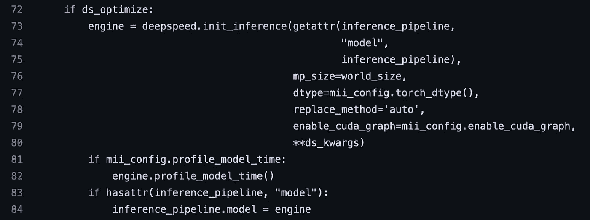
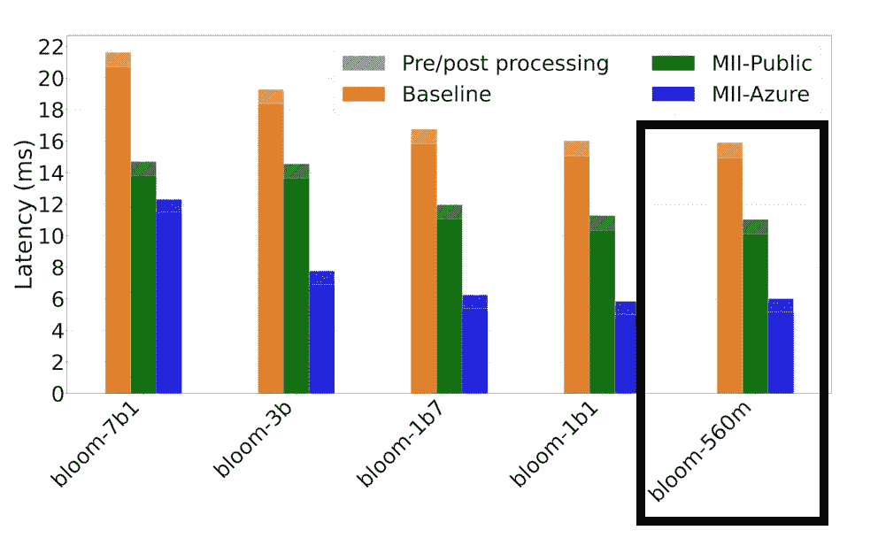

# DeepSpeed 深潜—推理的模型实现(MII)

> 原文：<https://towardsdatascience.com/deepspeed-deep-dive-model-implementations-for-inference-mii-b02aa5d5e7f7>

## 深入了解来自 DeepSpeed 的最新开源库

由作者创建的图像-使用稳定扩散创建

# 这是怎么回事？

DeepSpeed 团队最近发布了一个新的开源库，名为推理的[模型实现](https://github.com/microsoft/DeepSpeed-MII) (MII)，旨在使强大模型的低延迟、低成本推理不仅可行，而且易于访问。你可以在他们的[博客文章](https://www.deepspeed.ai/2022/10/10/mii.html)中读到所有相关内容。

当我开始探索 MII 图书馆时，我意识到那里有许多其他 DeepSpeed 技术的参考资料，例如零推理和 DeepSpeed 推理。因此，这篇博文的目的不是重述 DeepSpeed 的博文，我认为该团队在描述技术和潜在好处方面做得很好。相反，我将致力于解释一些底层技术和相关术语，并指出我在深入研究 MII 图书馆时发现的一些“问题”。这基本上是我希望在四周前开始钻研这个图书馆时就能拥有的博文😅

# 为什么这很重要？

没有一个星期会有新的、令人兴奋的人工智能模型发布。在写这篇博文的时候(2022 年 11 月 17 日)，本周的 AI 模型是 [Meta 的 Galactica 模型](https://arxiv.org/abs/2211.09085v1)。这些大型模型中有许多是开源的(BLOOM，OPT ),理论上每个人都可以访问。当然，挑战在于这些模型太大，客户很难部署它们。当他们设法部署它们时，他们面临着推理延迟和成本方面的挑战。

在过去的几年中，DeepSpeed 做了很多工作来克服这些挑战，现在他们将努力整合到一个库，DeepSpeed-MII。他们的目标是实现强大模型的低延迟、低成本推断，不仅可行，而且容易获得。就在上周，2022 年 11 月 9 日，他们[宣布](https://github.com/microsoft/DeepSpeed-MII/tree/main/examples/benchmark/txt2img)他们能够生成稳定扩散的图像，每张图像不到一秒。像这样的努力将使这些模型的使用民主化，并最终允许每个人运行这些模型🤗

# DeepSpeed 术语

首先要注意的是，DeepSpeed-MII 实际上是现有 DeepSpeed 技术的集合，特别是 DeepSpeed 推理和零推理。当我开始了解更多关于 DeepSpeed 的库时，我有点困惑，所以我想首先概述一下在使用 DeepSpeed 时可能会遇到的所有术语:

*:[于 2022 年 9 月](https://www.deepspeed.ai/2022/09/09/zero-inference.html)推出，作为 [*零无穷大*](https://www.microsoft.com/en-us/research/blog/zero-infinity-and-deepspeed-unlocking-unprecedented-model-scale-for-deep-learning-training/) (从 2021 年 4 月开始)的继任者——它通过在 CPU 或 NVMe 内存中托管模型权重来适应和优化 GPU 上的零无穷大技术，从而在 GPU 中不托管权重:*

**

*图片作者。来源:[https://www.deepspeed.ai/2022/09/09/zero-inference.html](https://www.deepspeed.ai/2022/09/09/zero-inference.html)*

****deep speed-推论***:[2021 年 3 月推出](https://www.deepspeed.ai/2021/03/15/inference-kernel-optimization.html)。这种技术与 ZeRO 技术没有关系，因此并不专注于托管不适合 GPU 内存的大型模型。相反，它引入了几个特性来有效地服务于基于 transformer 的 PyTorch 模型，比如定制推理的内核。你可以在他们的博客文章中了解更多。*

*所以，总结一下:*

*   ****零推理*** 专为**要求 GPU 加速但缺乏足够的 GPU 内存来托管模型**的推理应用而设计。此外，零推理针对面向吞吐量并允许大批量的推理应用程序进行了优化。*
*   ****deep speed-Inference***另一方面，**将整个模型放入 GPU 内存(可能使用多个 GPU)**更适合延迟敏感或批量较小的推理应用。*

*DeepSpeed MII 将这两种技术整合到一个框架中。然而，如上所述，它们用于不同的目的，因此不能一起使用:*

**

*图片由 authour 提供。来源:[https://github . com/Microsoft/deep speed-MII/blob/v 0 . 0 . 3/MII/deployment . py](https://github.com/microsoft/DeepSpeed-MII/blob/v0.0.3/mii/deployment.py)*

# *代码深潜*

*在这一节中，我们将浏览一下 MII 的代码，从中提取一些有用的信息。这个库还很年轻(当前版本是 0.0.3 ),有些东西还没有完全文档化。例如，在上面的代码片段中，我们看到 MII 结合了深度速度推理和零推理。*

*另一个有用的信息是，MII 的目标是让用户的生活更轻松。根据型号类型、型号大小、批量大小和可用的硬件资源，MII 自动应用 DeepSpeed-Inference 的一套适当的系统优化，以最大限度地减少延迟和最大限度地提高吞吐量。*

*例如，如果我们想要运行一个 Eleuther 模型，它将选择一组适当的配置值:*

**

*图片作者。来源:[https://github . com/Microsoft/deep speed-MII/blob/v 0 . 0 . 3/MII/models/load _ models . py](https://github.com/microsoft/DeepSpeed-MII/blob/v0.0.3/mii/models/load_models.py)*

*最终，优化和加速模型的代码与我们单独使用 DeepSpeed-Inference 时使用的代码是相同的:*

**

*图片作者。来源:[https://github . com/Microsoft/deep speed-MII/blob/v 0 . 0 . 3/MII/models/load _ models . py](https://github.com/microsoft/DeepSpeed-MII/blob/v0.0.3/mii/models/load_models.py)*

*知道这一点很好——这意味着我们不想通过 gRPC 服务托管我们的模型，我们仍然可以通过使用 DeepSpeed-Inference 获得相同的效率。不过，在未来，我希望我们能在 MII 内部选择使用 gRPC 或不使用 gRPC 的优化。*

# *是时候进行一些动手实验了*

*为了确保 MII 和 DeepSpeed-Inference 提供相同的加速，我们可以运行一些测试:我们可以首先在完全没有 DeepSpeed 加速的情况下运行一个文本生成任务，然后比较使用 DeepSpeed-Inference 和 MII 时延迟如何变化。*

*我们将在一个配备了 T4 (16 GB GPU 内存)的实例上使用 BLOOM-560M 模型进行这个实验。根据 MII 的博客文章，当使用 MII-公共选项时，我们应该看到以下收益:*

**

*图片作者。来源:[https://www.deepspeed.ai/2022/10/10/mii.html](https://www.deepspeed.ai/2022/10/10/mii.html)*

*这些测试的代码可以在这个 [GitHub repo](https://github.com/marshmellow77/ds-mii-deepdive) 中找到。*

## *基线-无深度速度的拥抱面管道*

*我们可以通过运行 BLOOM-560M 模型的标准拥抱面管道来获得基线。*

*我们看到结果大致符合 MII 博客帖子的预期:*

**

*作者图片*

## *深度推理*

*现在我们可以使用 DeepSpeed-Inference 框架运行相同的测试。为此，我们设置了与上面相同的拥抱面部管道，然后用优化的 DeepSpeed 模型替换底层模型:*

*一旦管道准备就绪，我们可以运行与上面相同的测试，并看到 4 毫秒的显著改进:*

**

*作者图片*

## *广播级录象机的型号之一*

*设置 MII 推理机也很容易，我们只需按照 MII GitHub repo 中的说明操作即可:*

*一旦生成器启动并运行，我们就可以再次生成新令牌，并测量生成它们所需的时间。生成器的结果是一个原型 MultiString 对象，可能源于我们正在与一个 gRPC 服务器进行交互。我确信有很好的方法来解析这个回复，但是我将通过一点正则表达式的魔力来快速地完成它:*

*现在我们计算相同的指标，看看结果:*

**

*作者图片*

*正如预期的那样，我们确实看到了与 DeepSpeed-Inference 完全相同的加速(4 毫秒)🤗*

# *结论*

*我对这一举措感到非常兴奋。我认为，对 BLOOM、OPT 等大型模型的民主化访问将是 2023 年的主要挑战之一，而 MII 是应对这一挑战的一个伟大项目。它仍然是一个非常年轻的库(创建于 2022 年 10 月，当前版本是 0.0.3)。但是看起来这个库是活跃的，社区正在使用和测试它，并提出了 GitHub 的问题。希望随着时间的推移，我们将看到这个库的成长和改进——我肯定会尽我的一份力量😊*