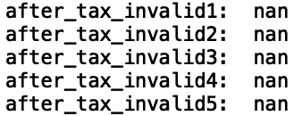

# 在 Python 中定义空变量和数据结构

> 原文：<https://towardsdatascience.com/defining-empty-variables-and-data-structures-in-python-501995458577>

## 定义缺失值、默认函数参数和初始化数据结构


图片由[在](https://www.pexels.com/@shvets-production/)[像素](https://www.pexels.com/photo/stack-of-carton-boxes-on-floor-in-rented-house-7203701/)上拍摄制作

在处理大量数据集合时，经常会遇到缺少值的情况。缺失值可能对应于空变量、空列表、空字典、列中缺失的元素、空数据帧甚至无效值。能够定义空变量或对象对于许多软件应用程序来说非常重要，尤其是在处理缺失和无效的数据值时。这对于变量初始化、类型检查和指定函数默认参数等任务非常重要。

根据不同的用例，有几个选项可以指定空变量。最常见的方法是使用关键字 None 存储空值。这很有用，因为它清楚地表明变量值缺失或无效。虽然这有助于处理丢失的值，但在需要计算的情况下这是没有用的。例如，对于分类值、浮点值和整数值，将缺失值 None 转换为安南值通常很有用。安南值对应于“不是一个数字”,它是一种标记缺失值的有用方法，同时仍然能够执行有用的计算。例如，我们可以使用 python 中的 pandas 方法，用均值、中值或众数等统计数据替换 NaN 值。

除了指定 None 和 NaN 类型之外，指定空数据结构也非常有用。例如，如果在 python 中填充一个列表，通常需要定义一个初始化的空列表。此外，您可能有一个函数需要一个列表作为输入，以便无论列表是填充的还是空的都可以正常运行。在填充字典方面也可以进行类似的论证。定义一个空字典，然后用对应于它们各自值的键填充字典的逻辑通常是有用的。与列表类似，您可以定义一个函数，该函数需要列出一个空字典才能成功运行。同样的逻辑也适用于数据帧。

最后，定义空变量和数据结构对于类型检查和设置默认参数等任务非常有用。在类型检查方面，空变量和数据结构可以用来通知一些控制流逻辑。例如，如果呈现一个空数据结构，则执行“X”逻辑来填充该数据结构。在类型检查和设置默认参数方面，可能会有这样的情况，空数据结构的实例应该启动一些逻辑，从而允许函数调用在意外情况下成功。例如，如果您定义了一个函数，它在不同的浮点数列表上被调用多次，并计算平均值，只要该函数提供了一个数字列表，它就会工作。相反，如果函数提供了一个空列表，它将失败，因为它将无法计算空列表的平均值。然后，可以使用类型检查和默认参数来尝试计算并返回平均值，如果失败，则返回默认值。

**用 None 和 NaN 定义一个空变量**

在 python 中定义空变量很简单。如果希望为不会用于计算的缺失值定义一个占位符，可以使用 None 关键字定义一个空变量。例如，假设我们有包含年龄、收入(美元)、姓名和老年公民身份值的人口统计数据:

```
age1 = 35
name1 = "Fred Philips"
income1= 55250.15
senior_citizen1 = Falseage2 = 42
name2 = "Josh Rogers"
income2=65240.25
senior_citizen2 = Falseage3 = 28
name3 = "Bill Hanson"
income3=79250.65
senior_citizen3 = False
```

对于每个人，我们都有年龄、姓名、收入和高级公民身份的有效值。可能存在某些信息缺失或包含无效值的情况。例如，我们可能会收到包含无效值的数据，如年龄的字符或字符串，或姓名的浮点或整数。使用自由文本用户输入框的 web 应用程序尤其会出现这种情况。如果应用程序无法检测到无效的输入值并提醒用户，它会将无效的值包含在其数据库中。考虑下面的例子:

```
age4 = "#"
name4 = 100
income4 = 45250.65
senior_citizen4 = "Unknown"
```

对于这个人，我们的年龄值为“#”，这显然是无效的。进一步说，输入的名字是 100 的整数值，同样没有意义。最后，对于我们的老年公民变量，我们有“未知”。如果我们对保留这些数据感兴趣，因为收入是有效的，所以最好使用 None 关键字将年龄、姓名和 senior_citizen 定义为空变量。

```
age4 = None
name4 = None
income4 = 45250.65
senior_citizen4 = None
```

通过这种方式，任何查看数据的开发人员都会清楚地了解到缺少年龄、姓名和老年人的有效值。此外，收入值仍然可以与所有其他有效数据值一起用于计算统计数据。None 关键字的一个限制是它不能用于计算。例如，假设我们想要计算我们定义的四个实例的平均年龄:

```
avg_age = (age1 + age2 + age3 + age4)/4
```

如果我们尝试运行我们的脚本，它将抛出以下错误:


作者截图

这是一个类型错误，说明我们无法在整数和 None 值之间使用“+”运算符(加法)。

我们可以通过使用 numpy 中的 NaN(非数字)值作为缺失值占位符来解决这个问题:

```
age4 = np.nan
name4 = np.nan
income4 = 45250.65
senior_citizen4 = np.nan
avg_age = (age1 + age2 + age3 + age4)/4
```

现在它将能够成功运行。因为我们的计算中有一个 NaN，所以结果也是 NaN。这非常有用，因为代码能够成功运行。此外，这在处理数据结构(如数据帧)时尤其有用，因为 python 中有一些方法允许您直接处理 NaN 值。

除了定义空变量之外，在变量中存储空数据结构通常也很有用。这有许多用途，但我们将讨论如何使用默认的空数据结构进行类型检查。

**为初始化定义空列表**

在变量中存储空列表的最简单的应用是初始化将要填充的列表。例如，我们可以为先前定义的每个属性初始化一个列表(年龄、姓名、收入、高级状态):

```
ages = []
names = []
incomes = []
senior_citizen = []
```

然后可以使用 append 方法填充这些空列表:

```
ages.append(age1)
ages.append(age2)
ages.append(age3)
ages.append(age4)
print("List of ages: ", ages)
```

对于姓名、收入和高级地位，我们也可以这样做:

```
names.append(name1)
names.append(name2)
names.append(name3)
names.append(name4)
print("List of names: ", names)incomes.append(income1)
incomes.append(income2)
incomes.append(income3)
incomes.append(income4)
print("List of incomes: ", incomes)senior_citizen.append(income1)
senior_citizen.append(income2)
senior_citizen.append(income3)
senior_citizen.append(income4)
print("List of senior citizen status: ", senior_citizen)
```


作者截图

**为初始化定义空字典**

我们也可以使用空字典进行初始化:

```
demo_dict = {}
```

并使用我们之前填充的列表来填充字典:

```
demo_dict['age'] = ages
demo_dict['name'] = names
demo_dict['income'] = incomes
demo_dict['senior_citizen'] = senior_citizen
print("Demographics Dictionary")
print(demo_dict)
```


作者截图

**为初始化定义空数据帧**

我们也可以对数据帧做类似的事情:

```
import pandas as pddemo_df = pd.DataFrame()
demo_df['age'] = ages
demo_df['name'] = names
demo_df['income'] = incomes
demo_df['senior_citizen'] = senior_citizen
print("Demographics Dataframe")
print(demo_df)
```


作者截图

请注意，填充字典和数据框的逻辑是相似的。您使用哪种数据结构取决于您作为工程师、分析师或数据科学家的需求。例如，如果您喜欢生成 JSON 文件并且不需要数组长度相等，则字典更有用，而数据帧对于生成 CSV 文件更有用。

**NaN 默认函数参数**

定义空变量和数据结构的另一个用途是用于默认函数参数。

例如，考虑一个计算联邦税后收入的函数。到目前为止，我们定义的收入范围的税率约为 22%。我们可以将我们的函数定义如下:

```
def income_after_tax(income):
    after_tax = income — 0.22*income
    return after_tax
```

如果我们用 income 调用我们的函数并打印结果，我们得到如下结果:

```
after_tax1 = income_after_tax(income1)
print("Before: ", income1)
print("After: ", after_tax1)
```


作者截图

对于这个例子来说，这很好，但是如果我们有一个无效的收入值，比如一个空字符串，该怎么办呢？让我们传入一个空字符串，并尝试调用我们的函数:

```
after_tax_invalid = income_after_tax(‘’)
```


作者截图

我们得到一个 TypeError，说明我们可以将一个空字符串乘以一个非整数类型的 float。函数调用失败，after_tax 实际上从未被定义。理想情况下，我们希望保证该函数适用于任何收入值，并且 after_tax 至少用某个默认值来定义。为此，我们可以为 after_tax 定义一个默认的 NaN 参数，并键入 check the income。如果收入是浮动的，我们只计算税后，否则，税后是 NaN:

```
def income_after_tax(income, after_tax = np.nan):
    if income is float:
        after_tax = income — 0.22*income
    return after_tax
```

然后我们可以传递任何无效的有效收入，我们仍然能够成功地运行我们的代码:

```
after_tax_invalid1 = income_after_tax('')
after_tax_invalid2 = income_after_tax(None)
after_tax_invalid3 = income_after_tax("income")
after_tax_invalid4 = income_after_tax(True)
after_tax_invalid5 = income_after_tax({})print("after_tax_invalid1: ", after_tax_invalid1)
print("after_tax_invalid2: ", after_tax_invalid2)
print("after_tax_invalid3: ", after_tax_invalid3)
print("after_tax_invalid4: ", after_tax_invalid4)
print("after_tax_invalid5: ", after_tax_invalid5)
```



作者截图

读者可能想知道为什么一开始就把一个无效值传递给一个函数。实际上，函数调用通常是针对成千上万的用户输入进行的。如果用户输入是自由文本响应，而不是下拉菜单，则很难保证数据类型是正确的，除非应用程序明确强制执行。因此，我们希望能够在应用程序不崩溃或失败的情况下处理有效和无效的输入。

**空列表默认函数参数**

将空数据结构定义为默认参数也很有用。让我们考虑一个函数，它获取我们的收入列表并计算税后收入。

```
def get_after_tax_list(input_list):
    out_list = [x — 0.22*x for x in input_list]
    print("After Tax Incomes: ", out_list)
```

如果我们把这个和我们的收入清单联系起来，我们会得到:

```
get_after_tax_list(incomes)
```


作者截图

现在，如果我们用一个不是列表的值调用它，例如一个整数，我们得到:

```
get_after_tax_list(5)
```


作者截图

现在，如果我们包含一个空列表作为输出列表的默认值，我们的脚本将成功运行:

```
get_after_tax_list(5)
```


作者截图

**空字典默认函数参数**

与将默认参数定义为空列表类似，用空字典默认值定义函数也很有用。让我们定义一个接受输入字典的函数，我们将使用我们之前定义的 demo_dict，它返回一个包含平均收入的新字典

```
def get_income_truth_values(input_dict):
    output_dict= {'avg_income': np.mean(input_dict['income'])}
    print(output_dict)
    return output_dict
```

让我们用 demo_dict 调用我们的函数

```
get_income_truth_values(demo_dict)
```


作者截图

现在让我们尝试为 input_dict 传入一个无效值。让我们传递整数值 10000:

```
get_income_truth_values(10000)
```


作者截图

我们得到一个类型错误，指出整数对象 1000 是不可订阅的。我们可以通过检查输入的类型是否是字典，检查字典中是否有适当的键，并为输出字典设置一个默认参数来纠正这一点，如果不满足前两个条件，将返回该参数。这样，如果条件不满足，我们仍然可以成功地运行我们的代码，而不会出现错误。对于我们的默认参数，我们将简单地为 output_dict 指定一个空字典

```
def get_income_truth_values(input_dict, output_dict={}):
    if type(input_dict) is dict and ‘income’ in input_dict:
        output_dict= {‘avg_income’: np.mean(input_dict[‘income’])}
    print(output_dict)
    return output_dict
```

我们可以成功地调用相同的函数

```
get_income_truth_values(10000)
```

我们还可以为“avg_income”定义一个带有安南值的默认字典。这样，我们将保证我们有一个包含预期键的字典，即使我们用无效的输入调用我们的函数:

```
def get_income_truth_values(input_dict, output_dict={'avg_income': np.nan}):
    if type(input_dict) is dict and ‘income’ in input_dict:
        output_dict= {'avg_income': np.mean(input_dict['income'])}
    print(output_dict)
    return output_dictget_income_truth_values(demo_dict)
get_income_truth_values(10000)
```


作者截图

**空数据框默认函数参数**

与我们的列表和字典示例类似，带有默认空数据框的默认函数非常有用。让我们修改我们定义的数据框，以包含每个人的居民状态:

```
demo_df['state'] = ['NY', 'MA', 'NY', 'CA']
```

让我们也使用平均值估算年龄和收入的缺失值:

```
demo_df['age'].fillna(demo_df['age'].mean(), inplace=True)
demo_df['income'].fillna(demo_df['income'].mean(), inplace=True)
```

接下来，让我们定义一个函数，该函数对各州执行 groupby，并计算年龄和收入字段的平均值。结果将使用每个州的平均年龄和收入:

```
def income_age_groupby(input_df):
    output_df = input_df.groupby(['state'])['age', 'income'].mean().reset_index()
    print(output_df)
    return output_dfincome_age_groupby(demo_df)
```


作者截图

你应该已经猜到了，如果我们用一个不是 dataframe 的数据类型调用我们的函数，我们会得到一个错误。如果我们传递一个列表，我们会得到一个 AttributeError，说明列表对象没有属性“groupby”。这是有意义的，因为 groupby 方法属于 dataframe 对象:

```
income_age_groupby([1,2,3])
```


作者截图

我们可以为每个预期字段定义一个包含 nan 的默认数据框，并检查必要的列是否存在:

```
def income_age_groupby(input_df, output_df = pd.DataFrame({'state': [np.nan], 'age': [np.nan], 'income':[np.nan]})):
    if type(input_df) is type(pd.DataFrame()) and set(['age', 'income', 'state']).issubset(input_df.columns):
        output_df = input_df.groupby(['state'])['age', 'income'].mean().reset_index()
        print(output_df)
    return output_dfincome_age_groupby([1,2,3])
```


作者截图

我们看到我们的代码在无效数据值的情况下成功运行。虽然我们考虑了我们制作的数据示例，但是这些方法可以扩展到各种数据处理任务，无论是软件工程、数据科学还是机器学习。我鼓励您在自己的数据处理代码中尝试应用这些技术！

这篇文章中的代码可以在 [GitHub](https://github.com/spierre91/builtiin/blob/main/empty_variables_and_datastructures.py) 上找到。

**结论**

定义空变量和数据结构是处理缺失或无效值的重要部分。对于浮点、整数、布尔和字符串等变量，无效类型通常会导致代码失败或出错。这可能导致程序在大型处理任务中途崩溃，从而导致时间和计算资源的巨大浪费。考虑到处理无效和丢失的数据是数据处理的一个重要部分，理解如何将空变量和数据结构定义为函数默认值可以省去工程师或数据科学家的许多麻烦。能够用合理的默认值定义函数，使它们返回一致的、预期的无错误输出，这是每个程序员的基本技能。

**本帖原载于** [**内置博客**](https://builtin.com/software-engineering-perspectives) **。原片可以在** [**这里找到**](https://builtin.com/software-engineering-perspectives/define-empty-variables-python) **。**