# 通过示例揭开 PyTorch 加权随机抽样器的神秘面纱

> 原文：<https://towardsdatascience.com/demystifying-pytorchs-weightedrandomsampler-by-example-a68aceccb452>

## 一种处理不平衡数据集的简单方法

最近，我发现自己在熟悉的情况下工作，处理一个非常不平衡的数据集，这影响了我的 CNN 模型在计算机视觉任务上的训练。虽然有各种方法可以实现这一点，但[的研究发现，在不同数据集上训练 CNN 模型时处理类别不平衡](https://arxiv.org/abs/1710.05381)得出结论，在几乎所有情况下，最佳策略是对少数类别进行过采样；增加了模型在训练期间看到这些类别的图像的频率。

然而，尽管这个想法看起来很简单，但在 PyTorch 中实现它通常需要与有点神秘的`WeightedRandomSampler`进行交互。[关于`WeightedRandomSampler`的文档](https://pytorch.org/docs/stable/data.html#torch.utils.data.WeightedRandomSampler)很少，既包括它是如何工作的，也包括如何设置参数以确保它按照我们预期的方式运行。尽管在过去已经使用了很多次，但是当我在很长一段时间没有使用它的时候，我经常发现自己在各种论坛和 StackOverflow 帖子中搜索，以确保我的设置是正确的。虽然有一篇[很棒的博客文章提供了它如何在幕后实现的数学上的严格分析](/address-class-imbalance-easily-with-pytorch-bb540497d2a6)，但众所周知，我们人类往往不太理解概率论，因此很难仅从这一点获得直觉。

在这篇文章中，我将采取务实的方法来理解`WeightedRandomSampler`的行为，目的是回答以下问题:

*   *如何计算用于平衡数据集的权重？*
*   *由于这种方法是基于概率的，我能确定这将以我想要的方式平衡数据集吗？*
*   *在训练期间，我的所有数据集都会被看到吗？*
*   *如果我不想均衡地平衡数据集，而是达到某个其他比率，该怎么办？*

我们将通过在处理真实数据集的上下文中与`WeightedRandomSampler`对象进行交互来实现这一点，然后运行一个简单的实验来确定平衡数据集是否会为我们的简单问题带来任何性能改进。

***Tl；dr:*** *如果你只是想看到一些可以直接使用的工作代码，复制这篇文章所需的所有代码都可以在这里*[*GitHub gist*](https://gist.github.com/Chris-hughes10/260c70650c5a6f322d273a8a8728b91a)*中找到。*

# 创建不平衡的数据集

首先，让我们下载一些数据作为例子。这里，我使用的是[牛津宠物数据集](https://www.robots.ox.ac.uk/~vgg/data/pets/)，它包含了 37 种不同类别的猫和狗。在 Linux 上，我们可以用以下命令下载它:

```
wget [https://thor.robots.ox.ac.uk/~vgg/data/pets/images.tar.gz](https://thor.robots.ox.ac.uk/~vgg/data/pets/images.tar.gz) -P data/pets
ls data/pets
tar -xzf data/pets/images.tar.gz -C data/pets
rm data/pets/images.tar.gz
```

现在我们有了一些数据，我经常发现探索这个问题的一个好方法是创建一个熊猫数据框架。我们可以使用标准库中的`pathlib`来快速获得所有图像路径的列表，由于类名包含在每个文件名中，我们可以在同一个步骤中提取这些路径。


我们现在可以使用这些工具轻松创建一个数据框架，用于快速检查我们的标签分布情况:

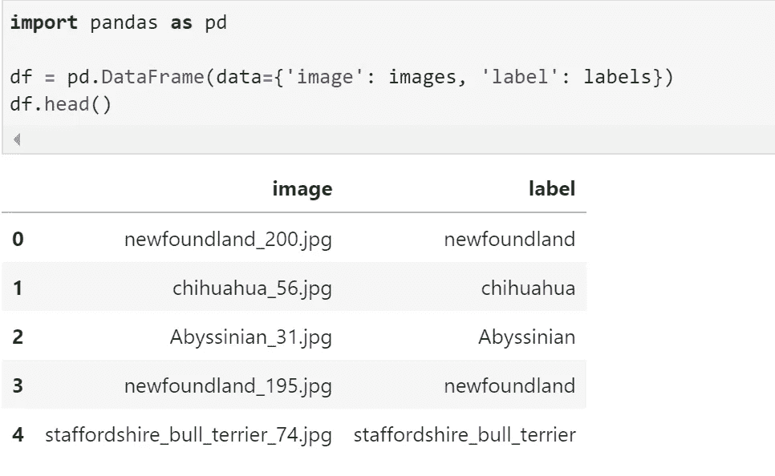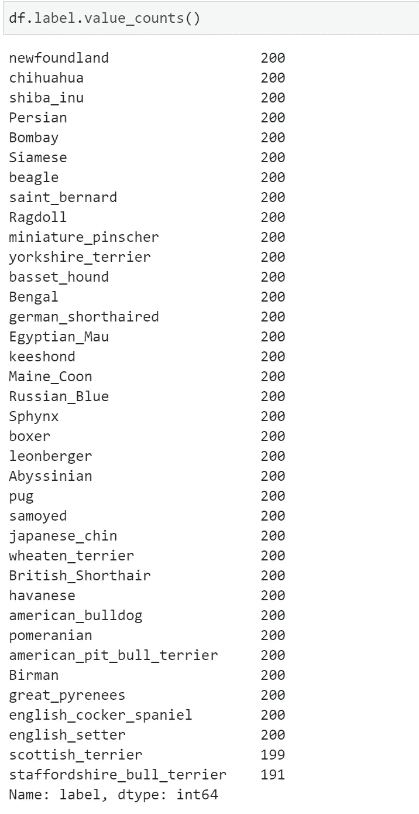

由此，我们可以看到数据集非常均衡，几乎所有的类都有大约 200 张图片。虽然这通常是一件好事，但为了使数据集适合我们的目的，我们可以定义一个函数来提取不平衡的子集:

选择其中两个类别，我们可以用它来创建不平衡数据集，如下所示:

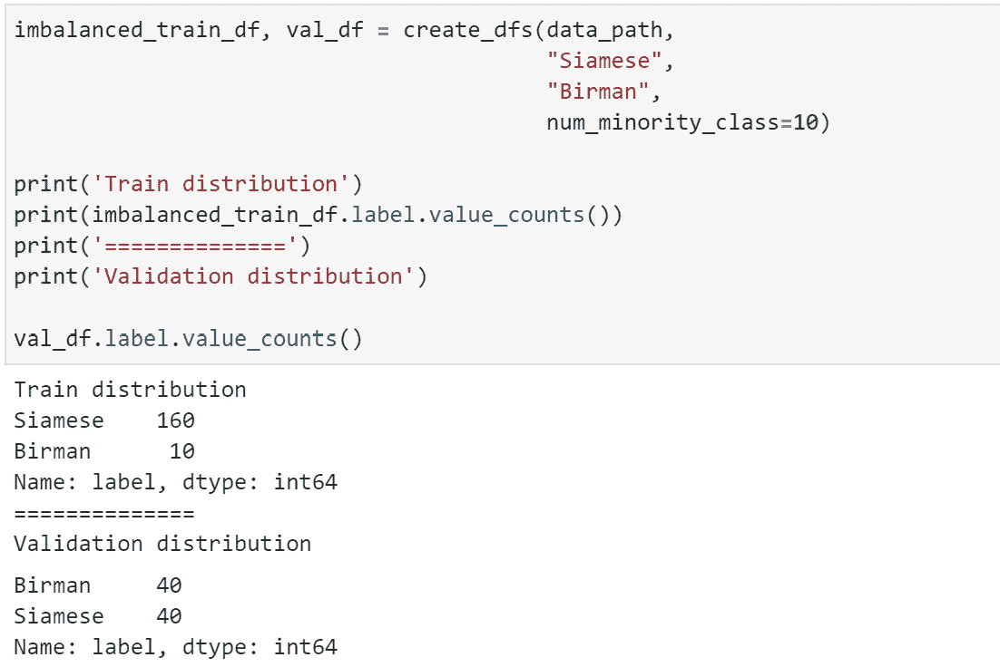

让我们用整数值对我们的类标签进行编码，并创建一个在我们的数据集中使用的查找。


在这里，我选择了*暹罗猫*和*伯尔曼猫*品种，因为根据数据集网站上的预览图片，它们具有短暂的相似性。我们可以通过随机检查一些图像来确认这一点。

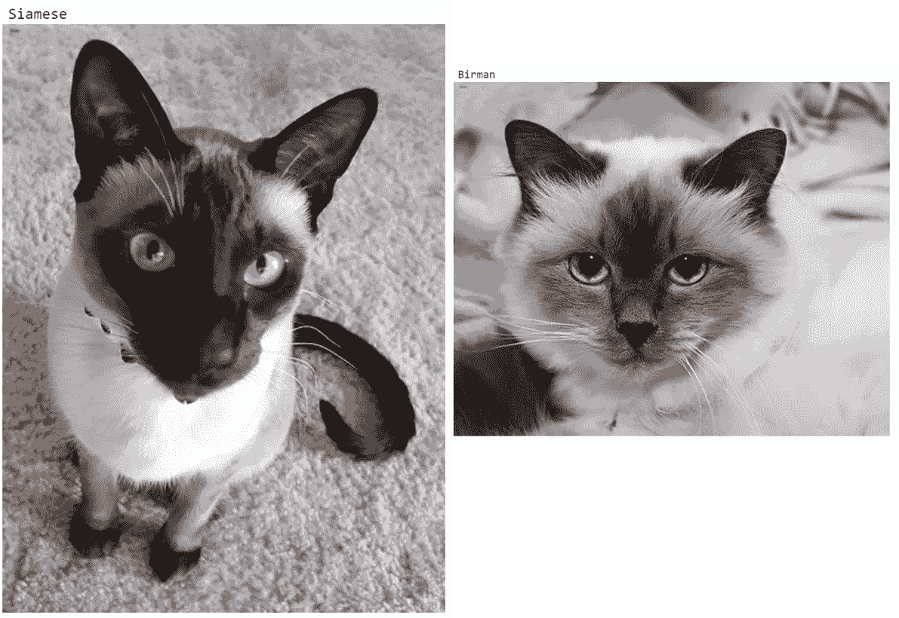

基于这一点，这些类似乎是一个简单但重要的任务的合适选择。

# 可视化批量分配

现在，我们已经定义了数据集，让我们通过检查模型在单个训练时期将看到的每一批的分布来探索类不平衡的影响。

因为此时我们不需要加载图像，所以让我们从每个图像的标签和索引创建一个张量数据集，这样我们就可以快速迭代。


我们可以定义一个函数来实现这一点，方法是跟踪每个批处理期间看到的类和索引，并绘制它们，如下所示:

我们现在可以用它来研究我们的数据是什么样子的。

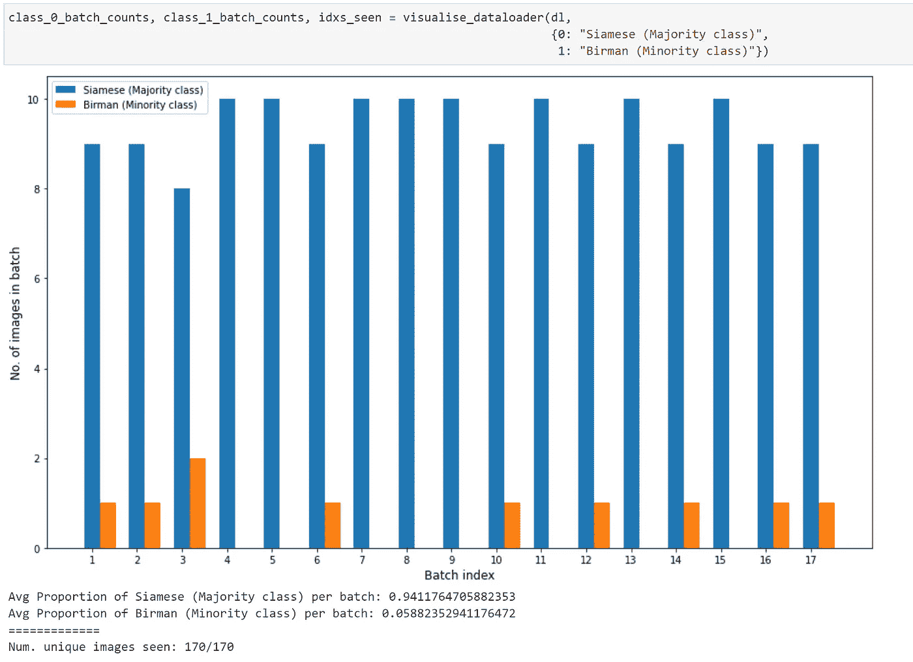

由此，我们可以清楚地观察到不平衡的影响，因为一些批次根本不包含任何来自我们少数类的图像！此外，我们可以看到，数据集中的每幅图像都会在训练过程中出现。当我们对所有批次取平均值时，我们观察到与数据集中相同的比例，这是我们所期望的。


## 用*加权随机采样器*平衡我们的数据集

现在，让我们看看如何使用`WeightedRandomSampler`来平衡数据集。

我们需要做的第一件事是计算将用于对每个图像进行采样的`weights`;[从文档](https://pytorch.org/docs/stable/data.html#torch.utils.data.WeightedRandomSampler)中，我们可以看到我们需要为数据集中的每幅图像设定一个权重。在我看来，最令人困惑的是这些权重的总和不一定是 1。实际上，这些权重代表了图像被选中的概率，PyTorch 只是为了方便起见，在幕后将这些权重缩放到[0，1]范围内。

现在我们已经了解了我们需要什么，让我们看看如何计算这些权重。首先，我们需要计算有多少图像属于我们的每个类，使用 Pandas 我们可以这样做，如下所示:


现在，我们有了类计数，我们可以通过取计数的倒数来计算每个类的权重。这将确保具有较高代表性的类将具有较小的权重。


现在，我们只需要根据类别为每个样本分配适当的权重。在实践中，我们可以直接从类计数中完成，如下所示:


接下来，我们可以创建我们的采样器和数据加载器:


在这里，我们可以看到我们已经提供了计算的样本权重作为参数，并将`replacement`设置为 True 否则，我们根本无法进行过采样。现在，我们只是将样本的数量设置为数据集的长度，但是我们将在后面对此进行更多的讨论。

再次，我们可以可视化我们的数据加载器批次的分布，这次使用`WeightedRandomSampler`。

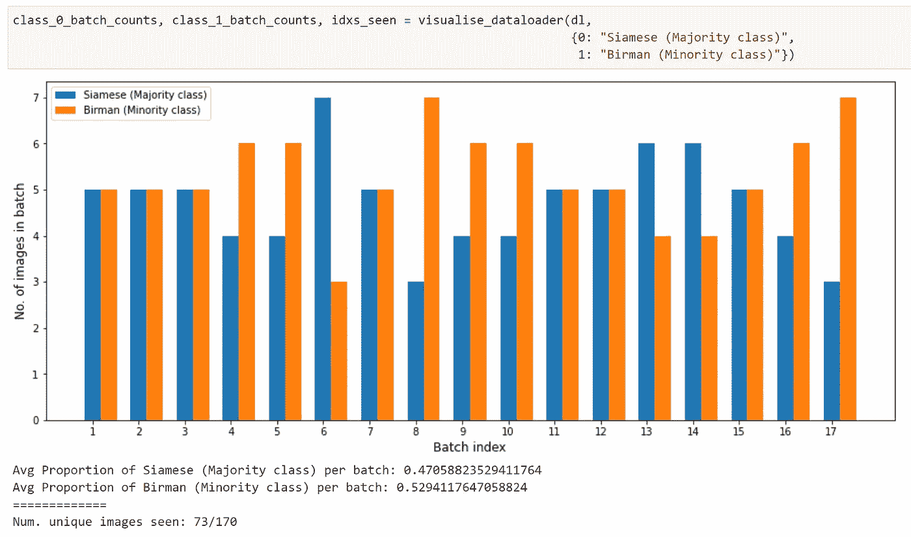

由此可见，我们的批次相当均衡！查看所看到的图像数量，我们可以看到采样器通过对少数类进行过采样而对多数类进行欠采样来实现这一点。

为了更详细地了解选择了哪些图像，我们可以创建一个数据帧，其中包含每个图像在这个时期被看到的次数。


为了使这些数据更容易解释，我们可以使用下面的代码片段将其表示为[经验累积分布函数图](https://seaborn.pydata.org/generated/seaborn.ecdfplot.html):

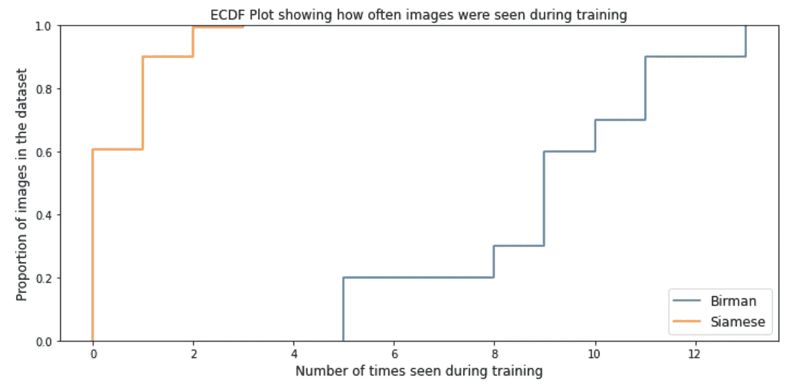

由此可见，要达到我们想要的比例，我们少数民族班的每张图片至少被看了 5 次，有的多达 13 次！相比之下，我们多数班的很多图像根本就没看到！

你可能会注意到，我们多数班的一些图像被多次看到，而另一些根本没有看到，这似乎很奇怪，这似乎并不理想。不幸的是，这是基于概率的采样方法的一个折衷。虽然我们可以将`WeightedRandomSampler`设置为无替换采样，但这也会阻止我们过采样；所以对我们这里没用！

下一个合乎逻辑的问题是，我们能否确保在训练过程中看到每一张图像。

# 训练期间什么时候可以看到我的所有图像？

## 调整每个时期的样本数量

如上所述，来自我们多数班的 97 幅图像在训练期间不会被看到。原因在于我们在创建`WeightedRandomSampler`实例时定义的`num_samples`参数。由于我们指定样本数等于原始不平衡数据集中的图像总数，因此我们的采样器必须忽略一些图像才能对少数类进行过采样。

调整这个参数，将原始数据集的大小增加一倍，我们可以看到，在一个时期内，我们可以看到更多的图像。

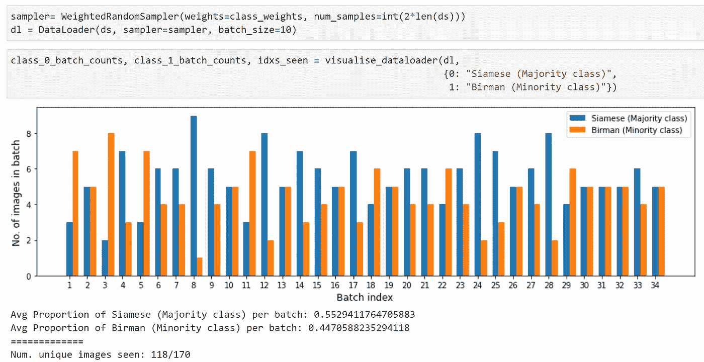

然而，这确实给纪元的确切含义带来了一些混乱。在机器学习中，我们将一个时期定义为*单次通过整个数据集*。当每个样本只被看到一次时，这个定义使得准确地理解模型到训练中的当前点已经看到了什么变得非常清楚；当以不同的频率对图像进行采样时，这一点变得不太清楚。

由于历元的概念主要是为了帮助我们跟踪训练过程中的进展，而与模型本身没有关系——它只看到一个恒定的图像流——我更喜欢将`num_samples`设置为数据集的长度，并相信随着我们训练更多的历元，所有图像都会在某个点被看到。

## 在模型看到所有图像之前需要多少个历元？

将我们的采样器重置回其原始参数:


让我们探索一下在一次训练运行中需要多长时间才能看到我们的所有数据集。

为了做到这一点，我们可以建立一个简单的实验，我们跟踪在多个时期内看到的所有图像，并绘制每个时期结束时到目前为止的唯一图像的数量。我们可以使用下面的代码片段来做到这一点:


在这里，我们可以看到，直到所有图像至少被看到一次，需要 10 个历元。然而，由于这取决于概率，这个数字很可能会改变！

为了得到一个更稳健的估计，让我们从[蒙特卡罗方法](https://en.wikipedia.org/wiki/Monte_Carlo_method)中得到启发，多次运行这个实验并观察分布。为了更容易解释，我们可以将它表示为[核密度估计图](https://seaborn.pydata.org/generated/seaborn.kdeplot.html)。


由此我们可以看出，在大多数情况下，大约需要 9-10 个历元才能确信所有数据都会被看到。

当然，这个估计高度依赖于底层数据集中不平衡的比例。似乎合乎逻辑的建议是，随着不平衡比率的增加，将需要更多的时代。我们可以通过对不同程度的不平衡重复我们的试验来证实这一点，如下所示:

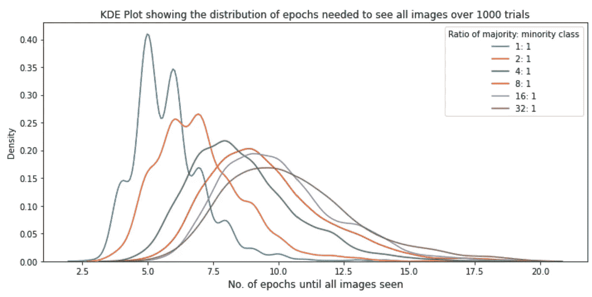

从图中，我们可以看出我们的直觉是正确的。然而，有趣的是，当在平衡数据集上使用`WeightedRandomSampler`时，需要大约 5 个时期才能看到所有数据；这表明在这种情况下这并不理想！

# 获取不平衡的数据集比例

既然我们已经探索了如何使用 WeightedRandomSampler 来平衡我们的训练集，那么让我们简单地研究一下如何调整我们的类权重来达到我们想要的任何比例。

这可能有用的一个例子是在对象检测中，我们希望我们的大部分训练集中在包含我们希望检测的项目的图像上，但是可用的数据集通常包含大量的*背景*图像。

作为一个例子，让我们研究一下如何以另一种方式使数据集严重失衡；这样我们的少数阶级就占了主导地位。

同样，首先我们需要计算每个类别的样本总数:


接下来，我们可以为每个类别定义目标比例:


最后，为了计算我们的样品重量，我们只需将每个重量乘以我们相应的目标比例，如下所示:


像以前一样，让我们将这些重量传递到我们的采样器，并可视化我们的批次。

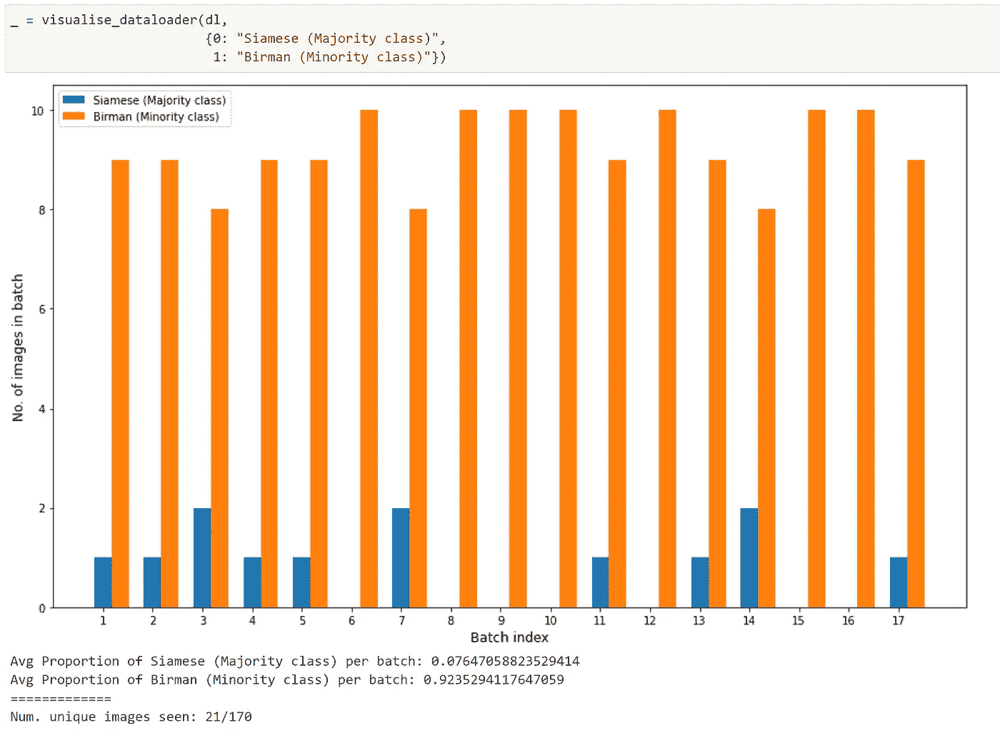

由此可以看出，我们已经获得了我们正在寻找的分布。

# 过采样能提高性能吗？

希望在这一点上，我们已经对`WeightedRandomSampler`如何工作有了一个直觉。然而，你可能会想，只是更频繁地向网络显示相同的图像真的会有所不同吗？让我们设置一个小实验来研究一下。

让我们在不平衡数据集上训练一个图像分类器。当然，结果在很大程度上取决于许多因素，例如使用的模型和数据集，但这只是一个简单的例子。在这里，我根据过去一直对我有效的训练食谱选择了以下内容:

*   型号:ResNet-RS50
*   优化器:AdamW
*   LR 调度程序:带预热的余弦衰减
*   图像大小调整为 224

由于我们的数据集非常小，为了进一步简化，让我们只训练在我们的架构中用于分类的最终线性层；由于我们的图像非常类似于模型已经过预训练的 ImageNet 图像，因此可以安全地假设主干中学习到的特性在这里应该足够好。

为了进行评估，我们可以使用我们之前创建的验证集，它包含了在训练中没有看到的图像的平衡样本。

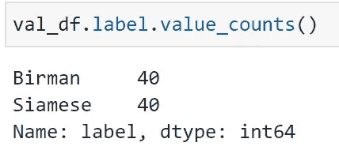

所有训练都是使用单个 NVIDIA V100 GPU 进行的。为了处理训练循环，我使用了 [PyTorch 加速库](https://github.com/Chris-hughes10/pytorch-accelerated)。然而，由于 PyTorch-accelerated 处理所有分布式训练问题，相同的代码可以在多个 GPU 上使用——无需将`WeightedRandomSampler`更改为分布式采样器——只需通过[定义一个配置文件，如这里所述](https://pytorch-accelerated.readthedocs.io/en/latest/quickstart.html)。

我们可以定义一个脚本来进行这个实验，如下所示:

使用的包:

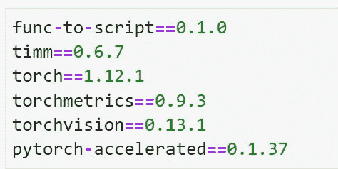

通过运行以下命令，在训练 10 个时期后选择最佳指标:


我得到了以下结果:


哦，不，这看起来像过采样实际上使事情变得更糟！

然而，就我们实验的设置方式而言，这并不十分令人惊讶，因为我们将模型的曝光限制在来自多数群体的新图像，而倾向于重复显示少数群体的少量图像。如果有一种方法可以从 Birman 图像的小集合中获取更多信息就好了…

## 添加数据扩充

为了尝试并帮助模型从我们的图像中学习更多，我们可以在训练期间使用数据增强来生成每个图像的稍微修改的版本。

在这种情况下，我决定使用 timm 的预定义 RandAugment 策略，因为这需要最小的超参数调整；timm 的 RandAugment 实现是[这里详细描述](/getting-started-with-pytorch-image-models-timm-a-practitioners-guide-4e77b4bf9055#8549)。

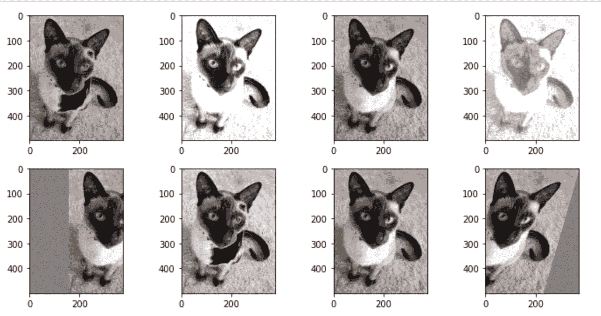

将 RandAugment 应用于来自我们训练数据集的图像

让我们再次运行这个实验，这一次使用数据扩充:


结果如下所示:


这一次，我们可以看到数据扩充和过采样的结合导致了性能的显著提高！

# 结论

希望这已经提供了如何开始使用`WeightedRandomSampler`的全面概述，并有助于说明如何使用它。

复制这篇文章所需的所有代码都可以从 GitHub gist 中获得。

*克里斯·休斯上的是* [*领英*](http://www.linkedin.com/in/chris-hughes1/) *。*

# 参考

*   [【1710.05381】卷积神经网络中类不平衡问题的系统研究(arxiv.org)](https://arxiv.org/abs/1710.05381)
*   [torch . utils . data—py torch 1.12 文档](https://pytorch.org/docs/stable/data.html#torch.utils.data.WeightedRandomSampler)
*   [使用 Pytorch 轻松解决阶级失衡问题第 2 部分| masta fa Foufa |迈向数据科学](/address-class-imbalance-easily-with-pytorch-bb540497d2a6)
*   [牛津大学视觉几何组](https://www.robots.ox.ac.uk/~vgg/data/pets/)
*   [seaborn . ecdfplot—seaborn 0 . 11 . 2 文档(pydata.org)](https://seaborn.pydata.org/generated/seaborn.ecdfplot.html)
*   [蒙特卡罗方法——维基百科](https://en.wikipedia.org/wiki/Monte_Carlo_method)
*   [seaborn . k deplot—seaborn 0 . 11 . 2 文档(pydata.org)](https://seaborn.pydata.org/generated/seaborn.kdeplot.html)
*   pytorch-accelerated:一个轻量级库，旨在通过提供一个最小但可扩展的训练循环来加速 pytorch 模型的训练过程，该训练循环足够灵活，可以处理大多数用例，并且能够利用不同的硬件选项，而无需更改代码。文件:https://pytorch-accelerated.readthedocs.io/en/latest/(github.com)
*   [快速入门— pytorch 加速 0.1.3 文档](https://pytorch-accelerated.readthedocs.io/en/latest/quickstart.html)
*   【PyTorch 图像模型(timm)入门:实践者指南|作者克里斯·休斯|走向数据科学

# 使用的数据集

*   牛津 Pets 数据集，[牛津大学视觉几何组](https://www.robots.ox.ac.uk/~vgg/data/pets/)。[知识共享署名-共享 4.0 国际许可](https://creativecommons.org/licenses/by-sa/4.0/)，包括商业和研究目的。