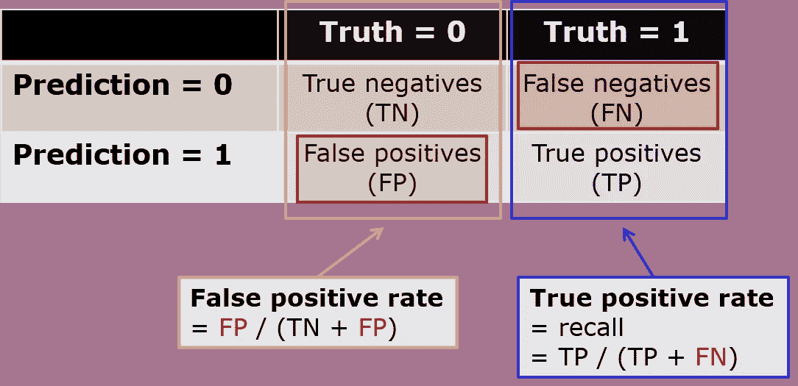
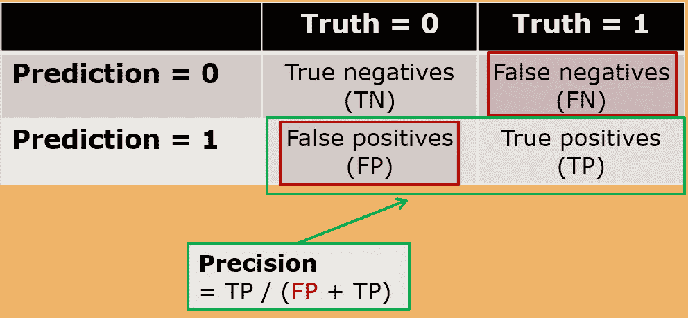
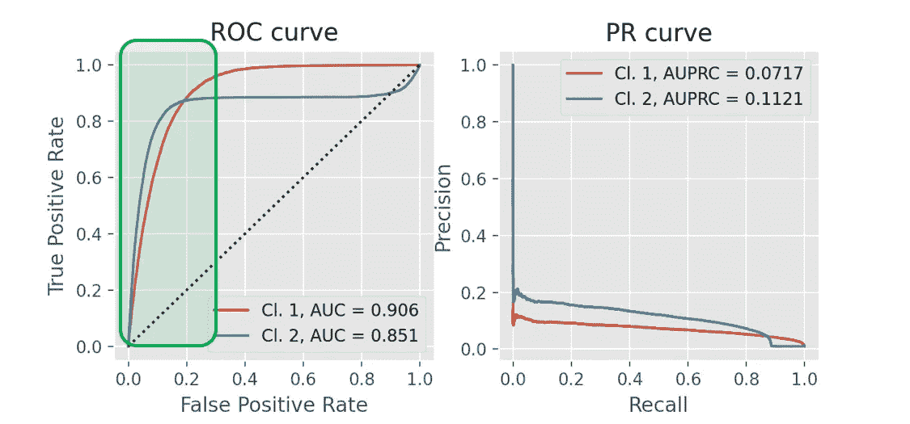

# 揭开 ROC 和精确回忆曲线的神秘面纱

> 原文：<https://towardsdatascience.com/demystifying-roc-and-precision-recall-curves-d30f3fad2cbf>

# 揭开 ROC 和精确回忆曲线的神秘面纱

## 揭穿关于二元分类的 ROC 曲线/ AUC 和精确召回曲线/ AUPRC 的神话，关注不平衡数据

受试者工作特征(ROC)曲线和精确召回率(PR)曲线是比较二元分类器的两种可视化工具。与此相关的是，ROC 曲线下面积(AUC，又名 AUROC)和 precision-recall 曲线下面积(AUPRC，又名 average precision)是用单个数字概括 ROC 和 PR 曲线的度量。在本文中，我们对这些工具进行了一些阐述，并把它们与不平衡数据(1 比 0 多)进行了比较。特别是，我们提出的论点是，对于不平衡数据，民间传说"*PR 曲线优于 ROC 曲线，因为 ROC 可能会误导人或不提供信息*"包含的真理比通常假设的要少。这是否正确取决于具体的应用环境，尤其是如何应用这些工具。更重要的是，PR 曲线同样可以很好地掩盖预测准确性的重要方面，并且在存在阶级不平衡时具有误导性。

# 混淆矩阵和两类错误

ROC 和 PR 曲线都是基于混淆矩阵。假设我们有一个二元分类器(算法或模型)，样本大小为 n 的测试数据，我们使用分类器对测试数据进行预测。测试数据中的每个数据点要么是 0(“负”)，要么是 1(“正”)。这是事实。此外，每个数据点被分类器预测为 0 或 1。这给出了四种组合:

*   真正的否定(TN)是被正确预测为 0 的 0
*   假阳性(FP)是被错误地预测为 1 的 0
*   假阴性(FN)是被错误预测为 0 的 1
*   真正的肯定(TP)是被正确预测为 1 的 1

**混淆矩阵**是一个(偶发事件)表，将测试数据中的所有实例分为以下四类:

图 1:混淆矩阵——作者图片

分类器会产生两种类型的错误**:假阳性**(当事实上是 0 时预测为 1)和**假阴性**(当事实上是 1 时预测为 0)。根据应用程序的不同，这两种类型的错误可能同等重要，或者这两种错误中的一种可能比另一种更严重。然而，人们通常不报告这两类误差的绝对数字，而是报告相对数字。这主要是因为相对数字更容易解释和比较。问题是:“相对于什么？”如果假阳性和假阴性同等重要，并且不想区分它们，可以简单地计算误差率= (FP+FN)/n，即误差总数 FP+FN 除以样本总数 n

如果要区分假阳性和假阴性，问题是这些数字应该与哪个基线量进行比较？可以说，最自然的参考量是 0(= TN+FP)和 1(= TP+FN)的总数。一种方法是考虑**假阳性率** = FP / (TN + FP)和**真阳性率** = TP / (TP + FN)。假阳性率是所有真 0 中错误预测 1 的比例。真阳性率也称为**召回**，是所有真 1 中正确预测 1 的比例。图 2 说明了这一点。

图 2:真阳性率(召回)和假阳性率——作者图片

将假阳性的数量与 0 的总数进行比较的另一种方法是使用所谓的精度将它们与预测的 1 的总数(= FP + TP)进行比较。**精度** = TP / (FP + TP)是正确预测的 1 在所有预测的 1 中所占的比例。总之，假阳性率和精度之间的主要区别在于假阳性的数量与哪个参考量进行比较:真实 0 的数量或预测的 1 的数量。*请注意，严格来说，精度将真实阳性与预测的 1 的总数进行比较。但这只是 1 - TP / (FP + TP) = FP 的另一面真实正利率也是如此。*

图 3:precision——作者图片

图 4:混淆矩阵示例——作者图片

图 4 显示了一个混淆矩阵的例子。在本例中，错误率为 0.2，真阳性率为 0.2，假阳性率为 0.1，精度为 0.25。

## 假阳性率还是精度？具有不平衡数据的玩具示例

图 5:不平衡数据的两个分类器的混淆矩阵，易于分类——图片由作者提供

ROC 曲线和 PR 曲线的主要区别在于前者考虑了假阳性率，而后者基于精确度。这就是为什么我们首先仔细研究不平衡数据的这两个概念。当(真)0 的数量比假阳性的数量大得多时，假阳性率可能是一个小数字，这取决于应用。如果解读错误，这么小的数字可能会隐藏重要的见解。作为一个简单的例子，考虑图 5 中的两个混淆矩阵，其中两个分类器应用于具有 1'000'000 个点的数据集，其中 1'000 个点是 1。这两个分类器的真实阳性率分别为 0.8 和 0.85。此外，分类器 I 具有 500 个假阳性，而分类器 II 具有 2000 个假阳性。这意味着这两个分类器具有非常小的假阳性率，大约为。0.0005 和 0.002。就绝对值而言，这两个假阳性率非常接近，尽管事实上分类器 II 具有四倍多的假阳性。这是数据分类不平衡的结果**和**数据相对容易分类的事实(= *可能同时具有高的真阳性率和低的假阳性率*)。然而，分类器 I 的精度大约为。0.62，而分类器 II 的精度约为。0.3.即，就精度而言，分类器 I 明显优于分类器 II。小的假阳性率有时可以掩盖不平衡数据的分类器之间的差异，这一事实是支持 PR 曲线优于 ROC 曲线的论点的根源。我们将在本文的后面回到这个问题。

图 6:难以分类的不平衡数据的两个分类器的混淆矩阵—图片由作者提供

接下来，考虑一个相似的数据集，但是它更难分类。两个分类器的混淆矩阵如图 6 所示。两个分类器再次分别具有 0.8 和 0.85 的真实阳性率。此外，分类器 I 的假阳性率大约为。0.4，而分类器 II 的值约为 0.4。0.45.然而，两个分类器的精度现在几乎相等，大约。0.002.两个分类器的精度如此之小的原因是存在类别不平衡**和**数据相对难以分类的事实。这表明，对于类别不平衡的数据，精度也可以掩盖分类器之间的重要差异**。** **这个小例子的结论是，精度或假阳性率是否更能提供信息取决于具体的应用，而不仅仅取决于是否存在类别不平衡。**

# ROC 和 PR 曲线

## 为什么首先是曲线？

我们可以在这里停下来，简单地比较错误率、假阳性率、真阳性率、精确度或任何其他基于混淆矩阵的总结性度量。然而，在大多数情况下，这不是一个好主意。为什么不呢？我们必须后退一步，理解混淆矩阵是如何产生的。首先，分类器通常为每个测试点计算预测分数 p。通常，这是一个介于 0 和 1 之间的数字，有时这也可以解释为一个概率。第二，选择决策阈值δ，并预测 p > δ的所有实例为 1，所有其他实例为 0。这种阈值的一个例子是δ=0.5。然而，在许多应用中，对于使用δ=0.5 没有严格的论证，并且使用其他δ可以获得更好的结果。其中，潜在的原因是(I)分类器经常没有被校准(即，即使我们可能认为输出 p 是概率，但是这个概率 p 与事件实现的实际概率不匹配)以及(ii)在与假阳性和假阴性相关联的损失中存在不对称性。

由于这些原因，人们针对几个或所有可能的阈值δ来比较分类器。ROC 和 PR 曲线就是这么做的。较低的(*较高的*)设置阈值δ，较高的(*较低的*)是假阳性的数量，较低的(*较高的*)是假阴性的数量。即，在假阳性和假阴性之间存在权衡。

## ROC 曲线和 AUC

**接收器工作特性(ROC)曲线**绘制了所有可能阈值δ的真阳性率与假阳性率的关系图，从而使上述权衡可视化。阈值δ越低，真阳性率越高，但假阳性率也越高。ROC 曲线越靠近左上角越好，斜线代表随机猜测。此外，ROC 曲线下的**面积(AUC，** aka AUROC **)** 用一个数字概括了该曲线。AUC 越大越好。AUC 有这样的解释，例如，0.8 的 AUC 意味着分类器以 80%的概率正确地排列两个随机选择的测试数据点。

## 精确召回曲线和 AUPRC

**精确度-召回率(PR)曲线**绘制了所有可能阈值δ的精确度与召回率(=真阳性率)的关系。目标是同时具有高召回率和高精确度。类似地，在高精度和高召回率之间也有一个权衡:阈值δ越低，召回率越高，但是精度也越低。此外，精确度-召回曲线(AUPRC，又名平均精确度 **)** 下的**区域用单个数字概括了该曲线。AUPRC 越高越好。除此之外，与 AUC 相反，AUPRC 没有直观的解释。**

# “对于不平衡的数据，精确召回曲线将优于 ROC 曲线”——有这么简单吗？

有一个常见的民间传说是，对于不平衡的数据，PR 曲线和 AUPRC 应优先于 ROC 曲线和 AUC，因为 ROC 和 AUC 可能会误导或不提供信息 " *(例如，见* [*此处*](https://www.ncbi.nlm.nih.gov/pmc/articles/PMC4349800/) *、* [*此处*](/precision-recall-curve-is-more-informative-than-roc-in-imbalanced-data-4c95250242f6) *、* [*此处*](https://machinelearningmastery.com/roc-curves-and-precision-recall-curves-for-classification-in-python/) *)但就这么简单吗？在下文中，我们将阐明这一点。*

## 模拟数据实验

我们将使用模拟数据来详细探讨这一论点。具体来说，我们模拟了 2，000，000 个数据点，其中 1%的数据为 1*(当使用另一个类别不平衡比率时，所有结果在性质上保持不变，例如 0.1% 1)*。数据首先以相对容易获得良好预测结果的方式生成。我们用一半的数据进行训练，另一半进行测试。为简单起见，我们考虑两个分类器，它们都是使用不同预测变量子集的逻辑回归模型。复制本文模拟实验的代码可以在[这里](https://github.com/fabsig/ROC_PrecisionRecall)找到。

图 7 显示了 ROC 和 PR 曲线以及 AUC 和 AUPRCs。根据该图，分类器 1 的 AUC 较高，而分类器 2 的 AUPRC 较高。ROC 和 PR 曲线的情况类似:根据 ROC 曲线，一个*可能*得到分类器 1 更好的印象，但是 PR 曲线讲述了相反的故事。但是哪个分类器“更好”呢？

图 7:易于预测的不平衡数据的 ROC 和 PR 曲线示例—作者图片

有一种观点认为分类器 2 确实更好，因此 AUC 具有误导性。论点如下。在 ROC 图中，两条曲线相对较快地达到高的真阳性率，同时具有低的假阳性率。很可能，我们感兴趣的是假阳性率小的区域，比如说低于 0.2，在图 7 中用绿色矩形突出显示。为什么只有这个区域？当进一步降低决策阈值时，真阳性率将仅略微增加，而假阳性率将显著增加。这是阶级不平衡和数据容易分类的结果。对于对应于小假阳性率的决策阈值，当考虑 ROC 曲线时，分类器 2 确实也更好。

对于不平衡的数据，PR 曲线和 AUPRC 自动倾向于更多地关注假阳性率小的区域，即相对高的阈值δ。这就是为什么根据 PR 曲线和 AUPRC，分类器 2 更好。然而，假设我们先验地知道我们对小的假阳性率感兴趣，我们也可以通过仅关注小的阳性率来相应地解释 ROC 曲线，即，通过“放大”到具有小的假阳性率的区域。该区域的 ROC 曲线不再具有误导性。

另一方面，为了达到非常高的真阳性率，我们可能事实上愿意接受高的假阳性率。如果是这种情况，分类器 1，而不是分类器 2 更好，ROC 曲线和 AUC 都不会产生误导。在这种情况下，PR 曲线和 AUPRC 具有误导性。总之，对于完全相同的数据，AUC 和 AUPRC 都可能产生误导，哪一个给出的情况更好取决于具体的应用。

接下来，让我们看看相同的不平衡数据，唯一的区别是有更多的标签噪声，这意味着获得准确的预测更加困难。结果如图 8 所示。当观察 ROC 曲线和 AUC 时，很明显，对于该数据，分类器 1 优于分类器 2。然而，两个分类器的 PR 曲线和 AUPRC 几乎是不可区分的。由于数据难以分类，假阳性的数量很快变得相对较大。这与存在类别不平衡的事实一起是 PR 曲线和 AUPRC 未能发现两个分类器之间重要差异的原因。

图 8:难以预测的不平衡数据的 ROC 和 PR 曲线示例—图片由作者提供

# 比较 ROC 和 PR 曲线时的其他问题

## **1。重复检查预测阳性会有成本吗？**

除了上面提到的事实之外，在实践中要考虑的另一件事是，有两种类型的成本可能发生:由于假阳性本身引起的成本和由于双重检查预测阳性引起的额外成本。在具有假阳性时发生成本而所有预测阳性中的假阳性的频率并不重要的情况下，因为例如当预测阳性时没有额外的成本发生，假阳性率比精度更重要。但是，也有假阳性率与精确度相比不太重要的应用，因为当预测阳性时会产生成本，因为例如所有预测的阳性都需要被双重检查。

*垃圾邮件检测就是一个应用程序的例子，其中预测的阳性结果不会产生额外的成本，因为这是一个完全自动化的任务，无需人工干预。另一方面，在欺诈检测中，当分类器预测为“肯定”时，人们通常会进行额外的检查，这些检查通常涉及人工交互。在这种情况下，假阳性在所有预测阳性中所占的比例(=精确度)可以说是非常重要的，因为每个预测 1 都会直接导致成本。*

## 2.AUC vs. AUPRC:可解释性重要吗？

在决定是使用 AUC 还是 AUPRC 时，还需要回答的一个问题是可解释性是否重要？如果没有，人们可以“盲目地”使用这两个度量来比较不同的分类器，并挑选具有最高数量的一个。如果一个人关心解释，情况就不同了。首先，除了 AUPRC 越高越好这一事实之外，AUPRC 没有 AUC 那样的直观解释(见上文)。第二，PR 曲线和 AUPRC 忽略了真正的负值(例如，见图 3)。这意味着不同数据集的 AUPRC 无法进行比较，因为 AUPRC 取决于数据中 0 和 1 之间的基本速率比。AUC 不是这样的，不同数据集的 AUC 是可比较的。

## 3.损失可以量化吗？

如果当有假阳性和假阴性时发生的损失可以量化，则可以使用统计决策理论来确定最佳决策阈值δ。当只有一个阈值时，事情就简化了:不需要使用 ROC 和 PR 曲线等曲线，而是可以使用误差率、假阳性率、真阳性率或精确度等度量。不幸的是，在许多情况下，这两类损失无法量化。

## 4.ROC 曲线和 PR 曲线可以得出相同的结论

如果一个分类器的 ROC 曲线总是在另一个分类器的 ROC 曲线之上，这同样适用于 PR 曲线，反之亦然(参见，例如，[此处](https://dl.acm.org/doi/10.1145/1143844.1143874)对此的证明)。在这种情况下，对于 ROC 和 PR 空间中的所有阈值，一个分类器比另一个更好，并且使用 ROC 曲线/ AUC 还是 PR 曲线/ AUPRC 来比较两个分类器通常并不重要。然而，一般来说，较高的 AUC 并不意味着较高的 AUPRC，反之亦然。

# 结论

说 ROC 曲线和 AUC 对于不平衡数据是误导性的或无信息的，意味着只有所有决策阈值的某个子集是感兴趣的:假阳性率小的那些。是否确实如此取决于具体的应用。如果是这种情况，AUC 确实会误导容易预测的不平衡数据，但 ROC 可以通过放大感兴趣的区域来简单地调整。此外，PR 曲线和 AUPRC 也可能是误导性的或无信息性的，当存在阶级不平衡且反应变量难以预测时，如上文所示。

本文的重点是比较 ROC 曲线/ AUC 和 PR 曲线/ AUPRC，以评估二元分类器。但是，由此得出的结论不应该是只使用这些工具中的一种。ROC 和 PR 曲线显示了不同的方面，并且很少有反对手头问题的额外观点的争论(*除了当不同的观点不一致时做出关于哪个分类器更好的决定可能变得更加困难的事实*)。还要记住的是，AUC 和 AUPCR 都考虑所有可能的决策阈值δ，同时给这些阈值的不同子集不同的权重。然而，对于一些应用，考虑所有阈值δ可能是不现实的，因为一些阈值可能被先验地排除。最后，注意 ROC 曲线和 PR 曲线“仅”考虑分类器正确排列不同样本的区分能力。有时，校准(=“预测的概率确实对应于预测事件实现的概率”)也很重要。如果是这种情况，需要额外考虑其他指标。