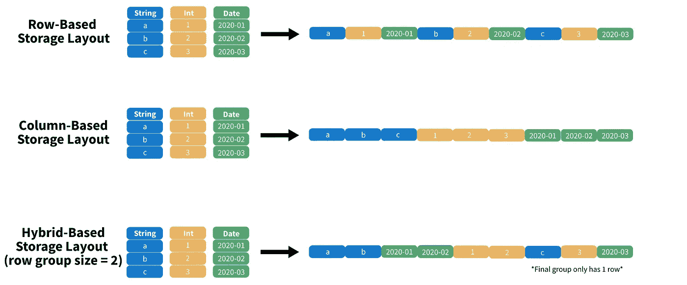
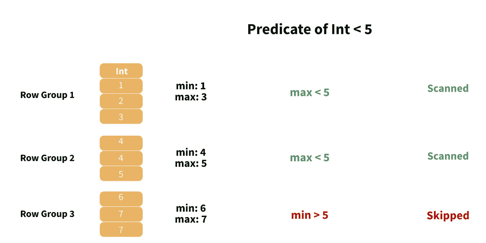

# 揭开拼花文件格式的神秘面纱

> 原文：<https://towardsdatascience.com/demystifying-the-parquet-file-format-13adb0206705>

## 任何数据科学工作流的默认文件格式

你在熊猫身上用过`pd.read_csv()`吗？嗯，如果您使用 parquet 而不是 CSV，那么这个命令的运行速度可以比 T2 快 50 倍。

照片由[迈克·本纳](https://unsplash.com/@mbenna?utm_source=medium&utm_medium=referral)在 [Unsplash](https://unsplash.com?utm_source=medium&utm_medium=referral) 拍摄

在本帖中，我们将讨论 apache parquet，这是一种非常高效且支持良好的文件格式。这篇文章是面向数据从业者(ML，DE，ds)的，所以我们将把重点放在高级概念上，并使用 SQL 来讨论核心概念，但更多资源的链接可以在整篇文章和评论中找到。

事不宜迟，我们开始吧！

# 技术 TLDR

Apache parquet 是一种开源文件格式，提供了高效的存储和快速的读取速度。它使用一种混合存储格式，按顺序存储列块，从而在选择和过滤数据时提供高性能。除了强大的压缩算法支持( [snappy，gzip，LZO](https://stackoverflow.com/questions/35789412/spark-sql-difference-between-gzip-vs-snappy-vs-lzo-compression-formats) )，它还提供了一些减少文件扫描和编码重复变量的巧妙技巧。

如果你在乎速度，你应该考虑镶木地板。

# 但是，到底是怎么回事呢？

好吧，让我们慢一点，用简单的英语讨论拼花地板。

## 1 —数据存储问题

假设我们是数据工程师。我们希望创建一个数据架构，促进在线分析过程( **OLAP** )，这只是面向数据分析的选择性查询。在 OLAP 环境中优化的数据函数的一些例子是探索性数据分析或决策科学。

但是我们应该如何在磁盘上存储我们的数据呢？

图 1:将二维表格转换成二进制的例子。图片作者。

嗯，在考虑我们的转换是好是坏时有很多考虑因素，但是对于 OLAP 工作流，我们主要关心两个…

*   **读取速度**:我们从二进制文件中访问和解码相关信息的速度
*   **磁盘大小**:二进制格式的文件需要多少空间

请注意，文件压缩算法的成功还有其他衡量标准，比如写速度和元数据支持，但是我们现在只关注上面两个。

那么，相对于 CSV 文件，parquet 的性能如何呢？**占用空间减少 87%，查询速度提高 34 倍** (1 TB 数据，s 3 存储)——[src](/csv-files-for-storage-no-thanks-theres-a-better-option-72c78a414d1d)

## 2 —镶木地板核心特征

但是为什么 parquet 比 CSV 和其他流行的文件格式更有效呢？第一个答案是存储布局…

**2.1 —混合存储布局**

当我们将一个二维表转换成一系列 0 和 1 时，我们必须仔细考虑最佳结构。应该先写第一栏，再写第二栏，再写第三栏吗？还是应该顺序存储行？

传统上，有三种主要布局可以将我们的二维表格向下转换为 1:

1.  **基于行:**顺序存储行(CSV)。
2.  **基于列:**顺序存储列(ORC)。
3.  **Hybrid-base:** 顺序存储大块的列(拼花地板)。

我们可以在图 2 中看到每种格式的图形表示。

图 2:3 种主要的存储类型。图片作者。

现在，混合布局对于 OLAP 工作流非常有效，因为它们支持投影和谓词。

**投影**是选择列的过程——你可以把它想象成 SQL 查询中的`SELECT`语句。基于列的布局最能支持投影。例如，如果我们想使用基于列的布局读取表的第一列，我们可以只读取二进制文件中的前 *n* 个索引，将它们反序列化，然后呈现给用户。很有效率，对吧？

**谓词**是用于选择行的标准——您可以将其视为 SQL 查询中的`WHERE`子句。基于行的存储最能支持谓词。如果我们希望所有的行都符合某种标准，比如`Int >= 2`，我们可以通过`Int`(降序)对表进行排序，扫描直到不满足我们的标准，然后返回无效行之上的所有行。

在这两个场景中，**我们都希望遍历尽可能少的文件。此外，由于数据科学通常需要对行和列进行子集化，基于混合的存储布局为我们提供了一个介于列和基于行的文件格式之间的中间地带。**

在继续之前，需要注意的是，拼花地板通常被描述为柱状结构。然而，由于它存储大量的列，如图 2 底部所示，混合存储布局是更精确的描述。

太好了！因此，如果我们希望提取数据，我们可以只存储连续的列块，而*通常*会获得非常好的性能。但是这种方法有规模吗？

**2.2 —拼花地板元数据**

答案是响亮的“是”Parquet 利用元数据来跳过根据我们的谓词可以排除的数据部分。

图 3:基于混合的存储布局从二维到一维的转换。图片作者。

以图 3 中的示例表为例，我们可以看到我们的行组大小为 2，这意味着我们存储给定列的 2 行，下一列的 2 行，第三列的 2 行，依此类推。

当我们用完所有的列后，我们移动到下一组行。注意，上表中只有 3 行，所以最后一个行组只有 1 行。

现在，假设我们实际上在行组中存储了 100，000 个值，而不是 2 个。如果我们希望找到所有的行，其中我们的`Int`列有一个给定值(即一个等式谓词)，最坏的情况是扫描表中的每一行。

图 parquet 如何处理行组谓词的例子。图片作者。

Parquet 通过存储每个行组的`max`和`min`值智能地解决了这个问题，允许我们跳过整个行组，如图 4 所示。但这还不是全部！由于 parquet 经常将许多`.parquet`文件写入一个目录，我们可以在中查看整个文件的列元数据，并确定是否应该扫描它。

通过包含一些额外的数据，我们能够跳过大块的数据并显著提高查询速度。更多，[看这里。](https://parquet.apache.org/docs/file-format/metadata/)

**2.3 —拼花文件结构**

好了，我们已经暗示了数据是如何从二维格式转换成一维格式的，但是整个文件系统是如何构造的呢？

如上所述，parquet 可以一次写很多`.parquet`文件。对于小型数据集，这是一个问题，您可能应该在写入前对数据进行重新分区。但是，对于较大的数据集，将数据子集化到多个文件中可以显著提高性能。

总的来说，镶木地板遵循以下结构。让我们依次看一看每一个…

> 根>拼花文件>行组>列>数据页

首先，我们的**文件根目录**，只是一个保存所有内容的目录。在根目录中，我们有许多单独的`**.parquet**` **文件**，每个文件包含我们数据的一个分区。单个拼花文件由多个**行组**组成，单个行组包含多个**列**。最后，在我们的列中有**数据页面**，它实际上保存了原始数据和一些相关的元数据。

我们可以在下面的图 4 中看到单个`.parquet`文件的简化表示。

图 4:按顺序排列的拼花地板的层次结构。图片作者。

如果你对细节感兴趣，这是文档。[重复和定义级别](https://blog.twitter.com/engineering/en_us/a/2013/dremel-made-simple-with-parquet)对于充分理解数据页面如何工作也是必不可少的，但这些只是一些额外的好处。

## **3 —附加优化**

自 2013 年问世以来，parquet 变得更加智能。基本结构与上面的格式相比基本没有变化，但是增加了许多很酷的特性，可以提高某些类型数据的性能。

让我们看一些例子…

**3.1 —我的数据有大量重复值！**

解决方案:[游程编码(RLE)](https://en.wikipedia.org/wiki/Run-length_encoding#:~:text=Run%2Dlength%20encoding%20(RLE),than%20as%20the%20original%20run.)

假设我们有一个包含 10，000，000 个值的列，但是所有的值都是`0`。为了存储这些信息，我们只需要两个数字:`0`和`10,000,000`—`value`和`number of times it repeated`。

RLE 就是这么做的。当发现许多连续的重复项时，parquet 可以将这些信息编码为一个对应于值和计数的元组。在我们的例子中，这将使我们避免存储 9，999，998 个数字。

**3.2 —我的数据有非常大的类型！**

解决方案:[字典编码](https://stackoverflow.com/questions/64600548/when-should-i-use-dictionary-encoding-in-parquet)带[位打包](https://parquet.apache.org/docs/file-format/data-pages/encodings/#a-namerlearun-length-encoding--bit-packing-hybrid-rle--3)

假设我们有一个包含国家名称的列，其中一些非常长。如果我们想存储“刚果民主共和国”，我们需要一个至少可以处理 32 个字符的字符串列。

字典编码用一个小整数替换列中的每个值，并将映射存储在数据页面的元数据中。当在磁盘上时，我们的编码值是位打包的，以尽可能占用最少的空间，但是当我们读取数据时，我们仍然可以将列转换回它的原始值。

3.3 —我对我的数据使用了复杂的过滤器！

求解:[投影和谓词下推](https://stackoverflow.com/a/58235274/3206926)

在 spark 环境中，我们可以避免通过投影和谓词下推将整个表读入内存。因为 spark 操作是延迟计算的，这意味着它们直到我们实际查询数据时才被执行，所以 spark 可以将最少的数据放入内存。

快速提醒一下，谓词子集行和投影子集列。因此，如果我们知道我们只需要几列和行的子集，我们实际上不必将整个表读入内存——它在读取过程中被过滤掉了。

**3.4——我有很多不同的数据！**

解决方案:[三角洲湖泊](https://docs.databricks.com/delta/index.html)

最后，Deltalake 是一个开源的“lakehouse”框架，它结合了数据湖的动态特性和数据仓库的结构。如果您计划使用 parquet 作为您的组织的数据仓库的基础，那么 ACID 保证和事务日志等附加特性确实是有益的。

如果你想了解更多，这里有一个很棒的适合初学者的资源。

# 摘要

对于现实世界的使用来说，Parquet 是一种非常有效的文件格式。它在最小化表扫描和将数据压缩到小尺寸方面非常有效。如果您是一名数据科学家，parquet 可能是您的首选文件类型。

*感谢阅读！我将再写 11 篇文章，将学术研究引入 DS 行业。查看我的评论，链接到这篇文章的主要来源和一些有用的资源。*