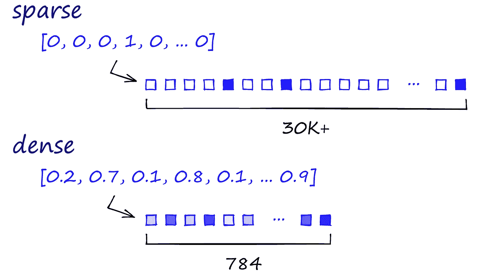
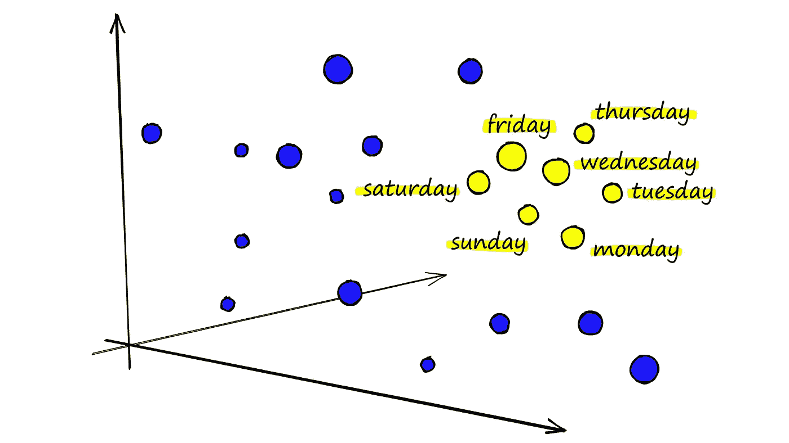
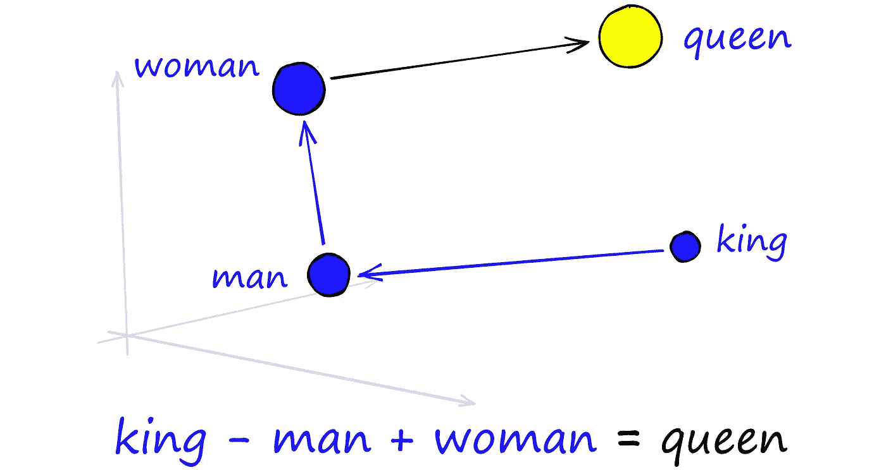
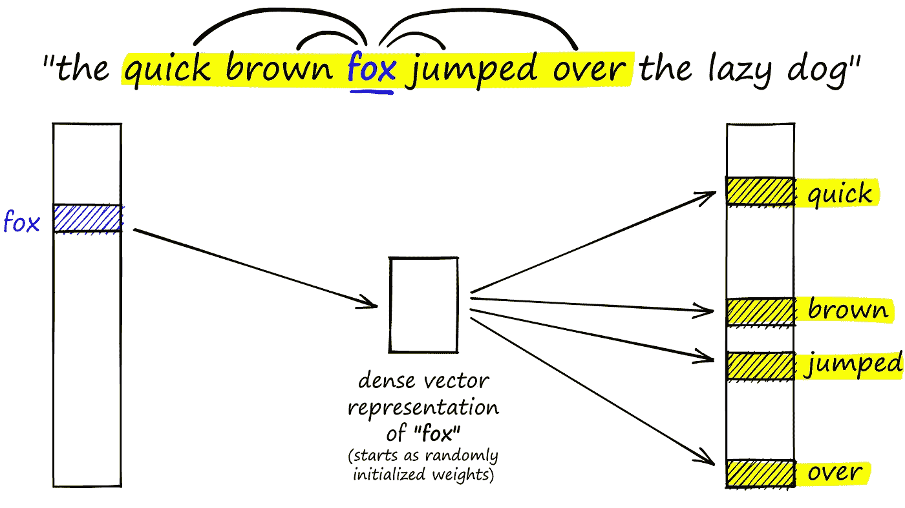
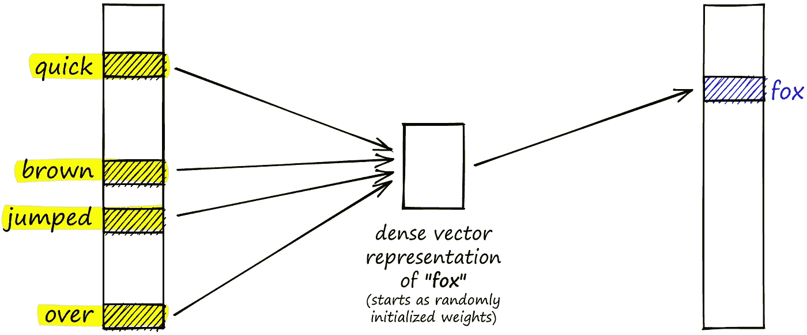
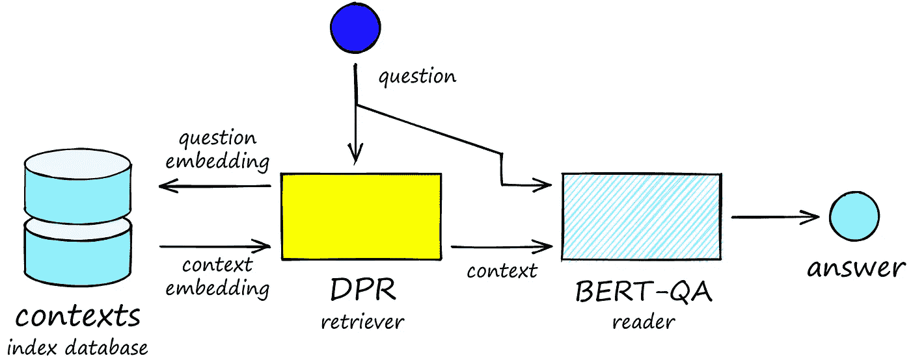
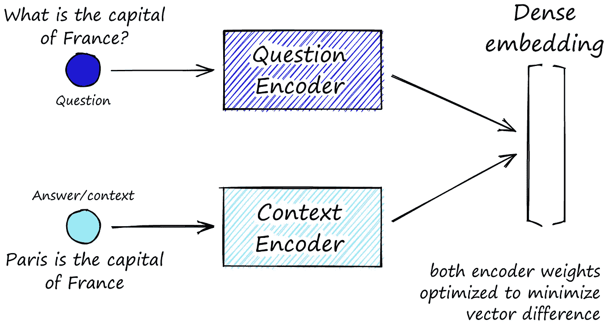
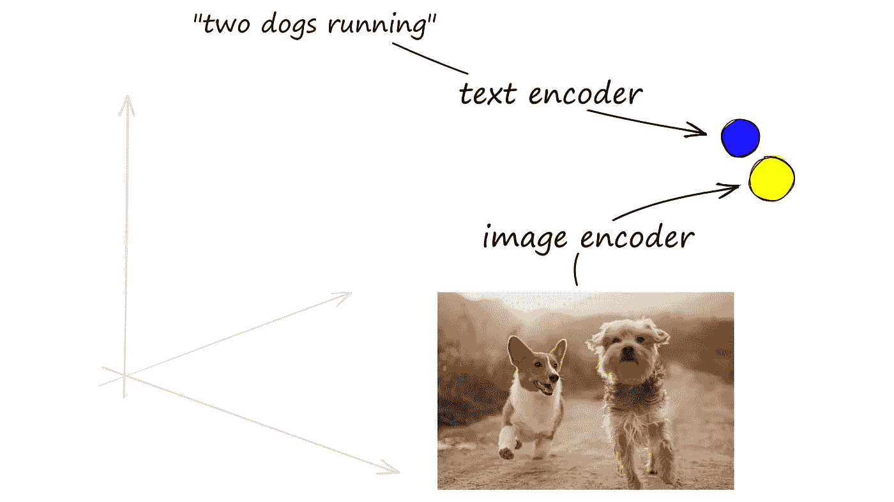
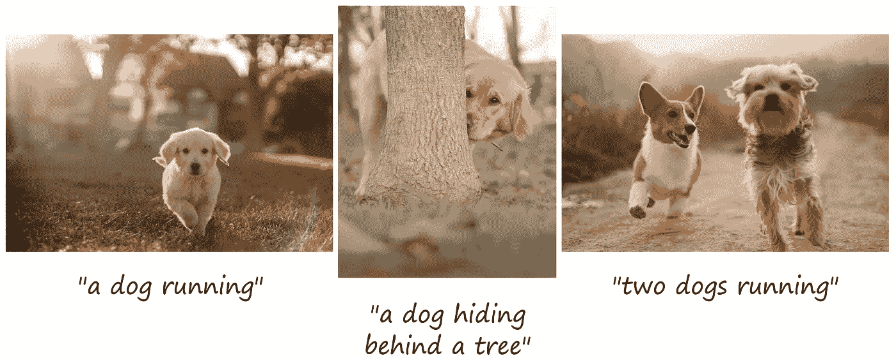

# 密集向量:用代码捕捉意义

> 原文：<https://towardsdatascience.com/dense-vectors-capturing-meaning-with-code-88fc18bd94b9>

## [语义搜索的自然语言处理](https://jamescalam.medium.com/list/nlp-for-semantic-search-d3a4b96a52fe)

## 谷歌、网飞、Spotify 和许多其他公司背后的技术解释


vackground.com 在 [Unsplash](https://unsplash.com?utm_source=medium&utm_medium=referral) 上[拍照。在松果(作者受雇于此)的语义搜索电子书](https://unsplash.com/@vackground?utm_source=medium&utm_medium=referral)的 [NLP 上发表的原始文章。](https://www.pinecone.io/learn/dense-vector-embeddings-nlp/)

对于现代自然语言处理(NLP)技术的成功，可能没有比语言的矢量表示更大的贡献了。随着 2013 年 word2vec 的推出，NLP 的迅速崛起被点燃[1]。

Word2vec 是代表文本的最具标志性和最早的密集向量的例子之一。但是自从 word2vec 时代以来，表示语言的发展已经以可笑的速度前进。

这篇文章将探讨*为什么*我们使用密集向量——以及目前可用的构建密集向量的一些最佳方法。

点击此处观看视频演示！

# 密集与稀疏向量

我们应该问的第一个问题是*为什么我们要用向量来表示文本？简单的答案是，为了让计算机理解人类可读的文本，我们需要将我们的文本转换成机器可读的格式。*

语言本来就充满了信息，所以我们需要相当大量的数据来表示哪怕是少量的文本。[矢量](https://www.pinecone.io/learn/vector-embeddings/)自然是这种格式的好选择。

对于向量表示，我们也有两种选择；*稀疏*矢量或*密集*矢量。

稀疏向量可以更有效地存储，使我们能够对两个序列进行基于语法的比较。例如，给出两个句子；`"Bill ran from the giraffe toward the dolphin"`和`"Bill ran from the dolphin toward the giraffe"`我们将得到一个完美(或接近完美)的匹配。

为什么？因为尽管句子的意思不同，但它们是由相同的语法(例如，单词)组成的。因此，稀疏向量将是紧密匹配的，甚至是完美匹配的(取决于构造方法)。

*稀疏向量之所以称为稀疏，是因为向量稀疏地填充了信息。通常，我们会在成千上万个零中寻找几个一(我们的相关信息)。因此，这些向量可能包含许多维度，通常有数万个维度。*

在稀疏向量表示文本语法的情况下，我们可以将密集向量视为语义的数字表示*。通常，我们把单词编码成非常密集的高维向量。词的抽象意义和关系是用数字编码的。*

**

*稀疏和密集向量比较。稀疏向量包含*稀疏*分布的信息比特，而密集向量在每个维度上都有密集打包的信息，信息丰富得多。*

**密集向量仍然是高维的(784 维很常见，但也可以更多或更少)。然而，每个维度都包含由神经网络确定的相关信息——压缩这些向量更复杂，因此它们通常会使用更多内存。**

*想象一下，我们为书中的每个单词创建密集的向量，减少这些向量的维度，然后以 3D 形式可视化它们——我们将能够识别关系。例如，一周中的几天可以聚集在一起:*

**

*相关关键词的聚类示例，如典型的单词嵌入，如 *word2vec* 或 *GLoVe* 。*

*或者我们可以执行“基于单词”的算法:*

**

*Mikolov 的另一篇论文[2]中对单词向量进行运算的经典示例。*

*所有这些都是通过使用同样复杂的神经网络实现的，神经网络从*海量*文本数据中识别模式，并将它们转化为密集向量。*

*因此，我们可以将稀疏向量和密集向量之间的区别视为用语言表示语法，而不是用语言表示语义。*

# *生成密集矢量*

*有许多技术可以用来构建密集向量，从单词或句子的向量表示，到职业棒球大联盟的球员[3]，甚至是跨媒体的文本和图像。*

**我们通常采用现有的公共模型来生成向量。几乎每个场景都有一个高性能的模型，使用起来更容易，更快，也更准确。有些情况下，例如对于特定于行业或语言的嵌入，您有时需要从头开始微调甚至训练一个新的模型，但这并不常见。**

*我们将探索这些技术中最激动人心和最有价值的几项，包括:*

*   *“2vec”方法*
*   *句子变形金刚*
*   *密道寻回犬(DPR)*
*   *视觉变形金刚(ViT)*

# *Word2Vec*

*尽管我们现在拥有构建嵌入的高级技术，但是如果没有 word2vec，对密集向量的概述将是不完整的。虽然*不是*第一个，但它是第一个广泛使用的密集嵌入模型，这要归功于(1)非常好的*，以及(2)发布的 [word2vec 工具包](https://code.google.com/archive/p/word2vec/)——允许轻松训练或使用预先训练的 word2vec 嵌入。**

**给定一个句子，通过一个编码器-解码器神经网络将一个特定的单词(翻译成一个热码编码向量)映射到周围的单词来创建单词嵌入。**

****

**word2vec 中构建密集矢量嵌入的跳格法。**

**这是 word2vec 的 *skip-gram* 版本，给定一个单词`fox`，它试图预测周围的单词(它的上下文)。训练后，我们丢弃左右块，只保留中间的密集向量。这个向量表示图左侧的单词，可以用于为下游语言模型嵌入这个单词。**

**我们还有*连续单词包(CBOW)* ，它切换方向，旨在根据上下文预测单词。这一次我们为右边的单词生成一个嵌入(在这种情况下，仍然是`fox`)。**

****

**在 word2vec 中构建密集矢量嵌入的连续单词包(CBOW)方法。**

**skip-gram 和 CBOW 是相似的，因为它们从编码器-解码器网络的中间*隐藏层*产生密集嵌入向量。**

**由此，Mikolov 等人提出了我们之前看到的应用于语言的矢量算术的臭名昭著的`King - Man + Woman == Queen`例子。**

**Word2vec 刺激了 NLP 的一系列发展。然而，当使用单一向量来表示较长的文本块时，word2vec 毫无用处。它允许我们对单个单词(或 n-grams)进行编码，但仅此而已，这意味着大段的文本只能由许多向量来表示。**

**为了有效地比较较长的文本块，我们需要用一个向量来表示它。因为这个限制，几个*扩展的*嵌入方法很快出现，比如 sentence2vec 和 doc2vec。**

**无论是 word2vec，sentence2vec，甚至是(击球手|投手)2vec(美国职业棒球大联盟球员的代表[3])，我们现在都有非常先进的技术来构建这些密集的向量。因此，尽管它是从“2vec”开始的，但我们今天并不经常看到它们被使用。**

# **句子相似度**

**我们已经用 word2vec 探索了基于单词的嵌入的开端，并简要地提到了弹出的另一个*2 vec*，旨在将这种矢量嵌入方法应用于更长的文本块。**

**我们在变压器模型中看到了同样的演变。这些模型产生了信息极其丰富的密集向量，可用于从情感分析到问答的各种应用。由于这些丰富的嵌入，transformers 已经成为主导的现代语言模型。**

**[伯特](https://www.pinecone.io/learn/semantic-search/)可能是这些变压器架构中最著名的(尽管以下适用于*大多数*变压器型号)。**

**在 BERT 中，我们为每个单词(或*令牌*)生成类似于 word2vec 的矢量嵌入。然而，由于更深的网络，嵌入更加丰富——由于注意机制，我们甚至可以对单词的*上下文*进行编码。**

**注意机制允许 BERT 通过考虑所述上下文单词的*对齐*来优先考虑哪些上下文单词应该对特定嵌入具有最大影响(我们可以将其想象为 BERT 字面上*根据上下文注意*特定单词)。**

**我们所说的“上下文”是指，word2vec 将为“银行”生成相同的向量，无论它是*“一个绿草如茵的银行”*还是*“英格兰银行”*——由于注意机制，BERT 将根据周围的上下文修改*银行*的编码。**

**但是，这里有一个问题。我们要重点比较*的句子*，而不是单词。并且为每个令牌产生 BERT 嵌入。所以这对我们句子对的比较没有帮助。我们需要的是一个单一的向量来表示我们的句子或段落，比如 sentence2vec。**

**第一个明确为此构建的转换器是 *Sentence-BERT (SBERT)* ，是 BERT [4]的修改版本。**

**BERT(和 SBERT)使用一个*单词块*记号赋予器——这意味着每个单词等于一个*或多个*记号。SBERT 允许我们为包含不超过 128 个标记的序列创建单个向量嵌入。任何超出这个限制的部分都会被删除。**

**这个限制对于长文本来说并不理想，但是在比较句子或者平均长度很小的段落时就足够了。许多最新的模型也允许更长的序列长度！**

## **嵌入句子转换器**

**让我们看看如何使用`sentence-transformers`库[5]快速整合一些句子嵌入。首先，我们导入这个库并初始化一个来自微软的名为`all-mpnet-base-v2`(最大序列长度`384`)的句子转换器模型。**

**然后我们可以继续编码一些句子，一些句子比另一些更相似——同时共享很少的匹配单词。**

**我们的句子转换器从这些句子中产生了什么？我们句子的 768 维密集表示。在大多数情况下，当使用相似性度量(如余弦相似性)进行比较时，这些嵌入的性能非常好。**

**尽管我们关于蜜蜂和它们的蜂王共享*零*个描述性词语的语义最相似的句子，当用余弦相似性测量时，我们的模型正确地将这些句子嵌入最近的向量空间中！**

# **问题回答**

**transformer 模型的另一个广泛应用是问答。在问答中，我们可以使用几种不同的*架构*。其中最常见的就是*开域 Q & A (ODQA)* 。**

**ODQA 允许我们获取一大组包含问题答案的句子/段落(比如来自维基百科页面的段落)。然后，我们问一个问题，以返回一个(或多个)段落中最能回答我们问题的一小部分。**

**在这样做的时候，我们利用了三个组件或模型:**

*   **某种**数据库**来存储我们的句子/段落(称为*上下文*)。**
*   **一个**检索器**检索它认为与我们的问题相似的上下文。**
*   **一个**阅读器**模型，它从我们的相关上下文中提取*答案*。**

****

**一个开放域问答(ODQA)架构的例子。**

**这个架构的*检索器*部分是我们这里的重点。想象我们使用一个句子转换模型。给定一个问题，检索者会返回与我们的问题最相似的句子——但是我们想要答案*而不是*问题。**

**相反，我们希望有一个模型能够将问答配对映射到向量空间中的同一点。所以给出了两句话:**

```
**"What is the capital of France?" AND "The capital of France is Paris."**
```

**我们想要一个模型，将这两个句子映射到相同的(或*非常接近的*)向量。因此，当我们收到问题`"What is the capital of France?"`时，我们希望输出向量与我们的[向量数据库](https://www.pinecone.io/learn/vector-database/)中的`"The capital of France is Paris."`向量表示具有非常高的相似性。**

**这方面最流行的模型是艾的*《密集通道检索器(DPR)】*。**

**DPR 由两个较小的模型组成——一个*上下文*编码器和一个*查询*编码器。同样，他们都使用 BERT 架构，并在问答对上进行并行训练。我们使用对比损失函数，计算为每个编码器输出的两个向量之间的差[6]。**

****

**DPR 的双编码器结构，我们有一个*问题编码器*和一个*上下文编码器*——两者都经过优化，为每个问题-上下文对输出相同(或接近)的嵌入。**

**因此，当我们给我们的问题编码器`"What is the capital of France?"`时，我们希望输出向量与我们的上下文编码器为`"The capital of France is Paris."`输出的向量相似。**

**我们不能把所有的问答关系都建立在训练期间被看到的基础上。因此，当我们输入一个新的问题，比如`"What is the capital of Australia?"`，我们的模型可能会输出一个我们认为类似于`"The capital of Australia is ___"`的向量。当我们将其与数据库中的上下文嵌入进行比较时，这个*应该*类似于`"The capital of Australia is Canberra"`(或者我们希望如此)。**

## **快速 DPR 设置**

**让我们快速看一下用 DPR 构建一些上下文和查询嵌入。我们将使用来自拥抱脸的`transformers`库。**

**首先，我们为我们的上下文(`ctx`)模型和`question`模型初始化记号化器和模型。**

**给定一个问题和几个上下文，我们标记和编码如下:**

***请注意，我们已经将这些问题包含在我们的上下文中，以确认双编码器架构不只是像句子转换器一样产生简单的语义相似性操作。***

**现在，我们可以将我们的查询嵌入`xq`与我们所有的上下文嵌入`xb`进行比较，看看哪些与*余弦相似度*最相似。**

**在我们的三个问题中，我们返回了两个正确答案作为*最热门的*答案。很明显，DPR 不是完美的模型，尤其是考虑到我们问题的简单性和 DPR 检索的小数据集。**

**然而，积极的一面是，在 ODQA 中，我们会返回更多的上下文，并允许一个*阅读器*模型来识别最佳答案。读者模型可以“重新排列”上下文，因此不需要立即检索顶部上下文来返回正确答案。如果我们在 66%的情况下检索到最相关的结果，这可能是一个好结果。**

**我们还可以看到，尽管在上下文中隐藏了与我们的问题完全匹配的问题，但它们只干扰了我们的最后一个问题，被前两个问题正确地忽略了。**

# **视觉变形金刚**

**计算机视觉(CV)已经成为变压器模型中一些令人兴奋的进步的舞台，这些进步在历史上一直局限于 NLP。**

**这些进步有望使《变形金刚》成为第一个被广泛采用的在 NLP *和* CV 两方面都出色的 ML 模型。同样的，我们一直在创造代表语言的密集向量。我们可以对图像做同样的事情——甚至将图像和文本编码到同一个向量空间中。**

****

**我们可以使用特定的文本和图像编码器将文本和图像编码到同一个向量空间。图片来源 [Alvan Nee](https://unsplash.com/photos/T-0EW-SEbsE) 。**

**[*视觉变压器(ViT)*](https://www.pinecone.io/learn/vision-transformers/) 是第一个在没有任何上游 CNN 帮助的情况下应用于 CV 的变压器(如同 VisualBERT [7])。作者发现，维生素 t 有时会胜过最先进的(SOTA)CNN(长期统治 CV 的大师)[8]。**

**这些 ViT 转换器已经与更传统的语言转换器一起使用，以产生迷人的图像和文本编码器，正如 [OpenAI 的 CLIP](https://www.pinecone.io/learn/clip/) 模型【9】。**

**剪辑模型使用两个编码器，像 DPR，但是这次我们使用一个 ViT 模型作为我们的图像编码器和一个*屏蔽自我关注*转换器，像文本的 BERT】。与 DPR 一样，这两个模型被并行训练，并通过对比损失函数进行优化——为图像-文本对产生*高相似度*向量。**

**这意味着我们可以对一组图像进行编码，然后将这些图像与我们选择的标题进行匹配。我们可以使用整篇文章中使用的编码和余弦相似性逻辑。让我们试一试。**

## **图文嵌入**

**我们先来获取几张图片进行测试。我们将使用 Unsplash 中的三幅狗做不同事情的图片(下面标题中的链接)。**

****

**从 Unsplash 下载的图片(标题是手动添加的——它们不包含在图片中)，照片署名为克里斯蒂安·卡斯蒂略[ [1](https://unsplash.com/photos/73pyV0JJOmE) 、 [2](https://unsplash.com/photos/qA9wk6SDuVw) 和 [Alvan Nee](https://unsplash.com/photos/T-0EW-SEbsE) 。**

**我们可以使用拥抱脸中的`transformers`来初始化剪辑`model`和`processor`。**

**现在让我们创建三个真正的标题(加上一些随机的)来描述我们的图像，并在将它们传递给我们的`model`之前通过我们的`processor`对它们进行预处理。我们将得到输出逻辑，并使用一个`argmax`函数来得到我们的预测。**

**在那里，我们有完美的图像到文本的匹配与剪辑！当然，它并不完美(我们这里的例子相当简单)，但是它很快就产生了一些令人惊叹的结果。**

**我们的模型已经处理了比较文本和图像嵌入。但是，如果我们想要提取那些在比较中使用的相同嵌入，我们访问`outputs.text_embeds`和`outputs.image_embeds`。**

**同样，我们可以遵循与之前余弦相似度相同的逻辑来查找最接近的匹配。让我们用这种替代方法比较一下`'a dog hiding behind a tree'`的嵌入和我们的三个图像。**

**不出所料，我们把躲在树后的狗还回来了！**

**以上是对 NLP 中早期密集矢量嵌入和当前 SOTA 的概述。我们已经介绍了文本和图像嵌入的一些最激动人心的应用，例如:**

*   **与`sentence-transformers`语义相似。**
*   **用脸书艾的 DPR 模型进行问答检索。**
*   **用 OpenAI 的剪辑进行图文匹配。**

**我们希望你能从这篇文章中学到一些东西。**

# **参考**

**[1] T. Mikolov 等人，[向量空间中单词表示的有效估计](https://arxiv.org/abs/1301.3781) (2013)**

**[2] T. Mikolov 等人，[连续空间词表征中的语言规律](https://aclanthology.org/N13-1090/) (2013)，NAACL HLT**

**[3] M. Alcorn，[(击球手|投手)2vec:具有神经球员嵌入的无统计人才建模](https://www.sloansportsconference.com/research-papers/batter-pitcher-2vec-statistic-free-talent-modeling-with-neural-player-embeddings) (2017)，麻省理工斯隆:体育分析会议**

**[4] N. Reimers，I. Girevych，[句子-BERT:使用连体 BERT 网络的句子嵌入](https://arxiv.org/abs/1908.10084) (2019)，EMNLP**

**[5] N .赖默斯，[句子变压器文件](https://www.sbert.net/)，sbert.net**

**[6] V. Karpukhin 等人，[面向开放领域问答的密集段落检索](https://arxiv.org/abs/2004.04906) (2020)，EMNLP**

**[7]李力宏等，[视觉伯特:视觉与语言的简单与表演基线](https://arxiv.org/abs/1908.03557) (2019)，arXiv**

**[8] A. Dosovitskiy 等人，[一幅图像值 16x16 个字:大规模图像识别的变形金刚](https://arxiv.org/abs/2010.11929) (2020)，arXiv**

**[9] A .拉德福德等，[剪辑:连接文本和图像](https://openai.com/blog/clip/) (2021)，OpenAI 博客**

**[10] [夹模特卡](https://huggingface.co/openai/clip-vit-base-patch32)，抱紧脸**

****所有图片均由作者提供，除非另有说明***