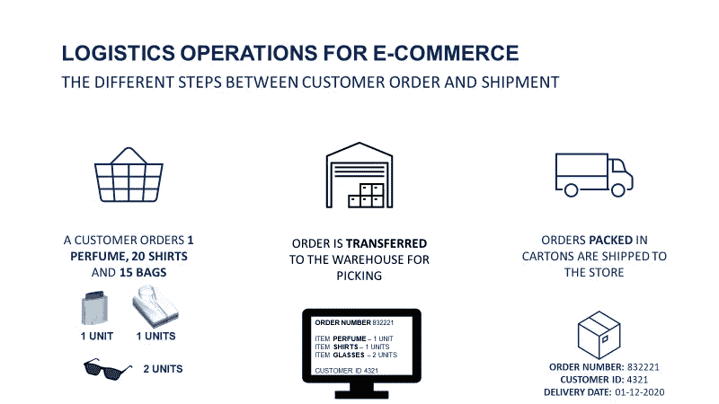
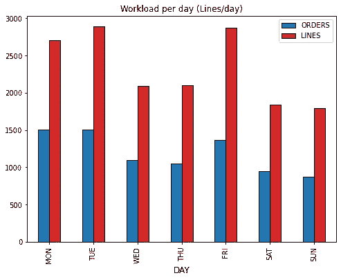
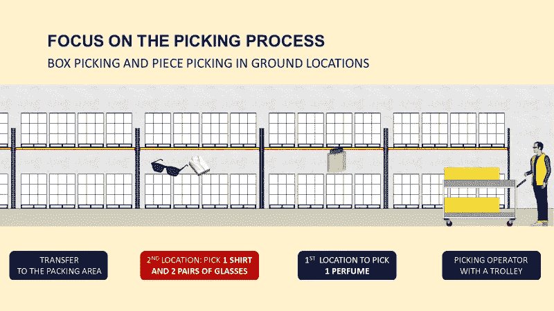
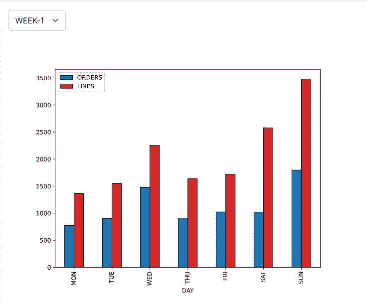
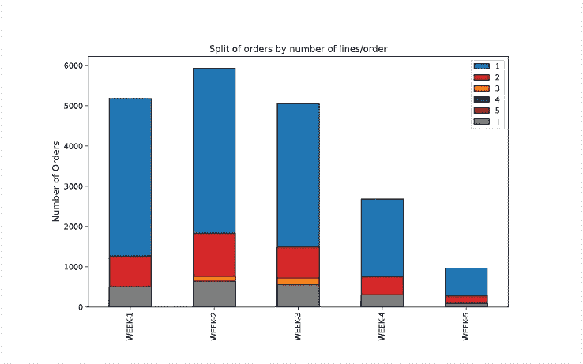
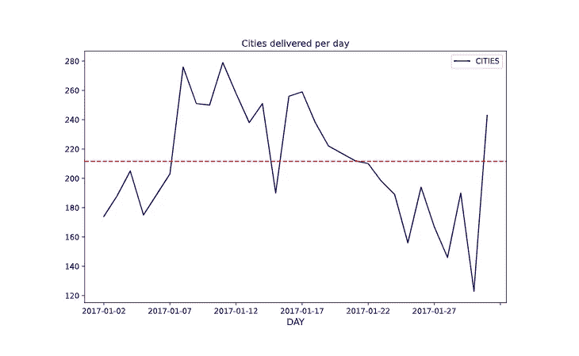
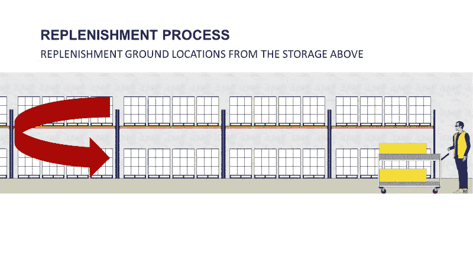
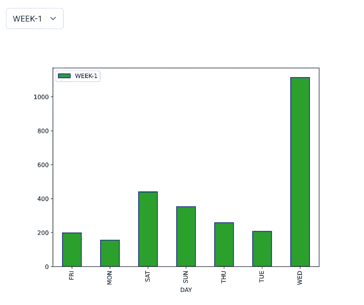
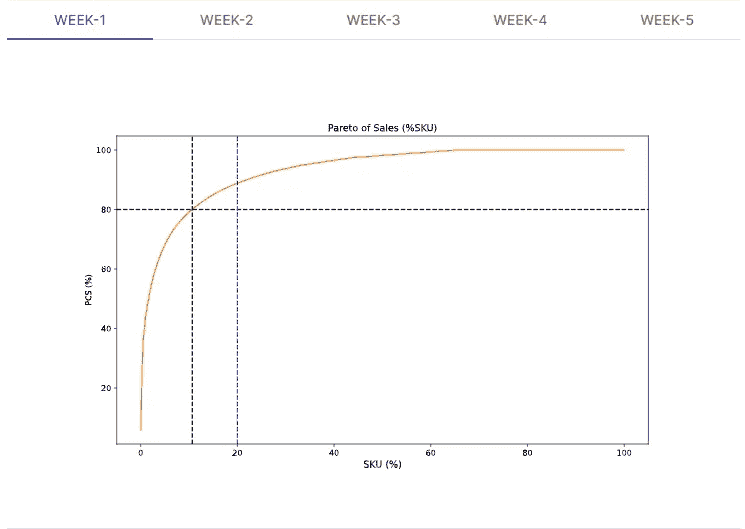
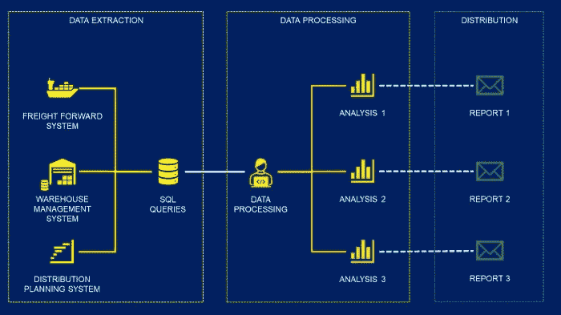

# 使用数据面板部署物流操作仪表板

> 原文：<https://towardsdatascience.com/deploy-logistics-operational-dashboards-using-datapane-585cf19532f1>

## 使用 DataPane 部署报告解决方案以支持电子商务的仓储物流操作


[皮卡伍德](https://unsplash.com/@pickawood?utm_source=medium&utm_medium=referral)在 [Unsplash](https://unsplash.com?utm_source=medium&utm_medium=referral) 上拍摄的照片

# 目标

构建**报告功能**以提供[**供应链可见性**](https://www.youtube.com/watch?v=0AZfe7DuT_U&t=27s) 并支持中型零售商的**配送中心**的运营团队

# 介绍

在中国等一些市场，电子商务已经彻底颠覆了零售业。快速变化的消费者行为极大地改变了这些公司管理业务的方式。

这直接[**影响了这些零售商的物流运营**](https://www.youtube.com/watch?v=YNvOX3CT3hQ) ，他们现在面临**数量**的高波动性、**更大的产品组合**以及**非常短的交付周期**。

> 为小型企业构建数据分析能力

然而， **SMEs** (中小企业)公司可能没有**预算**来投资于**昂贵的数据基础设施**以建立**报告能力**。

在本文中，我们将使用 Python 库 **DataPane** 为仓储操作设计一个简单的架构来部署一个**交互式仪表板。**

💌新文章免费直入你的收件箱:[时事通讯](https://www.samirsaci.com/#/portal/signup)

```
**SUMMARY**
**I. Context: Warehousing Operations for E-Commerce** Warehouse to prepare and ship orders for an E-Commerce website
**Objective** How can you support Operational Excellence with simple reports
**II. Build reports using DataPane
1\. Quick Introduction** Deploy and share your results with Datapane
**2\. Monitor the picking workload**
Build visuals showing the number of orders received per day**3\. Analyze the volumes pareto** How many SKU are representing 80% of your volume?
**III. Conclusion & Next Steps**
```

# 一、如何在没有 PowerBI 的情况下部署仪表盘？

# 问题陈述

作为一家中型在线零售商**配送中心(仓库)**的**持续改进工程师**，你负责建立报告能力，为运营团队带来可见性。

## 电子商务的物流运作



(图片由作者提供)

配送中心负责订单履行和装运

1.  顾客在网站上订购产品
2.  这些订单由[仓库管理系统(WMS)](https://youtube.com/shorts/MW1QRJs3iuE) 接收
3.  仓库操作员[准备订单，并将其打包](https://www.youtube.com/watch?v=XejgbF2m_8g)
4.  包裹被[运送](https://www.youtube.com/watch?v=PYkN24PMKd8)给顾客


配送中心布局(图片由作者提供)

最重要的**关键绩效指标(KPI)** 是订单接收和包裹装运之间的**提前期**。

此 KPI 受链中所有流程的影响；您将提供影响整体绩效的关键指标的可见性。

有关物流绩效管理的更多信息

<http://samirsaci.com>  

# 二。使用 DataPane 构建报告

你不会用 ETL 作业和像 PowerBI、Tableau 或 Google Studio 这样的高级可视化工具来构建一个完整的云架构。

这个想法是从 [WMS](https://youtube.com/shorts/MW1QRJs3iuE) 中提取数据，在本地处理你的数据，并部署可供运营团队使用的报告。

## 1.使用 DataPane 部署报告功能

这个框架让你有机会与你的同事分享你的 Jupyter 笔记本的结果。

例如，您想分享这个简单的条形图。



(图片由作者提供)

该图表显示了仓库每天收到的订单(和订单行)数量。

**你如何与同事分享这张图表？**

**这是一个非常简单的三步流程(** [**链接**](https://datapane.com/getting-started/#) **)**

1.  使用 pip 获取客户端库

```
pip3 install datapane
```

2.在 DataPane 上注册并注册您的令牌

```
datapane login --server=https://datapane.com/ --token=yourtoken
```

3.展开你的视觉

您需要在代码中添加一个部分来部署您的 visual，您可以选择几个模板

4.您可以与同事分享这一视觉效果

(作者视觉)

他们甚至可以用按钮(左上角)选择星期。您可以通过发送给运营团队的链接私下分享这一视觉效果。

## 后续步骤

我们现在将基于特定流程构建一组视觉效果，为团队带来可见性。

> 你可以在我的 Github(跟随我:D)资源库中找到完整的代码和虚拟数据:[链接](https://github.com/samirsaci/ops-dashboard)
> 我的投资组合与其他项目:[萨米尔萨奇](https://samirsaci.com/)

## 2.监控你的工作量

## 关注挑选过程



(图片由作者提供)

操作员正拿着他们的手推车，手推车上有顾客订购的商品清单，他们会在每个地点停下来清点订购的商品数量。

*如果你想了解更多关于拣选过程的信息，请看下面的视频*

详细挑选过程(视频由作者提供)

## **订单/订单行数**

**问题**
*我们每天从客户那里收到多少订单(和订单行)？*

提货工作量的一个主要指标是客户订单(和订单行)的数量。



通过[链接](https://datapane.com/u/samir/reports/n3RQRXA/orderslines-per-day/)访问互动视频(作者提供的视频)

> ***见解***
> 第一周周日:拣货团队面临订单行**高峰**，这可能解释了这一天的糟糕表现。

## 每天的件数

**问题**
*客户每天订购多少件商品？*

该指标可以显示公司当天的营业额。这也影响了包裹运送量(立方米)。


通过[链接](https://datapane.com/u/samir/reports/O7vqZx3/pieces-per-day/)访问互动视频(作者提供的视频)

> ***感悟***
> 第一周周三:由于某商品的特别促销，我们经历了每条线件数的激增。

## 按行/订单比率拆分订单

**问题**
*每天单线订单的拆分(%)是多少？*

由于每个订单的行数很多，您的操作员将会看到他们每个订单的行走距离在增加。因此，他们的提货生产率直接受到每个订单行数的影响。



通过[链接](https://datapane.com/u/samir/reports/Eka191k/lines-per-order/)访问视频(视频由作者提供)

> ***见解***
> 我们有大部分单行订单(1 行/订单)可以批量提货。

## 交付的城市数量

**问题**
*我每天需要配送多少个不同的城市？*

交付的城市数量会影响您的运输管理工作量。



通过[链接](https://datapane.com/u/samir/reports/W3Dqzz7/cities-per-day/)访问视频(视频由作者提供)

> ***见解***
> 在这个月的大部分时间里，您经历了送货城市数量的激增，这可能会影响您的运输成本。

## 关注补充流程



(图片由作者提供)

当拣选位置(在地面上)是空的，你的叉车司机执行**补给任务**。他们从上面的存储区提取物品，以补充未来订单的提货地点。

## 每天补充的数量

**问题**
*你们操作员每天完成多少补货任务？*

这个过程可能会成为瓶颈，影响您的整体性能，您需要跟踪每天的工作量。



通过[链接](https://datapane.com/u/samir/reports/n3Zoq17/replenishments-per-day/)访问视频(视频由作者提供)

> 第一周星期三:你会看到大量的补给任务，这可能会影响你的工作效率。

## 每个通道的补充数量

**问题**
*您仓库的哪个区域集中了您的大部分货量？*

您的仓库由带有单元和拣选位置的小巷组成。


仓库布局示例(图片由作者提供)

瓶颈的一个主要来源是当人们集中在一个区域时。如果你遇到这种问题，最好的解决方法是避免在同一个地区分组高轮转。


通过[链接](https://datapane.com/u/samir/reports/v7Jb5e7/treemap-replenishment/)访问视频(视频由作者提供)

> *洞察*
> 第一周:你可以看到 A09 和 A10 代表了件量的近 **20%，这可能会在订单高峰时造成瓶颈。**

</optimizing-warehouse-operations-with-python-part-1-83d02d001845>  

## 3.分析帕累托

**问题**
*有多少 SKU 代表我总销量的 80%？*

为了优化您的流程，您需要根据每件产品的数量进行产品细分。

高周转次数的物品需要放在满托盘的提货位置，而低周转次数的物品可以放在货架上以节省空间。

因为业务在发展，你需要追踪你的帕累托图**调整你的布局和流程**。



通过[链接](https://datapane.com/u/samir/reports/Okpb4X3/pareto-analysis/)访问视频(视频由作者提供)

*如果你想了解更多关于布局优化的帕累托法则，请看下面的视频*

利用帕累托定律优化布局(视频由作者提供)

# 三。结论和后续步骤

*关注我的 medium，了解更多与供应链数据科学相关的见解。*

## 结论

您已经构建了一组简单(但非常有用)的视觉效果，可供运营团队使用。

例如，它们可以嵌入到带有评论区的概念文档中，使其成为一个动态文档。

这种解决方案无法满足适当的云架构的性能和功能。然而，对于小型结构来说，它可以容易地实现，而不需要任何额外的成本。

## 在云上部署您的解决方案

您可以在云中部署用于构建这些视觉效果的代码(Heroku，Google App Engine ),以自动化这一过程并每天触发任务。

## 建造供应链控制塔

供应链控制塔传统上被定义为一组连接到各种**系统**的仪表板，使用数据监控整个供应链的**重要事件**。

它使供应链部门能够更好地实时跟踪、了解和解决关键问题。



分三步跟踪货物—(图片由作者提供)

数据面板将用于跟踪货物，并向商场和物流经理报告事故:

*   有多少货物延迟交付？
*   目前运输中的货物在哪里？
*   有多少转运货物面临风险？

欲知详情，

<https://www.samirsaci.com/automated-supply-chain-control-tower-with-python/>  

# 关于我

让我们连接上 [Linkedin](https://www.linkedin.com/in/samir-saci/) 和 [Twitter](https://twitter.com/Samir_Saci_) ，我是一名供应链工程师，正在使用数据分析来改善物流运作和降低成本。

如果你对数据分析和供应链感兴趣，可以看看我的网站

<https://samirsaci.com>  

# 参考

[1] DataPane，用 Python 分析——在 DataPane 上共享，文档，[链接](https://docs.datapane.com/)