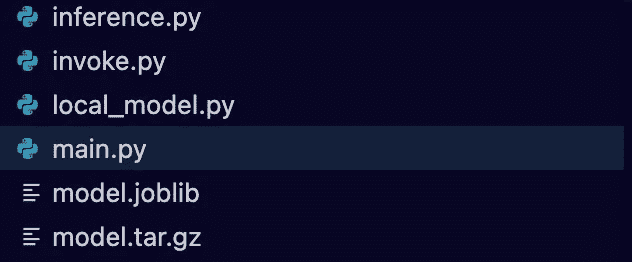
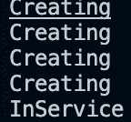

# 在 Amazon SageMaker 上部署预先训练的 Sklearn 模型

> 原文：<https://towardsdatascience.com/deploying-a-pre-trained-sklearn-model-on-amazon-sagemaker-826a2b5ac0b6>

# 在 Amazon SageMaker 上部署预先训练的 Sklearn 模型

## 将本地培训的模型投入生产

图片来自[穆罕默德·阿里·皮克](https://unsplash.com/@mrpeker)拍摄的 [Unsplash](https://unsplash.com/photos/hfiym43qBpk)

我曾经写过如何在亚马逊 SageMaker 上训练和部署定制的 [Sklearn](https://ram-vegiraju.medium.com/training-and-deploying-custom-scikit-learn-models-on-aws-sagemaker-3de6a2f669f4) 和 [TensorFlow](/training-and-deploying-custom-tensorflow-models-with-aws-sagemaker-72027722ad76) 模型。但是，对于某些用例，您可能有在其他地方培训过的预培训模型。在本文中，我们将探索如何获取预先训练好的模型数据，并将其部署到 SageMaker 上。此外，对于这个例子，我们将主要在本地环境中处理代码，以确保您不会在 AWS 控制台中有太多繁重的工作。

**注意**:对于那些刚接触 AWS 的人来说，如果你想跟进的话，请确保你在下面的 [**链接**](https://aws.amazon.com/console/) 做了一个账户。**本文将假设一个新手对 AWS 和 SageMaker 的知识达到中级水平。**我们也不会探究模型构建理论，本文的主要焦点将放在部署上。

# 目录

1.  设置
2.  模型部署脚本
3.  模型调用
4.  其他资源和结论

# 1.设置

首先，让我们快速地在本地训练一个可用于部署的 Sklearn 模型。您可以简单地运行以下 Python 脚本进行设置。

本地模型训练

这个脚本的主要关键是我们使用 [joblib](https://joblib.readthedocs.io/en/latest/) 模块来保存训练好的模型。您应该看到这个工件显示在您的本地目录中。

局部模型神器(作者截图)

有必要使用 joblib 来保存模型，因为这是 SageMaker 对 Sklearn 模型的预期格式。除了我们的本地模型脚本，我们可以提前提供的一个脚本是我们的推理脚本。这有助于 SageMaker 理解您的模型服务的输入和输出将如何配置。您可以提供四种默认功能[和](https://docs.aws.amazon.com/sagemaker/latest/dg/adapt-inference-container.html):

1.  **model_fn** :这将反序列化并加载我们的 joblib 文件。
2.  **input_fn** :您可以传入您的模型期望输入的数据格式(json、csv 等)。
3.  **predict_fn** :我们的模型预测功能。
4.  **output_fn** :处理 predict_fn 的返回值以及端点将得到的响应类型。

推理处理函数

下一步是在 AWS 控制台中创建一个**合适的 SageMaker IAM 角色**。在这里，您需要为 SageMaker 提供适当的权限:S3 完全访问、SageMaker 完全访问和 ECR 完全访问。对于本例，这应该是您在 AWS 控制台中的主要工作。一旦您创建了这个角色，我们就可以专注于构建我们的模型部署脚本了。

# 2.模型部署脚本

首先，我们的模型部署脚本有以下导入。确保这个脚本与您的推理处理程序和模型数据(joblib)在同一个目录中。

进口

我们与 AWS 服务的大部分协调工作都是通过 SDK 完成的，在这里是 Python SDK: [Boto3](https://aws.amazon.com/sdk-for-python/) 。我们与 SageMaker 的 [Boto3 客户端](https://boto3.amazonaws.com/v1/documentation/api/latest/reference/services/sagemaker.html)合作，协调我们的模型部署步骤。

SageMaker 设置

在这里，我们实例化了 SageMaker 的客户端和 S3 客户端，我们将在那里存储我们的模型数据，以便 SageMaker 访问。下一步是关键部分，SageMaker 需要一个**model.tar.gz**格式的模型工件/数据。为此，我们将把本地模型工件和 inference.py 脚本压缩到一个 tar 文件中。

创造 model.tar.gz

model.tar.gz 本地保存(作者截图)

接下来，SageMaker 要理解我们需要将这个模型工件放在 S3 的一个位置。

将模型数据上传至 S3

现在我们可以关注在 SageMaker 上构建端点的三个步骤。

1.  [模型创建](https://boto3.amazonaws.com/v1/documentation/api/latest/reference/services/sagemaker.html#SageMaker.Client.create_model)
2.  [端点配置创建](https://boto3.amazonaws.com/v1/documentation/api/latest/reference/services/sagemaker.html#SageMaker.Client.create_endpoint_config)
3.  [端点创建](https://boto3.amazonaws.com/v1/documentation/api/latest/reference/services/sagemaker.html#SageMaker.Client.create_endpoint)

对于 SageMaker 模型创建，我们需要两个特性:模型数据和容器图像。在这种情况下，我们可以使用 SageMaker SDK 从 SageMaker 直接检索 sk learn 图像进行推理。

检索 Sklearn 图像

现在我们可以提供模型数据和图像来创建我们的 SageMaker 模型。

SageMaker 模型创建

现在我们可以使用 SageMaker 模型来创建我们的端点配置，在这里我们可以指定我们的实例类型和我们想要的端点数量。

SageMaker 端点配置创建

现在，我们可以开始创建我们的端点，这将需要几分钟的时间来成功创建。

创建端点

如果您现在运行该脚本，您将看到一个端点成功创建，并且在您的 AWS 控制台中也是可见的。

端点创建(作者截图)

# 3.模型调用

我们现在可以创建一个单独的调用文件，用一个样本点来测试我们的端点。我们不想将它添加到主文件中，因为每次执行都会创建一个新的端点。获取您的端点名称，并在下面的脚本中指定它，您将看到执行。

调用端点

结果(作者截图)

# 4.其他资源和结论

 [## GitHub-RamVegiraju/Pre-Trained-Sklearn-sage maker:在亚马逊上部署一个预先训练好的 sk learn 模型…

### 此时您不能执行该操作。您已使用另一个标签页或窗口登录。您已在另一个选项卡中注销，或者…

github.com](https://github.com/RamVegiraju/Pre-Trained-Sklearn-SageMaker) 

有关示例的完整代码，请访问上面的链接。理解了模型数据的格式和结构之后，在 SageMaker 上部署预先训练好的模型就非常简单了。需要发生的主要变化是您使用 SDK 检索的图像，这应该与您正在使用的框架相匹配。如果 SageMaker 不支持容器，请查看如何[自带容器](/bring-your-own-container-with-amazon-sagemaker-37211d8412f4)。

## 额外资源

[萨格马克推论的例子](https://github.com/RamVegiraju/SageMaker-Deployment)

[带 SageMaker 的多模型 TensorFlow 端点](/deploy-multiple-tensorflow-models-to-one-endpoint-65bea81c3f2f)

*如果你喜欢这篇文章，请在*[*LinkedIn*](https://www.linkedin.com/in/ram-vegiraju-81272b162/)*上与我联系，并订阅我的媒体* [*简讯*](https://ram-vegiraju.medium.com/subscribe) *。如果你是新来的中号，用我的* [*会员推荐*](https://ram-vegiraju.medium.com/membership) *报名吧。*