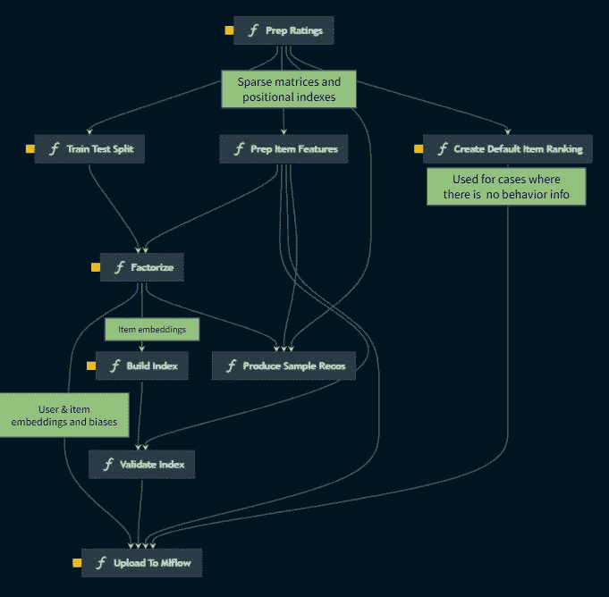
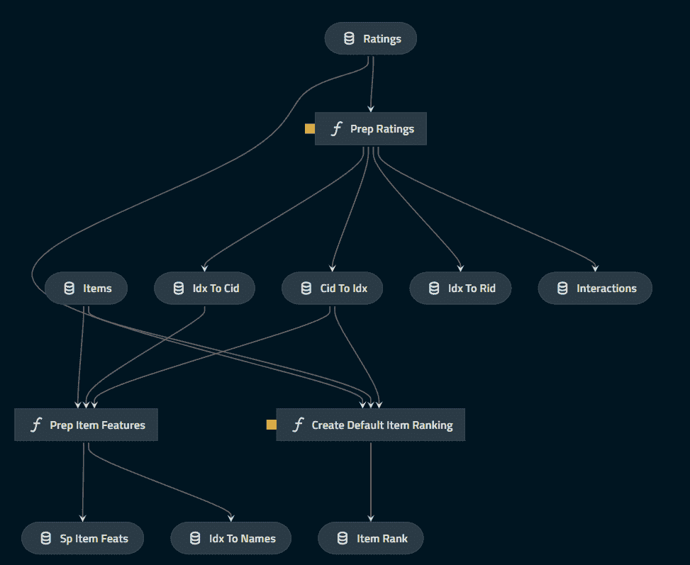
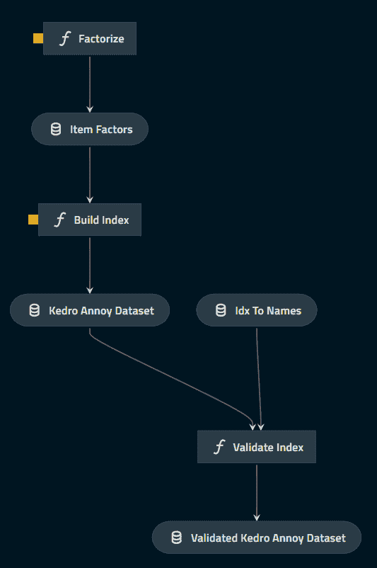
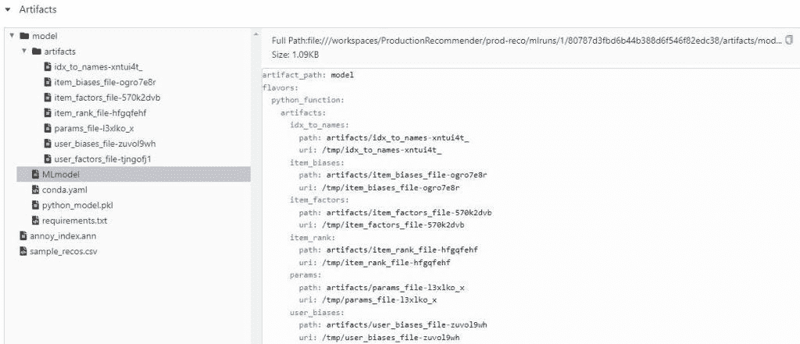

# 以 Kedro 的方式部署推荐系统

> 原文：<https://towardsdatascience.com/deploying-a-recommendation-system-the-kedro-way-7aed36db7cef>

## 使用 Kedro 和 MLFlow 创建推荐系统管道的教程


我们的管道中有需要定制的东西。就像这辆丰田 Supra。照片由 [Garvin St. Villier](https://www.pexels.com/@garvin-st-villier-719266?utm_content=attributionCopyText&utm_medium=referral&utm_source=pexels) 从 [Pexels](https://www.pexels.com/photo/photo-of-supra-parked-in-front-of-building-3874337/?utm_content=attributionCopyText&utm_medium=referral&utm_source=pexels) 拍摄

推荐系统是现代互联网不可或缺的一部分。如果你没有以某种方式为客户提供个性化的服务，他们就无法享受数字体验。甚至出现了“超个性化”一词，这是人工智能的高级能力，通过利用我们的数字面包屑为用户提供最相关的项目。用技术术语来说，这是将各种数据集(点击流、评级、文本、图像、商品本身等)尽可能实时地输入到机器学习算法中，以提供动态推荐体验。

[在我之前的文章](/level-up-your-mlops-journey-with-kedro-5f000e5d0aa0)中，我介绍了 MLOps 以及 Kedro 如何成为实现模块化、可维护和可复制管道的首选框架。推荐者受益于 MLOps，因为需要快速试验、持续再培训和模型部署。成功的公司甚至使用先进的 A/B 测试技术同时部署几个模型([参见网飞实验平台](https://netflixtechblog.com/its-all-a-bout-testing-the-netflix-experimentation-platform-4e1ca458c15))。因此，我认为分享我的经验将是令人兴奋的，我把一个推荐系统从工程、培训，一直带到服务。

为了演示工作流，我将使用 [MovieLens 10M](https://grouplens.org/datasets/movielens/10m/) ，这是一个推荐者意义上的中等大小的数据集。就交互数据而言，它也相当密集，但这是一个很好的练习。此外，它还包含可用作项目功能的标签。端到端流程的独特之处在于，它不仅仅服务于 MLFlow 的 scikit-learn 模型。有一些定制要做。但在此之前，让我们从用户 API 需求开始。

*注意，我假设读者已经熟悉协同过滤和最近邻索引。*

如果你想跳过所有内容，直接到这里看我的代码。

# 用户 API

我们将处理两种情况，传入用户已经是系统的一部分(已知用户)，传入用户未知(冷启动)。我们将有点独特地模拟我们的 API 响应实时浏览会话的情况。因此，我们将收到与他们在前一个小时左右浏览的内容相对应的商品 id。

**已知用户案例**

*   我们的用户已经登录并浏览了几个项目。
*   我们希望推荐与用户浏览的内容最接近的项目。
*   我们的 API 接收用户 id 和商品 id 对。

**冷启动案例**

*   这是我们第一次见到这个用户(或者他还没有登录)
*   同上，我们推荐最接近的项目
*   我们的 API 只接收项目 id

我们还可以有第三种情况，我们只接收用户 id。我们可以为培训产生的候选人服务。这对读者来说是一个很好的练习！

# 工作流程概述

[Kedro](https://kedro.readthedocs.io/en/stable/01_introduction/01_introduction.html) 被用作我们的工作流框架。算法方面，我们将使用 [LightFM](https://github.com/lyst/lightfm) 和 WARP loss。我们将使用生成的项目嵌入来产生我们最接近的项目。我们使用 [Optuna](https://optuna.readthedocs.io/en/stable/index.html) 进行超参数优化。为了创建一个快速的索引服务，我们使用[来构建我们的近似最近邻索引。最后，我们使用](https://github.com/spotify/annoy) [MLFlow](https://mlflow.org/) 来跟踪实验，存储工件，并为我们的模型服务。为了集成到 Kedro，我们使用 [kedro-mlflow](https://kedro-mlflow.readthedocs.io/en/stable/) 。

为了满足我们的用户 API 需求，我们将使用 ANNOY 来查找与查询项目最接近的项目。这就是所谓的候选人选择。如果用户是一个已知的用户，那么我们更进一步，通过用户嵌入和被查询项目嵌入的点积来排列最接近的项目。如果用户是未知的，那么我们简单地使用默认的排名——流行度和项目年龄。这就是所谓的候选人排名。在一些工作流中，有另一种模型根据当前会话(时间、位置、用户的其他行为)对候选人进行排名。但是在本教程中，我们将简单地使用上述内容。

下图说明了工作流程。这很简单，因为网飞规模的系统可能会令人望而生畏！这是由 [kedro-viz](https://github.com/kedro-org/kedro-viz) 生成的。绿色方框是我粘贴的评论。



作者图片

# 准备评分和准备项目功能

我将评级和项目特征从熊猫数据帧格式转换成稀疏格式。存储映射到其位置索引的用户和项目 id(“cid”是项目 ID，“rid”是用户 ID)。还存储了默认的排名和名称映射。想象这个阶段:



作者图片

在 Kedro 的 catalog.yaml 中，我已经将所有映射(dict 类型)定义为 pickled 对象。排名是一个 CSV 文件。

# 因数分解

在数据工程阶段之后，我们训练我们的模型。我们将数据分为训练和测试，并运行 LightFM。然后，我们产生我们的嵌入、偏差和模型度量。最后，我们抽样推荐。在真实的场景中，我们还可以在这里包括一些健全性检查和可视化，以尽可能多地实现自动化。


作者图片

如前所述，Optuna 用于超参数优化。为了集成到 MLFlow，我们使用回调。这实际上导致了一个新的 MLFlow 实验，不同于 kedro-mlflow 创建的实验。然而，最初的实验将存储最佳模型的参数，以及稍后将显示的所有工件。

# 索引

我们的最后一个阶段是使用项目因子来索引我们最近的邻居。这将确保为我们查询的项目提供快捷的服务。在下面的工作流中，`validate_index` 是我们的节点，用于在训练过程中立即测试我们创建的索引。



作者图片

这是我们第一次定制 Kedro 的地方。来自 aroy 库的对象不能被 pickled，所以我们需要为数据目录定制加载和保存功能。我们实现了 Kedro 的`AbstractDataset` ，并像下面这样使用它。

# 上传至 MLFlow

如果我们一切都正确，那么我们将把我们生成的每个工件上传到 MLFlow，因为它将用于模型服务。为了简单起见，我们将留在本地文件系统中。我们使用`MlflowModelLoggerDataSet`来保存工件，并在 MLFlow 标准下定义了另一个定制类`KedroMLFlowLightFM`。这将定义 MLFlow 将如何加载模型和处理输入。

这里发生了几件事。在第一个片段中，我们定义了上传到 MLFlow 工件存储库的文件。它看起来非常难看，因为它充满了临时文件作为上传过程的暂存区。我很想知道你对此是否有更好的方法。接下来，在第二个片段中，我们定义了`KedroMLFlowLightFM`。这将告诉 MLFlow 将如何存储和服务模型。这非常重要，因为这将决定`mlflow model serve`如何工作。请注意，预测功能捕获了我们的用户需求。

# 运行管道

既然管道的关键组件已经完成，让我们运行它。这里需要注意一些事情:

1.  准备功能——我们在这里运行 1000 万部电影的一个非常小的子集。在本演示中，这是为了缩短周期时间。
2.  训练——我们使用 Optuna 来优化嵌入的维度。
3.  索引—返回值的类型为`KedroAnnoyIndex`。
4.  推荐范例——这里有一些有趣的东西值得一看。

*   乍一看，《怪物史莱克》不应该接近《黑暗骑士》(风格迥异)，但两者都是主流大片，所以算法可能已经注意到了这一点。
*   《料理鼠王的近邻》中还包括其他动画电影，如《怪物公司》,甚至包括《龙猫邻居》这样的国际电影。
*   《罗生门》是一部永恒的电影，看到它接近老式电影(马耳他之鹰，大睡)和其他大脑电影(迷失的高速公路，玫瑰的名字)很酷。

```
**> kedro run** 
-- a lot of things get logged here so this is abbreviated
**-- (1) Prep Features** 
Running node: prep_ratings: 
prep_sparse_ratings([ratings,params:preprocessing]) -> [interactions,rid_to_idx,idx_to_rid,cid_to_idx,idx_to_cid] Number of users: 5387 
Number of items: 2620 
Number of rows: (195359, 4) 
Sparsity: 0.013841563730609597 **-- (2) Training kedro.pipeline.node** 
Running node: factorize: factorize_optimize([train,test,eval_train,sp_item_feats,params:model]) -> [user_factors,item_factors,user_biases,item_biases,model_metrics] Train: 0.20478932559490204, Test: 0.1860404759645462 
Train: 0.24299238622188568, Test: 0.21084092557430267 
Train: 0.2665676772594452, Test: 0.22465194761753082 
Train: 0.28074997663497925, Test: 0.23137184977531433 
Train: 0.2892519235610962, Test: 0.23690366744995117 
Train: 0.2953035533428192, Test: 0.2383144646883011 
Train: 0.3050306737422943, Test: 0.24187859892845154 
Train: 0.3089289367198944, Test: 0.24299241602420807 
Train: 0.3151661455631256, Test: 0.2450343668460846 
Train: 0.3220716714859009, Test: 0.24473735690116882 
Trial 0 finished with value: 0.24800445139408112 and parameters: {'n_components': 59}. Best is trial 0 with value: 0.24800445139408112 -- and so on...**-- (3) Indexing** Running node: build_index: build_index([item_factors,params:index_params]) -> [kedro_annoy_dataset] 
-- and so on...**-- (4) Sampling indexing results** Running node: validate_index:
validate_index([kedro_annoy_dataset,idx_to_names]) -> [validated_kedro_annoy_dataset] Closest to Dark Knight, The (2008) : 
Dark Knight, The (2008) 
Sin City (2005) 
Shrek 2 (2004) 
Kill Bill: Vol. 1 (2003) 
Batman Begins (2005) 
Princess Mononoke (Mononoke-hime) (1997) 
Ratatouille (2007) 
Harry Potter and the Order of the Phoenix (2007) 
Scarface (1983) 
Lord of the Rings: The Fellowship of the Ring, The (2001) Closest to Ratatouille (2007) : 
Ratatouille (2007) 
Monsters, Inc. (2001) 
My Neighbor Totoro (Tonari no Totoro) (1988) 
Kiki's Delivery Service (Majo no takkyûbin) (1989) 
Spirited Away (Sen to Chihiro no kamikakushi) (2001) 
Who Framed Roger Rabbit? (1988) 
WALL·E (2008) 
Cars (2006) 
Howl's Moving Castle (Hauru no ugoku shiro) (2004) 
Shrek (2001) Closest to Rashomon (Rashômon) (1950) : 
Rashomon (Rashômon) (1950) 
Maltese Falcon, The (a.k.a. Dangerous Female) (1931) 
Lost Highway (1997) 
Big Sleep, The (1946) 
Name of the Rose, The (Der Name der Rose) (1986) 
Fanny and Alexander (Fanny och Alexander) (1982) 
Brick (2005) 
Dogville (2003) 
Vertigo (1958) 
Nine Queens (Nueve Reinas) (2000)
```

如果一切顺利，那么在我们的 MLFlow 实验中应该有以下内容。



图片由作者提供。在本例中，所有工件都存储在本地，但是将它们存储在云环境中应该是小菜一碟。

# 上菜(和测试！)

为了服务于模型，我们将打包我们的项目，然后使用 MLFlow 为我们部署一个 API。构建和部署脚本如下。像往常一样，我们会保持本地化。

```
-- our project is named prod-reco 
> kedro package -- in case we have installed our module already
> pip uninstall prod-reco -y -- install locally 
> pip install src/dist/prod_reco-0.1-py3-none-any.whl -- mlflow serve. You can use the ff way, or the model registry mlflow models serve -m "runs:/<run-id>/model" -p 5001 --no-conda
```

对于上面的例子，我使用了实验的 run-id，但是使用模型注册表也可以。此外，由于我只在本地安装了这个包，所以没有使用-conda。

现在，为了测试我们的 API，我们使用 pytest。我们以不同的方式调用我们的 API，看看它是否正确运行。如果成功，您应该得到下面的输出。

```
> pytest — no-cov -s src/tests/test_endpoint.py::TestEndpoint
==test session starts ==
…
…
…
plugins: mock-1.13.0, cov-3.0.0, anyio-3.5.0
collected 5 itemssrc/tests/test_endpoint.py 
Dark Knight
[“City of God (Cidade de Deus) (2002)”, “Dark Knight, The (2008)”, “History of Violence, A (2005)”, “3:10 to Yuma (2007)”, “Animatrix, The (2003)”]
.
Dark Knight & Kung Fu Panda
[“Wallace & Gromit: The Wrong Trousers (1993)”, “Monsters, Inc. (2001)”, “City of God (Cidade de Deus) (2002)”, “Dark Knight, The (2008)”, “Mulan (1998)”, “Ratatouille (2007)”, “History of Violence, A (2005)”, “3:10 to Yuma (2007)”, “Animatrix, The (2003)”, “Kung Fu Panda (2008)”]
.
Dark Knight & Kung Fu Panda & Godfather II
[“Godfather, The (1972)”, “Godfather: Part II, The (1974)”, “Wallace & Gromit: The Wrong Trousers (1993)”, “Monsters, Inc. (2001)”, “City of God (Cidade de Deus) (2002)”, “City of God (Cidade de Deus) (2002)”, “Untouchables, The (1987)”, “Dark Knight, The (2008)”, “Carlito’s Way (1993)”, “Mulan (1998)”]
.
User likes vintage movies
[{“userId”: 2241, “recos”: [“Mulan (1998)”, “Wallace & Gromit: The Wrong Trousers (1993)”, “Ratatouille (2007)”, “Monsters, Inc. (2001)”, “History of Violence, A (2005)”, “Kung Fu Panda (2008)”, “3:10 to Yuma (2007)”, “Animatrix, The (2003)”, “City of God (Cidade de Deus) (2002)”, “Dark Knight, The (2008)”]}]
.
First user likes vintage movies, second likes animation
[{“userId”: 190, “recos”: [“Animatrix, The (2003)”, “History of Violence, A (2005)”, “Kung Fu Panda (2008)”, “3:10 to Yuma (2007)”, “Ratatouille (2007)”, “City of God (Cidade de Deus) (2002)”, “Dark Knight, The (2008)”, “Mulan (1998)”, “Monsters, Inc. (2001)”, “Wallace & Gromit: The Wrong Trousers (1993)”]}, {“userId”: 2241, “recos”: [“Mulan (1998)”, “Wallace & Gromit: The Wrong Trousers (1993)”, “Ratatouille (2007)”, “Monsters, Inc. (2001)”, “History of Violence, A (2005)”, “Kung Fu Panda (2008)”, “3:10 to Yuma (2007)”, “Animatrix, The (2003)”, “City of God (Cidade de Deus) (2002)”, “Dark Knight, The (2008)”]}]== 5 passed in 1.40s ==
```

# 摘要

让管道运转起来花了我们很多时间，但非常值得。我们定义了我们的数据准备、训练、索引、服务和测试。我想强调的是，在这一点上，你可以很容易地做几件事:

*   持续培训——编写一个 cronjob 或使用 kedro-airflow 将其转换为 Airflow DAG，以便在必要时使管道每天运行。注意，我们有适当的测试来检查它是否工作。批处理作业从未如此简单。
*   将您的培训应用程序文档化—您可以将生成的容器集成到您组织的更大的编排管道中。
*   部署您的服务应用程序—使用 MLFlow 从您的定制模型创建一个容器。
*   更改配置—想要使用云资源？就像改变配置一样简单。代码库将基本保持不变！

感谢您的阅读，祝您在 MLOps 之旅中好运！

*原载于 2022 年 3 月 28 日【http://itstherealdyl.com】<https://itstherealdyl.com/2022/03/29/deploying-a-recommendation-system-the-kedro-way/>**。***