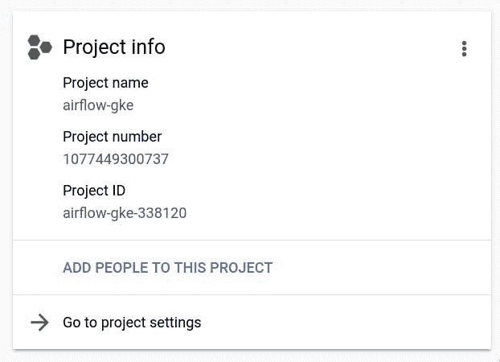
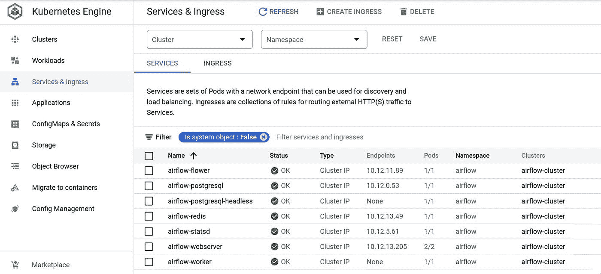

# 使用 Helm 在 Google Kubernetes 引擎上部署气流

> 原文：<https://towardsdatascience.com/deploying-airflow-on-google-kubernetes-engine-with-helm-28c3d9f7a26b>

## 第一部分:使用 Helm 配置基本气流部署

Reza Rostampisheh 在 [Unsplash](https://unsplash.com?utm_source=medium&utm_medium=referral) 上拍摄的照片

# 目标

这篇由两部分组成的文章将展示如何使用[官方掌舵图](https://airflow.apache.org/docs/helm-chart/stable/index.html)在 GCP 的 Google Kubernetes 引擎上部署和配置 Apache Airflow。

在第一部分中，我们将:

*   在 GKE 建立一个 Kubernetes 集群。
*   使用 Helm 和 values.yaml 文件部署和配置 Airflow。
*   通过 GCP 负载均衡器在 GKE 上公开 Airflow web 服务器。

在本部分的最后，我们将有一个运行 LocalExecutor 的 Airflow 部署和一个通过 GCP 负载平衡器可访问的 Airflow web 服务器。但是没有任何匕首。

在第二部分，我们将:

*   使用 GKE 秘密管理气流连接。
*   通过从工件注册表加载的 Docker 映像安装气流依赖项和自定义操作符。
*   使用 git-sync 特性从私有 GitHub 存储库中自动提取 Airflow DAGs。
*   整合谷歌云存储等其他 GCP 服务。

在第二部分之后，我们将使用一个 DAG 扩展我们的气流部署，该 DAG 将每天一批数据写入 Google 云存储桶。

# 介绍

GCP 是气流云提供商的绝佳选择。Apache-airflow-providers-GooglePython 包提供了大量的 air flow 操作符、钩子和传感器。这使得将 Airflow 与许多 GCP 服务(如 BigQuery 和 GCS)集成变得轻而易举。

值得注意的是，GCP 提供了自己的气流管理部署，名为 Cloud Composer。然而，通过管理我们自己在 Kubernetes 上的部署，我们保持了对底层基础设施的更细粒度的控制。这使我们能够针对特定使用情形优化基础架构，并降低成本。

# 先决条件

本文假设您的工作站已经满足了先决条件:

1.  一个名为“气流-gke”的 GCP 项目，有一个活跃的计费帐户(可能有免费试用信贷)。
2.  CLI 工具`gcloud`、`kubectl`和`helm`。

如果你需要 Kubernetes 的快速介绍，请观看这个[轻松视频](https://www.youtube.com/watch?v=4ht22ReBjno)。

# 1.在 GKE 创建一个库本内特星团

在 GKE 上初始化 Kubernetes 集群之前，我们必须首先在`gcloud` CLI 中使用项目 ID 设置项目:

项目 ID 可以在 GCP 仪表板的项目信息面板中找到。您的 GCP 项目将有一个不同于本文中的项目 ID。

作者图片

现在我们可以创建一个名为`airflow-cluster`的集群，带有一个公共端点。你可以自由选择不同的地理区域。

我们将使用`kubectl` CLI 与我们在 GKE 新部署的 Kubernetes 集群进行交互。使用以下命令对该集群验证`kubectl`:

最后，我们将使用`kubectl` CLI 为这个部署创建一个名为`airflow`的 Kubernetes 名称空间。这不是绝对必要的，但是了解一下这个特性是如何工作的是值得的。

不要忘记在下面的`kubectl`命令中将名称空间`airflow`传递给`--namespace`或`-n`标志。

浏览到 Kubernetes 引擎上的**集群**选项卡，查看新创建的集群。

作者图片

# 2.部署官方的阿帕奇气流舵图

现在，群集已经启动并运行，我们可以使用 Helm 安装气流。Helm 是一个软件包管理器，它将 Kubernetes 应用程序捆绑到所谓的图表中。阿帕奇气流在 2021 年 7 月发布了气流的官方掌舵图。有了这个图表，我们可以相对容易地在我们新创建的 Kubernetes 集群上引导气流。

首先在您的本地舵库中安装 Apache Airflow 的官方舵图:

验证图表是否在您的本地存储库中:

现在，只需一个命令，气流就可以部署在 GKE 上:

*   第一个`airflow`参数是我们给这个版本起的名字。
*   `apache-airflow/airflow`是我们部署的舵图。
*   第二个`airflow`参数是我们之前创建的 Kubernetes 名称空间。
*   建议使用`--debug`标志来查看进度和发现潜在问题。

通过浏览到 Kubernetes 引擎上的**服务&入口**选项卡来验证部署。

作者图片

在这里，我们可以看到我们的气流部署的各种服务。默认情况下，舵图表被配置为使用 CeleryExecutor，这就是为什么有`airflow-flower`和`airflow-redis`服务的原因。稍后我们将把它改为 LocalExecutor。

# 3.通过端口转发到 ClusterIP 服务来访问 Airflow web 服务器

默认情况下，Helm chart 配置为对`airflow-webserver`使用 Kubernetes ClusterIP 服务，如上图的 Type 列所示。该服务将请求路由到正确的 pod，但没有外部端点。要从群集外部访问它，我们必须将 pod 的端口 8080 转发到我们工作站的端口 8080:

现在可以在 [localhost:8080](https://localhost:8080) 上访问网络服务器。默认凭证是用户名`admin`和密码`admin`。

作者图片

每次我们想访问 web 服务器时都要转发端口，这很不方便。在下一节中，我们将用 GCP 负载平衡器替换 Kubernetes ClusterIP 服务，该负载平衡器将向外部公开 Airflow web 服务器。

# 4.配置我们的气流部署

在本节中，我们将通过编辑 Helm 图表的 values.yaml 文件来修改部署。将当前部署的默认配置写入名为 values.yaml 的文件:

我们将使用该文件来更改部署的两个方面:气流执行器和 web 服务器服务。为此，请在 values.yaml 文件中编辑以下值:

1.  将 202 行的`CeleryExecutor`换成`LocalExecutor`。
2.  用 752 行的`LoadBalancer`替换`ClusterIP`服务。

一旦保存，您可以将文件传递给带有`-f`标志的`helm`命令，当我们`upgrade`集群:

让我们再次验证新的部署。

作者图片

注意到 Kubernetes 的服务比以前少了吗？这是因为`LocalExecutor`不需要 Redis 代理和 Flower UI。因此，GKE 删除了这些豆荚，代之以一个`airflow-scheduler`服务。

还要注意`airflow-webserver`服务现在是一个“外部负载平衡器”类型。GKE 发现了从 ClusterIP 到 LoadBalancer 的变化，并自动为您创建了这个 GCP 服务。现在，您可以通过“端点”列中的 IP 地址访问 web 服务器。

作者图片

目前没有 Dag。在本文的第二部分，我们将学习如何添加 DAG 及其依赖项。

# 结论

我们现在在 GKE 有一个功能齐全的气流部署。由于 values.yaml 文件存储了我们的配置，我们总是可以重新创建它。因此，建议通过命令行(或使用 Terraform 等工具)设置您的项目，并使用 GCP 界面来检查我们的工作。

我们看到了赫尔姆和 GCP 是如何在配置 Kubernetes 时抽象出大量的复杂性的。例如，仅仅用“负载平衡器”替换“集群 IP”就足以使 GCP 加速旋转并为气流网络服务器配置负载平衡器。同样，通过将“CeleryExecutor”更改为“local executor ”, GCP 负责终止冗余的 flower 和 redis 服务并启动调度程序服务。

在下一部分中，我们将通过添加 DAG 来进一步扩展我们的部署。我们将看到 Apache-air flow-providers-Google 包中的操作者如何轻松地集成各种 GCP 服务，如 GCS。

# 参考

朱利安·德·鲁特，巴斯·哈伦斯拉克。(2021).*带阿帕奇气流的数据管道。*奥莱利。