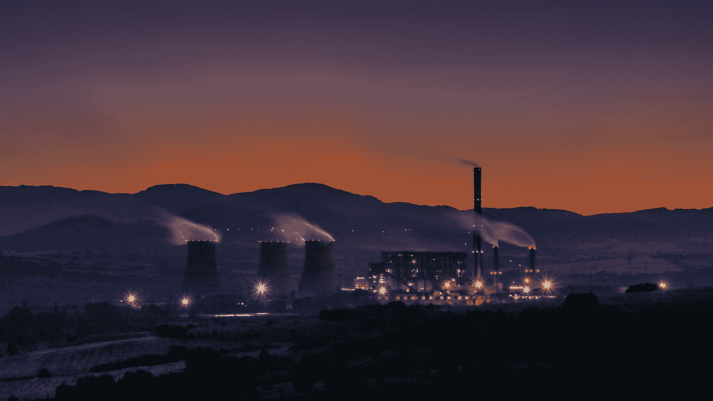
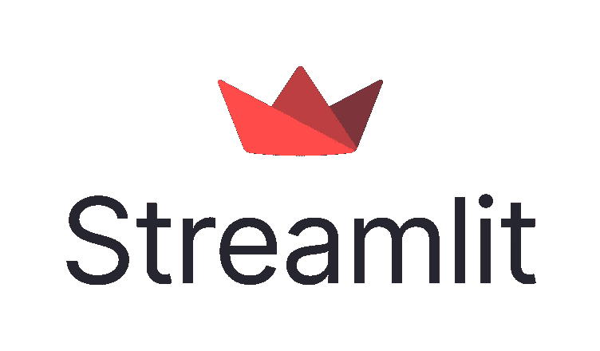
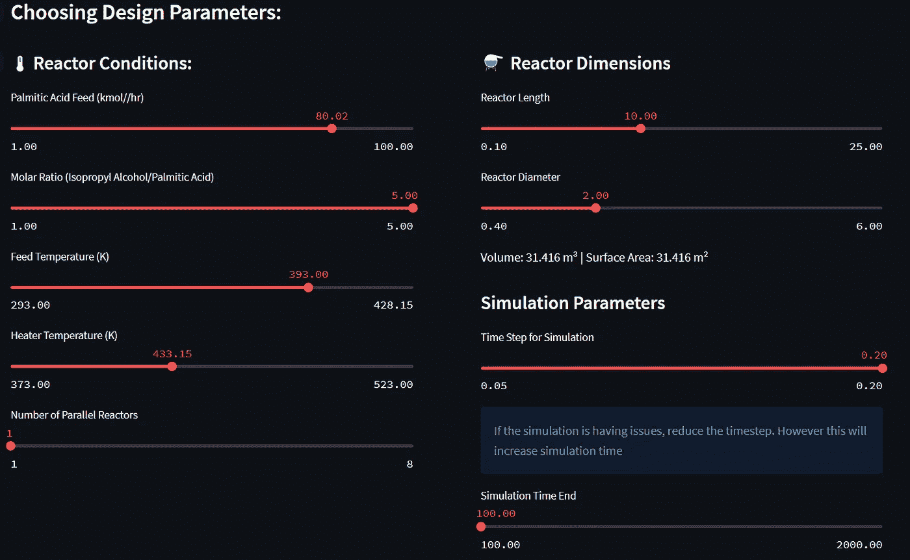
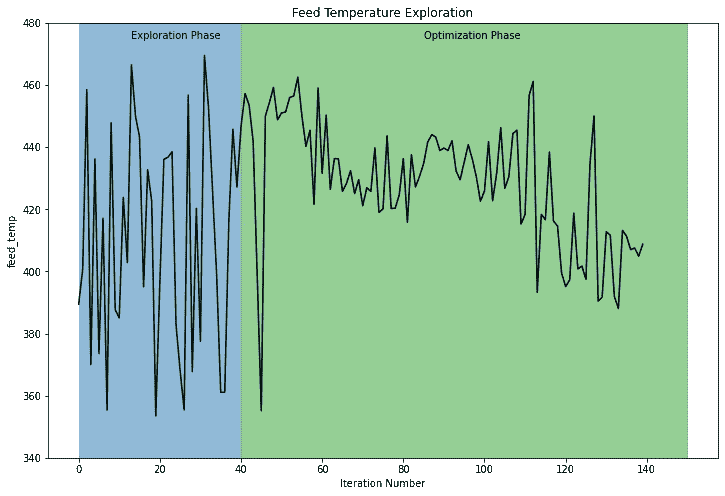

# 用数据科学设计化学反应器

> 原文：<https://towardsdatascience.com/designing-a-chemical-reactor-with-data-science-9e2c714d2475>

Viktor Kiryanov 在 [Unsplash](https://unsplash.com?utm_source=medium&utm_medium=referral) 上的照片

最后一年项目。大学生和工作生活之间的最后障碍。作为一名化学工程专业的学生，我的期末项目需要我设计和优化一个化学反应器。

就我个人而言，我的目标不是获得最好的成绩，而是将它作为一个数据科学问题来处理，展示我在 3.5 年的(持续)数据科学之旅中学到的所有知识。我是这样做的。

反应堆设计仪表板——作者制作的动画，在 https://share.streamlit.io/reoneo97/reactor-sim/app.py[公开发布](https://share.streamlit.io/reoneo97/reactor-sim/app.py)

这个项目可以分为两个阶段:模拟和优化。在这篇博文中，我将谈论帮助我解决这个问题的不同数据科学技巧。

# 模拟

照片由 [Unsplash](https://unsplash.com?utm_source=medium&utm_medium=referral) 上的[真空背景](https://unsplash.com/@vackground?utm_source=medium&utm_medium=referral)拍摄

像生活中的许多事情一样，反应堆的机制可以用几个方程精确地描述和预测。模拟程序的目标是能够根据参数预测(或者更准确地说，计算)反应堆的输出是什么样的。给定反应器的长度、直径和温度等参数，模拟必须计算反应产生的化学产物的量。

模拟用能量平衡偏微分方程

与数据科学中的回归问题不同，这个过程是完全确定的。也就是说，大多数描述反应堆的方程都是偏微分方程，求解起来非常困难，计算量也很大。

数据科学家的一项重要技能是将数学方程转化为代码的能力。给定教科书中的方程或研究论文，一个优秀的数据科学家应该能够完全从头开始实现这些想法(使用 Numpy ),或者与 PyTorch 等自动微分库一起实现。

能量平衡代码

为了这个项目，我不得不重新阅读关于热传递和反应动力学的旧教科书，并将这些冗长的方程转换成 Python 代码。作为一个额外的挑战，我试图只使用 Numpy 来求解这些方程，而不依赖于像 Scipy 这样的包来求解 PDEs。

# 可视化和仪表板

用于应用程序设计的可视化和仪表板包

数据科学家的另一项重要技能是可视化。熟悉可视化和绘图库使我能够创建一个仪表板来说明反应堆的不同条件。为此，我使用了 Streamlit 和 Plotly，它们都是构建交互式仪表盘的优秀软件包。

使用 Streamlit 滑块的模拟配置—图片由作者提供

Streamlit 通过易于编程的滑块来改变模拟中的不同参数，从而增加了交互性。它还允许使用时间滑块来可视化比二维更多的信息。另一方面，Plotly 帮助我只用几行代码就创建了令人惊叹的可视化效果。它还支持内置的“悬停”功能，以快速获取海量数据点中特定点的值。

# 编码

阿诺德·弗朗西斯卡在 [Unsplash](https://unsplash.com?utm_source=medium&utm_medium=referral) 上拍摄的照片

**写好代码和组织好数据科学项目**是一项最近才获得的技能。也就是说，我有，但这真的很重要。最初，组织好你的代码，而不是仅仅使用一个 Jupyter 笔记本可能会有点耗时，但从长远来看，它会带来巨大的回报。对于有许多不同的机器学习模型可以尝试的大型项目，拥有一个良好的代码结构可以避免一次又一次地重写相同的代码行。这也使得代码更容易理解，并且更容易在同一个项目中与其他人协作。

> 看看我关于这个话题的博客吧！

</leveling-up-your-machine-learning-projects-317da9c787fe>  

在我的 FYP 的上下文中，这意味着为反应器中许多不同的组件编写类和抽象。`Reaction`将是一个具有特定参数和函数的基类，然后我们可以在其上定义`EquilibriumReaction`，重用相同的方法。一个现实的反应堆`RealPFR` 只是一个更简单的理想化的`IdealPFR`的子类，它可以进一步被建模为从基类`Reactor`继承的类。

拥有中间类和基类帮助我更快地开发代码，构建在已经编写的代码之上，并且每当我想要尝试和实现不同的反应器设置时，不必从头开始。

# 最佳化

项目的第二阶段是**优化**。本质上，任务是根据某些度量标准选择最佳的反应器。

这是与数据科学的相似之处变得更加明显的地方。所有机器学习算法都可以从优化的角度来看，对数据科学家来说，很好地理解优化很重要。

当执行优化时，我们希望最大化或最小化某些特定目标。对于分类问题，这个度量通常是精度或召回率。由于这一指标很难显式优化，机器学习在一个独立的函数上执行优化，如负对数似然(NLL)。

然而，在这个特定的背景下，有两个优化目标:成本(C)和转换(X)。**转化率**是指转化为产物的反应物的量，而**成本**仅仅是整个反应器设置的成本。在这种情况下，我们希望最大化 X 并最小化 C，这与最大化-C 是相同的。

最大化目标

因为这两个目标同等重要，所以一个简单的方法是设计一个考虑这两项的损失函数(或效用函数)。转换的范围是[0，1]，而成本的范围是≈ [10⁶，10⁹]，因此我们可以使用缩放使它们具有相等的权重。

优化反应器的参数实际上类似于优化机器学习模型的超参数。两个函数都不是连续的，需要无梯度方法来优化它们。可以使用模拟退火或粒子群优化等常见的优化方法，但我决定使用贝叶斯优化，这是一种用于调整模型超参数的常见算法。

贝叶斯优化(使用`bayes_opt`库【1】)是一种概率优化技术。它依赖于创建一个高斯过程候选函数，并在获得更多信息时逐步更新该函数。在第一阶段，贝叶斯优化随机探索搜索空间，映射出目标函数的拓扑结构。随后，该算法将开始对很有可能找到最优值的多个点进行采样。本质上，该算法开始利用高确定性的区域来逐渐收敛到最优。

作者对温度变量图像的优化

从上面的图中，我们可以看到这个过程在起作用。模型在探索(蓝色)阶段开始随机采样点。优化(绿色)阶段的运动更加系统化，模型最终收敛到反应堆的最佳温度 410K 左右。在任何时候，贝叶斯优化将考虑整个样本空间，因此，不太可能收敛到局部最优。

# 最后的想法

弗拉德·巴加西安在 [Unsplash](https://unsplash.com?utm_source=medium&utm_medium=referral) 上拍摄的照片

作为一名化学工程专业的学生，进入数据科学领域是一段相当艰难的旅程。在 Udemy 上学习了无数个小时，在大学上了额外的数学课，并完成了 2 次数据科学实习后，我现在很兴奋地开始了我的数据科学之旅的下一个阶段。这个项目虽然侧重于化学工程，但让我展示了我的数据科学技能，并巩固了我对利用数据科学技能解决任何问题的多功能性和潜力的信念。

## **查看代码:**

<https://github.com/reoneo97/reactor-sim>  <https://reoneo.medium.com/membership>  

## **参考文献**

[1] F. Nogueira，“贝叶斯优化:Python 的开源约束全局优化工具”。2014 — .【在线】可用:[https://github.com/fmfn/BayesianOptimization](https://github.com/fmfn/BayesianOptimization)