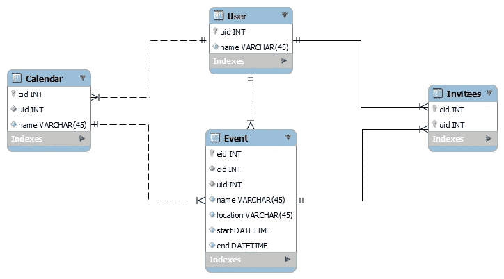
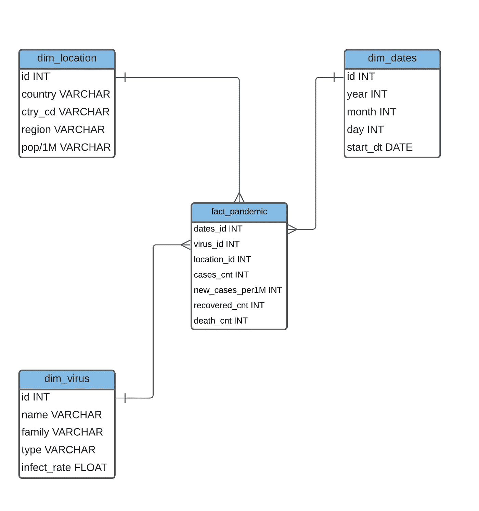
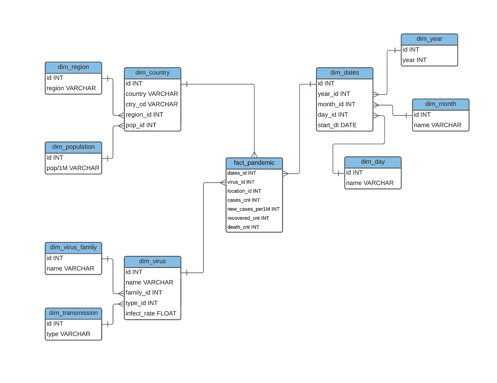

# 设计数据库模式

> 原文：<https://towardsdatascience.com/designing-your-database-schema-best-practices-31843dc78a8d>

## 决定使用星型模式还是雪花型模式适合您，规范化与反规范化如何影响您的分析，以及数据库模式设计的未来是什么样子

良好的数据库模式设计对于任何利用关系数据库管理系统的公司都是至关重要的。如果现在不花时间去设计一个逻辑和直观的数据库模式，以后就会花时间去弄清楚表之间是如何关联的，以及如何在表之间执行连接。什么是数据库模式？**一个** [**模式**](https://www.fivetran.com/blog/database-schema-design-best-practices-for-integration-and-analysis) **是数据库中包含的所有对象(表、视图、列、键等)的快照。)和他们的关系。这是数据库结构的鸟瞰图。使用[实体关系图](https://www.lucidchart.com/pages/er-diagrams/#section_0) (ERD)来表示模式，这是一个描述实体在数据库系统中如何相关的流程图，其中矩形表示实体(例如表)、椭圆形、属性(例如列)、菱形、关系(例如一对一、一对多、多对一和多对多)。有关组成 ERD 的元素的更多信息，请查看 Lucidchart 的这篇文章。**



实体关系图示例([维基共享](https://commons.wikimedia.org/wiki/File:AcumenERD.png))

在这里，我将讨论不同的模式模型，规范化与反规范化，以及模式设计的未来。我假设该模式是在企业数据仓库(EDW)中实现的，并且数据库本质上是关系型的。我们开始吧！▶️

# 模式模型

关系数据库系统中最常见的模式模型是星型模式和雪花型模式。

## 星形模式⭐️

星型模式是最简单也是最常用的模式模型。历史上，它是由 Ralph Kimball 开发的，并在*的数据仓库工具包* (1996 年)中引入。一个星型模式由一个中心的[事实表](https://www.ibm.com/docs/en/ida/9.1?topic=models-fact-tables-entities)表示，它可以被周围的[维度表](https://www.ibm.com/docs/en/ida/9.1.1?topic=models-dimension-tables-entities)连接。星型模式模型的维度表是非规范化的，需要更少的连接，从而简化了查询逻辑并提高了查询性能。



自己的图表(使用 [Lucidchart](https://www.lucidchart.com/pages/) 创建)

```
SELECT 
    loc.region, 
    loc.country,
    vir.family as virus_subfamily_name,
    vir.infect_rate,
    fact.death_cnt
FROM fact_pandemic AS fact
    LEFT JOIN dim_location AS loc
        ON fact.location_id = loc.id
    LEFT JOIN dim_virus AS vir
        ON fact.virus_id = vir.id
    LEFT JOIN dim_dates AS d
        ON fact.dates_id = d.id
WHERE d.year = 2020
```

## 雪花(" 3NF ")模式❄️

另一方面，**雪花模式**(或“第三范式”模式)被认为是星型模式的前身。数据仓库创建者比尔·恩门在 20 世纪 90 年代早期引入了雪花模式模型。雪花模式的设计类似于星型模式，除了维度表是完全规范化的。规范化有很多好处:它有助于减少数据中的重复项，降低存储空间的使用量(通常，维度表没有事实数据表大)，以及避免在多个地方执行数据删除或更新命令。但是，由于要执行更多的连接，这确实会降低查询性能。



自己的图表(使用 [Lucidchart](https://www.lucidchart.com/pages/) 创建)

从下面的 SELECT 语句中可以看出，还有更多的连接要执行！

```
SELECT 
    r.region, 
    c.country,
    fam.name AS virus_subfamily_name,
    t.infect_rate, 
    fact.death_cnt
FROM fact_pandemic AS fact
    LEFT JOIN dim_country AS c
        ON fact.location_id = c.id
    LEFT JOIN dim_region AS r
        ON r.id = c.region_id
    LEFT JOIN dim_virus AS vir
        ON fact.virus_id = vir.id
    LEFT JOIN dim_virus_family AS fam
        ON fam.id = vir.family_id 
    LEFT JOIN dim_transmission t
        ON vir.type_id = t.id 
    LEFT JOIN dim_dates AS d
        ON fact.dates_id = d.id
    LEFT JOIN dim_year AS y
        ON d.year_id = y.id
WHERE y.year = 2020
```

## 星系模式(事实星座模式)🌌

**星系模式**(也称为**事实星座模式**)是星形和雪花模式模型的组合。它是完全规范化的，但涉及更多的设计复杂性，因为可能有多个事实表，并且在维度和事实表之间可能存在多个依赖关系。其中的一些优势是，您可以期待更高的数据质量和准确性，这可以增强您的报告。但是，您可能会注意到报表的刷新按钮旋转的时间有点长，因为 galaxy 模式很复杂，可能会影响查询的性能。我推荐阅读[这篇文章](https://www.educba.com/galaxy-schema/)来学习更多关于事实星座模式的知识。

## 数据仓库 2.0🔐

Data Vault 2.0 由 Dan Linstedt 在 2000 年创建的 Data Vault 演变而来。根据其设计者的说法，data vault 是一种“混合方法，包含第三范式(3NF)和星型模式之间的最佳组合”，它提供了一个灵活的框架来扩展和适应 EDW(参见 Dan Linstedt 的*Super Charge Your Data Warehouse*)。该模型是围绕三件事构建的:枢纽、卫星和链接。


自己的图表(受[这篇文章](https://bi-insider.com/data-warehousing/data-vault-data-model-for-edw/)的启发)

**Hubs** 是存储主键的表，主键唯一地标识一个业务元素。其他信息包括散列键(对在 Hadoop 系统上运行模型有用)、数据源和加载时间。

**卫星**是包含业务对象属性的表格。它们存储可以在集线器或链接表中引用的外键，以及以下信息:

*   父哈希键(集线器中哈希键的外键)
*   加载开始和结束日期(在卫星中，记录历史变化)
*   数据源
*   业务对象的任何相关维度

**链接**通过集线器中定义的业务键设置 2 个集线器之间的关系。链接表包含:

*   一个散列键，其作用类似于主键，以散列格式唯一标识 2 个集线器之间的关系
*   引用集线器中主哈希键的外部哈希键
*   引用中心中主要业务键的外部业务键
*   装载日期
*   数据源

data vault 模型具有适应性(如果添加或删除列、更改数据类型或更新记录，则需要执行相对较少的手动操作)和可审计性(数据源和日期记录允许跟踪数据)。然而，它仍然需要被转换成维度模型，以便可用于商业智能目的。出于这个原因，您可能希望以数据集市的形式添加一个维度层，以支持 BI 分析师。维度表将来源于集线器，而事实表将来源于链路表以及卫星。

# 规范化与反规范化

我之前讲过规格化和反规格化。但是这些是什么意思呢？

## 正常化

规范化是通过将较大的表分解成较小的表来减少数据冗余的过程。通过避免重复行，规范化允许更多的存储空间，从而提高数据库系统的性能。通过消除重复行，数据变得干净而有条理。然而，你可能会给你的分析带来压力。规范化数据库需要更多的表间连接，这会影响查询性能。想想 Tableau、Looker、PowerBI 和 SSRS 仪表板:如果您有一个支持报表的查询，并且它正在从一个规范化的数据库中提取数据，那么报表页面可能需要花一些时间来加载。使用非规范化的表可能是提高性能的更好选择。

## 反规格化

另一方面，反规范化指的是将表组合在一起的过程。扁平化或反规范化的表是同义词。联接通常内置于扁平视图中，从而减少了检索数据所需的联接。您将看到仪表板和其他报告加载速度加快。但是，使用非规范化表的缺点是，现在数据集中有重复的行，这可能需要额外的数据争论，然后才能生成清晰准确的最终报告进行分发。

# 模式设计的未来

## 人工智能驱动的模式设计

这些天，人工智能和机器学习(AI/ML)成了热门话题。你不能一天不听到关于人工智能和它改变世界的方式的消息。机器学习在数据库模式设计中也发挥着作用。今天，设计数据库模式的过程是手工的和劳动密集型的。然而，数据库学教授 Andy Pavlo 告诉我们，从 RDBMS 的早期开始，人们就考虑开发一个自主的、“自适应的”数据库系统，包括自动化模式设计。

一个最初的项目着眼于自动数据库模式设计: [AutoMatch](https://cs.gmu.edu/~ami/teaching/infs797/current/autoplex-derivatives.pdf) 。它解决了“在两个语义相关的数据库模式的属性之间寻找映射”的问题如果添加了一个新的数据库元素会怎样——如何将它正确地映射到数据库中的其他元素？通过使用特征选择和对概率结果进行排序，Automatch 将为每个发现分配一个排序的预测值，对两个元素相互关联的可能性进行评分。虽然机器的预测需要验证，但像 Automatch 这样的项目是简化数据库设计操作的有力例子。

除了简化数据库模式设计流程之外，拥有自动化 ERD 设计的工具还可以为企业节省大量成本和时间……只要预测准确率高。一些公司开始提供这样的服务，比如 [dbdiagram.io](https://dbdiagram.io/home) 。它提供了一个使用 DSL 代码自动设计数据库图表的工具。然而，数据库元素之间的链接仍然是手工完成的，可能还需要几年时间，我们才能看到完全自动化实体关系图设计的功能性工具，包括新元素到现有数据库元素的映射。

## 敏捷方法

尽管公司希望预测他们 10 年后的数据需求，但预测未来并不总是可能的。这就是为什么在创建或重塑数据库模式设计时采用敏捷方法很重要。随着公司越来越多地从本地服务器迁移到云，迁移过程是思考新的创新方法以提高 EDW 的敏捷性、适应性和可扩展性的时候了。Data vault 2.0 提供了一个良好的基础。展望未来，下一次迭代将不得不关注于构建敏捷模式模型，同时提供高度优化和高性能的功能来执行分析操作。

# 结论

最终，最佳数据库模式设计将取决于公司收集的数据类型、组织的数据成熟度及其分析目标。在本文中，我介绍了不同的模式模型、规范化和反规范化之间的差异，以及模式设计的未来，特别是使用机器学习来自动化设计过程。希望您能够更好地设计下一个数据库模式模型！

*这篇文章最后编辑于 2022 年 6 月 12 日。这里表达的观点仅属于我自己，并不代表我的雇主的观点。*