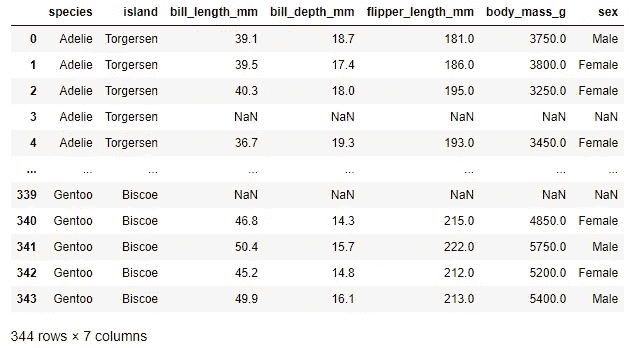
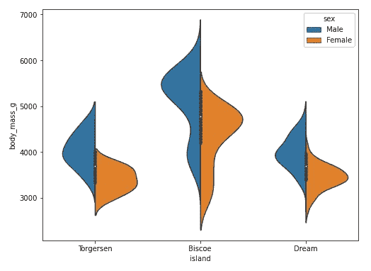
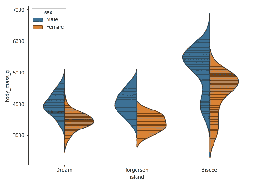
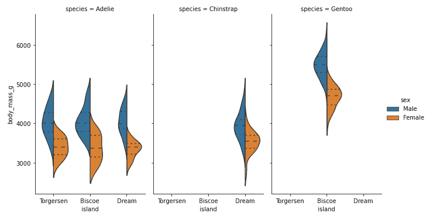
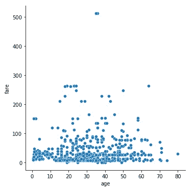
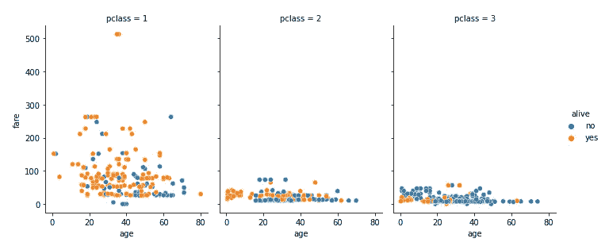
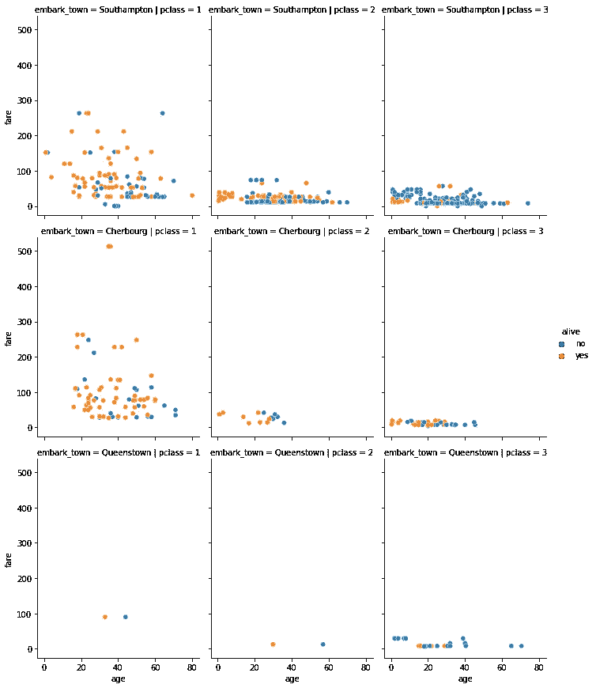
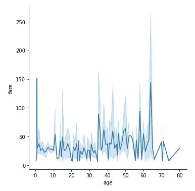
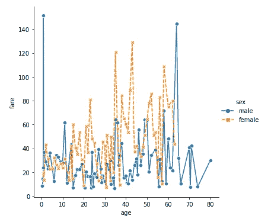

# Seaborn 的 Violinplot 和 Relplot 的细节

> 原文：<https://towardsdatascience.com/details-of-violinplot-and-relplot-in-seaborn-30c63de23a15>


Tetiana SHYSHKINA 在 [Unsplash](https://unsplash.com?utm_source=medium&utm_medium=referral) 上拍摄的照片

## 充分发挥潜力在 Seaborn 使用小提琴和 Relplots

Python 的 Seaborn 库是一个非常流行的可视化库。它建立在 Matplotlib 之上，包含了很多内置样式的高级剧情。我有一篇关于 Seaborn 的文章，涵盖了最受欢迎的情节(本文末尾提供了链接)。我决定对一些情节做详细的教程。

在本文中，我将关注 Seaborn 库中两个非常常见的情节:

1.  小提琴情节
2.  重新绘图

先说小提琴情节。

## 小提琴情节

小提琴图如此有用的原因是它给了你一个核密度和一个盒图。所以，在一个图中，你可以得到一个变量的很多信息。我将使用企鹅数据集绘制小提琴图:

```
import seaborn as sns
import matplotlib.pyplot as pltpen = sns.load_dataset("penguins")
```



我会从最基本的小提琴情节开始，慢慢走向一些更复杂的。

> 下面是 body_mass 的小提琴剧情:

```
sns.violinplot(data = pen, x = "body_mass_g")
```


这里你可以先看到密度图。这种分布是右偏的。中间的方框图显示了中间值(中间的小白点)、第一个四分位数、第三个四分位数、最小值和最大值。

对于下一个图，我将在 x 方向使用分类变量，在 y 方向使用 body_mass。我选择“岛”作为 x 方向。“岛屿”一栏中有三个岛屿。

> 我们将得到三个岛屿企鹅体重的三幅小提琴图:

```
plt.figure(figsize=(8, 6))
sns.violinplot(data = pen, x = 'island', y = "body_mass_g")
plt.show()
```


所以，我们有三个小提琴图，代表三个岛屿。你可以看到个别岛屿企鹅体重的核心密度和箱线图。

再往前走一步，我们甚至可以进入更细粒度的情节。

> 使用“色调”参数，我们现在将根据性别分离小提琴图:

```
plt.figure(figsize=(8, 6))
sns.violinplot(data = pen, x = 'island', y = "body_mass_g", hue ="sex")
plt.show()
```


对于每个岛屿，我们现在有两个小提琴图。一个用于男性人口，另一个用于女性人口。但是小提琴图两边的核密度是一样的。因此，Seaborn 库可以选择使用“split”参数使用两边来绘制两个类别的内核密度。

> 在这里，我用小提琴图的一边代表男性，一边代表女性:

```
plt.figure(figsize=(8, 6))
sns.violinplot(data = pen, x = 'island', y = "body_mass_g", hue ="sex", split=True)
plt.show()
```



这个图的一个缺点是你只能得到一个岛屿总人口的箱线图。当我们对男性和女性有单独的小提琴图时，我们也有单独的箱线图。

> 我们可以用虚线代替箱线图来表示四分位数:

```
plt.figure(figsize=(8, 6))
sns.violinplot(data = pen, x = 'island', y = "body_mass_g", hue ="sex", split=True, inner = "quartile")
plt.show()
```


我们得到了显示第一、第二和第三四分位数的四分位数，而不是箱线图。提醒一下，第二个四分位数是中位数。所以，这次我们得到了每个岛上男性和女性人口的独立四分位线。

除了四分位数，我们还可以通过使用“stick”作为内部参数来获得代表数据点的线。此外，我们总是有默认顺序的岛屿小提琴情节:“托格森”，“比斯开”，和“梦想”。顺序也可以改变:

```
plt.figure(figsize=(8, 6))
sns.violinplot(data = pen, x = 'island', y = "body_mass_g", hue ="sex", split=True, inner = "stick", order=['Dream', 'Torgersen', 'Biscoe'])
plt.show()
```



岛屿的顺序变了！

假设，岛上的两只企鹅被选为任何独特实验的特殊对象，我们想用不同的颜色展示它们。假设特殊的岛屿是比斯开和梦:

```
pen['special'] = pen['island'].isin(['Dream', 'Biscoe'])plt.figure(figsize=(8, 6))
sns.violinplot(data = pen, x = 'island', y = "body_mass_g", hue = "special")
plt.show()
```


看，比斯科和梦想的小提琴情节是不同的颜色！

小提琴图的最后一个图将显示使用 Seaborn 的小平面网格选项来绘制小提琴图。小提琴剧情本身没有那个特权。

> 我们可以使用“catplot”并将“kind”用作小提琴:

```
sns.catplot(data = pen, x = 'island', y = "body_mass_g", hue ="sex", split=True, inner = 'quartile', kind = 'violin', col = 'species', height = 5, aspect = 0.6)
```



我们对不同的物种有不同的情节。梦里只有‘下巴颏儿’，比斯开只有‘巴布亚’。

小提琴剧情到此为止！

我还有一个视频教程，一步步展示所有这些情节:

## 重新绘图

Seaborn 中的“relplot”也非常有用，因为它显示了两个变量之间的统计关系。它使用散点图和线图。这一部分将详细介绍 relplot。

我将使用著名的“泰坦尼克号”数据集:

```
ti = sns.load_dataset('titanic')
```

以下是该数据集的列:

```
ti.columns
```

输出:

```
Index(['survived', 'pclass', 'sex', 'age', 'sibsp', 'parch', 'fare', 'embarked', 'class', 'who', 'adult_male', 'deck', 'embark_town', 'alive', 'alone'], dtype='object')
```

像往常一样，我将从最基本的 relplot 开始。

> 从使用两个连续变量“年龄”和“费用”的最基本曲线开始:

```
sns.relplot(data = ti, x = 'age', y = "fare")
```



默认情况下，它使用散点图。我们将在后面看到如何使用线图。

> 添加“色调”参数，以获得不同类别的不同颜色:

```
sns.relplot(data = ti, x = 'age', y = "fare", hue = "alive")
```


我们再给它加一个变量。

> 将“pclass”变量作为“col”添加，以获得三个“pclass”的三个单独的图:

```
sns.relplot(data = ti, x = 'age', y = "fare", hue = "alive",
           col = "pclass", height = 4, aspect = 0.8)
```



我们为三个“类”提供了三个单独的地块。现在让我们进一步分离数据。

> 下一个图将为单个“embark_town”添加行:

```
sns.relplot(data = ti, x = 'age', y = "fare", hue = "alive",
     col = "pclass", row = "embark_town",  height = 4, aspect = 0.8)
```



我一直只使用默认的散点图。让我们看看如何使用线图。

> 我将再次回到最基本的情节，只看“年龄”和“费用”之间的关系。但这一次符合剧情:

```
sns.relplot(data = ti, x = 'age', y = "fare", kind = 'line')
```



默认情况下，线图带有直线和沿着直线的置信带。如果您不想要置信带，可以使用 ci = None 来避开它。

> 在下一个图中，我们将避开置信带，使用色调参数根据性别用不同颜色分隔数据，还将使用基于性别的样式和标记:

```
sns.relplot(data = ti, x = 'age', y = "fare", kind = 'line', ci = None, hue = "sex", dashes = True, style = "sex", markers= True)
```



这里，我使用了相同的变量作为“色调”参数和“样式”参数。但是如果你愿意，你也可以使用不同的变量。请尝试一下，看看你是否喜欢。

> 对于下一个图，让我们为三个“p 类”绘制三个单独的图，使用置信带，并根据“性别”绘制颜色和样式:

```
sns.relplot(data = ti, x = 'age', y = "fare", hue = "alive", col = "pclass", height = 4, aspect = 0.8, style = "sex", kind = "line")
```


如果这个情节对你来说太复杂了，那就摘掉信心带。那可能会有帮助。此外，请尝试在“行”中使用另一个变量，就像我之前在散点图中所做的那样。

下面是 relplot 的视频教程:

## 结论

我想向你们展示 Seaborn 库的两个重要图，它们有助于绘制连续变量，并提供许多有用的见解。我希望这有所帮助。

请随时在 [Twitter](https://twitter.com/rashida048) 、[脸书页面](https://www.facebook.com/Regenerative-149425692134498)上关注我，并查看我的 [YouTube 频道](https://www.youtube.com/channel/UCzJgOvsJJPCXWytXWuVSeXw)。

## 更多阅读

</an-ultimate-cheatsheet-of-data-visualization-in-seaborn-be8ed13a3697>  </exploratory-data-analysis-with-some-cool-visualizations-in-pythons-matplotlib-and-seaborn-library-99dde20d98bf>  <https://pub.towardsai.net/data-analysis-91a38207c92b>  </30-very-useful-pandas-functions-for-everyday-data-analysis-tasks-f1eae16409af>  </chi-square-test-for-correlation-test-in-details-manual-and-python-implementation-472ae5c4b15f>  <https://medium.datadriveninvestor.com/what-is-a-b-testing-how-to-perform-an-a-b-testing-892cc8f35cbf> 