# 为浓缩咖啡建立一个体面的形象

> 原文：<https://towardsdatascience.com/developing-a-decent-profile-for-espresso-c2750bed053f>

## 咖啡数据科学

## 试图模仿金快车

我等着买一台像样的浓缩咖啡机，因为我仍在寻找我的 Kim Express 机器的改进之处，但我最终买了这台由数据和控制回路驱动的机器。到达后，我立即着手制定一个与我的 Kim Express 相关的基线，然后从那里开始改进。

所有图片由作者提供

# 金特快列车

金快递是一个弹簧[杠杆机器](/taxonomy-of-lever-espresso-machines-f32d111688f1)，在我看来，是最好的家用杠杆机器，特别是对于不受控制的水锅炉。这台机器提供了许多有趣的能力，但它们都不是金特快独有的。许多功能与其他杠杆机器相同，这些功能指导我充分利用 DE:

**预浸**:由于活塞允许水进入咖啡球，所有的杠杆机器都提供自然的预浸，并且这种预浸是可变的。使用控制杆，您可以缩短或延长预输注时间，甚至改变预输注压力。

**水温**:灯头在锅炉内部，所以灯头处的水温非常接近锅炉，这使得水温保持在锅炉的温度附近。因为加热器是不受控制的，所以仍然有一些温度冲浪，但它比其他机器更容易管理。

# 体面的个人资料

开发这些配置文件教会了我很多关于机器如何运行的知识，当我开始向前倾斜时，我的配置文件能够变得非常好。在这两者之间，我有许多个人资料，但我想强调最有趣的变化以及我是如何做到这一点的。

## 压力脉冲 1

这第一个轮廓是建立在开花轮廓上的。我用的是同样的预灌注，开花期间没有压力。我对脉冲进行了明确的转换，但这些脉冲有一个大约 3 秒的大间隔。我在金特快上的典型间隔是 0.5 秒。在 profile maker 中，我还被限制了最多 20 步。

我开始的时候水温是 97C，但是经过思考后我开始改变它。

## 压力脉动 2

我首先减少了预灌注时间，然后是温度，我在开花期增加了一个缓慢的斜坡。

## 压力脉动 3

预输注对我来说不太合适，所以我从一个较慢的斜坡开始，但它仍然由流量控制。我也开始最大限度地提高温度，因为我发现金快车的温度要高得多。事实上，我发现 116℃到 123℃之间的罐温范围对 Kim 来说是理想的，因为它提供了大约 2.2 巴的罐压，这对于预浸泡来说是理想的。

另外，我把开花期的流速调得比零高。金快车没有零压开花阶段，我认为这有助于排出一些释放的二氧化碳。

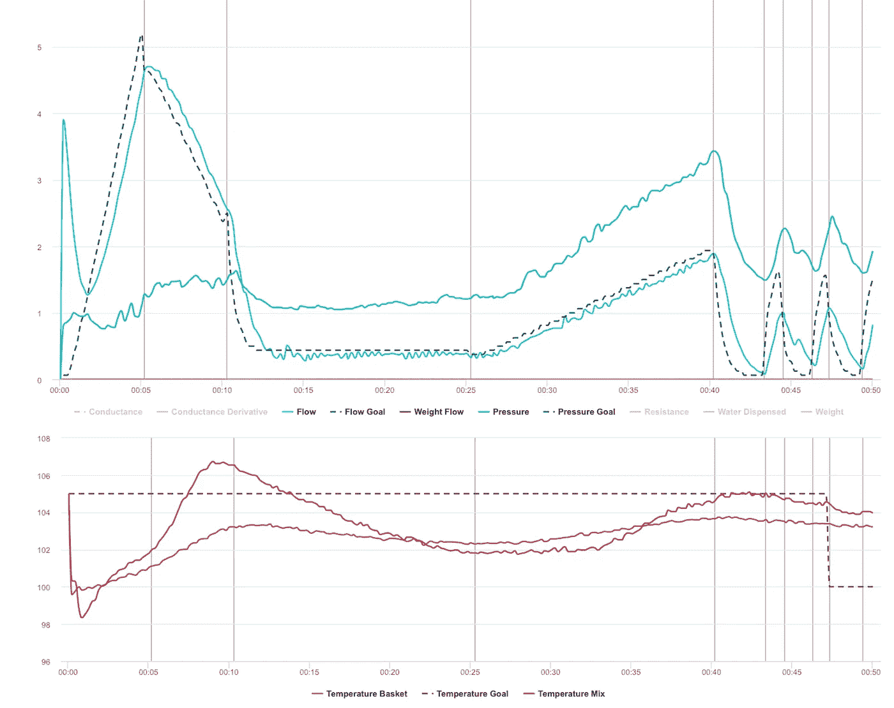

## 压力脉动 9

我延长了花期，并开始计算何时结束基于水进入冰球的预灌注。这可以在咖啡和重量中拨入。我的目标是过滤器在进入开花期之前被咖啡覆盖。人们建议使用秤和最初的几滴，但当时，我的 Acaia Pyxis 不被支持。这种情况正在改变，但最好的办法是用相机来提供这种反馈。

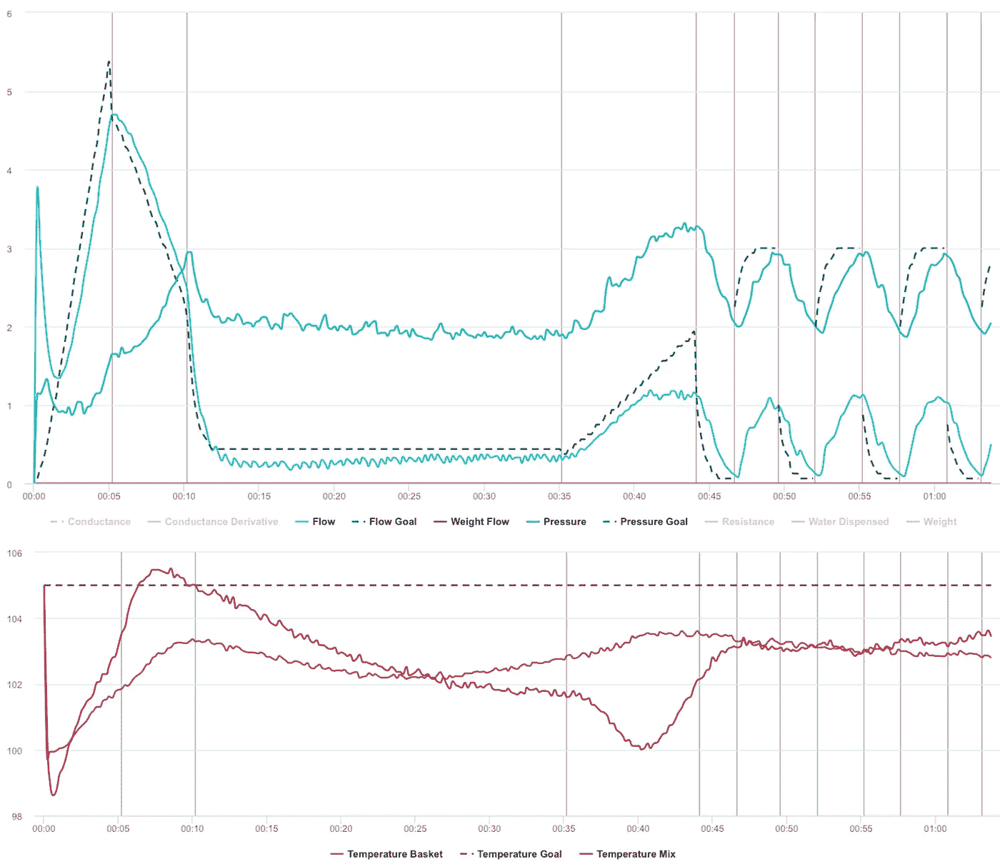

## 压力脉动 14

我把开花期调整到压力控制，就像 2.2 巴左右的 Kim Express。我还设置了 10 毫升的退出标准，因为我通常会等待大约那么多的液体出来。

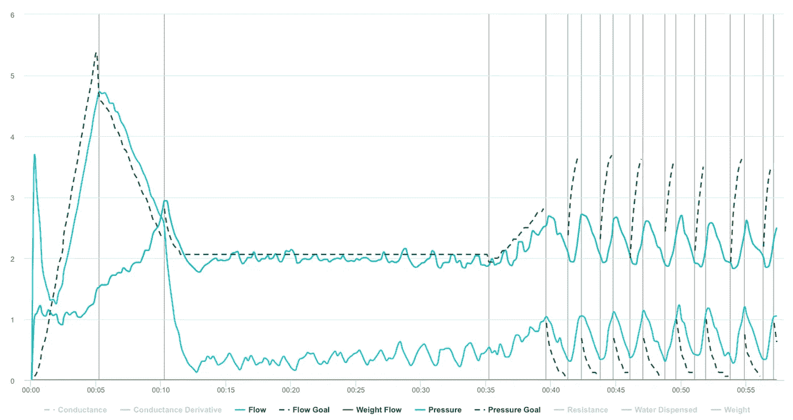

然后这是偶然发生的:

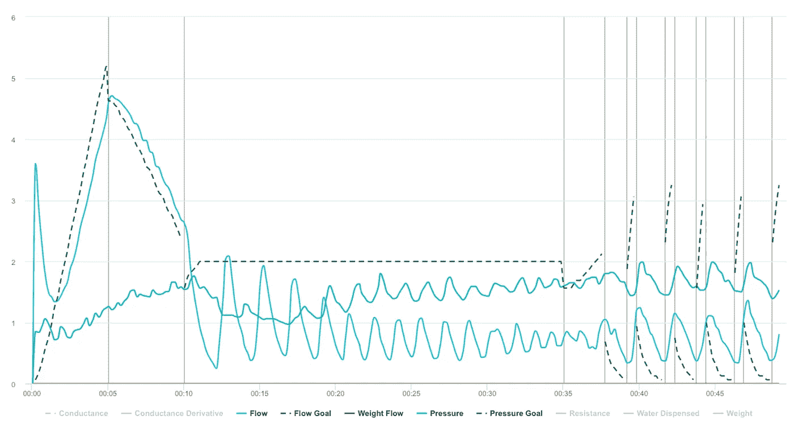

冰球在开花阶段产生阻力，导致 PID 控制器中的质量波动，因为流量和压力控制器努力达到它们的目标。

我意识到，通常人们会把压力和流量作为你实际可以达到的目标，但也许这可以成为我的优势。

## 压力脉冲 16:改变脉冲

我进行了一项测试，将压力目标设置为高于适当的流量目标。我意识到这是一种不用 18 步就能产生更快脉冲的方法。

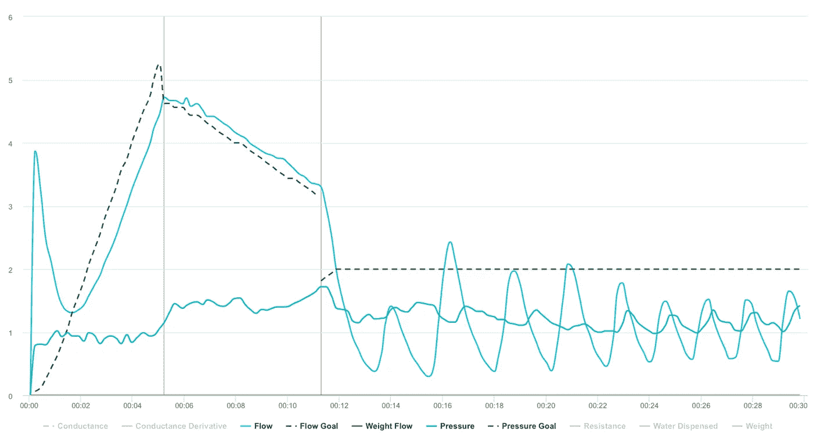

## 压力脉动 20

我将预输注变得更简单，并且我在压力脉动部分做了改变。开花期的流量目标是有问题的。

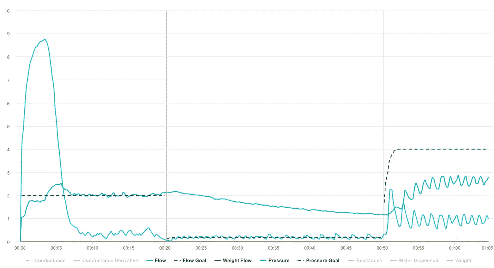

## 压力脉冲 27

我再次将开花期转换为压力目标，并在预输注中添加了第二期。第一阶段是让所有人自由达到我的压力目标，然后我开始寻找一个退出点。

## 压力脉冲 28

在压力脉动期间，我开始增加压力目标，并改变了流量和压力从 2 巴/步过渡到 6 巴/步的速度。改变步进限制器有助于增加脉冲频率。

## 压力脉动 30

然后，我修改了预输注，使其在流速低于 3 ml/s 时结束。这更接近我的全自动化目标。

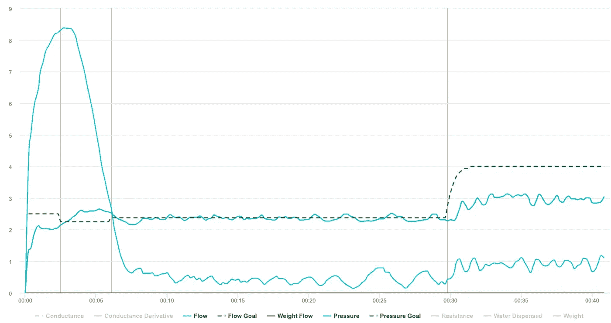

## 压力脉动 33

我再次增加压力脉冲，我开始接近 1 秒的脉冲间隔。然而，压力徘徊在 3 到 4 巴之间。多次发射的平均压力在 3 到 4 之间。这远远低于人们认为你应该使用的 6 到 9 格浓缩咖啡，但我的提取率很高。

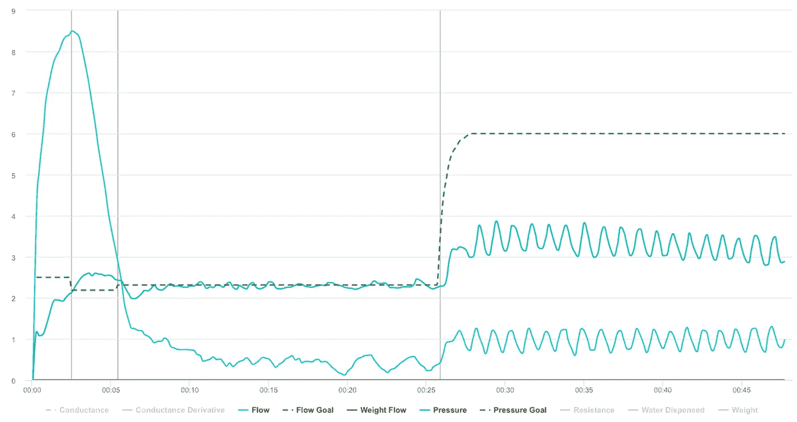

## 压力脉动 36

我再次增加脉冲的压力，但是我也发现了一个问题。如果我的拨片拨得不对或者剂量太高，压力脉冲就不会正常工作。相反，如果剂量太低或研磨太粗。所以我开始建立一个适应性档案。

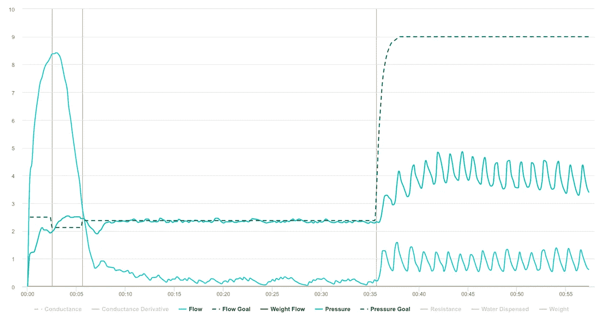

## 压力脉冲 38 自适应

我定义了压力截止点，因此如果压力由于高阻力而变高，它可以下降到较低的压力并继续。我又做了一个改变，插入阶段，让压力下降一点，然后再尝试脉冲。每个阶段都有一套不同的压力和流量目标，以允许持续的压力脉动。

## 压力脉冲 40 手动

对于所有这些变化，我仍然没有在盖上过滤器的时候停止预输注。花开也不是在最好的时候结束的。所以我做了一个 profile 延长预灌注和开花来强迫我手动进入下一阶段。这一改变稍微影响了提取并减少了消耗。

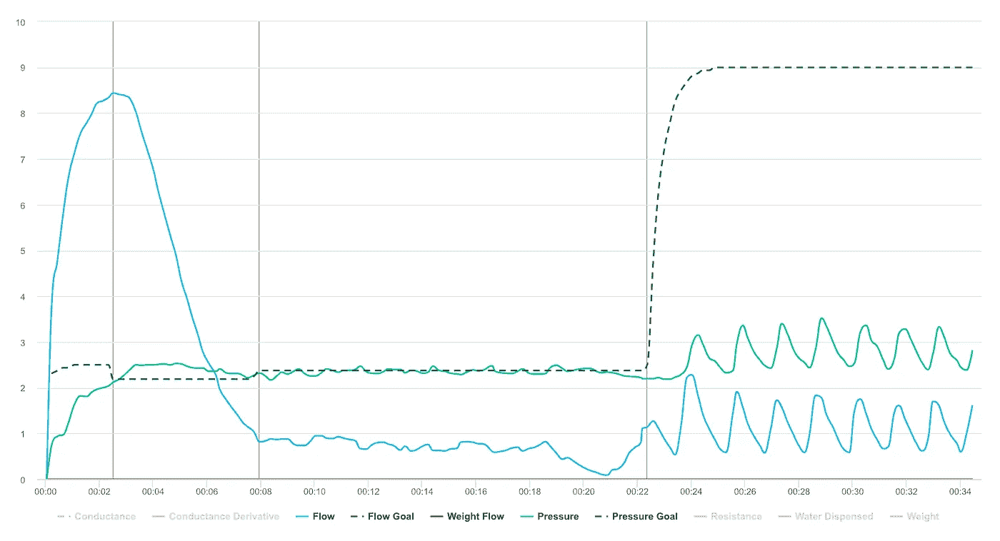

# 更改日志

我做了很多小改动，还原了很多改动。我追踪它们是为了好玩，在这里未经编辑就把它们呈现出来。

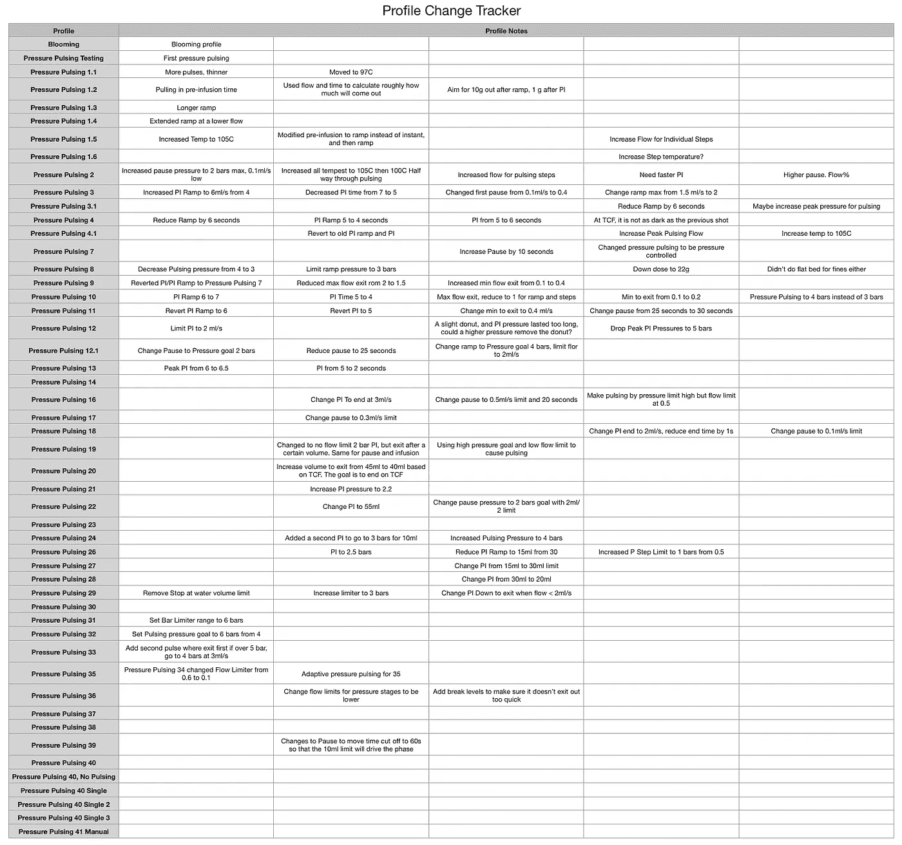

# 绩效指标

我使用一些[指标](/metrics-of-performance-espresso-1ef8af75ce9a)来评估技术之间的差异:最终得分和咖啡萃取。

[**最终得分**](https://towardsdatascience.com/@rmckeon/coffee-data-sheet-d95fd241e7f6) 是记分卡 7 个指标(尖锐、浓郁、糖浆、甜味、酸味、苦味和回味)的平均值。当然，这些分数是主观的，但它们符合我的口味，帮助我提高了我的拍摄水平。分数有一些变化。我的目标是保持每个指标的一致性，但有时粒度很难确定。

</coffee-solubility-in-espresso-an-initial-study-88f78a432e2c>**用折射仪测量总溶解固体量(TDS)，这个数字结合咖啡的输出重量和输入重量用于确定提取到杯中的咖啡的百分比，称为**提取率(EY)** 。**

****强度半径(IR)** 定义为 TDS vs EY 控制图上原点的半径，所以 IR = sqrt( TDS + EY)。这一指标有助于标准化产量或酿造比的击球性能。**

**我还采用了每个配置文件的最大 TDS、EY、IR 和最终得分(味道)指标，以查看数据显示了什么，并警告有多次烘烤:**

**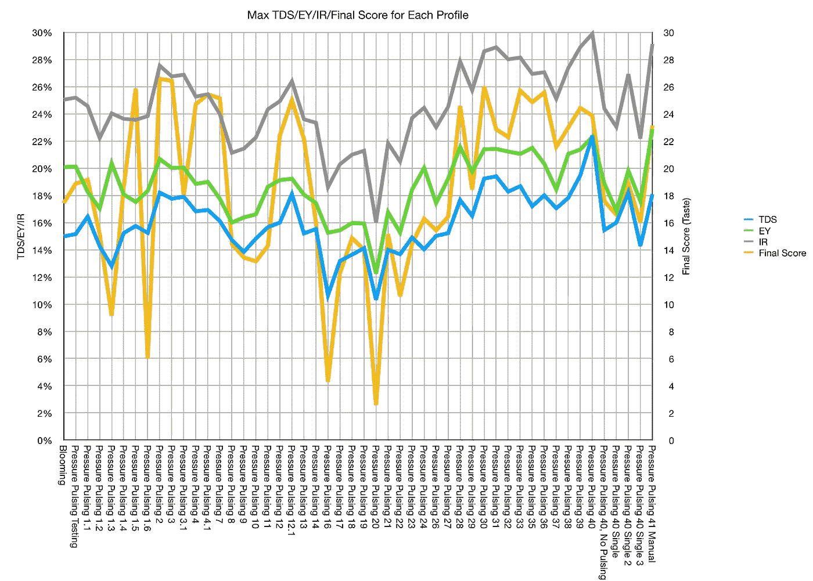**

**随着时间的推移，TDS、EY 和 IR 都开始出现大幅增长，但有些是倒退。也有一些断奏镜头混合在一起，在所有指标中得分更高。**

**我的 Pyxis 秤现在得到了支持，所以我做了一些基于输出重量的结束步骤的工作，特别是开花。然而，我仍然发现在过滤器被覆盖的基础上结束预浸的第二阶段已经提供了最好的提取产量。**

**如果你愿意，可以在推特、 [YouTube](https://m.youtube.com/channel/UClgcmAtBMTmVVGANjtntXTw?source=post_page---------------------------) 和 [Instagram](https://www.instagram.com/espressofun/) 上关注我，我会在那里发布不同机器上的浓缩咖啡照片和浓缩咖啡相关的视频。你也可以在 [LinkedIn](https://www.linkedin.com/in/dr-robert-mckeon-aloe-01581595) 上找到我。也可以关注我在[中](https://towardsdatascience.com/@rmckeon/follow)和[订阅](https://rmckeon.medium.com/subscribe)。**

# **[我的进一步阅读](https://rmckeon.medium.com/story-collection-splash-page-e15025710347):**

**[我未来的书](https://www.kickstarter.com/projects/espressofun/engineering-better-espresso-data-driven-coffee)**

**[我的链接](https://rmckeon.medium.com/my-links-5de9eb69c26b?source=your_stories_page----------------------------------------)**

**[浓缩咖啡系列文章](https://rmckeon.medium.com/a-collection-of-espresso-articles-de8a3abf9917?postPublishedType=repub)**

**工作和学校故事集**