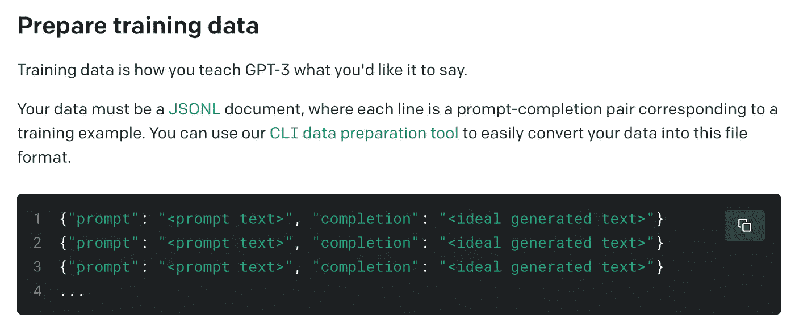
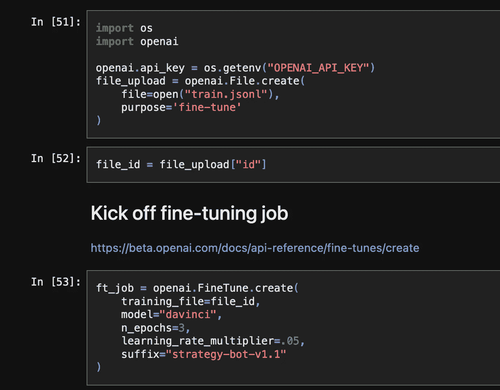
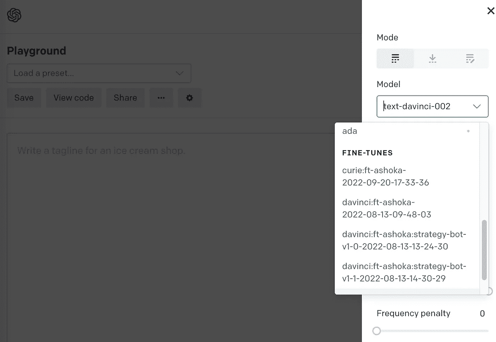

# 与 GPT-3 一起为一个非政府组织开发战略机器人

> 原文：<https://towardsdatascience.com/developing-a-strategy-bot-for-an-ngo-39cddf912eba>

## 如何创建自己的自定义版本的 GPT-3，甚至更好的结果

[JESHOOTS.COM](https://unsplash.com/@jeshoots?utm_source=medium&utm_medium=referral)在 [Unsplash](https://unsplash.com?utm_source=medium&utm_medium=referral) 上拍照

# 这是怎么回事？

当 [OpenAI](https://openai.com/) 在 2020 年发布 [GPT-3](https://en.wikipedia.org/wiki/GPT-3) 时，自然语言处理(NLP)社区变得疯狂(类似于过去几个月由文本到图像模型创造的炒作，如 [DALL-E 2](https://openai.com/dall-e-2/) 和[稳定扩散](https://en.wikipedia.org/wiki/Stable_Diffusion))。几周之内，人们意识到并收获了用 GPT-3 创造惊人演示和应用的潜力，并取得了惊人的成果。2021 年 12 月，OpenAI [引入了](https://openai.com/blog/customized-gpt-3/)微调 GPT-3 的能力，这意味着客户可以根据他们的特定应用创建他们自己的定制版本的模型。

在这篇博文中，我们将学习如何创建一个定制版的 GPT 3，我们还将看到一个非政府组织如何使用这项技术为年轻的社会企业家创建一个战略机器人。

# 为什么这很重要？

自从引入像 [BERT](https://en.wikipedia.org/wiki/BERT_(language_model)) ，*微调*这样的流行的最先进的 NLP 模型以来，这些 NLP 模型已经成为适应特定任务的主要机制。这种技术利用了 [*迁移学习*](https://en.wikipedia.org/wiki/Transfer_learning) 的概念:使用预先训练的模型，并使其适应新的(专门的)领域，这显著提高了模型性能并降低了训练成本。

来源:[https://www . CSE . ust . hk/~ qyang/Docs/2009/tkde _ transfer _ learning . pdf](https://www.cse.ust.hk/~qyang/Docs/2009/tkde_transfer_learning.pdf)

GPT-3 最初没有提供微调的选项。相反，它已经接受了各种任务和专业领域的训练，无需进一步训练就能表现出色。然而，随着时间的推移，组织开始意识到开箱即用的模型令人印象深刻，但往往不够好，不足以用于生产。

在定制数据集上微调 GPT-3 并创建其定制版本的选项将使模型性能超过组织可以轻松将其用于生产工作负载的阈值。

# 问题陈述

阿育王成立于 1980 年，是世界上最大的社会企业家网络。这些社会企业家开发系统改变解决方案，通常以战略文件开始，详细说明他们想要解决的问题，他们的方法，以及他们的解决方案如何扩大间接和系统的影响。制定这些策略可能是一项艰巨的任务，Ashoka 希望用一个*策略机器人*来支持社会企业家，即一个可以帮助编写这些策略的文本生成模型。

他们尝试了 GPT-3 的普通版本，发现结果很有希望，但对于他们的特定目的来说还不够好。他们知道微调 GPT-3 的选项，并需要有人可以在他们的数据集上训练模型，这就是我参与的地方🙂那么，让我们来看看我们该如何着手此事！

# 解决方案演练

阿育王有 4000 多份以前的战略文件样本，加上一点功能工程，是 GPT-3 的一个很好的训练数据集。在开始微调之旅之前，我们还想了解一下它的成本。最后，在开始培训之前，我们必须以特定的方式准备数据集。让我们一步一步来。

## 数据准备

Ashoka 提供的数据集由几列感兴趣的文本组成，我们的目标是将它们浓缩成两列:一列是提示文本，另一列是我们希望 GPT-3(理想情况下)从提示中生成的文本。这是根据 OpenAI 的指导方针，数据需要如何准备进行微调:

来源:https://beta.openai.com/docs/guides/fine-tuning

对于提示文本，我们可以使用数据集中名为*简介*的列。不过，有些还是太长了，所以我们决定只把那篇文章的前两句话作为提示。此外，我们发现，如果我们在提示符后附加一条简短的指令，GPT-3 的性能甚至会更好:

该练习的结果将如下所示:

作者图片

类似地，我们将把来自不同列的文本编译成*完成*特性，让 GPT-3 知道我们希望它生成什么。要了解这些策略需要什么，你可以查看 https://www.ashoka.org/en-us/story/strategy-plan-action 的。

需要注意的是，*完成*文本应该有一个独特的短语来表示文本生成的结束(关于这个的更多信息在 [OpenAI 的网站](https://beta.openai.com/docs/guides/fine-tuning/conditional-generation))。因此，我们以这段代码结束了创建完成:

## 估价

既然我们已经准备好了数据，我们可以提交它来创建培训作业。不过，在我们这么做之前，我们想快速计算一下培训的成本——没有什么比培训一个模型之后才意识到成本远远超出预期更糟糕的了。(事实上，如果 OpenAI 能够提供一个预先估计微调工作价格的功能，那就太好了，但据我所知，在我撰写本文时，这个功能还不存在)

幸运的是 [OpenAI 的定价网站](https://openai.com/api/pricing/)给了我们一些如何计算价格的线索:培训最有能力的模型(达芬奇)的费用是每 1000 个代币 3 美分。该网站还声明，一个代币是*文字块*，1 个代币大约相当于 4 个字符:

来源:[https://openai.com/api/pricing/](https://openai.com/api/pricing/)

最后，OpenAI 还提供了一些关于我们应该在多少个例子上训练模型的指导:

来源:[https://beta . open ai . com/docs/guides/fine-tuning/preparing-your-dataset](https://beta.openai.com/docs/guides/fine-tuning/preparing-your-dataset)

我们决定用 500 个例子，因此我们的价格估计是，培训将花费我们大约 10 美元，相当实惠🤗

## 微调

我们已经准备好了数据，我们很清楚微调的成本，所以现在是扣动扳机的时候了。 [OpenAI 的 API 参考](https://beta.openai.com/docs/api-reference/fine-tunes/create)非常清晰且易于理解——要微调模型，我们只需上传训练文件并调用 FineTune.create API:

作者图片

提交培训工作后，大约需要两个小时才能完成，但这显然取决于您的培训数据，您的里程可能会有所不同。培训工作完成后，新模型将出现在操场应用程序中:

作者图片

现在我们终于可以测试我们自己的 GPT-3 模型了😃

## 测试

在测试这些模型时，我们没有太多可以自动化的东西——不幸的是，仍然没有好的基准来评估生成的文本是否“好”。所以我们做了自己的手工测试，我们对模型的表现感到非常惊讶。

该模型从一个简单的想法中创建的策略包括间接和系统的影响，它还包括围绕开源和培训其他组织的各种聪明的策略。这正是我们所需要的🎉

# 结论

在这篇博文中，我们看到了创建我们自己的 GPT-3 模型是多么容易(而且相当实惠)。我们已经看到，微调模型的结果超出了我们的预期，足以用于生产工作负载。Ashoka 目前正在内部测试和实施这一模式，并将向社会企业家推广，以帮助他们创造新的战略，让世界变得更好🌍

*如果你有兴趣联系，请联系* [*LinkedIn*](https://www.linkedin.com/in/heikohotz/) *或*[*https://www . aiml . consulting/*](https://www.aiml.consulting/)