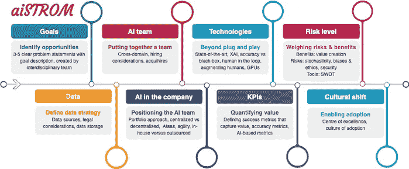

# 用 aiSTROM 框架开发成功的人工智能策略

> 原文：<https://towardsdatascience.com/developing-a-successful-ai-strategy-with-the-aistrom-framework-a1d8f979b2a9>

由 Dall-E2 生成。

## 如何实现人工智能技术的战略

大量人工智能项目失败。Rackspace Technology 的调查估计这个数字高达 34% [2]。这种失败很大程度上是由于管理层不理解人工智能技术的风险和复杂性，反之亦然，开发人员不知道如何扩展技术或业务需求。许多管理人员似乎认为人工智能项目就像典型的软件项目一样，然而，也有一些特殊的挑战。这些挑战可能涉及团队所需的技能、要求模型透明的法律问题、大数据治理、采用的文化挑战等等。

在我最近关于[aiSTROM——在 IEEE Access [1]中开发成功人工智能策略](https://ieeexplore.ieee.org/document/9612182)的路线图的论文中，我提出了如何应对这些挑战的详细路线图。缩写 aiSTROM 代表以人工智能为中心的战略路线图。如需深入讨论，请参考[全文](https://ieeexplore.ieee.org/document/9612182) [1]。在接下来的内容中，我们将简要介绍 aiSTROM 路线图的各个步骤。

aiStrom 概述，图片基于[1]。

# 1.发现机会

人工智能技术提供的机会可能是巨大的。aiSTROM 建议与领域级专家和技术专家一起举办头脑风暴研讨会，以提出一个 top- *n* 项目列表，例如前 5 个项目。在确定这些问题时要问的一些问题可能包括:我们的竞争对手在做什么？我们能自动化流程吗？我们能利用人工智能以新的方式做事并提供创新服务吗？

关于选择项目时需要注意的事项的完整列表和广泛讨论，请参考[1]。在下文中，将根据框架中的下一步，首先是"数据",审查每个项目的考虑因素。

# 2.数据

“大数据”的可用性是当前深度学习时代的催化剂之一，此外还有 CNN 等新技术以及 GPU 硬件的广泛可用性。我们可以将大数据的首次提及追溯到 1997 年的 Cox 和 ells worth[3]:

> “……给计算机系统带来了一个有趣的挑战:数据集通常非常大，占用了主内存、本地磁盘甚至远程磁盘的容量。我们称之为**大数据**的问题。当数据集不适合主内存(在内核中)时，或者当它们甚至不适合本地磁盘时，最常见的解决方案是获取更多资源……”

大数据通常有三个特征:量(大量数据)、多样性(杂乱数据)和速度(快速增长)。这些最初的 V 有时会随着价值(商业价值)和准确性(偏见)而扩展。在机器学习中，需要大数据来训练我们的模型。这意味着我们需要建立必要的数据库或仓库基础设施来处理项目所需的容量。下面讨论一些需要记住的特殊注意事项。

**数据来源。**组织中是否已经有可用的数据？如果没有，可能需要*收集，*或者你会考虑*购买*数据吗？如果你考虑自己收集数据，请记住这需要很多时间，通常需要伦理委员会的批准，以及预处理和质量检查。然而，开始收集越早越好，即使你还不确定你是否需要这些数据。看看亚马逊 MTurk 等众包方法可能会提供一种比自我收集更快的替代方法，但在质量方面往往更差。找到正确、高质量的数据源是一项重要的决策。更多的数据通常是好的，但请记住贝尔曼[5]的“维数灾难”，以及维护大型数据池的成本高昂这一事实。

**法律问题。**存储/收集数据时，需要牢记大量隐私和安全注意事项。您是否遵守当地的隐私法，组织中谁有权访问数据等。是需要考虑的重要问题。有必要在允许人工智能员工大规模访问你公司的所有数据(快速开发想法)与隐私和安全之间找到一个良好的平衡。

**存储数据。**公司是组织内部存储(这涉及大量成本和管理人力)，还是使用外部数据中心？在决定时，考虑数据应该存储在靠近客户所在地的地方，因为传输速度较慢。此外，这些数据是以原始形式存储，例如存储在一个数据湖中，还是经过预处理成为结构化形式？这些选择应考虑数据管理原则，如 CAP 定理和 PACELC 定理[4]。

# 3.人工智能团队

开发人工智能模型不仅仅是一项具有技术挑战性的任务，它涉及前沿模型和创造力，以及研究水平的思维能力和问题解决能力以及领域知识。Herremans 在[1] 中提供了一个更全面的技能列表。公司经常雇佣博士级别的开发人员，和/或与学术机构合作。另一种快速雇佣大量人才库的方法是通过收购:当一家公司收购另一家公司，但只是为了重用这些人员。这方面的一个例子是 2005 年谷歌雇佣 Android，当时还没有开发出任何产品。

# 4.艾在公司

人工智能的发展将会如何发生？

**团队定位。**AI 团队将如何在组织中定位？一些组织选择分散的方法，每个部门负责自己的人工智能项目。在一个更集中的方法中，可以雇佣一个可以跨部门工作的 CAI。这种方法可以形成一个卓越的中心或研究实验室。最后，一些组织可能更喜欢混合方法。最佳设置将取决于组织的需求和准备情况。

**投资组合方法。** AI 项目和金融资产有一些共同点:两者都会有风险等级。一家公司可以实施一系列人工智能项目，这将降低风险，并在其中一些项目出错时提供缓冲。

**AIaas —人工智能即服务。一些服务已经存在，为什么不直接使用 API 呢？这可能有效，但如果服务对核心业务至关重要，则不建议这样做。**

**是否在内部开发？外包可能是快速进行开发的一个好选择。这个决定可能取决于公司的人工智能准备程度。除了内部开发，另一个选择是收购一家已经开发出该技术的公司。**

**敏捷。**像任何 IT 项目一样，敏捷开发方法通常被推荐。另一个最佳实践是 MLOps，这是 DevOps 与机器学习的融合。

# 5.技术

我们在这里的目的不是概述人工智能技术。但是，有意思的是，要强调与技术选择相关的几点:

**准确性与黑盒。** AI 系统是随机系统。经理可以命令开发商预测客户的行为，但不能保证模型的准确性。事实上，这往往取决于它是否是一个黑箱模型(更准确，但无法解释)。在某些领域，如信用评分，法律要求公司对做出决定的原因做出解释。在这种情况下，需要使用简单、不太准确的系统，如基于规则的系统，而(通常)更准确的深度学习模型本质上是黑盒模型。

**人类在回路中。**一些策略使用预先标记的数据集，例如，有人浏览了数据并标记了照片中的所有汽车。然而，在强化学习策略中，系统将不断地接受来自用户的反馈和纠正。

**取代或增加人类。人工智能系统通常被视为对人类工作的威胁。实际上，它们为用户提供了机会，使他们能够更好、更有创造性、更容易、更好地控制自己的工作。**

**云与内部托管。**这一决定将基于内部托管服务器的成本(人力资本+设备)与订阅费，后者通常比租用服务器更容易扩展。

# 6.KPI

像任何项目一样，从一开始就有清晰的*基于价值的*成功指标是至关重要的。这些应该与组织的战略目标相联系。请注意上面的“基于价值”一词，这表明我们应该不仅仅关注财务目标，还应该关注人工智能技术如何为客户或员工创造价值。另外，考虑到 AI 模型是随机的，准确性也不能保证，这也是要评估的事情！

# 7.设定风险等级

AI 系统在开发过程中需要监控的 ***风险*** 包括:

*   它们的随机性。模型可能无法准确工作！
*   偏见和道德。在开发的任何模型中，必须避免种族/性别/…习得性偏见
*   安全。该模型应该能够抵抗对抗性攻击以及欺骗攻击。
*   其他战略决策。风险可能源自之前的任何决策:内部开发、招聘、托管失败、数据不安全等。

在考虑风险的时候，我们还要权衡 ***利益*** 。理想情况下，这些由上述基于价值的 KPI 来捕获。

一个 ***SWOT 分析*** 可以把这两者放在一起，提供一个很好的管理决策概览。

# 8.促成文化转变

直接参与项目的人员，无论是 it 经理还是开发人员，都必须了解人工智能技术。甚至其他员工，尽管他们看起来与项目相去甚远，也为组织的整体文化做出了贡献。接受人工智能教育的员工可能会基于他们对公司的特定知识贡献想法和见解。

通过建立一个卓越中心，该公司可以提高意识并教育员工，这将导致整个组织拥抱人工智能技术。任何对被人工智能技术取代的恐惧通常都会通过提高人工智能素养来缓解，因此这将极大地有助于培养人工智能采用的文化。

# 结论

我希望已经提供了一些伴随着实施长期人工智能战略而来的战略管理决策的良好概述。aiSTROM 提供了一个路线图，指导经理在实施人工智能战略时通过不同的领域和需要战略决策的领域。

如果你有兴趣阅读更多的细节，请查看原文 [aiSTROM 论文](https://ieeexplore.ieee.org/document/9612182/authors#authors)，或者联系讨论我可以如何帮助你！需要生成 aiSTROM 报表的界面或模板，或者有其他需求，请告诉我！

# 关于作者

dorien herre mans(IEEE 资深会员)在安特卫普大学获得应用经济学博士学位。她获得了玛丽-居里奖学金，在伦敦玛丽皇后大学数字音乐中心工作。在此之前，她于 2005 年毕业于安特卫普大学管理信息系统专业，成为一名商业工程师。之后，她在世界领先的瑞士布鲁切莱斯罗切斯酒店管理学院担任 Drupal 顾问和 IT 讲师。她目前是新加坡科技与设计大学的助理教授。在 SUTD，她还是 SUTD 游戏实验室的主任，并领导音频、音乐和人工智能(AMAAI)实验室以及人工智能金融(AIFi)小组。她的激情包括战略思维以及人工智能技术的新颖应用。她在许多委员会和董事会任职，并应邀在世界各地发表演讲。她入选了新加坡 2021 年 100 名科技女性榜单，该榜单旨在表彰和庆祝新加坡为科技行业做出重大贡献的鼓舞人心的女性。

# 参考

[1] D. Herremans，“[aiSTROM——开发一个成功的人工智能策略的路线图”](https://ieeexplore.ieee.org/document/9612182)，在 IEEE Access，第 9 卷，第 155826-155838 页，2021，doi:10.11109/Access . 2002003005

[2] *全球报告:组织在人工智能和机器学习方面取得成功了吗？*2021 年【在线】可用:【https://www.rackspace.com/solve/succeeding-ai-ml/ty.】T2

[3] M. Cox 和 D. Ellsworth，“用于核外可视化的应用程序控制的按需分页”， *Proc .第八次会议。Vis。【VIS】《T5》，第 235 页，1997 年。*

[4] M. Chen，S. Mao 和 Y. Liu，“大数据:一项调查”，*移动网络。申请*，第 19 卷，第 2 期，第 171–209 页，2014 年。

[5] R. Bellman，自适应控制过程:导游，普林斯顿，新泽西州，美国:普林斯顿大学出版社，第 3 卷，第 2 页，1961 年。