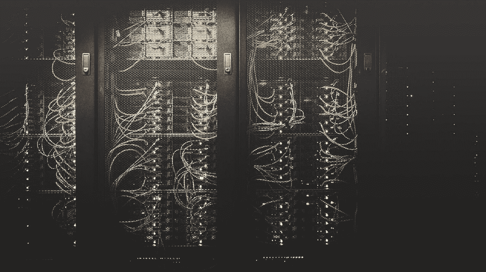

# 计算机视觉的发展

> 原文：<https://towardsdatascience.com/developments-occurring-within-computer-vision-9d485a072d46>

## 概述计算机视觉领域以及技术基础设施的进步如何支持其发展和可扩展性

Nubelson Fernandes 在 [Unsplash](https://unsplash.com/s/photos/developer?utm_source=unsplash&utm_medium=referral&utm_content=creditCopyText) 上的照片

从事计算机视觉(CV)工作的人工智能(AI)从业者和开发者在计算机和计算机系统内实施和集成涉及视觉的问题的解决方案。图像分类、人脸检测、姿态估计和光流是 CV 任务的典型例子。

深度学习算法非常适合解决计算机视觉问题。卷积神经网络的结构特征使得能够检测和提取图像数据中存在的空间模式和特征。换句话说，机器可以识别和分类物体，甚至对它们做出反应。

因此，计算机视觉工程师称自己为深度学习工程师或只是普通的旧机器学习工程师。

[计算机视觉](https://developer.nvidia.com/computer-vision)是一个快速发展的领域，包括研究、商业和商业应用。对计算机视觉的高级研究现在可以更直接地应用于商业领域。

计算机视觉领域正在快速向前发展，这使得 CV 专家必须跟上最新的发现和进步。

## 关键要点

*   帮助扩展深度学习解决方案的云计算服务
*   自动机器学习(AutoML)解决方案减少了标准机器学习流程中所需的重复工作量
*   研究人员努力使用变压器架构来优化计算机视觉任务

# 云计算

云计算通过互联网向个人或企业提供计算资源，如数据存储、应用服务器、网络和计算基础设施。与使用本地资源执行计算相比，云计算解决方案为计算资源可用性和扩展提供了快速且经济高效的解决方案。

机器学习解决方案的实施需要存储和处理能力。在机器学习项目的早期阶段(数据聚合、清理和争论)对数据的关注涉及用于数据存储和应用/数据解决方案接口访问的云计算资源(BigQuery、Hadoop、BigTable)。

泰勒·维克在 [Unsplash](https://unsplash.com/s/photos/data-center?utm_source=unsplash&utm_medium=referral&utm_content=creditCopyText) 上的照片

最近，具有计算机视觉能力的设备和系统显著增加，例如用于步态分析的姿态估计、用于移动电话的面部识别、自动车辆中的车道检测等。

对云存储的需求正在增加，据[预计](https://www.fortunebusinessinsights.com/cloud-storage-market-102773)2021 年该行业的价值将达到 3903.3 亿美元，是当前市场价值的五倍。

预计[市场规模](https://www.alliedmarketresearch.com/computer-vision-market-A12701#:~:text=The%20global%20computer%20vision%20market,16.0%25%20from%202020%20to%202030.&text=This%20is%20possible%20due%20to,artificial%20intelligence%2C%20and%20computational%20power)和应用程序的计算机视觉将大幅增长，从而导致使用入站数据来训练机器学习模型的数量增加。开发和训练 ML 模型所需的数据样本的增加与更大的数据存储容量需求和广泛强大的计算资源直接相关。

GPU 可用性的提高加速了计算机视觉解决方案的发展。然而，当服务于数千甚至数百万消费者时，仅靠 GPU 并不总能提供这些应用所需的可扩展性和正常运行时间。这个问题的显而易见的答案是云计算。

云计算平台，包括[亚马逊网络服务(AWS)](https://aws.amazon.com/) 、[谷歌云平台(GCP)](https://cloud.google.com/) 和[微软 Azure](https://azure.microsoft.com/en-gb/) ，为机器学习和数据科学项目管道的核心组件提供解决方案，包括数据聚合、模型实现、部署和监控。

提高对与计算机视觉和通用机器学习相关的云计算服务的认识，会使任何 CV 工程师在企业中占据优势。通过进行深入的成本效益分析，可以确定云计算服务的好处。

一个很好的经验法则是，确保作为一名 CV 工程师，您了解或以某种形式接触到至少一个主要的云服务提供商及其解决方案，包括它们的优势和劣势。

# 大规模计算机视觉需要云服务集成

以下是支持典型计算机视觉操作的 NVIDIA 服务的示例，以强调哪种类型的云计算服务适合 CV 工程师。

利用英伟达广泛的预训练深度学习模型的[英伟达图形处理单元云(NGC)目录](https://catalog.ngc.nvidia.com/models?filters=&orderBy=scoreDESC&query=)抽象出深度学习模型实施和训练的复杂性。[深度学习脚本](https://catalog.ngc.nvidia.com/resources)为 CV 工程师提供现成的管道，可定制以满足独特的需求。健壮的模型部署解决方案自动向最终用户交付模型。

此外， [NVIDIA Triton 推理服务器](https://developer.nvidia.com/nvidia-triton-inference-server)支持在任何基于 GPU 或 CPU 的基础设施上部署来自 TensorFlow 和 PyTorch 等框架的模型。NVIDIA Triton 推理服务器提供了跨各种平台的模型可扩展性，包括云、边缘和嵌入式设备。

此外，NVIDIA 与云服务提供商如 [AWS](https://catalog.ngc.nvidia.com/orgs/nvidia/collections/amazonwebservices) 的合作伙伴关系支持部署基于 CV 的资产的能力。无论是 NGC 还是 AWS，通过利用由英伟达专家整合的打包解决方案，对基础设施和计算资源的考虑都很少。这意味着 CV 工程师可以更专注于模型性能和优化。

鼓励企业在可行的情况下降低成本和优化策略。云计算和云服务提供商通过提供基于使用和基于服务需求扩展的计费解决方案来满足这一需求。

# AutoML

机器学习算法和模型开发是涉及许多任务的过程，这些任务可以通过创建自动化操作管道从自动化和减少手动过程中受益。

以特征工程和模型选择为例。特征工程是一个涉及从数据中检测和选择相关信息和属性的过程，该过程非常适合于描述数据集或提高基于机器学习的解决方案的性能。

模型选择涉及评估一组机器学习分类器、算法或给定问题的解决方案的性能。这些活动需要 ML 工程师和数据科学家花费相当多的时间来完成，并且经常需要从业者重新访问程序操作以提高模型性能或准确性。

人工智能(AI)领域致力于自动化机器学习过程中的大量手动和重复操作，称为自动化机器学习或 AutoML。

斯蒂芬·道森在 [Unsplash](https://unsplash.com/s/photos/data-science?utm_source=unsplash&utm_medium=referral&utm_content=creditCopyText) 上拍摄的照片

有几个正在进行的大型项目来简化机器学习项目管道的复杂性。AutoML 是一项超越抽象的努力，它专注于 ML 工作流和过程的自动化和增强，以使 ML 对于非 ML 专家来说容易和可访问。

花一点时间来考察汽车行业的市场价值，[预测](https://www.psmarketresearch.com/market-analysis/automated-machine-learning-market)预计到 2030 年汽车市场将达到 140 亿美元。这意味着其规模将比目前的价值增加近 42 倍。

计算机视觉项目有一系列重复的任务来实现预期的目标。参与模型实现的 CV 工程师太了解了。寻找合适的超参数的重复工作的数量使得模型的训练能够收敛到最佳损失并实现期望的精度，该过程被称为超参数优化/调整。

模型选择和特征工程是耗时且重复的过程。AutoML 是机器学习管道中自动化重复过程的努力。

机器学习和自动化的这种特殊应用正在获得牵引力。CV 工程师需要了解 AutoML 的优势和局限性。

## 实践中的自动化

AutoML 仍然是一项专注于自动化标准机器学习程序的新技术。然而，从长远来看，所获得的优势是显著的。

AutoML 对 CV 和 ML 工程师的一个明显好处是节省时间。数据聚合、数据准备和超参数优化是耗时的过程，可以说不使用 ML 工程师的核心技能和能力。

超参数调优涉及一个带有有根据猜测的试错过程。虽然数据准备和汇总是必要的过程，但它们涉及重复的任务，并取决于找到适当的数据源。事实证明，AutoML 功能在自动化这些流程方面非常成功，使 CV 工程师能够将更多的时间和精力投入到要求更高、更有成就感的任务中。

AutoML 及其应用程序，尤其是数据源，仍然有助于数据质量，主要是模型性能。特定于问题领域的高质量数据的获取对于自动化来说还不成熟，需要专业的人工观察和监督。

对于那些对探索 GPU 驱动的 AutoML 感兴趣的人来说，广泛使用的[基于树的流水线优化工具(TPOT)](https://github.com/EpistasisLab/tpot) 是一个自动化的机器学习库，旨在通过遗传编程优化机器学习过程和流水线。 [RAPIDS cuML](https://github.com/rapidsai/cuml) 提供通过 GPU 计算资源加速的 TPOT 功能。这篇[文章](https://medium.com/rapids-ai/faster-automl-with-tpot-and-rapids-758455cd89e5)提供了更多关于 TPOT 和急流城的信息。

# 机器学习库和框架

机器学习库和框架在任何 CV 工程师的工具包中都是必不可少的。ML 库和框架的发展和进步是渐进和持续的。主要的深度学习库如 [TensorFlow](https://www.tensorflow.org/) 、 [PyTorch](https://pytorch.org/) 、 [Keras](https://keras.io/) 、[和 MXNet](https://mxnet.apache.org/versions/1.9.0/) 在 2021 年得到了不断的更新和修复，没有理由认为这不会持续到 2022 年。

最近，在以移动为重点的深度学习库和软件包方面取得了令人兴奋的进展，这些库和软件包优化了常用的 DL 库。

[MediaPipe](https://google.github.io/mediapipe/solutions/pose.html) 在 2021 年扩展了其姿态估计功能，通过 BlazePose 模型提供 3D 姿态估计，该解决方案可在浏览器和移动环境中使用。在 2022 年，预计会看到更多涉及动态运动的使用案例中的姿态估计应用，并需要稳健的解决方案，如舞蹈中的运动分析和虚拟角色运动模拟。

[PyTorch Lighting](http://pytorchlightning.ai/) 由于其简单性、对复杂神经网络实现细节的抽象以及对硬件考虑的增强，在研究人员和专业机器学习实践者中越来越受欢迎。

# 最先进的深度学习

深度学习方法长期以来一直被用来应对计算机视觉挑战。用于进行面部检测、车道检测和姿态估计的神经网络架构都使用卷积神经网络的深度连续层。

CV 工程师非常了解 CNN，并且需要更加适应该领域的研究发展，特别是使用 Transformer 来解决计算机视觉任务。Transformer，2017 年[《注意力是你需要的全部》](https://arxiv.org/pdf/1706.03762.pdf)论文中介绍的深度学习架构。

该文章提出了一种新的方法，通过利用[注意力机制](https://blog.floydhub.com/attention-mechanism/)来导出输入数据的一部分相对于其他输入数据段的重要性，从而创建数据的计算表示。变压器神经网络架构没有利用卷积神经网络的惯例，但是[研究](https://viso.ai/deep-learning/vision-transformer-vit/#:~:text=The%20vision%20transformer%20model%20uses,processed%20by%20the%20transformer%20encoder.)已经展示了变压器在视觉相关任务中的应用。

通过 [NGC 目录](https://catalog.ngc.nvidia.com/orgs/nvidia/resources/transformer_for_pytorch)探索变压器模型，其中包括 PyTorch 中实际变压器模型的架构和利用的详细信息。

变压器在 NLP 领域产生了相当大的影响，只需参考 GPT(生成式预训练变压器)和[伯特](https://arxiv.org/abs/1810.04805)(来自变压器的双向编码器表示)的成就。

这篇发表于 2021 年最后一个季度的[论文](https://arxiv.org/pdf/2101.01169.pdf)，提供了 [Transformer](https://arxiv.org/abs/1706.03762) 网络架构在计算机视觉中的应用的高级概述。

CV 工程师对应用 ML 感兴趣，不熟悉阅读研究论文，那么这篇[帖](https://developer.nvidia.com/blog/how-to-read-research-papers-a-pragmatic-approach-for-ml-practitioners/)就为大家呈现了一套系统的阅读和理解研究论文的方法。

# 移动设备

边缘设备变得越来越强大，设备上的推理能力是期望快速服务交付和人工智能功能的客户所使用的移动应用程序的必备功能。

照片由[在](https://unsplash.com/@homescreenify?utm_source=unsplash&utm_medium=referral&utm_content=creditCopyText) [Unsplash](https://unsplash.com/s/photos/smartphones?utm_source=unsplash&utm_medium=referral&utm_content=creditCopyText) 上主屏化

在移动设备中结合计算机视觉使能功能减少了获得模型推断结果的等待时间；将计算机视觉功能集成到移动设备中可带来诸多优势，例如:

*   减少获得模式推断结果时的延迟。在设备上进行和提供的推理结果不依赖于云服务器，反而减少了对推理结果的等待时间。
*   根据设计，设备上的推理功能限制了数据从设备到云服务器的传输。该功能增强了数据的保密性和安全性，因为几乎没有数据传输要求。
*   消除对云 GPU/CPU 服务器的依赖以进行推理的成本降低提供了额外的财务优势。

许多企业正在探索其产品和服务的移动产品，这也包括探索如何在移动设备上复制现有人工智能功能的方法。CV 工程师应该知道几个平台、工具和框架来实现移动优先的 AI 解决方案。

*   [TensorFlow Lite](https://www.tensorflow.org/lite)
*   [CoreML](https://developer.apple.com/documentation/coreml)
*   [苹果愿景框架](https://developer.apple.com/documentation/vision)
*   [张量流-反应](https://blog.tensorflow.org/2020/02/tensorflowjs-for-react-native-is-here.html)
*   [CreateML](https://developer.apple.com/machine-learning/create-ml/)
*   [媒体管道](https://google.github.io/mediapipe/)
*   [MLKit](https://developers.google.com/ml-kit)

# 摘要

随着人工智能越来越多地融入我们的日常生活，计算机视觉技术的使用将会增加。随着它在我们的社会中变得越来越普遍，对具有计算机视觉系统知识的专家的需求将会上升。

CV 工程师必须紧跟行业的最新发展和趋势，以保持领先地位并利用最新的进步。2022 年，你应该意识到 PyTorch 照明、以移动为重点的深度学习库以及变形金刚在计算机视觉应用中的使用越来越受欢迎。

此外，边缘设备正变得越来越强大，企业正在探索其产品和服务的移动产品。以移动为重点的深度学习库和包值得关注，因为它们很可能在未来一年中增加使用。

2022 年，预计 AutoML 功能将得到更广泛的应用，ML 库和框架将继续增长。增强和虚拟现实应用的不断发展将允许 CV 工程师将其技能扩展到新的领域，如开发将真实对象复制到 3D 空间的直观有效的方法。计算机视觉应用将继续改变和影响未来，在支持计算机视觉系统的技术基础设施方面将会有更多的发展。

[**这篇文章的一个版本最早出现在 Nvidia 开发者博客**](https://developer.nvidia.com/blog/the-future-of-computer-vision/)

# 摘要

> **完成步骤 1-4，了解我在媒体和其他平台上制作的最新内容。**

1.  [**成为推荐媒介会员，支持我的写作**](https://richmondalake.medium.com/membership)
2.  订阅我的 [**YouTube 频道**](https://www.youtube.com/channel/UCNNYpuGCrihz_YsEpZjo8TA)
3.  订阅我的播客 [**苹果播客**](https://apple.co/3tbXlIa)**|**[**Spotify**](https://spoti.fi/38IIC06)**|**[**可听**](https://amzn.to/3m62Vb3)
4.  订阅我的 [**邮件列表**](https://richmond-alake.ck.page/c8e63294ee) 获取我的简讯