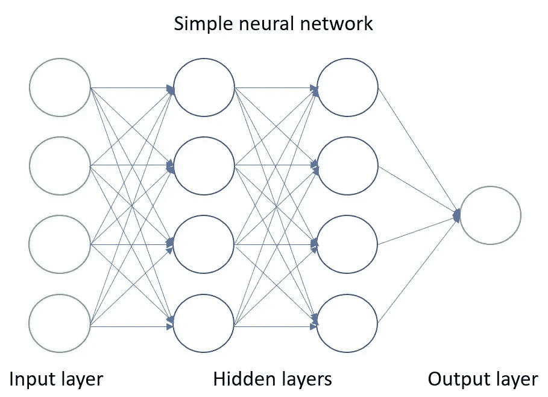
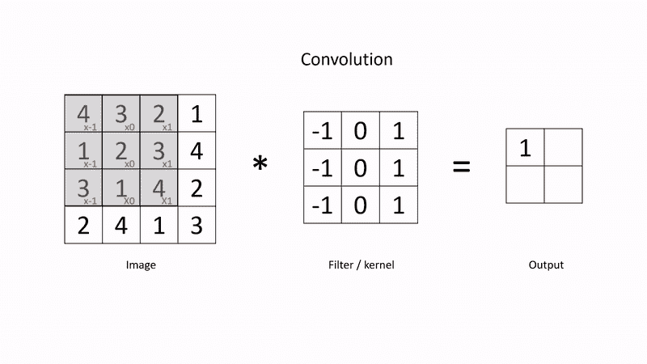
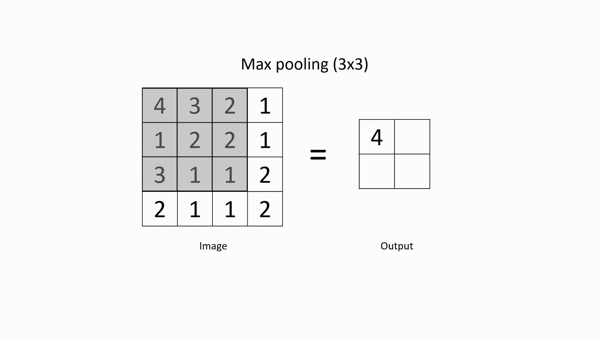
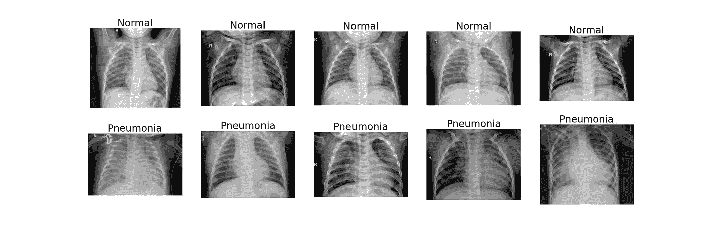
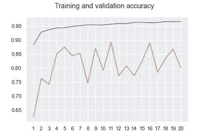
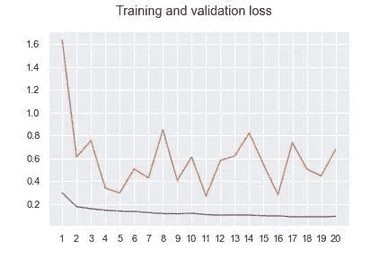
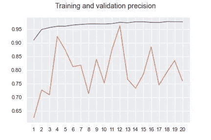
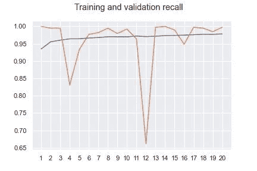
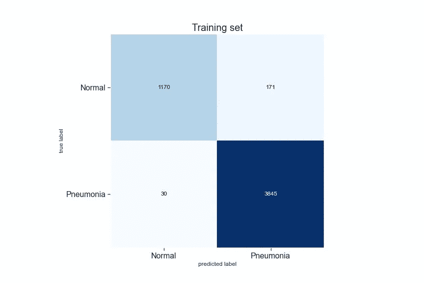

# 利用卷积神经网络从 X 射线图像中诊断肺炎

> 原文：<https://towardsdatascience.com/diagnosing-pneumonia-from-x-ray-images-using-convolutional-neural-network-fe9975cab808>

## 图像分类技术在医学诊断中的应用

[乌曼诺德](https://unsplash.com/@umanoide?utm_source=medium&utm_medium=referral)在 [Unsplash](https://unsplash.com?utm_source=medium&utm_medium=referral) 上拍摄的照片

*免责声明:本文中的信息无意提供或替代任何专业医疗建议、诊断或治疗。*

# 介绍

深度学习，也称为神经网络，近年来获得了牵引力，现在被广泛应用于多个领域，其中一个受欢迎的应用是使用卷积神经网络(" **CNN** ")的图像分类。在医学诊断领域中，也正在探索图像分类的潜力。在本文中，我将讨论如何构建一个卷积神经网络，帮助我们从胸部 x 射线图像中诊断肺炎。

# 神经网络

首先，神经网络可以描述为一系列算法，其目标是识别数据中的关系或模式。简单的神经网络由不同类型的层组成，即输入层、输出层和隐藏层。每一层都包含许多神经元，每个神经元都由算法组成，这些算法将前一层的输出作为输入，生成进一步的输出并将它们传递到下一层。

下图显示了一个简单神经网络的示例架构。在本例中，输入层中有 4 个变量，用绿色圆圈表示。它们被输入到第一个隐藏层中由蓝色圆圈表示的 4 个神经元中的每一个。然后，这些神经元将产生进一步的输出，传递给第二个隐藏层中的神经元。最后，第二个隐藏层的输出将进入由橙色圆圈表示的输出层中的神经元，该神经元将生成最终输出。

作者图片

# 卷积神经网络(CNN)

卷积神经网络是一类通常应用于与图像相关的任务的神经网络。一般来说，它包括 3 个不同类型的层，即卷积层，池层和全连接层。

完全连接的层基本上与上面简单神经网络示例中的隐藏层相同。下面我将依次讨论卷积层和池层。

## 卷积层

顾名思义，卷积层对数据进行卷积运算。这是一种数学运算，将两个数字数组相乘，得到第三个数字数组。

例如，在下图中，3×3 过滤器(或内核)中的每个值都乘以 4×4 图像的 3×3 子部分，并且相乘的结果在每个子部分中相加。然后，滤波器在图像上移动到下一个子部分，并重复计算，直到填满整个输出阵列。

作者图片

示例中的滤波器可以被认为是从图像中识别边缘的边缘检测器。其他类型的特征可以用不同的过滤器来识别。在卷积层中，我们通常会有多个滤波器来检测不同类型的特征。

然而，我们可能不一定知道哪些过滤器最适合应用于我们的任务。因此，代替设置我们自己的过滤器，神经网络将确定最佳过滤器，该过滤器最好地检测我们的分类任务所需的特征。

图像通常表示为 RGB 值，由 0 到 255 的 3 个值组成，每个值对应红、绿、蓝三种颜色。因此，卷积滤波器通常是三维的(例如 3x3x3)。

## 汇集层

汇集层通过将图像的子部分简化为单个值来减少数据的维度。例如，在下图中，应用最大池会通过将图像每个子部分中的最大值作为输出来缩小图像。

作者图片

# 数据准备和扩充

在本文中，我使用的数据集来自[这里的](https://data.mendeley.com/datasets/rscbjbr9sj/2)(数据集是 CC BY 4.0)，其中包括 5856 张标记为“肺炎”或“正常”的胸部 x 光图像。这些胸部 x 光图像选自广州妇女儿童医疗中心 1 至 5 岁儿童患者的回顾性队列。这些 x 射线图像被分成训练集、验证集和测试集。训练集中有 5，216 幅图像，验证集中有 624 幅图像，测试集中有 16 幅图像。我保存文件夹的目录，并在下面的代码中相应地命名它们。

下面我从训练集中画出了 10 张 x 光图像，其中 5 张是“正常”，5 张是“肺炎”。在普通的胸部 x 射线图像检查中，放射科医生会在肺部寻找白色斑点，以确定患者是否患有肺炎。然而，作为非医学专业人员，我们可能不一定有专业知识或经验来区分“肺炎”图像和“正常”图像。

作者图片

让我们看看神经网络是否可以帮助我们这些非医学专业人士区分肺炎和非肺炎的胸部 x 光图像。首先，我在下面的代码中列出了数据准备和扩充的步骤。

我使用 Tensorflow 中的图像预处理库从文件夹中提取并生成批量图像。如上所述，图像用 RGB 值表示，范围从 0 到 255。在卷积神经网络中，每个图像应该只贡献等量的信息。然而，具有高像素值的图像可能比具有低像素值的图像具有更大的权重。因此，我对图像应用了 1/255 的重缩放因子，使它们的值在 0 和 1 之间。

我还应用样本集中和标准化来集中和标准化图像。图像的平均值为 0，标准偏差为 1，这是通过减去每个图像中的平均像素值并除以像素值的标准偏差得到的。

为了减少模型可能过度拟合训练集并且不能很好地概括它从未见过的图像的影响，我应用数据扩充来生成更多看起来与原始图像略有不同的图像，以包括在数据集中。额外的图像被随机缩放 0.2 倍，并且它们的高度和宽度与总量相比被随机移动 0.1 的分数。

我将数据增强应用于训练集和验证集，以评估模型在具有相似数据增强的相似图像分布中的表现。然而，我没有对测试集应用数据扩充，而只是对测试集进行了重新调整和标准化，以评估该模型在图像失真可能性较小的正常情况下更可能遇到的图像上的表现。

类别模式设置为二进制，因为类别为“肺炎”或“正常”。我将图像缩小到(160，160)的大小，以减少输入的数量。批量大小设置为 16，这意味着模型中的内部参数将在每运行 16 个样本时进行更新。可以认为，该模型每观察 16 个样本，就会向最优值迈一小步。

# 构建卷积神经网络

我在下面的代码中列出了我的卷积神经网络的结构。

有 4 个类似的层块，一个卷积层，然后是批量标准化和最大池层。对于跨越所有四个块的卷积层，过滤器的数量从 32 个增加到 128 个，内核大小为 3×3。

在每个块的卷积层之后，我应用批量归一化来归一化结果。然后它们被输入到激活函数中，我将其设置为 ReLU 函数。然后，我应用最大池层，池大小为 2x2。

在四个块卷积和池化层之后，我展平该层，并包括一个具有 512 个神经元的全连接层，以 ReLU 作为激活函数。最后，我包括一个具有 1 个神经元的输出层，其 sigmoid 函数作为我们的二元分类任务的激活函数。

我使用随机梯度下降作为优化方法，学习率从 0.01 开始指数衰减，二进制交叉熵作为损失函数。

然后，我用 20 个时期(或周期)训练该模型，每个时期的步数等于训练集中的图像数除以批量大小，这将允许在每个时期训练整个训练集。我在下面列出了模型摘要。

作者图片

我绘制了各种指标，包括准确度、丢失率、精确度和召回率。

作者图片

训练集中的准确率提高到 95%以上。我们可能会倾向于得出这样的结论:这个模型做得相当好。然而，当我们查看跨时期验证集中的准确率时，它徘徊在 75%到 90%左右，没有随着我们通过更多时期训练模型而增加的明显趋势。

作者图片

训练集中的损失呈下降趋势，而验证损失在最初几个时期后没有显示出明显的下降趋势。

作者图片

作者图片

相似的观察结果可以在精度和召回率中被识别，其中在训练和验证集之间没有明显的收敛。

我们还看到，总体精度低于验证集中的精度，这表明一定比例的预测是假阳性；而验证集中的召回率通常较高，这表明低百分比的预测是假阴性。

上述观察可能暗示我们的模型遭受过拟合的问题，该模型过拟合训练集，并且当它遇到从未见过的新图像时不能很好地概括。

# 混淆矩阵

下面我列出了模型在预测训练、验证和测试集时的混淆矩阵。

作者图片

在训练集中，该模型正确地预测了大多数“肺炎”图像，以及精确度稍低的“正常”图像。

作者图片

在验证集中，模型准确地预测了“肺炎”图像，但在“正常”图像中预测得不太好。

作者图片

在测试集中可以看到类似的模式，即模型不能有效地区分“正常”图像和“肺炎”图像。

从验证集和测试集中的结果，我们可以得出结论，该模型可以正确地预测大多数肺炎的胸部 x 射线图像，但不能预测正常的胸部 x 射线图像。

因此，该模型不是一种万无一失的方法，在该方法中，高百分比的“正常”图像被分类为“肺炎”图像。

# 后续步骤

上述结果可能是由于数据集中的不平衡，因为“肺炎”图像的比例较大，而“正常”图像相对较少。神经网络可能没有看到足够多的“正常”图像来正确识别它们。

此外，过度拟合似乎仍然是一个问题，尽管我们扩大了数据集的数据增加。因此，收集更多的胸部 x 射线图像添加到我们的数据集，特别是正常图像，可能会给我们一个更准确的模型。

我们也可以探索迁移学习的应用。迁移学习是采用预先训练的模型，该模型在非常大的图像集上进行训练，并针对更具体的任务重新训练顶层。这有可能超过我们当前的模型，因为预训练的模型已经从非常大的图像集中学习了基本特征，这将理想地帮助模型处理更复杂的任务。

# 结论

卷积神经网络作为神经网络的一个分支，常用于图像相关的任务，可以应用于医疗诊断等不同领域。然而，深度学习是数据饥渴的，为了训练一个性能良好的模型，需要大量的数据，这可能是医疗领域的一个障碍。