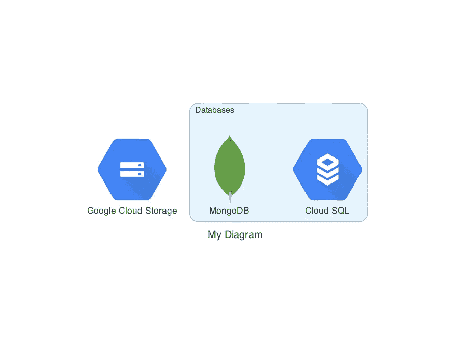
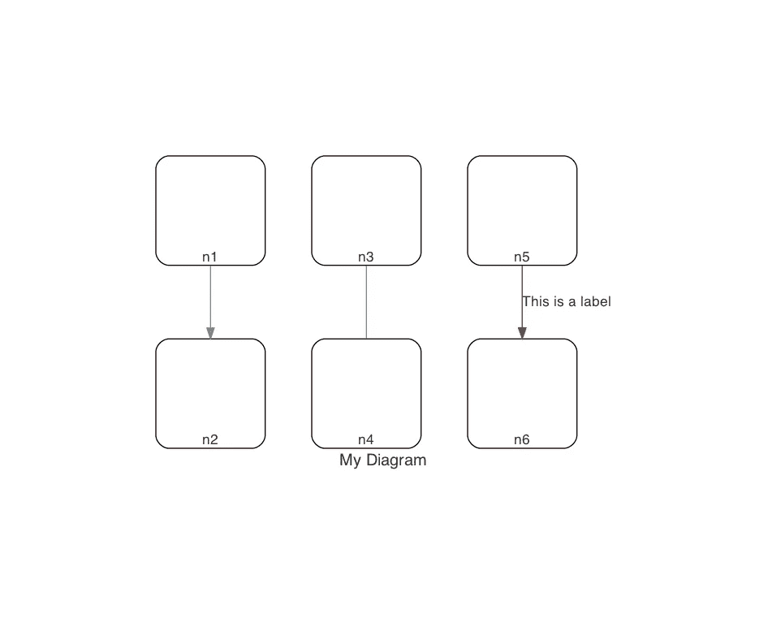

# Python 中作为代码的图

> 原文：<https://towardsdatascience.com/diagrams-as-code-python-d9cbaa959ed5>

## 用 Python 创建云系统架构图


照片由[玛丽奥拉·格罗贝尔斯卡](https://unsplash.com/@mariolagr?utm_source=unsplash&utm_medium=referral&utm_content=creditCopyText)在 [Unsplash](https://unsplash.com/s/photos/diagram?utm_source=unsplash&utm_medium=referral&utm_content=creditCopyText) 上拍摄

在过去的几年里，我使用了许多不同的工具来绘制系统架构图，包括数据平台和云架构，包括 [**draw.io**](https://draw.io) 和 [**Excalidraw**](https://excalidraw.com/) 。

尽管这些平台提供了各种各样的工具，可以帮助你画出想要的图，但我一直在为一些事情而挣扎。首先，对我来说，与组织中的其他人分享图表并不容易，这样他们就有可能更新或修改它们。其次，对我的图进行版本控制几乎是不可能的，在大多数情况下，我必须保存一个包含元数据的文件，该文件可以用来重新加载一个旧的图。

最后，我的图缺乏一致性——在我看来——这是非常重要的，因为你需要创建几个不同的图，并且必须呈现给用户和同事。我所说的一致性是指能够使用各种图表组件——包括边、节点等。—始终如一。

最近，我遇到了一个 Python 包，它可以让你在没有任何设计工具的情况下，用 Python 代码绘制云系统架构。换句话说，它以代码的形式提供了图表，您可以通过编程的方式绘制图表，同时能够对它们进行版本控制。

## 图表包

[Diagrams](https://diagrams.mingrammer.com/) 是一个 Python 包，可以用来创建云系统架构图，支持亚马逊 Web Services (AWS)、微软 Azure、谷歌云平台(GCP)、Kubernetes、阿里云、甲骨文云等六大云提供商。此外，它还支持其他常用的技术，如特定的编程语言、框架、聊天系统和更多的节点。同时，您还可以选择创建定制节点，以服务于您的特定用例。

该包需要 Python 3.6 或更高版本，因此在尝试之前，请确保您的主机上有兼容的 Python 版本。此外，您还必须安装[Graphviz](https://www.graphviz.org/)——一个开源的图形可视化软件，Diagrams package 使用它来呈现图表。

> 如果你使用的是[自制软件](https://brew.sh/)，macOS 用户可以通过`brew install graphviz`下载 Graphviz。同样，安装了 [Chocolatey](https://chocolatey.org/) 的 Windows 用户也可以运行`choco install graphviz`。
> 
> —图表文档

现在你已经仔细检查了你的 Python 版本并安装了 Graphviz，你可以继续通过`pip`安装这个包了:

```
$ pip install diagrams
```

## 用 Python 创建云架构图

在将我们的第一个图创建为代码之前，让我们探索一下这个包的一些最基本的组件。

第一个是`Diagram`，它是表示全局图上下文的主要对象。你可以使用`Diagram`作为上下文管理器

```
**from** diagrams **import** Diagram
**from** diagrams.gcp.analytics **import** Bigquery **with** Diagram('My Diagram'):
    BigQuery('Data Warehouse')
```

上面的代码片段将创建一个由单个 BigQuery 节点组成的图表，该节点是 Google 云平台上的托管数据仓库服务。

这个包的第二个基本组件是`Node`，它是一个抽象的概念，代表一个单一的系统组件对象。典型的`Node`由三个基本部分组成；**提供方**、**资源类型**和**名称。**例如，我们在前面的代码片段中使用的 BigQuery 节点是由`gcp`提供者提供的，属于`analytics`资源类型(显然 BigQuery 对应于节点的名称)。请注意，您甚至可以创建自己的自定义节点:

```
**from** diagrams **import** Diagram, Node**with** Diagram('My Diagram'):
    Node('This is a custom node')
```

使用这个库创建图的第三个关键组件叫做`Cluster`，它允许多个节点以一种方式组合在一起，这些节点都与集群中不包含的任何其他节点相隔离。

例如，考虑下面由三个节点组成的图表；一个用于 Google 云存储(这是 Google 云平台上的托管对象存储服务)，一个云 SQL 节点(这是 GCP 上的托管 Postgres 服务)和一个本地 MongoDB。

```
**from** diagrams **import** Cluster, Diagram
**from** diagrams.gcp.database **import** SQL
**from** diagrams.gcp.storage **import** GCS
**from** diagrams.onprem.database **import** MongoDB**with** Diagram('My Diagram', direction='TB'):
  gcs = GCS('Google Cloud Storage')**with** Cluster('Databases'):
  cloud_sql = SQL('Cloud SQL')
  mongodb = MongoDB('MongoDB')
```



带有数据库集群的示例图—来源:作者

最后，图的最后一个基本组件是`Edge`——一个表示两个`Node`对象之间的边的对象，有三个属性；标签、颜色和样式。

```
**from** diagrams **import** Diagram, Edge, Node **with** Diagram('My Diagram', direction='TB'):
    n1 = Node('n1')
    n2 = Node('n2')
    n3 = Node('n3')
    n4 = Node('n4')
    n5 = Node('n5')
    n6 = Node('n6')   

    n1 >> n2
    n3 - n4
    n5 >> Edge(label='This is a label', color='red') >> n6
```



不同类型边的示例—来源:作者

## 创建架构图

现在我们已经了解了用 Python 构建一个图所需的基本对象，让我们使用前面提到的组件创建一个更真实的流程。

在下面的例子中(摘自官方文档),我们创建了一个与 Google 云平台上的消息收集系统相对应的图表。

```
**from** diagrams **import** Cluster, Diagram
**from** diagrams.gcp.analytics **import** BigQuery, Dataflow, PubSub
**from** diagrams.gcp.compute **import** AppEngine, Functions
**from** diagrams.gcp.database **import** BigTable
**from** diagrams.gcp.iot **import** IotCore
**from** diagrams.gcp.storage **import** GCS**with** Diagram("Message Collecting", show=False):
    pubsub = PubSub("pubsub")**with** Cluster("Source of Data"):
        [IotCore("core1"),
         IotCore("core2"),
         IotCore("core3")] >> pubsub**with** Cluster("Targets"):
        with Cluster("Data Flow"):
            flow = Dataflow("data flow")**with** Cluster("Data Lake"):
            flow >> [BigQuery("bq"),
                     GCS("storage")]**with** Cluster("Event Driven"):
            with Cluster("Processing"):
                flow >> AppEngine("engine") >> BigTable("bigtable")**with** Cluster("Serverless"):
                flow >> Functions("func") >> AppEngine("appengine")pubsub >> flow
```


Google 云平台上的消息收集图—来源:[文档](https://diagrams.mingrammer.com/docs/getting-started/examples)

## 最后的想法

架构图非常重要，因为它们清楚地展示了组织中各种组件的工作方式。因此，重要的是让他们正确，并以一种良好、直观和一致的方式呈现他们。

此外，能够容易地共享这些图也很重要，通过这种方式，它们可以容易地被不同的人修改，同时被版本控制。

当涉及到绘制和共享架构图时，作为代码的图是一种可以帮助您朝着这个方向前进的方法。在今天的教程中，我们展示了如何利用`diagrams`包来用 Python 编程创建图表。

[**成为会员**](https://gmyrianthous.medium.com/membership) **阅读介质上的每一个故事。你的会员费直接支持我和你看的其他作家。你也可以在媒体上看到所有的故事。**

[](https://gmyrianthous.medium.com/membership) [## 通过我的推荐链接加入 Medium-Giorgos Myrianthous

### 作为一个媒体会员，你的会员费的一部分会给你阅读的作家，你可以完全接触到每一个故事…

gmyrianthous.medium.com](https://gmyrianthous.medium.com/membership) 

**相关文章您可能也喜欢**

[](/apache-airflow-architecture-496b9cb28288) [## 阿帕奇气流架构

### 深入探讨 Apache Airflow 架构及其如何编排工作流

towardsdatascience.com](/apache-airflow-architecture-496b9cb28288) [](/parallel-computing-92c4f818c) [## 什么是并行计算？

### 理解并行计算在数据工程环境中的重要性

towardsdatascience.com](/parallel-computing-92c4f818c) [](/big-o-notation-32fb458e5260) [## 大 O 符号

### 用 Big-O 符号计算算法的时间和空间复杂度

towardsdatascience.com](/big-o-notation-32fb458e5260)