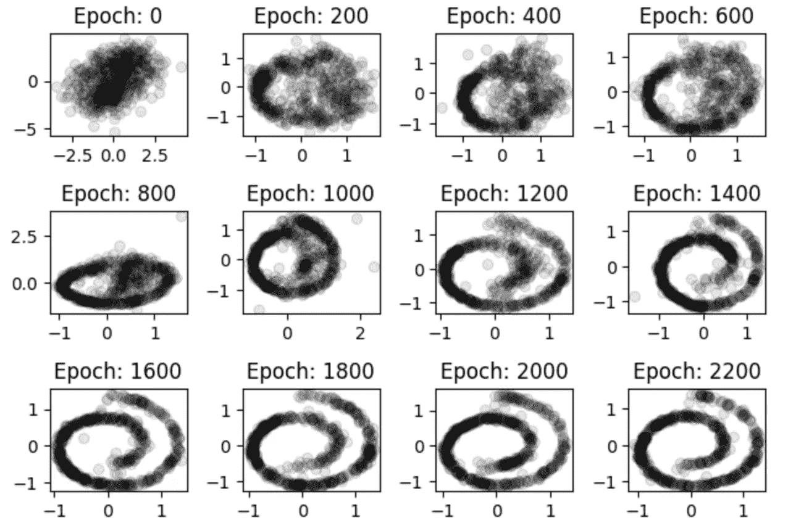

# 扩散模型

> 原文：<https://towardsdatascience.com/diffusion-models-91b75430ec2>

## 它们是什么，它们是如何工作的，为什么是现在？


来源:由稳定扩散生成…因为我当然必须这么做。

这篇文章旨在帮助你推导和理解扩散模型。如果你读完这篇文章后的第一个想法是，“为什么我没有想到这个？！?"那好吧，我成功了🎉。如果没有，好吧，还是谢谢你🤝希望你旅途愉快。

我们不会重建稳定扩散，但我们会在这一集结束时制作一些玩具模型来展示一切是如何工作的。除了这篇文章，我还创建了一个配套的 [Github 库](https://github.com/Jmkernes/Diffusion)来收集所有与扩散相关的东西。在几个点上，我会参考回购的更多细节。截至 2022 年底，有两件事你会想看看:

1.  在玩具数据集上实现扩散模型的简单代码(参见 [DDPM](https://github.com/Jmkernes/Diffusion/blob/main/diffusion/ddpm/diffusers.py) 类和这个[玩具脚本](https://github.com/Jmkernes/Diffusion/blob/main/diffusion/ddpm/main.py))。
2.  [全教程，含数学](https://github.com/Jmkernes/Diffusion/blob/main/diffusion/ddpm/tutorial.md)。填补了这个帖子所掩盖的任何空白，也有一些有趣的物理东西。如果你觉得这个帖子有意思，我推荐通读一下笔记！

# 强制性的非技术性介绍

我不想撒谎。出于尴尬，我开始写这篇文章。

感觉像是上辈子以前我曾在统计物理领域工作，这可以用一个想法来概括，“是的，一个粒子很酷，但你知道什么更酷吗？其中 10 个。”统计物理是一个广阔的领域，但毫不夸张地说，非平衡物理的研究在其中占有突出的地位。非平衡物理学是现代物理学中令人兴奋的领域之一，我们仍然没有真正理解，但仍然包含大量有意义的发现的机会。

然而，如果你要我准确描述*什么是*非平衡物理，我真的不能告诉你。如果你随便选一个物理问题，问我“这是非平衡的吗？”我可能会回答，"不，这是帕特里克……"然后，在尴尬的沉默中坐下来，决定是笑还是退缩。但是，有一种现象我可以说确实属于非平衡物理，因此应该属于我的“专业知识”领域:扩散。

如果你已经跟上了 2022 年的 ML 流行文化，那么“扩散”这个词应该会触发你的人工智能流行词警报⏰。当我第一次注意到人们开始随便折腾非平衡物理术语时，我感到胃里一阵剧痛。我的思绪淹没在漫漫长夜中，苦读着范·坎彭的 [*物理和化学中的随机过程*](https://www.elsevier.com/books/stochastic-processes-in-physics-and-chemistry/van-kampen/978-0-444-52965-7) 。但是，如果有一个足够强大的动机来克服数学引起的恶心，那就是尴尬。由于害怕有人会问我扩散模型是如何工作的，我开始尽快研究它们。这篇文章不是关于我试图自我证明我的教育或抱怨缓慢(lol ok *快)*忘记我在研究生院学到的一切。不，这是关于分享一些我来之不易的知识，关于扩散模型如何在基本水平上运作。谢天谢地，原来这些东西都挺酷的！

# 什么和为什么

## 什么是扩散模型？

1.  设计用于从分布 p(x)中有效抽取样本的模型。
2.  生成模型。他们学习一些数据的概率分布 p(x)。
3.  自然无监督(这与整个生成部分密切相关)，尽管您可以对它们进行调节或学习有监督的目标。
4.  不是真正的模特。扩散模型泛指调度程序、先验分布和转移核(通常由神经网络参数化)的集合。结合起来，这些片段可以从 p(x)生成样本。

## 为什么扩散模型很酷？

扩散模型并不是人们发明的第一个生成模型，问我们为什么特别关心这些模型是公平的。为了说明原因，让我们回顾一些历史。

你可能会很自然地想到，在深度学习时代，学习概率分布 P(x)是微不足道的:加载你最喜欢的神经网络，制作一个参数化的函数 E_𝝑(x，并通过最小化| p(x)-e_𝝑(x)|.来学习值𝝑然而，这是行不通的。原因是正常化。P(x)不是我们想要学习的任意函数。它必须服从∫ P(x) dx = 1 的约束，也就是说如果我们要学习一个无约束函数 E_𝝑(x)，我们实际上需要优化|P(x) — E_𝝑(x) / ∫ E_𝝑(x) dx|，这个现在因为积分完全拧了。归一化常数 Z(𝝑) = ∫ E_𝝑(x) dx 也称为*配分函数*，通常用大写字母 z 表示。遵循学习无约束函数 E_𝝑(x 方法的模型称为**基于能量的模型** (EBMs)。

值得注意的是，有几种方法可以克服归一化常数问题。冒着错过大量研究的风险，我建议读者参考 2015 年论文[使用非平衡动力学的深度无监督学习](https://arxiv.org/pdf/1503.03585.pdf)的第 1.2 节，以获得更好的概述。我将简单记下一些比较流行的方法:

1.  通过用随机样本近似积分的通常方法，在训练期间估计归一化常数 Z(𝝑。抽取一个好的随机样本是这里最难的部分。这被称为对比发散训练。
2.  了解一些简单的、固有的归一化函数 q_𝝑(x 的参数，其中*近似于* P(x)。这就是变分法。
3.  仔细构建一组可逆的、可训练的变换，这些变换采用简单的标准化概率分布(像正态分布)并将其转化为更复杂的东西。这是规范化流程的方法。
4.  求解导数𝛁_x P(x)而不是 P(x)。由于𝛁_xz(𝝑= 0，这就完全消除了归一化常数。这很好，但是还不清楚如何利用这一点。这种方法被称为分数模型，事实证明，对于某些培训目标，它可以被证明为等同于扩散模型(参见倒数第二节[注释](https://github.com/Jmkernes/Diffusion/blob/main/diffusion/ddpm/tutorial.md)的*基于分数的模型和扩散模型*的等效性)
5.  将自己从标准化的暴政中解放出来，只需学习一个直接生成样本的函数。让你不稳定的模型对着你的耳朵说一些关于博弈论的甜言蜜语，就像你慢慢忘记学习 P(x)的必要性一样。这是甘斯的做法。

扩散模型很有趣，因为它们把自己作为条目(6)添加到上面的列表中。它们提供了处理规范化问题的不同方式。

# 基本的见解

## 这个想法

您可以将扩散模型方法视为我们之前列出的避免归一化常数的方法中的方法(3)和(4)的混合。**扩散模型源自一个简单的想法**:

> 与其直接尝试对分布 P(x)进行建模，不如我们可以找到一些操作，采用一个蹩脚的答案 P_crap(y)，并将其转换为稍微好一点的答案 P_better(x)怎么样？

为什么这会有帮助？假设我们发现了这样一个操作。如果这个操作可以采用任何旧的猜测 P_crap(x)并使其更好，*即使是无穷小的*，那么理论上我们可以一遍又一遍地重复这个操作，直到我们达到正确的分布 p(x)！现在让我们把第(6)项加入我们的清单

6.求解一个取归一化分布 q_t(x)的转换核，把它变成稍微好一点的归一化分布 q_{t+1}(x)。这暗示着 p(x) = q_{∞}(x)。这就像一个连续的正常化流程。

如果你想要一个有趣的，尽管不完全类似的，正在发生的事情的视觉表现，有一种叫做镍钛诺的令人着迷的材料，它能够记住自己的形状。这里有一个用这种材料制成的回形针的视频。成型的回形针可以认为是我们要学习的分布 p(x)。向前(扩散)的过程将相当于拉直回形针，使其形成一个漂亮而简单的均匀分布。逆向(生殖)过程是将它倒入热水中，看着它卷曲回原来的形状。

***抛开对阿松的生财怜款***

> 过渡核以一个 D 维 x_t 作为输入，返回另一个 D 维向量 x_{t+1}作为输出，意味着核产生一个 ***向量场*** 。[这里有一个展示向量场的演示](https://demonstrations.wolfram.com/ElectricFieldLinesDueToACollectionOfPointCharges/)。确保关闭等电位曲线。
> 
> 观察到我们正在学习一个向量场是很有帮助的。它允许我们问这样一个问题，“如果我们什么都没学到，只是直接计算出如果训练数据集中的每个点都被认为是一个微小的质量时会产生的引力场，会怎么样？”你可以的。您刚刚创建的是一个函数，它取空间中的任意点，并将其映射到训练数据中的现有点。这本身并不坏，但我们真正想要的是插值，即映射到不在训练数据集中的点的能力。我可以想到两种方法来实现这一点。第一种方法是在这个映射过程中添加一些随机噪声。这可以做得很严谨，并且是扩散理论的基础。这就是我们在这篇文章中探索的方法。
> 
> 第二种方法，是仔细构建先验分布和向量场，这样就存在一个确定性的方程来映射 p(x)的先验。这是[泊松生成流模型](https://arxiv.org/abs/2209.11178)背后的中心思想。还有更多的空白要填，但这就是它的主旨。它们简单、强大，相对于扩散模型有很多好处。我将在以后的文章中讨论这些问题。

## 方程式

在这一小节中，我们将把我们的想法(使用一些运算将垃圾转化为更少的垃圾)转化为数学。从贝叶斯方程中，我们可以知道我们可以引入一个辅助变量 y，这样 p(x) = ∫ p(x，y) dy = ∫ p(x | y) p(y) dy。现在，让我们将时间离散为步长 t ϵ ℕ，并将 p(x)定义为某个最终时间 t 的 p(x_t)。使用贝叶斯方程，我们可以写出对任何分布 p(x)都有效的一般马尔可夫序列:


我们将调用函数 p(x _ t | x _ { t-1 }；𝜗)的*跃迁内核*。我们已经通过一些参数𝜗将其参数化，这正是我们要训练我们的模型学习的。我们还可以引入一个连续的版本，p _∏t(x | y ),它取决于一个小的时间步长 t。直观地说，转移核 p _∏t(x | y)表示，在时间 t+t 的一个点 x 的概率密度 p(x)等于在时间 t 的所有其他点 y 的概率密度之和，乘以从 y 跳到 x 的转移概率 p(x | y)。换句话说，到达某个地方的唯一方法是要么从那里开始，要么从某个地方开始将所有这些方法相加，根据旅行的可能性进行加权，你就得到了新的概率。

在这一点上，你可能会尝试采用形式极限 t -> 0，并创建一个∂p/∂t 项。这样做不会对我们有太大帮助，但我可以告诉你这条路上会有什么。你实际上是试图重新推导出 [**主方程**](https://en.wikipedia.org/wiki/Kramers%E2%80%93Moyal_expansion) (链接指向 Kramers-Moyal 展开式，因为它有我想要的主方程版本)。这个方程增加了一个我在直觉中没有提到的部分，即建立一个一般的积分微分方程，你还必须考虑在 t=0 时处于正确位置的一些概率在 t =∏t 时移动到错误位置的可能性，无论如何，这里不需要主方程的完整机制。

我们现在有了给出数据点 x_t 的对数似然的基本方程，并且我们有一些想要学习的参数。为了通过梯度下降来学习这些参数，我们需要找到一个损失函数来最小化。不过这并不是最难的部分。困难的部分是处理所有的积分和变量 x_0，…，x_t，我们刚刚介绍过的。

# 物理学视角

这一节对于继续推导扩散模型算法是不必要的，但是它将从不同的角度使事情变得更清楚。

首先，我要写下三个方程，并声称这三个方程描述了同一个物理过程:受某个势 V(x)支配的粒子系综的演化。这些方程是[朗之万方程](https://en.wikipedia.org/wiki/Langevin_equation)、[福克-普朗克方程](https://en.wikipedia.org/wiki/Fokker%E2%80%93Planck_equation)和翁萨格-马赫卢普泛函。


对于翁萨格-马赫卢普泛函，我能找到的最好的资源是 646 页的奥尔特兰和西蒙斯*凝聚态物理。注意，在任何固定时间，η(t)都是从正态分布中得出的！*

让我们从中线开始，福克-普朗克(FP)方程。它的定态解出现在∂p/∂t = 0 时，解为 p ~ e^{-V / D}。重新排列，我们发现对于选择 V(x) = -ln q(x)，定态解将是 q(x)。换句话说，我们可以写出一个 FP 方程，它在很长时间内会给出我们想要的精确分布。

如果将我们巧妙选择的 V(x)代入朗之万方程(第一行),然后引入小时间ϵ并离散化，我们可以找到朗之万马尔可夫链蒙特卡罗(MCMC)的定义方程


只要我们知道我们想要取样的分布的梯度，我们就可以用上面的方程模拟一堆粒子 x 的随机动力学，从而抽取样本。另外，注意我们只需要 q(x)的*梯度*。听起来熟悉吗？这正是我们在第(4)节“为什么扩散模型很酷”中定义的分数。这意味着我们不需要一个归一化常数来从 q(x)中采样🎉。

我们现在知道如何定义一个分布，并在已知分数的情况下从中抽取样本。最后，我们可以使用路径积分表示来定义帮助我们学习分数的训练目标。注意如果我们离散化这个动作会发生什么(指数中的东西)；我们得到类似 e^{-(x_{t+1} - x_t -ϵ F_t) / 4ϵ}的东西，其中 F_t = -𝛁 V(x_t)。这只是一个正态分布，它的形式和我们之前的转移核公式一样。我们发现，有一个非常令人信服的理由为什么我们应该选择高斯核，除了它是物理学中唯一一个知道如何处理的函数🤷。‍:如果我们也离散化这个测度，我们会发现一个无限的转移核乘积，它再现了我们之前的马尔可夫序列方程。

先不说这个总结:

1.  Fokker-Planck 方程告诉我们，存在一个稳定的分布，具有我们想要的值 p(x ),和由分数函数给出的力。
2.  朗之万方程可以从 p(x)中抽取样本。
3.  离散化路径积分再现了马尔可夫序列，该序列可用于制作优化我们的模型的损失函数。

## 抛开朗之万不谈

请随意跳过这一步。仅供参考:有更好的方法来采样高维函数，许多聪明人已经花了很多时间来思考它们。在这里，我只想证明朗之万·麦克公司的这种方法确实有效。这里有一些代码将使用 Pytorch 来计算我制作的随机函数的对数梯度，然后用 20k 个样本运行 Langevin MCMC 1000 步

```
import torch
import numpy as np
import matplotlib.pyplot as plt
from scipy.integrate import quad

# pick any random distribution to sample from
numpy_fn = lambda x: (0.2 + np.cos(2 * x) ** 2) * np.exp(- 0.1 * x ** 2)
norm = quad(numpy_fn, -np.inf, np.inf)[0]
torch_fn = lambda x: ((0.2 + torch.cos(2 * x) ** 2) * torch.exp(- 0.1 * x ** 2) ) / norm
# Run Langevin MCMC
samples, steps, eps = 20000, 1000, 5e-2
x = (2 * torch.rand(samples, requires_grad=True) - 1) * 10
for _ in range(steps):
    potential = torch.autograd.grad(torch.log(torch_fn(x)).sum(), [x])[0]
    noise = torch.randn(samples)
    x = x + eps * potential + np.sqrt(2 * eps) * noise

# Plot against the true distribution
y = torch.linspace(-2 * np.pi, 2 * np.pi, 100)
plt.plot(y, torch_fn(y), 'k--')
plt.hist(x.detach().numpy(), density=True, bins=300)
plt.xlim(-2 * np.pi, 2 * np.pi)
```

如果您运行代码，您应该会得到类似这样的结果:


我不想撒谎，这个例子是精心挑选的。使用马尔可夫链蒙特卡罗(MCMC)方法进行适当的采样本身就是一项精细的技能，但是希望你可以放心，这至少在理论上是可行的！

# 训练扩散模型

## 导出损失函数

当 t 趋于无穷大时，我们希望生成分布 p(x_t)与观测分布 p_data(x)相匹配。然而，由于无穷很难处理，让我们做一些奇怪但符合文献的事情。假设在时间 t=0，我们有期望的分布 p(x，t=0) = p_data(x)。然后，不失一般性地，我们假设在未来的某个时间 t=T，我们已经充分破坏(扩散)了我们的分布，使得 p(x，t=0) = N(x |0，1)。最后，我们需要一个损耗来推动观察到的和参数化的分布彼此更接近。我们可以通过最小化它们的[KL-散度](https://en.wikipedia.org/wiki/Kullback%E2%80%93Leibler_divergence)来做到这一点，这给了我们看似简单的目标**L =-∫p _ data(x _ 0)LNP(x _ 0；𝜗) dx_0。**

通常，p_data 是不可积的(我们不知道它，但我们有样本，即数据集)。这可以通过通常的方法来克服，用随机小批量观察数据集的求和来代替积分(积分<=>求和交换)。对数项是困难的一项。使用完全展开的马尔可夫形式，以及随之而来的所有烦人的积分，我们可以这样写:


这里我们用的是简写 dx_1:T = dx_1…dx_T

从这里开始，我们需要去掉积分并简化，直到我们有了可以编码的东西。这样做是一项艰巨的任务，所以我将概述您需要的主要见解。完整的推导过程可在[随附注释](https://github.com/Jmkernes/Diffusion/blob/main/diffusion/ddpm/tutorial.md)中找到。

## 用重要性抽样去除积分

首先我们需要处理那些讨厌的积分。为此，我们将使用一个古老的技巧:重要性抽样。如果你有一些积分，比如∫ f(x) dx，给你带来麻烦，你可以把它近似为其他分布 q(x)的期望值 E_{x ~ q(x)}[f(x)/q(x)]。如果你想听起来很新奇，你可以说你从退火重要性抽样和 Jarzynski 等式中获得了这个想法的灵感。我们称分布为 q(x_0，…，x_T)。任何分布都可以，但问题是，我们选什么？答案是我们能找到的最便宜的。

> 幽默旁白:有一次我去海外旅行，觉得从当地的一家酒店带几瓶葡萄酒回家会很不错。那时我还是一个穷学生，不用说，我正经历着轻微的贴纸休克。我不知所措，轻轻地走到店主面前，用平静的声音礼貌地问最便宜的瓶子是什么。接下来，我所知道的是，这位老店主睁大了眼睛，用手掌拍着桌子，大声斥责道:“我们不卖便宜的酒！”我想指出的是，作为一名学生不仅仅意味着你破产了，还意味着你很笨拙。因此，我对这位大声嚷嚷的店主的反应是眯着眼睛，好像我在重演 [Futurama Fry meme](https://knowyourmeme.com/memes/futurama-fry-not-sure-if) ，并回答说，“好吧……但根据定义，至少像这些葡萄酒中的一种*有*是最便宜的，对吗？”店主感到不安，开始从桌子上抬起她的手，把她的指关节转向我，用拇指捏她的手指。然后她俯下身子，用平静得多的声音向我解释道:“最便宜的。不便宜。我可以卖给你最便宜的酒。直到今天，我都确保从来没有要求过便宜的东西。我总是要求最便宜的🤌.

这就是扩散模型的**扩散**部分发挥作用的地方。一个基本的扩散过程几乎是我们能为 q(x_0，…，x_T)构造的最简单的马尔可夫分布，它允许一个解析表达式。现在让我们为我们的两个发行版命名:

**正向(破坏性/扩散性)过程** : q(x_0，…，x_T)。这就是我们将分析解决的用于重要性抽样的扩散。

**逆向(生成式)过程:** p(x_0，…，x_T)。这是包含我们的可学习参数和转换内核的东西，将用于生成样本。

现在的损失是:


## 使用证据下限(ELBO)

技巧#2 是另一个熟悉的技巧(在这种情况下近似)。请使用詹森不等式来优化 ELBO。这意味着你可以将对数移过积分和 q(x_1:T | x_0):


做一些删除，进一步简化，最终你可以用 KL 散度来表示


情商。 [DDPM 纸业的 a . 21](https://arxiv.org/abs/2006.11239)。没有 KL 分歧。


KL 的分歧。

这是**将军** **组建**。

## 把正向过程变成扩散过程

到目前为止，除了它们是马尔可夫过程之外，我们还没有说任何关于前向或后向过程的东西。我们现在为了易处理而牺牲一般性，把正向过程变成扩散过程。我们将遵循[去噪扩散概率模型](https://arxiv.org/abs/2006.11239) (DDPM)论文中的方法，并做出如下选择(诀窍#3！)对于正向转换内核


注意，这个选择是特定于 DDPM 扩散的。它不是所有扩散模型的通用方程。

其中⍺_t's 是固定的、依赖于时间的值。我们可以看到，通过方差βt = 1 —⍺_t.，它们很容易与不同时间的噪声方差相关联

## 以后选择更大的方差

我们对扩散核的选择看起来完全是随机的，但它实际上是非常聪明的。请注意，扩散过程是由其方差定义的，这里我们决定方差应该是*时间相关的*。之前的调度会奇迹般的让 q(x_t | x_0)以封闭形式解析(注释中显示的[)，并且保证方差不会随时间爆炸。](https://github.com/Jmkernes/Diffusion/blob/main/diffusion/ddpm/tutorial.md)

我还想说一句重要的话。随着样本离 p_data(x)越来越远，选择逐渐变大的方差对于扩散模型的性能至关重要。直觉上，你可以这样想。

假设你远离分布的中心。对你来说，它可能看起来像天空中的星星——所有的形状、凸起和特征都模糊成远处某处的一个焦点。在这个阶段，进行大幅度跳跃是有意义的，直到你足够接近以更好地分辨距离，然后才减小跳跃的幅度。否则，你将花费大量时间来优化随机的东西，这些东西与空间旅行的正确方向毫无关系。

## 将反向(生成)核定义为高斯核

信不信由你，到目前为止，生成过程仍然是通用的。如果你把物理学放在一边看，下一步的动机应该是清楚的。如果没有，就把它当成一个容易的选择。我们将通过具有可学习的均值和固定方差的正态分布来参数化后向核:p(x_t | x_{t-1}) = N(μ(x，t；𝜗)，β(t))。这将把大量的积分转换成两个高斯函数之间的 KL-散度，一般来说，使数学变得更简单。最终，你会发现总损失是每个可能的时间步长损失的总和，每个损失都有相同的形式。结果是:


根据定义的方差，我们定义β_t = 1 — ⍺_t.。我们还将⍺_t 棒线定义为截至时间 t: ∏_0^t ⍺_t.的所有阿尔法的乘积

其中，L_{t-1}是第(t-1)个时间步长的损耗，最后一步是仅用噪声ϵ来重写，因此我们得到:


第一个等式是ϵ_𝜗的定义，第二个等式是 x_t 的定义，第三个等式是期望损耗

μ项只在采样时才需要记住。

## 最终结果，一个去噪目标

损失表达式非常简单，也非常直观。它说，在任何给定的时间步长，都有一些高斯噪声应用于输入，我们的任务是预测它(因此去噪)。这表明了下面的简化，这在实践中证明是更有效的:降低损失函数中的系数。我们终于达到了扩散算法。在这里，我将从原始论文中复制/粘贴算法，而不是重新键入它


资料来源:Ho、Jonathan、Ajay Jain 和 Pieter Abbeel。"去噪扩散概率模型."*神经信息处理系统进展*33(2020):6840–6851。

σ_t 只是标准差，由√(1-⍺_t 给出的)(老实说，我不知道他们为什么不能写出来🤷‍♂️).

## 抽样

我忽略了这一点，但是由于我们有正态分布，采样很容易得到。上面的推导来自于再参数化技巧，即可以通过首先采样 z ~ N(0，1)，然后计算 x = + σ z，从 x_T 开始采样，然后反向采样，我们看到 x_{T-1} ~ p(x_{T-1} | x_T)容易采样，这意味着 x_{T-2} ~ p(x_{T-2} | x_{T-1})容易采样等等。这也被命名为[祖先采样](https://www.reddit.com/r/deeplearning/comments/cgqpde/what_is_ancestral_sampling/)，它也包含更复杂的图条件依赖。

为了完整起见，如果您查看算法 2 中的步骤(4 ),请注意它具有 Langevin 方程的形式，正如我们之前讨论的那样。

# 解决纷争

## 不良投入的问题

当我第一次读到最终的 DDPM 算法时，老实说，我对它的工作感到非常震惊。为什么我们的模型能够从撤销一些应用于它的随机高斯噪声中得到任何信息？当我们的数据点 x 远离分布的中心时，这将如何工作呢？当我们实际上只得到一张时间快照时，我们怎么能学会动态变化呢？

对于第一个问题，答案是如果看情商。(5)在训练算法中，我们实际上是将噪声输入到模型中。这里的关键点是，我们也在时间中进食。这些额外的信息似乎会产生影响。我的猜测是，它允许模型推断它有多接近真实分布，并使用它来更好地过滤噪声。

对于第三个问题，我认为答案是组装。如果平衡分布已知，写下福克-普朗克方程就很简单了。不管怎样，这就是它们最初的设计目的。一般来说，我们可以通过(a)长时间模拟一些粒子或者(b)短时间模拟大量粒子来确定平衡。随着你获得越来越多的数据，我认为你越来越接近选项(b ),这就是为什么这是可行的。

对于第二个问题，答案是不会。lol。我不想伤害研究过这个的 OG 作者，所以我尊重他自己的[关于这个](https://yang-song.net/blog/2021/score/)的博客。在标题为“天真的基于分数的生成模型及其缺陷”的章节中，你会找到要点。简而言之，低密度区域完全陷入了损失函数。这是学习左下角和右上角的两个高斯流的视觉效果:


来源:https://yang-song.net/blog/2021/score/

我认为这个问题在泊松流模型中得到了一定程度的解决，因为这些模型偏向于复制单极场。但是，我没有证据证明这一点。

## 高差异

最糟糕的感觉是看着你的扩散模型慢慢地越来越接近一个相当好的图像，只是在最后一刻大喊 skrt skrrrrtttt，然后转向一个看起来像 90 年代的电视调到 100 频道。在步长和方差之间有一个折衷。更小的方差+更多的步数总是随机微分方程的更精确的表示，但是它也更加计算密集。这里一定要注意。

# 编码

让这些东西在实践中工作实际上有点烦人，主要是由于上一节中关于低密度区域的问题(2)。您需要确保在能够通过扩散从真实目标分布到达的区域中对先验分布进行采样。此外，您需要调整扩散步骤的数量和变化时间表。其他一些论文(参见[改进的去噪扩散概率模型](https://arxiv.org/pdf/2102.09672.pdf))着手优化这些东西，发现用一些简单的时间 1D 函数代替我们推导的花哨的离散方差时间表可以做得更好。

至于编码，实际上非常简单。你需要:

1.  将向量 x 和时间 t 作为输入，并返回与 x 维数相同的另一个向量 y 的模型。具体来说，该函数类似于 y = model(x，t)。根据您的变化计划，对时间 t 的依赖可以是离散的(类似于变压器中的令牌输入)或连续的。如果是离散的，你可以使用老式的变换位置编码([不要脸的自插](/master-positional-encoding-part-i-63c05d90a0c3))，如果是连续的，你可以使用高斯随机特征。
2.  一个 Mixin，处理特定模型的所有调度、采样和去噪损失计算。

为了说明这是如何工作的，我们将尝试使用扩散模型来学习一个简单的 2D 螺旋模式。这是最初的 [2015 论文](https://arxiv.org/abs/1503.03585)中使用的玩具数据集，所以我们将使用 DDPM 重做它。

作为调度器的例子，你可以在这里查看 DDPM 类。为方便起见，我复制/粘贴以下内容:

```
import torch
from torch import nn

class DDPM(nn.Module):
    """Dataclass to maintain the noise schedule in the DDPM procedure of discrete noise steps
    Mathematically, the transition kernel at time $t$ is defined by:
    $$
    q(x_t|x_{t-1}) = \mathcal{N}(x_t| \sqrt{\alpha_t} x_{t-1}, 1 - \alpha_t)
    $$
    We further define quantities $\beta$ and $\bar \alpha$ in terms $\alpha$:
    $$
    \beta_t \equiv 1 - \alpha_t
    $$
    $$
    \bar \alpha_t = \prod_{t' < t}\alpha_{t'}
    $$
    which will be useful later on when computing transitions between non adjacent times.
    """

    def __init__(self, n_steps: int, minval: float = 1e-5, maxval: float = 5e-3):
        super().__init__()
        assert 0 < minval < maxval <= 1
        assert n_steps > 0
        self.n_steps = n_steps
        self.minval = minval
        self.maxval = maxval
        self.register_buffer("beta", torch.linspace(minval, maxval, n_steps))
        self.register_buffer("alpha", 1 - self.beta)
        self.register_buffer("alpha_bar", self.alpha.cumprod(0))

    def diffusion_loss(self, model: nn.Module, inp: torch.Tensor) -> torch.Tensor:
        device = inp.device
        batch_size = inp.shape[0]

        # create the noise perturbation
        eps = torch.randn_like(inp, device=device)

        # convert discrete time into a positional encoding embedding
        t = torch.randint(0, self.n_steps, (batch_size,), device=device)

        # compute the closed form sample x_noisy after t time steps
        a_t = self.alpha_bar[t][:, None]
        x_noisy = torch.sqrt(a_t) * inp + torch.sqrt(1 - a_t) * eps

        # predict the noise added given time t
        eps_pred = model(x_noisy, t)

        # Gaussian posterior, i.e. learn the Gaussian kernel.
        return nn.MSELoss()(eps_pred, eps)

    def sample(self, model: nn.Module, n_samples: int = 128):
        with torch.no_grad():
            device = next(model.parameters()).device

            # start off with an intial random ensemble of particles
            x = torch.randn(n_samples, 2, device=device)

            # the number of steps is fixed before beginning training. unfortunately.
            for t in reversed(range(self.n_steps)):
                # apply the same variance to all particles in the ensemble equally.
                a = self.alpha[t].repeat(n_samples)[:, None]
                abar = self.alpha_bar[t].repeat(n_samples)[:, None]

                # deterministic trajectory. eps_theta is similar to the Force on the particle
                eps_theta = model(x, torch.tensor([t] * n_samples, dtype=torch.long))
                x_mean = (x - eps_theta * (1 - a) / torch.sqrt(1 - abar)) / torch.sqrt(
                    a
                )
                sigma_t = torch.sqrt(1 - self.alpha[t])

                # sample a different realization of noise for each particle and propagate
                z = torch.randn_like(x)
                x = x_mean + sigma_t * z

            return x_mean  # clever way to skip the last noise addition
```

对于一些样本模型在离散和连续时间的情况下，你可以在这里查看代码。

训练过程与普通训练过程非常相似，除了在您的批处理中没有目标，您必须使用 DDPM 调度程序中的 diffusion_loss 方法来计算损失。你可以在 DDPM 包的 [main.py 脚本](https://github.com/Jmkernes/Diffusion/blob/main/diffusion/ddpm/main.py)中找到训练循环。

如果训练成功，您会发现生成的分布如下所示:



从随机的高斯斑点到整齐有序的螺旋。

# 包装东西

在过去的几年里，扩散领域的事情发展得非常快，这是有充分理由的。至少可以说，最近(2022 年)的一些模型，如 Dalle-2、StableDiffusion 和 Midjourney 的结果令人惊讶。结合当前对生殖人工智能的狂热，你有新的快速发展。因此，除了这篇文章之外，还有很多令人兴奋的东西可以探索。

首先，我没有提到任何流行的文本到图像的模型。这些都是大型的、复杂的、多模态的架构，许多 GPU 超出了本文的范围。进一步研究的其他途径可能包括实际训练扩散模型的更好方法。我只是简单地提到了一些关于优化这些的研究，但是当然你可以做得更深入。另一个有趣的途径是观察条件模型。我提到的一些论文也涉及到这一点，但我不想说得太远。已经有很多有趣的工作来引导这些扩散模型走向特定的结果，无论是阶级条件作用还是其他。其他领域的研究着眼于新颖性和保真度之间的权衡，以及如何以其他方式调整输出，如通过负采样。

对我来说，在开始写这篇博客之前，我想回答的最大问题是，“这些东西实际上是如何工作的，为什么？”我希望这篇文章至少给出了一些部分令人满意的答案😄！