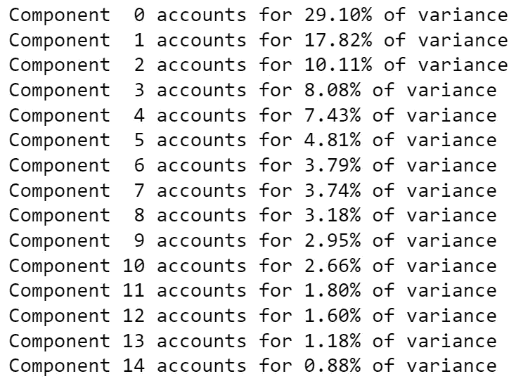

# Python 中基于主成分分析和 t-SNE 的降维方法

> 原文：<https://towardsdatascience.com/dimensionality-reduction-with-pca-and-t-sne-in-python-c80c680221d>

## 数据科学学会研讨会 18:什么是降维、PCA 实现、t-SNE 实现


阿什利·朱利斯在 [Unsplash](https://unsplash.com?utm_source=medium&utm_medium=referral) 上拍摄的照片

今年，作为 UCL 数据科学协会的科学负责人，该协会将在整个学年举办一系列 18 场研讨会，主题包括数据科学家工具包 Python 简介和机器学习方法。每个人的目标是创建一系列的小博客文章，这些文章将概述主要观点，并为任何希望跟进的人提供完整研讨会的链接。所有这些都可以在我们的 [GitHub](https://github.com/UCL-DSS) 资源库中找到，并将在全年更新新的研讨会和挑战。

本系列的第十八个研讨会是 Python 数据科学研讨会系列的一部分，涵盖了降维方法。在本次研讨会中，我们将讨论什么是降维以及主成分分析和 t 分布随机邻居嵌入方法的实施。和往常一样，这篇博文是整个研讨会的总结，可以在这里找到[这里](https://github.com/UCL-DSS/Dimensionality_reduction)还包括使用随机森林分类的数据准备和特征提取。

如果你错过了我们最近三次研讨会中的任何一次，你可以在这里找到这些

[](/a-practical-introduction-to-hierarchical-clustering-from-scikit-learn-ffaf8ee2670c) [## scikit-learn 中的分层聚类实用介绍

### UCL 数据科学学会研讨会 17:什么是层次聚类、实现、解释和评估

towardsdatascience.com](/a-practical-introduction-to-hierarchical-clustering-from-scikit-learn-ffaf8ee2670c) [](/a-practical-introduction-to-kmeans-clustering-using-scikit-learn-fd9cff95144b) [## 使用 scikit-learn 进行 Kmeans 聚类的实用介绍

### UCL 数据科学学会研讨会 16:什么是 Kmeans 集群、实现、评估和解释

towardsdatascience.com](/a-practical-introduction-to-kmeans-clustering-using-scikit-learn-fd9cff95144b) [](/a-practical-introduction-to-support-vector-machines-from-scikit-learn-6e678cf1f228) [## 来自 scikit-learn 的支持向量机实用介绍

### UCL 数据科学学会研讨会 15:什么是支持向量机，如何实现它们，以及如何评估它们

towardsdatascience.com](/a-practical-introduction-to-support-vector-machines-from-scikit-learn-6e678cf1f228) 

## 什么是降维？

降维(在大多数情况下)属于无监督的机器学习算法，这意味着我们没有特定的目标。该方法的主要目的是减少数据集中的要素数量，从而减少模型所需的资源，或者在执行任何分析之前帮助可视化数据。这是通过减少数据集中属性或变量的数量，同时尽可能多地保留原始数据集中的变化来实现的。这是一个预处理步骤，意味着它主要在我们创建或训练任何模型之前执行，将它与通常在初始建模之后完成的特征提取分开。

有许多算法可用于降维，但它们主要来自两组主要的线性代数和流形学习:

**线性代数**

这是从矩阵分解方法中得出的，矩阵分解方法可以通过检查我们可能使用的变量之间的线性关系来进行降维。这一分支中的常用方法包括:

*   主成分分析
*   奇异值分解
*   非负矩阵分解
*   要素分析
*   线性判别分析

**流形学习**

这与线性代数方法的不同之处在于，它使用非线性方法来降维，因此与线性代数方法相比，它通常可以捕获变量之间更复杂的关系。这一分支中一些流行的方法包括:

*   Isomap 嵌入
*   局部线性嵌入
*   多维标度
*   光谱嵌入
*   t 分布随机邻居嵌入

**特征提取**

这组方法可以松散地归入降维的范畴，因为尽管上述方法从现有变量中创建新的变量组合，但特征提取只是移除特征。我们已经从[随机森林](https://python.plainenglish.io/a-practical-introduction-to-random-forest-classifiers-from-scikit-learn-536e305d8d87)中看到了这一点，但是在这方面流行的方法包括:

*   反向消除
*   预选
*   随机森林

降维体系下的每种算法都提供了不同的方法来应对降维的挑战。这通常意味着不存在适用于所有情况的最佳降维方法。这也意味着，如果不使用受控实验和广泛探索，就没有简单的方法来为您的数据找到最佳算法。在这种程度上，我们将包括在 NBA 数据集上实现 PCA 和 t-SNE，目的是可视化关于球员位置的二维数据。

## 主成分分析

PCA 只是降维的线性代数方法之一。这有助于我们从现有的大量变量中提取一组新的变量，这些新变量采用主成分的形式。这样做的目的是用最少的主成分获取尽可能多的信息。在最小化信息损失的同时获得的变量越少，在计算资源和时间方面有助于模型训练，并且有助于可视化。

其中，主成分是变量的线性组合，其组织方式是第一主成分解释数据集中的最大方差。然后，第二个主成分试图解释数据集中与第一个主成分不相关的剩余方差，以此类推。

为了实现 PCA 算法，我们需要归一化数据，因为否则它将导致对具有大方差的变量的大量关注，这是不期望的。这意味着我们不应该将 PCA 应用于分类变量，因为尽管我们可以将它们转化为数值变量，但它们只会取 0 和 1 的值，这自然会有很高的方差。

为此，在实现模型之前，我们将使用来自`scikit-learn`库的`StandardScaler`来缩放数据:

```
#import the standard scaler
from sklearn.preprocessing import StandardScaler#initialise the standard scaler
sc = StandardScaler()#create a copy of the original dataset
X_rs = X.copy()#fit transform all of our data
for c in X_rs.columns:
    X_rs[c] = sc.fit_transform(X_rs[c].values.reshape(-1,1))
```

然后，我们可以对标准化数据实施模型，如下所示:

```
#import the PCA algorithm from sklearn
from sklearn.decomposition import PCA#run it with 15 components
pca = PCA(n_components=15, whiten=True)#fit it to our data
pca.fit(X_rs)#extract the explained variance
explained_variance = pca.explained_variance_ratio_
singular_values = pca.singular_values_
```

既然我们已经使 PCA 适合我们的数据，我们实际上需要评估它产生的成分。我们可以通过解释方差比来做到这一点，方差比可用于查看主成分的有用程度，从而选择要在模型中使用的主成分。我们可以把这想象成:

```
#create an x for each component
x = np.arange(1,len(explained_variance)+1)#plot the results
plt.plot(x, explained_variance)#add a y label
plt.ylabel('Share of Variance Explained')
plt.title("PCA explained variance plot")
plt.xlabel("Components")#show the resuling plot
plt.show()
```


```
#iterate over the components
#to print the explained variance
for i in range(0, 15):
    print(f"Component {i:>2} accounts for {explained_variance[i]*100:>2.2f}% of variance")
```



如果我们要在模型中使用这些数据，那么我们需要决定在模型中使用多少组件来平衡计算资源和模型性能之间的平衡。为此，我们可以使用几种方法来选择主成分的最佳数量:

*   检查解释的方差图中的拐点，在我们的例子中，它出现在 4- 6 个主要成分周围
*   保留占数据集中方差 1%以上的分量，在我们的例子中是在 14 个分量之后
*   在模型中保留总计占解释方差 80%的变量，在我们的例子中是前 7 个组成部分。

这可能取决于主成分分析的目的和您正在实施的模型。在我们的例子中，我们想尝试在二维空间中可视化数据，以及这与我们的目标变量的关系。因此，我们可以这样实现:

```
#set the components to 2
pca = PCA(n_components=2, whiten=True) 
#fit the model to our data and extract the results
X_pca = pca.fit_transform(X_rs)#create a dataframe from the dataset
df = pd.DataFrame(data = X_pca,
                 columns = ["Component 1", 
                            "Component 2"])#merge this with the NBA data
NBA = pd.merge(NBA,
              df,
              left_index=True,
              right_index=True,
              how = "inner")#plot the resulting data from two dimensions
g = sns.jointplot(data = NBA,
                 x = "Component 1",
                 y = "Component 2",
                 hue = "Pos")
```


作者图片

从这个图中我们可以看到，将数据减少到两个分量并不一定表明玩家的位置和他们的统计数据之间的明确关系。我们可以从中得出的结论是，中锋的位置可能与其他位置不同，有几个位置与大前锋的位置相融合。而与此同时，控卫、得分后卫和小前锋之间存在着相当大的混合，这在某种程度上是可以预料的。

当然，您是否希望这是两个或更多的主成分(14 个成分的方差大于 1%)将取决于您最终想要对数据做什么。在早期的[随机森林分类器研讨会](https://python.plainenglish.io/a-practical-introduction-to-random-forest-classifiers-from-scikit-learn-536e305d8d87)的情况下，我们可能希望在模型中使用 14 个组件，而不是我们最初开始时的 23 个，因为其余的可能是噪声，只会增加模型的复杂性。

## t-SNE

t-SNE 是另一种降维算法，但与 PCA 不同，它能够解释非线性关系。在这个意义上，数据点可以通过两种主要方式映射到较低的维度:

*   局部方法:将较高维度上的邻近点映射到较低维度上的邻近点
*   全局方法:试图在所有比例下保持几何形状，使附近的点靠得很近，同时使远处的点彼此远离

t-SNE 是为数不多的能够通过计算点在高维度和低维度空间的概率相似性在低维度数据中保留两种结构的降维算法之一。

t-SNE 的输出通常被称为用数据创建的维度，其中固有特征在数据中不再可识别。这意味着我们不能仅基于 t-SNE 的输出做出任何直接的推断，将其限制于主要的数据探索和可视化，尽管输出也可以用于分类和聚类(尽管不能用于测试和训练数据集)。

实施 t-SNE 算法时，我们需要注意几个关键参数:

*   `n_components`:从数据中创建的尺寸
*   `perplexity`:与其他流形学习算法中使用的最近邻数相关，用于确定要保留的模型中全局和局部关系的权衡。虽然注意到 t-SNE 通常对此参数不太敏感，但它应该小于建议的最佳范围在 5 到 50 之间的点数
*   `learning_rate`:学习率通常是模型行为的关键参数，因此在这方面探索参数空间是值得的，但它通常在 100 到 1000 之间。

scikit-learn 文档建议，由于算法的复杂性，如果数据集中的特征数量超过 50，则在 t-SNE 之前使用 PCA 或截断 SVD。然而，在我们的例子中，这不应该是一个问题，所以我们可以在我们已经有的数据上实现这个模型。因为我们的目标主要是观想，那么我们可以将维度的数量设置为两个，以便能够在 2D 观想图上绘制如下:

```
#import the method
from sklearn.manifold import TSNE#set the hyperparmateres
keep_dims = 2
lrn_rate = 700
prp = 40#extract the data as a cop
tsnedf = X_rs.copy()#creae the model
tsne = TSNE(n_components = keep_dims, 
            perplexity = prp, 
            random_state = 42,
            n_iter = 5000,
            n_jobs = -1)#apply it to the data
X_dimensions = tsne.fit_transform(tsnedf)
#check the shape
X_dimensions.shape#out:
(530, 2)
```

我们可以把它想象成:

```
#create a dataframe from the dataset
tsnedf_res = pd.DataFrame(data = X_dimensions,
                         columns = ["Dimension 1", 
                                "Dimension 2"])#merge this with the NBA data
NBA = pd.merge(NBA,
              tsnedf_res,
              left_index=True,
              right_index=True,
              how = "inner")#plot the result
g = sns.jointplot(data = NBA,
                 x = "Dimension 1",
                 y = "Dimension 2",
                 hue = "Pos")
```


作者图片

我们在这里可以看到，在某种程度上，我们比之前使用 PCA 得到了更清晰的不同位置的图像。我们现在可以看到，中锋的位置显得更加明显，得分后卫的分布非常广泛，而控卫则倾向于集中在一起，小前锋和大前锋也一起出现。

这使得它稍微清晰一些，并表明变量之间的关系可能确实是非线性的，因此 t-SNE 可能在这个数据集上更好。当然，在思考这个问题时，你必须注意你想用维度或主要成分做什么。

如果您想了解我们协会的更多信息，请随时关注我们的社交网站:

https://www.facebook.com/ucldata

insta gram:[https://www.instagram.com/ucl.datasci/](https://www.instagram.com/ucl.datasci/)

领英:[https://www.linkedin.com/company/ucldata/](https://www.linkedin.com/company/ucldata/)

如果你想了解 UCL 数据科学协会和其他优秀作者的最新信息，请使用我下面的推荐代码注册 medium。

[](https://philip-wilkinson.medium.com/membership) [## 通过我的推荐链接加入媒体-菲利普·威尔金森

### 作为一个媒体会员，你的会员费的一部分会给你阅读的作家，你可以完全接触到每一个故事…

philip-wilkinson.medium.com](https://philip-wilkinson.medium.com/membership) 

或者查看我在 Medium 上的其他文章

[](/introduction-to-hierarchical-clustering-part-1-theory-linkage-and-affinity-e3b6a4817702) [## 层次聚类简介(第 1 部分——理论、联系和相似性)

### 什么是层次聚类、亲和度和关联度

towardsdatascience.com](/introduction-to-hierarchical-clustering-part-1-theory-linkage-and-affinity-e3b6a4817702) [](/maximum-likelihood-estimation-and-poisson-regression-in-the-gravity-model-5f0de29e3464) [## 重力模型中的最大似然估计和泊松回归

### 通过引力模型介绍它们之间的关系

towardsdatascience.com](/maximum-likelihood-estimation-and-poisson-regression-in-the-gravity-model-5f0de29e3464) [](/an-introduction-to-object-oriented-programming-for-data-scientists-879106d90d89) [## 面向数据科学家的面向对象编程介绍

### 面向对象的基础知识，适合那些以前可能没有接触过这个概念或者想知道更多的人

towardsdatascience.com](/an-introduction-to-object-oriented-programming-for-data-scientists-879106d90d89)