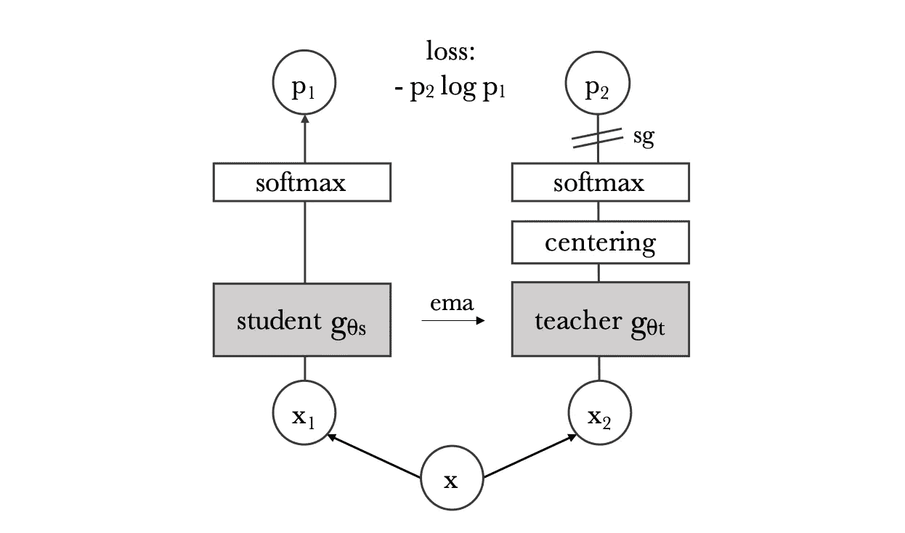
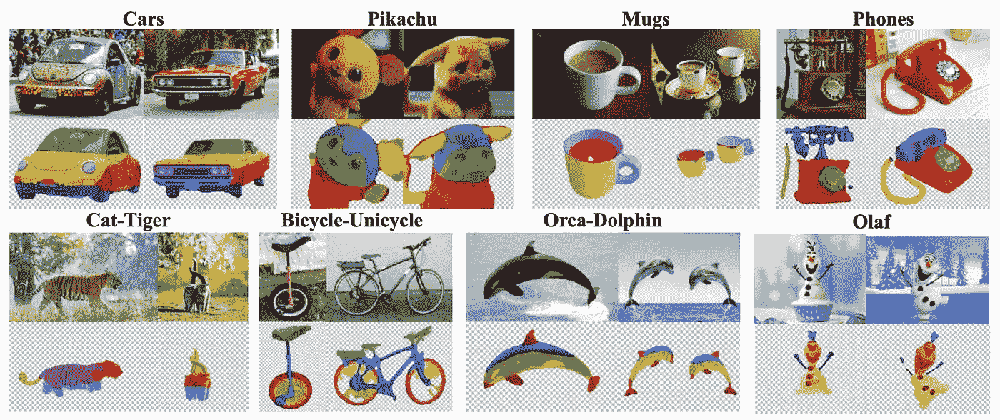

# DINO-ViT —超越自我监督的分类

> 原文：<https://towardsdatascience.com/dino-vit-beyond-self-supervised-classifications-3f5d43178216>

## 在没有监督的情况下提取精细的特征

图一。自我监督学习是实现真正人工智能的重要一步。从 Unsplash 检索的图像。

以前，我写过几篇文章简要讨论自我监督学习，特别是[对比学习](/contrastive-learning-in-3-minutes-89d9a7db5a28)。然而，还没有包括的是一个并行的自我监督方法的分支，它使用了最近出现并表现出色的多个网络的交互作用。迄今为止，最先进的培训方法之一是一种主要的知识提取方法，名为 DINO，应用于视觉变形金刚(DINO-ViT)。然而，这种架构最令人惊讶的元素不再是其强大的分类知识，而是其密集的功能，这些功能实际上能够执行更细粒度的任务，如部分分割，甚至跨多个对象的对应。

在本文中，我们将回顾 DINO-ViT 是如何被训练的，然后是一个简短的教程，介绍如何利用现有的库进行零件共分割和寻找对应关系。

# 迪诺维特是什么？

恐龙这个词来自于没有监督的自我升华。顾名思义，DINO-ViT 利用传统知识提炼方法的变体，将其应用于强大的[视觉转换器(ViT)](/vision-transformers-in-pytorch-43d13cb7ec7a) 架构。这个想法多少受到了技术 [*引导你自己的潜能(BYOL)*](https://arxiv.org/abs/2006.07733) 的启发，我们将在接下来的文章中更全面地介绍这个技术。

## 知识提炼是如何工作的？

图二。恐龙训练方法概述。从[https://arxiv.org/abs/2104.14294](https://arxiv.org/abs/2104.14294)检索的图像。

简单地说，知识提炼的目标是允许学生网络 Ps 向教师网络 Pt 学习。从计算机视觉的角度来看，目标可以转化为更新学生网络，以最小化给定图像 x:

## *自我监督的知识蒸馏*

下面描述了蒸馏法是如何扩展到恐龙训练的:

给定特定的图像 x，我们现在将该图像裁剪成两个全局视图和多个局部视图。所有作物(全局和本地)都被输入到学生网络中，但只有全局视图被输入到教师网络中。然后，我们按照知识提取方法最小化交叉熵。为了实现这一目标，训练学习在图像内创建局部和全局对应，从而鼓励学生网络学习适当的图像特征。

## **从学生那里得到老师**

与知识提炼的原始问题设置不同，其中教师网络的权重是先验给定的，DINO 没有经过预训练的教师。因此，教师网络实际上是通过移动平均方法从以前的学生中检索的。执行额外的居中以避免两个模型塌陷。

# 分类、细分等等

图二。从 https://arxiv.org/abs/2104.14294[取回的迪诺-维特图像注意图](https://arxiv.org/abs/2104.14294)。

分类一直是所有自我监督方法的标准基准，DINO-ViT 无疑是领先的得分者之一。然而，DINO-ViT 的迷人之处在于其通过自蒸馏获得的精细致密特性。图 2 说明了在没有任何监督的情况下，迪诺-维特的注意力是如何令人惊讶地集中在物体的前景上的。这意味着高分类精度实际上仅仅是能做更多事情的表示的结果。

## 下一步是什么？

图 3。使用 DINO-ViT 特征的零件共同分割结果。图片来自 https://arxiv.org/abs/2112.05814。

在 DINO-ViT 之后是一篇名为 [*的论文，深度 ViT 特征作为密集的视觉描述符*](https://arxiv.org/abs/2112.05814) 。Amir 等人在这项工作中描述了 DINO-ViT 的密集分片特征，以及额外的聚类和简单的无监督方法，可以执行非常具有挑战性的任务，例如部分共分割和对应查找(如图 3 所示)。事实上，这些特征如此强大，以至于它可以在不同类别的图像中找到对应关系。

## **使用密集特征**

Amir 等人在他们的项目页面上为有兴趣的个人发布了现成的 Google Colab 笔记本。您也可以按照 GitHub 的说明安装软件包，并批量运行这些方法。

该代码的链接可在此处找到:

 [## GitHub-shira mir/dino-vit-Features:论文“深度 ViT 特性作为…

### 论文《深度 ViT 特征作为密集视觉描述符》正式实施。我们证明了有效性…

github.com](https://github.com/ShirAmir/dino-vit-features) 

# 结束注释

创造真正的人工智能的漫长旅程似乎是无穷无尽的，但自我监督学习无疑是朝着它迈出的一大步。迪诺-维特展示了对网络如何学习的见解，这些学习特征背后的巨大潜力确实将成为计算机视觉领域的重要垫脚石。

*感谢您坚持到现在*🙏*！* *我定期写关于计算机视觉/深度学习的不同领域，所以* [*加入并订阅*](https://taying-cheng.medium.com/membership) *如果你有兴趣了解更多！*