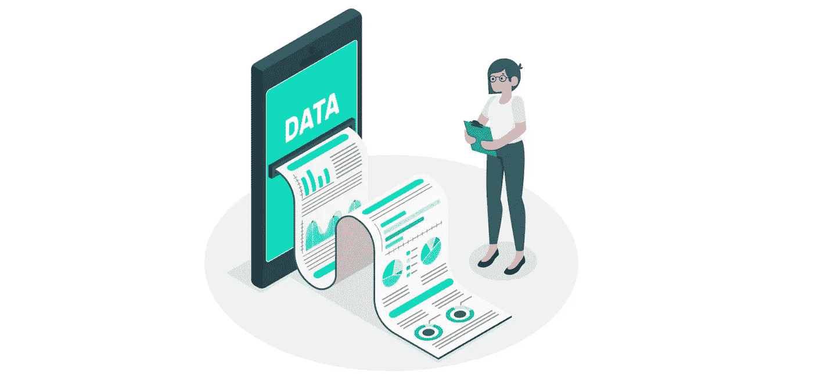

# 发现强大的数据:NLP 的金矿

> 原文：<https://towardsdatascience.com/discovering-powerful-data-the-guardian-news-api-into-python-for-nlp-1829b568fb0f>

## 使用免费的卫报新闻应用编程接口解锁过多的标记数据



由 www.freepik.com 弗里皮克设计

想想看，寻找带标签的数据令人头痛，任何曾经解决过 NLP 问题的人都知道这一点。但是哪个行业需要大量的写作，然后在他们的网站上贴上漂亮的标签呢？没错；新闻文章。所以让我们利用这一点。《卫报》(新闻机构)有一个非常强大的免费 API——每天有 5000 个电话和近 200 万条内容。他们所有的内容都有自己的标签:环境、金钱、环境/能源等。有人已经为我们做了所有的艰苦工作。

请求访问 API，您就有了 NLP 的大量数据。这些标签是完美的标签。这使得它非常适合 NLP 分类训练。它可能不仅仅是为了 NLP，而是任何种类的分析，比如:容量分析，一袋单词分析等等。

首先，在这里请求访问:[https://openplatform.theguardian.com/access/](https://open-platform.theguardian.com/access/)

在本文中，我们将介绍:

*1)将数据拉入 Python*

*2)在一个函数中拉入 200 多个结果*

*3)拉入多个标签*

*4)端到端代码。*

*5)数据的潜在用途*

鉴于能源危机，我们将探索寻找与能源有关的新闻文章的用例。即能源行业标签。

> 如果您在获取自己的数据时遇到困难，那么整篇文章中有功能完整的代码片段，只要您用自己的 API 键替换“您的 API 键”就可以了。

# 将数据拉入 Python

在拉入数据之前，请确保从[https://open-platform.theguardian.com/access/](https://open-platform.theguardian.com/access/)注册并获取您的 API 密钥。

正如在文档中看到的，它有我们可以用于请求包的典型 API 调用方法，在我们的例子中，我们使用 GET 方法并将变量放入 URL 的字符串中。由于我们专注于标签/标注，以利用《卫报》对每篇文章进行人工标注的工作，我们的示例将是*按标签查询。*但是，也可以通过搜索关键字进行查询。

因为我们将通过标记进行查询，所以我们需要首先找出存在哪些标记，根据 API，我们可以使用 get 方法以 JSON 文件的形式获得一个标记列表。请记住,《卫报》有数百个标签，所以最好通过搜索您想要的标签来筛选。

下面我们搜索与 ***能量有关的标签。***

> 注意:用您的 API 密钥替换您的 API 密钥

```
tag_json = requests.get(‘https://content.guardianapis.com/tags?q=energy&page-size=200&api-key=YOUR API KEY).json()
```

返回的是一个 JSON，其中包含所有带有关键字 energy 的标签。所以我只是从列表中选了一些我感兴趣的放入一个列表中。下面是我挑的几个。

```
tag_list = ['environment/energy', 'money/energy', 'technology/energy', 'science/energy', 'environment/energy-storage',
           'business/energy-industry', 'environment/energy-monitoring', 'environment/renewableenergy',
           'sustainable-business/hubs-energy-efficiency']
```

让我们看看列表中的第一个标签，我将查询文章数据中的特定标签“环境/能源”。我把最大页面大小设置为 200，这似乎是每次调用所能达到的最大值。

*注意:API 调用中的 Page 表示页码，例如，如果我在一个页面上放置 200，放置 1 作为页码将提取第一个 200，放置 2 将提取第二个 200*

问题是，您一次只能查询大约 200 个，所以让我们讨论一下如何绕过它。

# 在一个函数中拉入超过 200 行(限制)

为此，我们可以简单地编写能够处理 for 循环的函数。幸运的是，我们知道有多少结果，所以我们可以计划我们需要多少数据。如果我们每页有 200 行，那么我们可以写一个 If 语句和 for 循环来说，如果有超过 200 行要获取，那么做一个 for 循环来获取每页。

我们可以创建 3 个函数:

> 1)查询一个响应
> 
> 2)检查存在多少数据并调用更多页面。将所有内容放在一个列表中
> 
> 3)将 json 响应列表转换为数据帧

有了这三个功能，您现在可以根据自己的需要调用任意多的文章，只要每天调用次数不超过 5，000 次，即 1，000，000 篇文章！

# 拉入多个标签

最后一个功能是如果我们想拉进多个标签。之前我创建了一个我感兴趣的标签列表。谜题的最后一部分是在这些标签上运行 for 循环。

# 端到端代码

> 如果你愿意的话，下面是可以复制粘贴的端到端代码:

不要忘记更改您的 API 密钥。

样本输出:


# 潜在的未来用途

## Tableau 仪表板监控新闻

为了掌握能源行业的最新消息，我创建了一个 Tableau 仪表板来查看一段时间内的新闻量，如果我点击一个条形，下面会输出一个文章列表。


## NLP 培训(使用 Google AutoML)

我之前说过，这是使用这种标记来训练 NLP 模型的完美数据。您可以获得带有特定标签的数据集，并使用它们来训练您的模型。我推荐使用 Google AutoML，你可以在这里找到[的教程](https://medium.com/voice-tech-podcast/auto-text-classification-using-googles-automl-80f151ffa176)。或者，继续使用 Python 和 Scikit learn。

我希望这有所帮助——愉快的数据提取。

> 如果你喜欢这篇文章，请留下掌声和关注支持！

或者，如果您有兴趣加入 Medium 社区，这里有一个推荐链接:

<https://medium.com/@adrian.causby15/membership> [## 通过我的推荐链接加入 Medium-Adrian caus by

medium.com](https://medium.com/@adrian.causby15/membership)