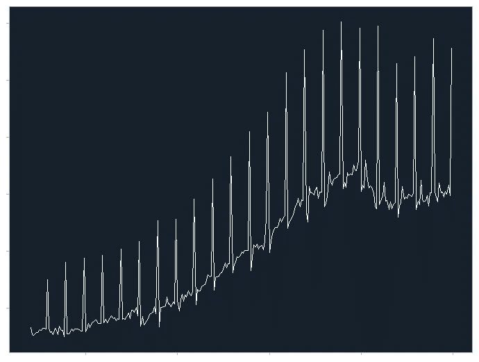
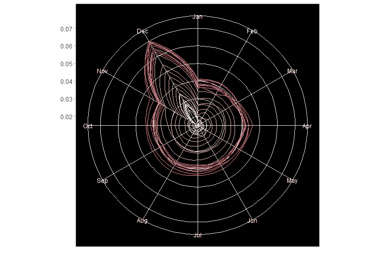
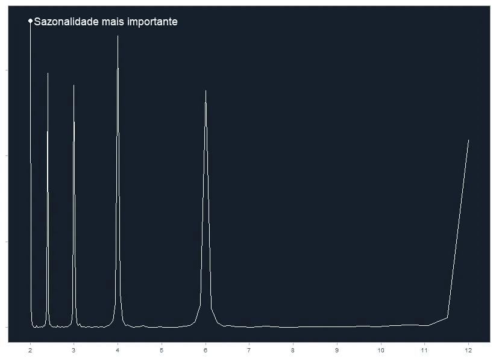
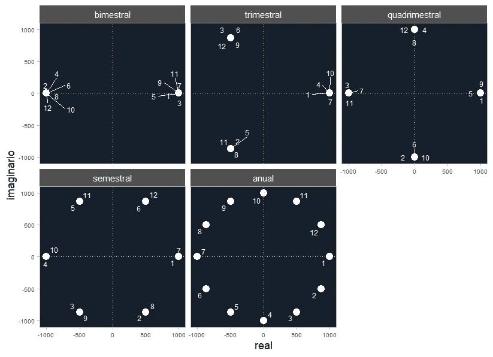
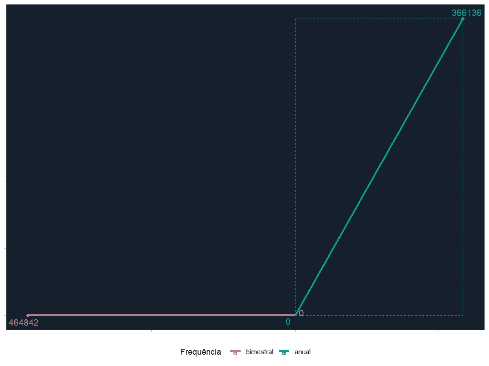

# 时间序列中季节性的发现

> 原文：<https://towardsdatascience.com/discovery-of-seasonality-in-time-series-4b3d6073b5a6>

## 使用 R 的傅立叶变换分析

[摄影](https://unsplash.com/@photoholgic?utm_source=unsplash&utm_medium=referral&utm_content=creditCopyText)在 [Unsplash](https://unsplash.com/s/photos/wave?utm_source=unsplash&utm_medium=referral&utm_content=creditCopyText) 上拍摄的照片

G 政府收支、旅客流量、进出口值都是与经济现象相关的时间序列。就其本质而言，它们受趋势、结构变化和其他因素的影响。当试图寻找这种时间序列的最佳季节性特征时，这些因素会产生错误的结论。在下面的段落中，我们将分析一个案例，这个案例起初可能会带来一些挫折，但最终是时间序列分析中最敏捷的技术之一的一个极好的应用:傅立叶变换。对于这个材料，我使用 R 语言来获取和处理数据，进行调查，并生成图表。该代码的链接位于正文的末尾。这是对那些阅读到底的人的奖励。

看看下面的系列，它描述了用于确定巴西中央政府运营结果的一个要素的 23 年月度行为。请注意，周期指向周期性峰值和这些峰值之间的一些凹痕。还要注意的是，有一个增长的趋势，然后有些稳定。

整个时间序列。作者图片

我们可以看看第一个赌注，最关键的季节性是由周期性峰值确定的年度季节性，从整个时间序列中每 12 个月出现的图表中可以合理地相信这一点。但是，另一方面，一个更谨慎的方法可能会让我们认为凹痕也是季节性发生的，从而标志着另一个周期性。
见下面循环视图中分布的数值。

循环图。图片由作者提供。

可以看出，高峰期出现在 12 月。其他月份没有显示出明显的缩减，这使我们加强了年度季节性的假设。这里还值得注意的是，颜色渐变表示一系列年份:越接近粉红色，年份越近。这种与较高值相关联的更接近粉红色的颜色配置证实了本文开头已经指出的增长趋势。

尽管该图给人的印象是季节性是每年一次的，但寻找更强大的分析工具来减少纯视觉分析的不确定性是很方便的。文献推荐使用[傅立叶变换](https://www.youtube.com/watch?v=FjmwwDHT98c&t=40s)来识别周期信号中最关键的频率。遵循从系列中排除趋势的[指导方针](https://www.researchgate.net/publication/309470320_Seasonal_Modelling_of_Fourier_Series_with_Linear_Trend)，我使用 R 语言来识别最基本的频率，然后开始所有的惊喜。见下图。

最关键的季节性。图片由作者提供。

上图改编自傅里叶变换分析的最常见输出。通常，水平轴是频率，垂直轴是与每个频率相关的频谱，表示每个频率的重要性。根据定义，频率是给定周期的反函数( *f=1/T* ，其中 *f* 为频率， *T* 为周期)。对于我们的例子，我们最初对标记季节性的时期更感兴趣，所以我选择在水平轴上显示这个变量。

正如您所看到的，与最高频谱相关联的周期对应于两个时间单位，在本例中是两个月。最关键的季节性是每两个月一次，而不是每年一次。顺便说一句，在上面的同一张图中，当查看相关的光谱时，12 个月被其他几个季节超过了。

但是如何解释这一发现呢？与傅立叶变换相关的算法的详细分解可以帮助我们理解。在接下来的图表和段落中跟随我。

用一组频率表示月份。图片由作者提供。

时间函数的傅立叶变换从原始时间函数中存在的频率和中分解信号。在我们的例子中，我们使用没有趋势的序列来检查 144 个不同频率的贡献。所有这 144 个频率都对实际过程有贡献，但只有极少量是有意义的。由于我们对月度数据的时间序列感兴趣，我们在上图中突出显示并命名了双月、三月、四月、半年和一年的频率。

傅立叶变换产生的值是类型为 *a+bi* 的**复数**，其中 a 是实部，b 是虚部。图形的水平轴对应于实数元素，垂直轴对应于虚数部分。

还要注意，该图试图表示半径为 1000 的圆。半径测量在每个白点处表示的**复数**的所谓*模数*。我们将对该值应用三角函数，以获得实部和虚部。

有了这些初步的解释，我们可以更好地理解图中所示的频率。请看**双月**频率图。我们看到两个点占据水平轴或实轴:一个在零的左边，另一个在右边。左边的点与数字 1、3、5、7、9 和 11 相关，另一个点与 2、4、6、8、10 和 12 相关。每个数字代表一年中的一个月。这样，偶数月与奇数月相对。

奇数月份的点在圆的 0 度角上。对于这种情况，我们知道水平轴上的值是 1000，垂直轴上的值是 0。这样，我们就有了有序对(1000，0)。用复数来说，这个点对应的是 *1000+0i* ，我们用三角函数来计算:

*1000 *余弦(0)+1000 *正弦(0 )i.*

由于余弦(0 )=1，正弦(0 )=0，我们回到 *1000+0i* 。

偶数月份的点在圆上 180 度处。这里横轴上的值是-1000，纵轴上的值是 0。用复数表示法，对应 *-1000+0i* 。使用正弦和余弦:

*1000 *余弦(180)+1000 *正弦(180 )i.*

由于余弦(180 )=-1，正弦(180 )=0，所以我们有: *-1000+0i* 。

现在让我们跳到年度频率。请注意，相等的角度分隔了这些数字。由于 360 度圆上有 12 个点，每个点与另一个点相距 30 度。因此，第 12 个月的点表示一个复数，来自:

*1000 *余弦(30)+1000 *正弦(30)一.*

即: *866，02+500i* 。

一个建议:尝试计算年频率的其他点，并观察每个月的实部和虚部中存在的正值和负值。另一个建议:检查不同的频率和与每个频率相关的点。观察来自组成、分布和月份对冲的模式。

目前，我们将停止在这一审查。我们稍后将需要这个符号来计算向量，这些向量是从分析的序列中计算出的每个点的实数和虚数的组合中产生的。

傅里叶变换在时间序列分解中的应用。图片由作者提供。

上图显示了在实践中，我们如何根据 12 个月和随机选择的 6 年中的每一年的双月或年度频率，用趋势排除法分解时间序列。我在每一年中突出显示了 12 月的假设值。比如第 3 年，这个值是 **41874** 。第 7 年是 **42314** ，以此类推。这些值是复数的模。请注意，第 12 个月通常远离其他月份。尤其是在**年 20** 中，12 月 12 日的模数值比其他月份高得多。记住，我们可以用复数符号来表示这些点:

*双月频率*

*   第 3 年第 12 个月:

41874 *余弦(180)+41874 *正弦(180 ) = -41874+0i

*   第 7 年第 12 个月:

42314 *余弦(180)+42314 *正弦(180 ) = -42314+0i

*年频率*

*   第 3 年第 12 个月:

41874 *余弦(30)+41874 *正弦(30 ) = 36263.95+20937i

*   第 7 年第 12 个月:

42314 *余弦(30)+42314 *正弦(30 ) = 36645+21157i

现在是时候将每年的实部和虚部的值分别相加，然后计算得到的向量，这将允许我们验证哪一个提供更大的频谱、年度频率或双月频率。请看下图所示。

一些合成向量。图片由作者提供。

上图显示了随机选择的六年的合成向量。我们通过将与每个频率的每个月相关联的每个复数相加来计算结果向量。换句话说，对于所分析的两个频率中的每一个，我们将每年的所有实部和虚部相加。这样，我们就有了结果向量的模在水平轴和垂直轴上的投影。投影在图中用虚线表示。带点的整条线表示末端的合成矢量，有助于指示方向。

我们应用勾股定理计算合成向量的模:√(σ实数+σ虚数)。例如，在第 3 年，年频率的值是 9832，双月频率的值是 13002。

注意，随着时间的推移，双月频率的合成向量的模通常比年频率的更重要。此外，请注意，在年频率下，向量的方向与第 12 个月在同一象限，即在 0°和 90°之间。至于双月频率，向量与第 2、4、6、8、10 和 12 个月对齐，即 180 度。

现在我们进入最后一步，计算每个频率的最终合成向量。请看下图。

整个级数的矢量合成。图片由作者提供。

上图显示了考虑 23 年的总合成向量。请注意，双月频率的模数 **464842** 大于年频率的模数 **366136** 。我们确认双月频率在数学上与比年频率更大的频谱相关联。

该图还允许我们从向量的方向显示哪个双月组合占优势。注意，这个方向指向偶数个月。我们得出结论，偶数月份的值之和大于奇数月份的值之和。生成此配置的可能性之一是，每个偶数月的值都比它之前的奇数月的值高。

下图有助于验证这种可能性。

按月累计的值。图片由作者提供。

上图显示了整个时间序列的累积值。奇数月和接下来的偶数月之间有一些细微的区别。唯一的例外是第 12 个月，这比第 11 个月高得多。

有了最后一个数字，就很清楚为什么双月周期比任何其他月份安排的配置更好地代表了本文中分析的时间序列，包括一年一次的安排，这是我们一眼就能看出的。

**数据、代码和联系人**

数据来自巴西国库秘书处的[开放数据门户](https://www.tesourotransparente.gov.br/ckan/dataset/resultado-do-tesouro-nacional)。我准确地使用了“1.3——Arrecada ao líquida para o RGPS”系列。数据集也可以被这个 R 包[消费这里](https://github.com/tchiluanda/rtn)。由于数据源是使用 ODbL 许可证许可的，任何人都可以出于任何目的使用数据。

读者可以从我的 [GitHub](https://github.com/fernandobarbalho/transformadas_fourier) 中访问数据和代码。考虑在推特[上查找我的信息](https://twitter.com/barbalhofernand)以获得进一步的澄清。

**致谢**

感谢[费尔南达·佩肖托·索托](https://www.linkedin.com/in/fernanda-peixoto-souto-91533391/)、[路易斯·菲利佩·科英布拉·科斯塔](https://www.linkedin.com/in/luisfelipecoimbracosta/)和[米莲娜·奥齐耶](https://www.linkedin.com/in/milenaauziervilena/)的建议和反馈。