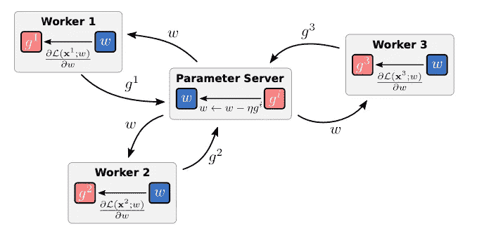
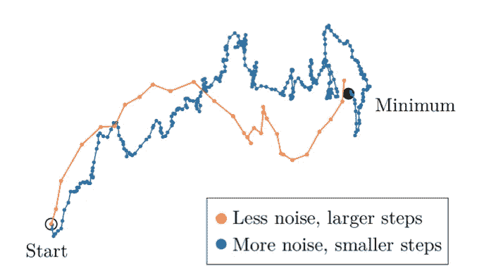

# 分布式学习:入门

> 原文：<https://towardsdatascience.com/distributed-learning-a-primer-790812b817f1>

## 让机器学习模型更大、更好、更快的算法背后

稳定扩散生成的图像

分布式学习是现代科技公司的 ML 堆栈中最关键的组件之一:通过在大量机器上并行化，人们可以更快地在更多数据上训练更大的模型，以更快的迭代周期释放更高质量的生产模型。

但不要只相信我的话。以[推特](https://blog.twitter.com/engineering/en_us/topics/insights/2020/distributed-training-of-sparse-machine-learning-models-1)为例:

> 使用定制的分布式培训[…]使我们能够更快地迭代，并根据更多更新鲜的数据来训练模型。

或者[谷歌的](https://storage.googleapis.com/pub-tools-public-publication-data/pdf/40565.pdf):

> 我们的实验表明，我们新的大规模训练方法可以使用一群机器来训练即使是中等规模的深度网络，速度也比 GPU 快得多，而且没有 GPU 对模型最大大小的限制。

或者[网飞的](https://netflixtechblog.com/distributed-neural-networks-with-gpus-in-the-aws-cloud-ccf71e82056b):

> 我们试图实现一个大规模的神经网络训练系统，该系统利用了 GPU 和 AWS 云的优势。我们希望使用合理数量的机器，通过神经网络方法实现强大的机器学习解决方案。

在这篇文章中，我们将探索分布式学习背后的一些基本设计考虑，特别关注深度神经网络。您将了解到:

*   模型并行与数据并行训练，
*   同步与异步训练，
*   集中式与分散式培训，以及
*   大批量训练。

让我们开始吧。

## 模型并行与数据并行

在深度神经网络的分布式训练中有两种主要的范例，模型并行，其中我们分布模型，以及数据并行，其中我们分布数据。

**模型并行性**意味着每台机器只包含模型的一个分区，例如深度神经网络的某些层(“垂直”分区)，或者来自同一层的某些神经元(“水平”分区)。如果一个模型太大而不能在一台机器上运行，那么模型并行性可能是有用的，但是它需要在机器之间发送大量的张量，这会带来很高的通信开销。在最坏的情况下，一台机器可能会在等待前一台机器完成其部分计算时处于空闲状态。

**数据并行性**意味着每台机器都有一个完整的模型副本，并在本地批量数据上向前和向后传递。根据定义，这种模式的伸缩性更好:我们也可以随时向集群添加更多的机器

*   通过保持全局(集群范围)批处理大小固定，并减少本地(每台机器)批处理大小，或者
*   通过保持本地批量大小不变并增加全局批量大小。

在实践中，模型和数据并行性不是互斥的，而是互补的:没有什么可以阻止我们将模型和数据分布到我们的机器集群上。正如[推特](https://blog.twitter.com/engineering/en_us/topics/insights/2020/distributed-training-of-sparse-machine-learning-models-2)的一篇博客文章所概述的，这种混合方法有其自身的优势。

最后，还有**超参数并行**，每台机器在相同的数据上运行相同的模型，但是具有不同的超参数。在其最基本的形式中，这是令人尴尬的平行。

## 同步与异步训练

在数据并行中，在训练周期的每次迭代中，一批全局数据均匀地分布在集群中的所有机器上。例如，如果我们在一个有 32 台机器的集群上以 1024 的全局批量进行训练，我们将向每台机器发送 32 个本地批量。

为了实现这一点，我们需要一个**参数服务器**，一个存储和跟踪最新模型参数的专用机器。工人将他们本地计算的梯度发送到参数服务器，参数服务器又将更新的模型参数发送回工人。这可以同步或异步完成。

在**同步训练**中，参数服务器等待来自所有工人的所有梯度到达，然后基于在所有工人上聚集的平均梯度更新模型参数。这种方法的优点是平均梯度的噪声更小，因此参数更新的质量更高，使得模型收敛更快。然而，如果一些工人需要更长的时间来计算他们的局部梯度，那么所有其他工人都必须闲置，等待掉队者赶上来。当然，闲置是对计算资源浪费:理想情况下，每台机器都应该随时有事可做。

在**异步训练**中，参数服务器一接收到来自单个工作者的单个梯度就更新模型参数，并将更新的参数立即发送回该工作者。这消除了闲置的问题，但它引入了另一个问题，即陈旧。一旦基于来自单个工作者的梯度更新了模型参数，所有其他工作者现在就使用陈旧的模型参数。工人越多，问题越严重:例如，有 1000 个工人，当最慢的工人完成计算时，它将落后 999 步。

异步数据并行。每个工人将他们的本地梯度发送到参数服务器，并接收模型参数。(图片来源:兰格等人 2020，[链接](https://arxiv.org/abs/2007.03970))

同步数据并行。在发送更新的模型参数之前，参数服务器聚集来自所有工人的梯度。(图片来源:兰格等人 2020，[链接](https://arxiv.org/abs/2007.03970))

因此，一个好的经验法则是，如果节点数量相对较少，则使用异步训练，如果节点数量非常大，则切换到同步训练。例如，来自谷歌的研究人员在 32 个 Nvidia K40 GPUs 上使用异步并行性训练了他们的'[洪水填充网络](https://research.google/pubs/pub45815/)'，这是一种用于大脑图像分割的深度神经网络。然而，为了在一台拥有 2048 个计算节点的超级计算机上训练相同的模型架构，来自[阿贡国家实验室](https://arxiv.org/abs/1905.06236)(包括本文作者)的研究人员改用了同步并行。

在实践中，人们也可以在同步和异步并行之间找到有用的折衷。例如，来自微软[的研究人员提出了一个对同步并行的“残酷”修改:简单地留下最慢的工人。他们报告说，这种修改将训练速度提高了 20%，而对最终模型的准确性没有影响。](https://www.usenix.org/system/files/conference/osdi14/osdi14-paper-chilimbi.pdf)

## 集中式与分散式培训

拥有中央参数服务器的缺点是，对该服务器的通信需求随着集群的大小而线性增长。这就产生了一个瓶颈，限制了这种集中式设计的规模。

为了避免这个瓶颈，我们可以引入多个参数服务器，并为每个参数服务器分配模型参数的子集。在最分散的情况下，每个计算节点既是一个工作者(计算梯度)，也是一个参数服务器(存储模型参数的子集)。这种去中心化设计的优点是，所有机器的工作负载和通信需求都是相同的，这消除了任何瓶颈，并使其更容易扩展。

## 大批量训练

在数据并行中，全局批处理大小随着集群大小线性增长。在实践中，这种缩放行为支持具有极大批量的训练模型，这在单台机器上是不可能的，因为它的内存有限。

大批量训练中最关键的问题之一是如何根据聚类大小调整学习速率。例如，如果模型训练在单个单机上运行良好，批量大小为 32，学习率为 0.01，那么当再添加 7 台机器，导致全局批量大小为 256 时，正确的学习率是多少？

在 2017 年的一篇论文中，来自[脸书](https://arxiv.org/abs/1706.02677)的研究人员提出了**线性缩放规则**:简单地将学习率与批量大小线性缩放(即，在上面的例子中使用 0.08)。使用具有 256 台机器和 8192(每台机器 32)的全局批量大小的 GPU 集群，作者仅用 60 分钟就在 ImageNet 数据集上训练了一个深度神经网络，这在论文发表时是一个了不起的成就，也是大批量训练的力量的展示。

大批量训练图解。批量越大，梯度噪音越小，步长越大，收敛越快。(图片来源:McCandlish et al 2018，[链接](https://arxiv.org/pdf/1812.06162.pdf))

然而，大批量训练有其局限性。正如我们已经看到的，为了利用更大的批量，我们需要提高学习率，以便利用额外的信息。但是如果学习率太大，在某一点上模型可能会超调并且不能收敛。

来自 [OpenAI](https://arxiv.org/abs/1812.06162) 的一篇 2018 年论文解释说，大批量训练的限制似乎取决于领域，从 ImageNet 的数万批次到学习玩游戏 Dota 2 的数百万批次强化学习代理。找到这些极限的理论解释是一个尚未解决的研究问题。毕竟，ML 研究很大程度上是经验性的，缺乏理论支柱。

## 结论

概括一下，

*   分布式学习是现代科技公司 ML 堆栈中的一个关键组件，能够更快地在更多数据上训练更大的模型。
*   在数据并行中，我们分发数据，在模型并行中，我们分发模型。在实践中，两者可以结合使用。
*   在同步数据并行中，参数服务器等待所有工人发送他们的梯度，而在异步数据并行中则不会。同步数据并行实现了更精确的梯度，代价是引入了一些空闲时间，而最快的工人必须等待最慢的工人。
*   在完全去中心化的数据并行中，每个工作者也是模型参数子集的参数服务器。去中心化设计均衡了所有机器的计算和通信需求，因此消除了任何瓶颈。
*   数据并行支持大批量训练:我们可以在大规模集群上快速训练模型，方法是将学习速率与全局批量成线性比例。

而这只是冰山一角。分布式学习仍然是一个活跃的研究领域，有一些开放性的问题，如:大批量训练的局限性是什么？如何优化具有多个培训工作的真实集群，从而产生竞争负载？如何最好地处理包含混合计算资源(如 CPU 和 GPU)的集群？当搜索许多可能的模型或超参数时，我们如何平衡探索和利用？

欢迎来到分布式学习的迷人世界。

*📫* [*订阅*](/subscribe/@samuel.flender) *把我的下一篇文章直接发到你的收件箱。
💪* [*成为中等会员*](/@samuel.flender/membership) *并解锁无限权限。
🐦关注我上* [*中*](/@samuel.flender) *、*[*LinkedIn*](https://www.linkedin.com/in/sflender/)*、*[*Twitter*](https://twitter.com/samflender)*。*