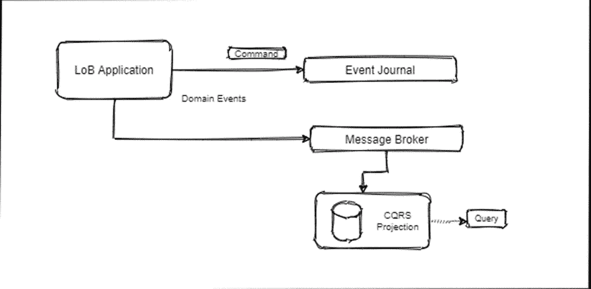

# 分布式事务的设计模式

> 原文：<https://towardsdatascience.com/distributed-transactions-cdc-event-sourcing-outbox-cqrs-patterns-ee0cf70339b1>

## 了解事件来源、命令查询责任分离(CQRS)、变更数据捕获(CDC)和发件箱模式

最终演变为微服务架构的领域驱动的分布式应用架构具有许多优势，如交付服务的速度和敏捷性、小型和专注的团队、可扩展的设计、较小的代码库、容错和数据隔离。在适应微服务架构方面存在各种挑战，架构师和开发人员通常会遇到设计复杂性、数据完整性问题、治理和版本问题。

幸运的是，有架构驱动的解决方案和设计模式可以克服这些挑战。在这篇文章中，我们将主要关注解决*数据一致性挑战*，这是由于整个数据架构中的分布式事务。

由 [Shubham Dhage](https://unsplash.com/@theshubhamdhage?utm_source=medium&utm_medium=referral) 在 [Unsplash](https://unsplash.com?utm_source=medium&utm_medium=referral) 上拍摄

在本帖中，我们将简要介绍以下内容:

*   活动采购
*   变更数据捕获(CDC)
*   命令查询响应分离
*   发件箱模式

 [## Pankaj Jainani -云架构师

### 我是云解决方案架构师、人工智能工程师、DevOps 顾问、Scrum Master、技术经理……

linkedin.com](https://linkedin.com/in/p-jainani) 

在我们分别讨论每个问题之前，让我们先描述两个重要的概念:

*   *领域事件*:它们是参与者与应用程序交互产生的业务事件。它们代表真实世界的事件，如*loan approval、FraudDetected、ChartUpdated 或 OrderCancelled。*领域事件与事件源相关联。
*   *变更事件:*随着底层数据库中数据状态的变化而产生。这些是数据库事务日志，与变更数据捕获相关联。

## 活动采购

由业务逻辑生成的应用程序状态的变化被捕获为软件日志中的域事件。该日志允许遍历到时间线中任意点的应用程序的特定状态。日志是一个*只追加*存储，并且是不可变的。它们可以在任何时间点重复播放，并且是真实的单一来源。日志中的域事件按 ID 分组，以捕捉对象在任一时间点的状态。*快照*是一种重新创建对象状态的机制。

**事件来源**[图片由作者提供]

## 变更数据捕获(CDC)

如上所述，来自数据库事务日志的*变更事件*被下游消费者捕获和消费。因此，它是一种机制，通过这种机制，我们可以通过一些集成模式将应用程序状态共享给外部系统。

物化视图是 CDC 方法的关键概念，有一个外部过程将变更事件物化并转发给下游消费者。

有一个消息代理，它处理事件消息并将其转发给下游的消费者，并保证*至少一次*交付。

**改变数据捕捉(CDC)** 【图片由作者提供】

## **发件箱模式**

发件箱模式确保应用程序状态(存储在应用程序数据库中)及其各自的域事件(转发给外部使用者)在单个事务下是一致的和持久的。发件箱表在应用程序的数据库中实现，以收集与事务对应的域事件。一旦我们有了事务保证机制，我们就可以使用发件箱表通过 CDC 传播事件交付，如上所述，与 CDC 连接器集成的代理将消息转发给外部消费者。

发件箱的重要之处在于，它只是一个临时的传出事件数据存储库，域事件在下游处理后会立即被删除。

**发件箱图案**【图片由作者提供】

## 命令查询责任分离(CQRS)

它通常与事件源相关联，有时用发件箱模式实现。作为视图*的只读数据投影*是 CQRS 实现的关键概念。对于不同的消费者，从相同的数据集可以得到多个这样的预测。这构成了分离*查询*部分 w.r.t. CQRS 实现的基础。

或者，CQRS 的*命令*方面适用于应用程序执行的动作，以生成作为域事件的响应。这使得能够生成投影的状态。因此，这与它与事件源的联系密切相关。

我们必须注意，将*命令*与*查询*分离会导致两个数据模型的最终一致性。CQRS 模式的实现比带有发件箱的 CDC 更复杂。

**命令查询责任分离(CQRS)** 【图片由作者提供】

## 结论

本文简要介绍了分布式事务架构实现的各种设计模式。有各种全面的文献和文档解释了实现这些模式的细节、某些注意事项、优点和缺点。实际的实现也因用例而异，并且依赖于对实现技术的选择。

在后续的文章中，我们将通过解决一个业务用例，同时利用云原生平台服务，详细阐述每个模式的实现。

 [## Pankaj Jainani -云架构师

### 我是云解决方案架构师、人工智能工程师、DevOps 顾问、Scrum Master、技术经理……

linkedin.com](https://linkedin.com/in/p-jainani)