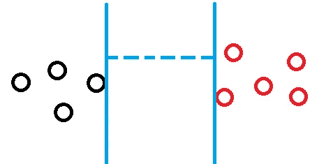
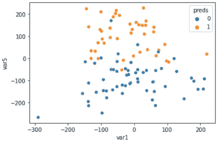

# 深入研究 C-支持向量分类

> 原文：<https://towardsdatascience.com/diving-into-c-support-vector-classification-221ced32e4b4>

## SVC 算法能为我们做的技巧


[大卫·罗蒂米](https://unsplash.com/@davidrotimi?utm_source=unsplash&utm_medium=referral&utm_content=creditCopyText)在 [Unsplash](https://unsplash.com/s/photos/separate?utm_source=unsplash&utm_medium=referral&utm_content=creditCopyText) 上的照片

# 介绍

最近我一直在研究 Scikit-Learn，并记下了这个神奇的库所提供的工具。在本帖中，我们来了解一下[C-支持向量机](https://scikit-learn.org/stable/modules/generated/sklearn.svm.SVC.html)分类器。

支持向量机(SVM)是一种监督学习算法，可用于分类或回归。它适用于边界的线性和非线性计算，因此对一些问题很有用。

支持向量机可以替代其他好的算法，如决策树、逻辑回归或随机森林，因此它是一个很好的技能补充。

# 支持向量机

支持向量机是一种将数据点分为两类的算法。一旦对所有点都完成了，算法就开始追踪两个类之间的分离边缘处的一些线，目标是最大化它们之间的距离。它找到最大距离的地方就是最佳分隔线所在的地方。



蓝线是两个等级之间的最大距离。图片由作者提供。

对于线性分离的数据集，该算法工作得非常好。但是，如果我们的数据不是线性的呢？怎么还能用？

如果我们查看文档，我们会发现有一个名为`kernel`的超参数。内核是算法用来将点分成不同组并对它们进行分类的逻辑。

> **内核: *{ '线性'，' poly '，' rbf '，' sigmoid '，' precomputed'}或可调用，默认='rbf'***

## 线性的

`linear`内核非常简单。SVM 将创建线条，就像之前显示的图形一样。

```
SVC(kernel='linear')
```

## 多项式

`poly`选项是针对多项式内核的。如果你观察多项式的形状，你会发现随着次数的增加，曲线越来越多，变得越来越不规则。因此，对于模型欠拟合，增加多项式次数可能是一个好主意，使决策边界绕过更多的点。`C`是正则化超参数，`coef0`平衡了模型受高次或低次多项式的影响。

```
SVC(kernel='poly', degree=3, coef0=1, C=5)
```

## 肾血流量（renal blood flow 的缩写）

该内核`rbf`用于高斯**径向**径向**径向**径向**函数。它创建高斯分布来计算哪一个点更适合，以确定如何对这些点进行分类。超参数`gamma`使高斯曲线更窄(高伽玛值，更多偏差)或更宽(低伽玛值，更平滑的边界)。所以，如果我们增加伽玛，我们的决策边界会更加不规则。如果你的模型不合适，试着增加这个数字。如果过拟合，降低伽玛。`C`是正则化数。它的工作方式与 gamma 参数相似。**

```
SVC(kernel='rbf', gamma=4, C=100)
```

## 乙状结肠的

内核`sigmoid`使用类似逻辑回归的逻辑，其中高达 50%的概率属于一个类，超过这个数字，它属于相反的类。你可以使用`gamma`超参数来正则化。

```
SVC(kernel='sigmoid', gamma=2)
```

## 预先计算的

最后，这最后一个内核用于更高级/定制的情况，您可以创建自己的内核来运行模型。

# 编码

使用 sklearn 的 SVC 类创建一个基本的 SVM，并不需要花费太多时间。

```
# Imports
import pandas as pd
import seaborn as sns# Data
from sklearn.datasets import make_classification# sklearn
from sklearn.model_selection import train_test_split
from sklearn.pipeline import Pipeline
from sklearn.preprocessing import StandardScaler
from sklearn.svm import SVC
from sklearn.metrics import confusion_matrix
```

创建数据集并在训练和测试中拆分。

```
# Dataset
X, y = make_classification(n_classes=2, n_features=6, n_samples=500, n_informative=2, scale=100, random_state=12)# Dataframe
df = pd.DataFrame(X, columns=['var'+str(i) for i in range(1, X.shape[1]+1)])
df['label'] = y#Train test split
X_train, X_test, y_train, y_test = train_test_split(X, y, test_size=0.2, random_state=12)
```

快速查看创建的数据。


本例的数据集。图片由作者提供。

让我们使用 RBF 内核创建一个 SVM。建议您缩放数据以获得更好的结果。为此，我们可以用运行该任务的步骤和函数的名称创建元组。请注意，我们正在(1)缩放数据；(2)用核 RBF 训练一个 SVC。

```
steps = [('scaler', StandardScaler()),
         ('svm_classif', SVC(kernel='rbf', gamma=0.5, C=10))]# Create Pipeline object
rbf_kernel = Pipeline(steps)# Run the pipeline (fit) 
#Scale data and Fit the model
rbf_kernel.fit(X_train,y_train)# Predictions
preds = rbf_kernel.predict(X_test)
```

接下来看看表现。

```
# performance dataframe
result = pd.DataFrame(X_test, columns=['var'+str(i) for i in range(1, X.shape[1]+1)])result['preds'] = preds# Plot var1(on x) and var5(on y)
sns.scatterplot(data=result, x='var1', y='var5', hue='preds');
```

这就产生了下面的情节。



这里是混淆矩阵，看看这个模型在分类方面的表现。

```
# Confusion Matrix
pd.DataFrame(confusion_matrix(y_test, result.preds, labels=[0,1]))
```


SVC 的混淆矩阵。图片由作者提供。

非常好！只有 5 个假阳性和 1 个假阴性，准确率高达 94%。

如果我们训练一个随机森林分类器，这就是结果。

```
from sklearn.ensemble import RandomForestClassifiersteps = [('scaler', StandardScaler()),
         ('rf_classif', RandomForestClassifier())]# Create pipeline
rf = Pipeline(steps)# Fit
rf.fit(X_train,y_train)# Preds
preds = rf.predict(X_test)# performance
result = pd.DataFrame(X_test, columns=['var'+str(i) for i in range(1, X.shape[1]+1)])result['preds'] = preds# Confusion Matrix
pd.DataFrame(confusion_matrix(y_test, result.preds, labels=[0,1]))
```


随机森林的混淆矩阵。图片由作者提供。

类似的结果。这里的准确率是 92%，稍微低一点，但是我们必须注意到对于随机森林没有任何调整。可以改进。

# 在你走之前

我相信知道更多的算法和它们如何在引擎盖下工作是很好的。像数据科学中的许多事情一样，最佳选择不是这个或那个算法，而是为您的问题提供最佳结果的算法。所以，多了解一个，你就增加了获得更好结果的机会。

在这篇文章中，我们深入研究了`SVC`算法，学习如何为每个内核选择主超参数，以及它们本质上是如何工作的。

请记住，文档是您的朋友，可以提供很多帮助。另一个很好的资源是这本书《sklearn、Keras 和 Tensorflow 的机器学习实践》。我一直在阅读和享受很多。

在 GitHub 的这个[库中找到这篇文章的代码。](https://github.com/gurezende/Studying/blob/master/Python/sklearn/SVC.ipynb)

这是我的博客，如果你喜欢这个内容，想关注我或者在 [Linkedin](https://www.linkedin.com/in/gurezende/) 找到我。

[](http://gustavorsantos.medium.com/)  

如果你想成为中级会员，这个[推荐代码](https://gustavorsantos.medium.com/membership)会激励我加入你的订阅。

# 参考

[](https://scikit-learn.org/stable/modules/generated/sklearn.svm.SVC.html)  [](https://scikit-learn.org/stable/modules/svm.html#svm-kernels)  

[https://en.wikipedia.org/wiki/Support_vector_machine](https://en.wikipedia.org/wiki/Support_vector_machine)

[](https://www.amazon.com/Hands-Machine-Learning-Scikit-Learn-TensorFlow/dp/1492032646/ref=asc_df_1492032646/?tag=hyprod-20&linkCode=df0&hvadid=385599638286&hvpos=&hvnetw=g&hvrand=847972974391386897&hvpone=&hvptwo=&hvqmt=&hvdev=c&hvdvcmdl=&hvlocint=&hvlocphy=9009674&hvtargid=pla-523968811896&psc=1&tag=&ref=&adgrpid=79288120515&hvpone=&hvptwo=&hvadid=385599638286&hvpos=&hvnetw=g&hvrand=847972974391386897&hvqmt=&hvdev=c&hvdvcmdl=&hvlocint=&hvlocphy=9009674&hvtargid=pla-523968811896)  [](https://stats.stackexchange.com/questions/90736/the-difference-of-kernels-in-svm)  

一个漂亮的 Github 页面，包含每个内核的所有可视化内容:

[https://gist . github . com/WittmannF/60680723 ed 8d d0 CB 993051 a 7448 f 7805](https://gist.github.com/WittmannF/60680723ed8dd0cb993051a7448f7805)