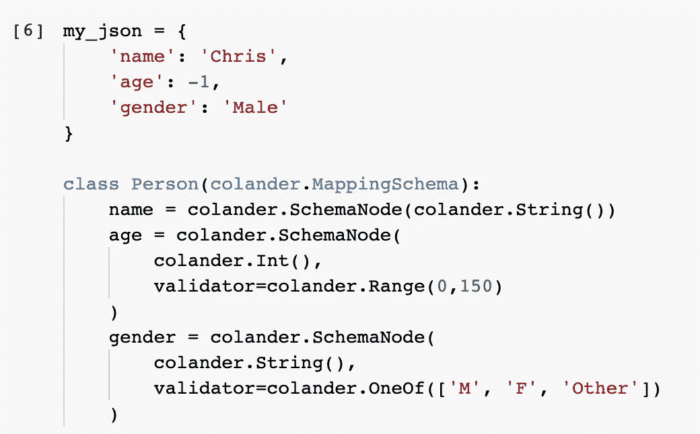
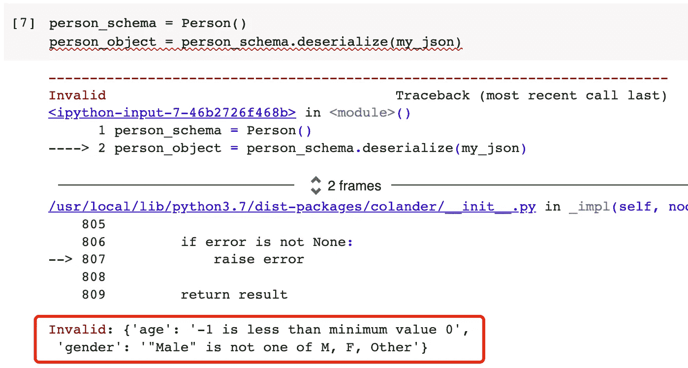
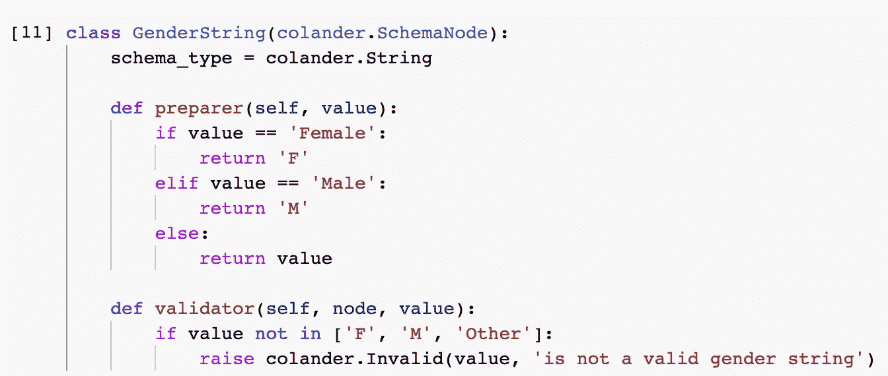
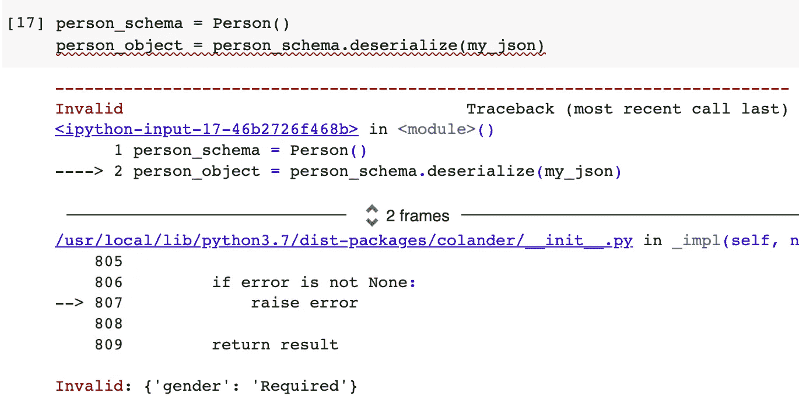
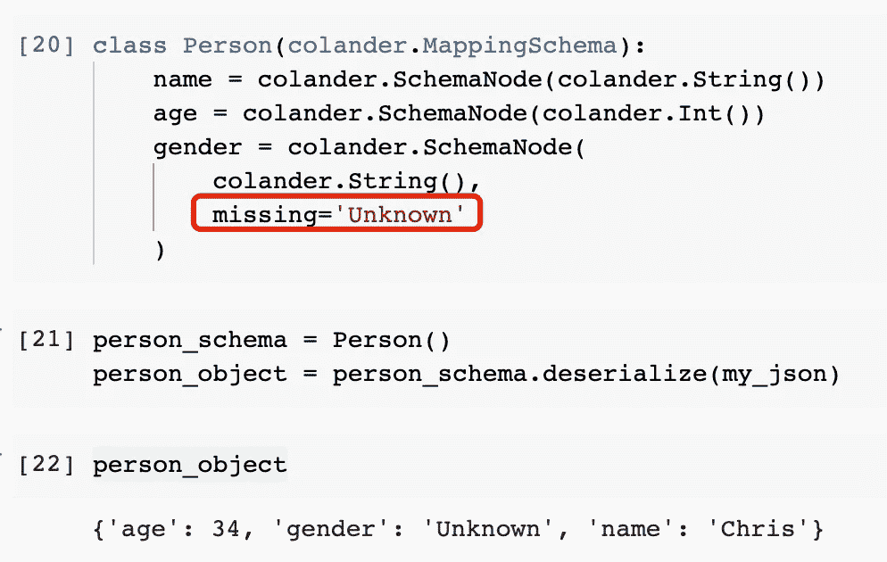
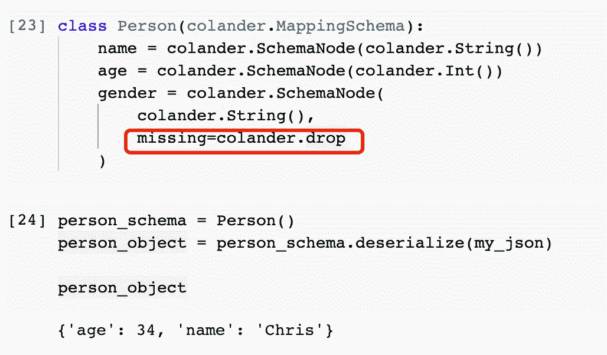
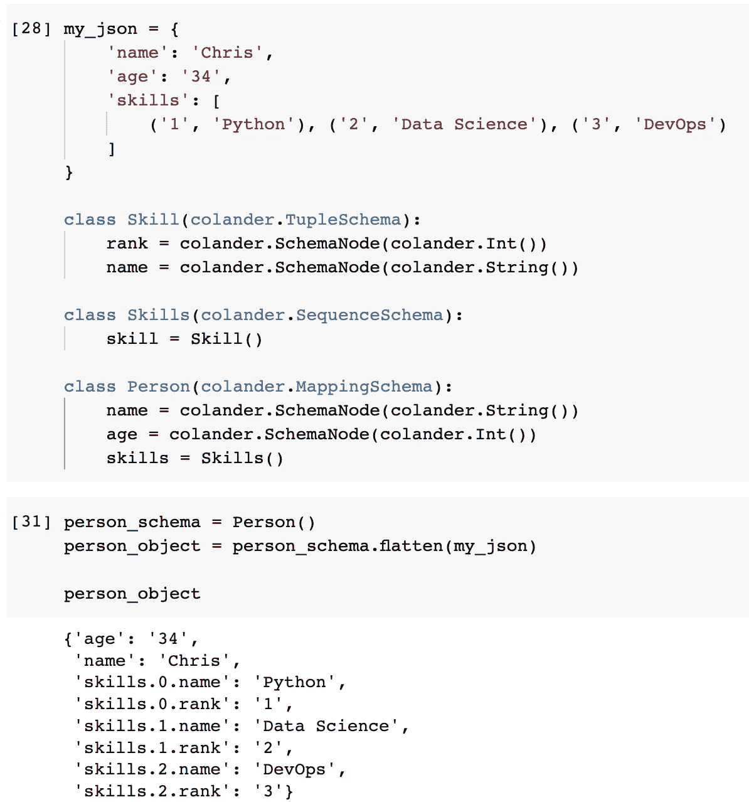

# 不要再使用 If-Else 来验证 Python 中的数据对象——Colander

> 原文：<https://towardsdatascience.com/do-not-use-if-else-for-validating-data-objects-in-python-anymore-colander-7dd66c435118>


图片由 [Irenna86](https://pixabay.com/users/irenna86-233597/?utm_source=link-attribution&utm_medium=referral&utm_campaign=image&utm_content=7305172) 来自 [Pixabay](https://pixabay.com/?utm_source=link-attribution&utm_medium=referral&utm_campaign=image&utm_content=7305172)

## 使用定制的类以灵活的模式定义你的数据结构

几周前，我介绍了一个名为 Cerberus 的 Python 库。它可以让我们编写一个“模式”,以简洁易读的方式验证我们的数据对象(JSON/Dictionary ),而不是使用无尽的 if-else 条件。

</do-not-use-if-else-for-validating-data-objects-in-python-anymore-17203e1d65fe>  

在本文中，我将介绍另一个令人惊叹的第三方库— Colander。然而，它做了一件非常相似的事情，只是方式非常不同。它使用类，而不是在字典中定义验证规则。这听起来有点庞大，但是如果我们有一个非常复杂的数据结构需要验证，这可能会更有组织性。此外，当我们在类中编写所有的验证规则时，有一个显著的好处。也就是说，我们可以将它导出为一个可以导入的独立模块。换句话说，它在另一个层面上提供了灵活性和可重用性。

  

# 1.基础


图片来自[像素](https://pixabay.com/users/pexels-2286921/?utm_source=link-attribution&utm_medium=referral&utm_campaign=image&utm_content=1840300)来自[像素](https://pixabay.com/?utm_source=link-attribution&utm_medium=referral&utm_campaign=image&utm_content=1840300)

像往常一样，让我们从一个不成熟但基本的例子开始，看看这个库是如何工作的。在我们可以使用这个库之前，别忘了安装它。

```
pip install colander
```

现在，我们需要一个样本 JSON，或者 Python 字典。

```
my_json = {
    'name': 'Chris',
    'age': '34',
    'skills': [
        ('1', 'Python'), ('2', 'Data Science'), ('3', 'DevOps')
    ]
}
```


请注意，所有的属性和值都是字符串。当我们以消息的形式从另一个系统获取数据对象时，这是一种很常见的情况。

然后，我们需要导入我们刚刚安装的 colander 模块，然后如下定义 3 个类。

```
import colanderclass Skill(colander.TupleSchema):
    rank = colander.SchemaNode(colander.Int())
    name = colander.SchemaNode(colander.String())class Skills(colander.SequenceSchema):
    skill = Skill()class Person(colander.MappingSchema):
    name = colander.SchemaNode(colander.String())
    age = colander.SchemaNode(colander.Int())
    skills = Skills()
```


## Colander 模式类

Person 类定义了总体模式。它有 3 个属性，属性“技能”来自另一个类。然后，技能类只有一个属性—技能。技能类别定义了个人技能的结构。

尽管我们需要定义多个类，但这可以保持代码整洁。在某些情况下，它甚至比使用字典更好，就像我们在 Cerberus 中所做的那样。

## Colander 模式类型

所有的类都需要从 Colander 继承模式类型。在上面的例子中，`TupleSchema`指的是元组，`SequenceSchema`指的是顺序重要的集合类型，`MappingSchema`指的是字典。

除了示例中的这些，还有更多可用的模式类型。请参考官方文档。

## Colander 模式节点

顾名思义，每个 colander 模式节点都引用原始数据结构中的一个原子属性。例如，字符串属性“name”应该是字符串类型的模式节点，而 age 属性应该是整数模式节点。

## 反序列化 JSON 对象

现在，我们已经定义了模式，这是 Person 类。在使用它之前，我们需要将其实例化为一个模式对象。

```
person_schema = Person()
```

然后，我们可以使用这个模式对象去序列化 JSON 对象。

```
person_object = person_schema.deserialize(my_json)
```


在去军事化过程中至少发生了两件事。首先，JSON 对象经过了这个“漏勺”，所有的验证器都通过了。其次，那些整数类型的属性被正确地从字符串转换成整数。

可以看出，理解 JSON 结构是如何被验证的，以及 Colander 将字符串值反序列化为目标数据类型的机制是什么是很重要的。

# 2.验证者和准备者


图片来自 [Pixabay](https://pixabay.com/?utm_source=link-attribution&utm_medium=referral&utm_campaign=image&utm_content=1839626) 的[像素](https://pixabay.com/users/pexels-2286921/?utm_source=link-attribution&utm_medium=referral&utm_campaign=image&utm_content=1839626)

为了演示验证器是如何工作的，我们可以使用一个相对简单的例子。假设我们有下面的字典。

```
my_json = {
    'name': 'Chris',
    'age': -1,
    'gender': 'Male'
}
```

现在，我们可以尝试向模式中添加一些验证器。

```
class Person(colander.MappingSchema):
    name = colander.SchemaNode(colander.String())
    age = colander.SchemaNode(
        colander.Int(),
        validator=colander.Range(0,150)
    )
    gender = colander.SchemaNode(
        colander.String(),
        validator=colander.OneOf(['M', 'F', 'Other'])
    )
```



在上面的例子中，为`age`和`gender`属性添加了两个**内置的**验证器。Colander 提供了许多内置的验证器，因此我们可以轻松地利用它们。

对于属性`age`，我们想把它限制在一个整数范围内，在 0 到 150 之间。

对于属性`gender`，我们希望它是数组中预定义的值之一。

现在，让我们再次尝试去序列化它，看看验证器是如何工作的。

```
person_schema = Person()
person_object = person_schema.deserialize(my_json)
```



如图所示，两个验证器都抱怨了，并且给出了具体的错误消息，这对理解发生了什么非常有帮助。

## 将错误消息作为字典获取

您可能已经注意到，错误消息实际上是 JSON 格式的。这使得返回到下游组件进行显示变得更加容易。

使用 try-except 块，我们可以很容易地将这个错误消息作为一个字典来“捕捉”。

```
try:
    person_object = person_schema.deserialize(my_json)
except colander.Invalid as e:
    print(e.asdict())
```


## 定制验证者和准备者

现在，让我们看看如何定制一个验证器。尽管有许多内置的验证器，有时我们可能仍然对我们的数据结构有非常特殊的要求。

我们需要定制一个 Colander 模式节点来拥有一个定制的验证器。要定义一个定制的 Colander 模式节点，我们需要编写一个类，并让它从`colander.SchemaNode`继承，如下所示。

```
class GenderString(colander.SchemaNode):
    schema_type = colander.String
    title = 'Gender String' def preparer(self, value):
        if value == 'Female':
            return 'F'
        elif value == 'Male':
            return 'M'
        else:
            return value def validator(self, node, value):
        if value not in ['F', 'M', 'Other']:
            raise colander.Invalid(value, 'is not a valid gender string')
```



在上面的代码中，我们定义了一个名为`GenderString`的类，这将是一个定制的 Colander 模式节点。在这个类中，我们需要指定模式类型，它是一个字符串。然后，我们实现了两个方法`preparer`和`validator`。

在`preparer()`方法中，我们定义了类似“魔法”的东西。即当性别字符串为“男性”时，会转换为单字母缩写“M”，所以为“女性”。这个方法将在验证器之前执行，它也将改变这个节点的值。

在验证器中，我们使用简单的 if-else 条件定义了验证方法。如果无效，将引发“无效”错误，并且消息也是定制的。

定义了这个模式节点后，我们可以在模式定义中使用它，如下所示。

```
class Person(colander.MappingSchema):
    name = colander.SchemaNode(colander.String())
    age = colander.SchemaNode(colander.Int())
    gender = GenderString()
```


请注意，`gender`属性已经被分配了一个`GenderString`实例。

现在，让我们更正原始 JSON 的`age`属性，看看验证器是否能通过。

```
my_json['age'] = 34person_schema = Person()
person_object = person_schema.deserialize(my_json)print(my_json)
print(person_object)
```


酷！JSON 对象已经通过了验证器，性别字符串也已经从“男性”转换为“M”。

# 3.漏测值


图片来自 [Pixabay](https://pixabay.com/?utm_source=link-attribution&utm_medium=referral&utm_campaign=image&utm_content=2343224) 的[Malin btm star](https://pixabay.com/users/malinbatmastar-5460879/?utm_source=link-attribution&utm_medium=referral&utm_campaign=image&utm_content=2343224)

处理缺少值的情况很重要。有时，我们不允许缺少值，默认情况下 Colander 支持这一点。

让我们再次定义模式，只是使用一些简单的定义。

```
class Person(colander.MappingSchema):
    name = colander.SchemaNode(colander.String())
    age = colander.SchemaNode(colander.Int())
    gender = colander.SchemaNode(colander.String())
```

此外，让我们有一个新的 JSON 对象，并且其中没有属性。

```
my_json = {'name': 'Chris', 'age': 34}
```


现在，让我们再次尝试去非军事化。

```
person_schema = Person()
person_object = person_schema.deserialize(my_json)
```



如错误消息所示，模式假设所有属性都是必需的，只要我们已经定义了它们。

这很好，因为我们确实需要验证器来帮助验证一个必填字段是否存在。但是，如果这应该是一个可选属性呢？实际上，我们只需要在 schema 节点中添加一个`missing`参数，如下所示。

```
class Person(colander.MappingSchema):
    name = colander.SchemaNode(colander.String())
    age = colander.SchemaNode(colander.Int())
    gender = colander.SchemaNode(
        colander.String(), 
        missing='Unknown'
    )
```



如图所示，`missing`参数的值将用于填充属性，如果没有给出的话。但是，如果我们不想给一个回退值呢？我们可以使用`colander.drop`作为`missing`参数，表示如果在源代码中没有给出这个属性，就不要包含它。

```
class Person(colander.MappingSchema):
    name = colander.SchemaNode(colander.String())
    age = colander.SchemaNode(colander.Int())
    gender = colander.SchemaNode(
        colander.String(), 
        missing=colander.drop
    )person_schema = Person()
person_object = person_schema.deserialize(my_json)
```



# 4.数据结构扁平化


图片来自 [Pixabay](https://pixabay.com/?utm_source=link-attribution&utm_medium=referral&utm_campaign=image&utm_content=1903316) 的 [Ulrike Leone](https://pixabay.com/users/ulleo-1834854/?utm_source=link-attribution&utm_medium=referral&utm_campaign=image&utm_content=1903316)

最后我想介绍的是 Colander 库的扁平化特性。这可能是一个非常有用的方法。

让我们回到最初的 JSON。

```
my_json = {
    'name': 'Chris',
    'age': '34',
    'skills': [
        ('1', 'Python'), ('2', 'Data Science'), ('3', 'DevOps')
    ]
}
```

同样，让我们把原来的模式找回来。

```
class Skill(colander.TupleSchema):
    rank = colander.SchemaNode(colander.Int())
    name = colander.SchemaNode(colander.String())class Skills(colander.SequenceSchema):
    skill = Skill()class Person(colander.MappingSchema):
    name = colander.SchemaNode(colander.String())
    age = colander.SchemaNode(colander.Int())
    skills = Skills()
```

这次让我们跳过反序列化，使用模式中的`flatten()`方法。

```
person_object = person_schema.flatten(my_json)
```



JSON 文档被简化成一维的键值对字典。

事实上，我们也可以使用这种符号从数据结构中获取特定的值，如下所示。

```
person_schema.get_value(my_json, 'skills.0.name')
```


# 摘要


图片来自 [Pixabay](https://pixabay.com/?utm_source=link-attribution&utm_medium=referral&utm_campaign=image&utm_content=7302776) 的 [myungho lee](https://pixabay.com/users/iemlee-5726489/?utm_source=link-attribution&utm_medium=referral&utm_campaign=image&utm_content=7302776)

在本文中，我介绍了另一个用于数据验证的库——Colander。和我之前介绍过的 Cerberus 库相比，很难说哪个更好。这取决于使用案例和个人偏好。

总的来说，我认为 Colander 更适合需要非常复杂的验证和特殊需求的用例。它使我们能够编写更可读的代码。然而，Colander 中的所有东西都必须被定义为一个类。所以，如果用例不是那么复杂，这就有点过度设计了。

<https://medium.com/@qiuyujx/membership>  

如果你觉得我的文章有帮助，请考虑加入 Medium 会员来支持我和成千上万的其他作者！(点击上面的链接)

> *除非另有说明，所有图片均出自作者之手*