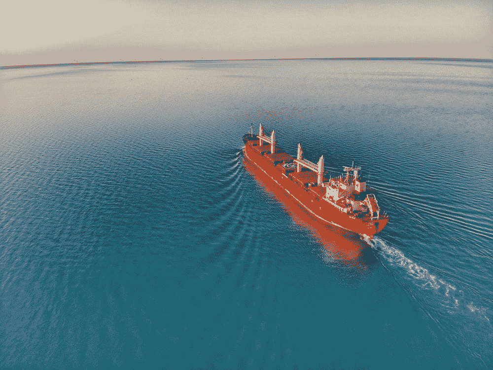

# 面向绝对初学者的 Docker:图像和容器的区别

> 原文：<https://towardsdatascience.com/docker-for-absolute-beginners-the-difference-between-an-image-and-a-container-7e07d4c0c01d>

## 了解 Docker 图像和容器的区别+实用代码示例


因为这是一篇关于 Docker 的文章，我们必须有一个与容器相关的封面，对吗？(图片由[边境摄影师](https://unsplash.com/@borderpolarphotographer)在 [Unsplash](https://unsplash.com/photos/AMXFr97d00c) 上拍摄)

容器、映像、环境、构建、运行、虚拟机..当你刚接触 Docker 时，所有这些抽象的术语可能会有点混乱。在本文中，我们将浏览所有这些术语，并了解每个术语。我们将重点解释**图像和容器之间的区别以及它们是如何协同工作的**，但是在这个过程中，我们将探索其他与 Docker 相关的东西。在本文结束时，您将:

*   了解如何建立一个形象
*   了解如何旋转图像
*   理解图像和容器之间的区别
*   了解如何在日常工作中更好地使用 Docker

我们来编码吧！

## 简单地说，码头工人

Docker 是对“但它在我的机器上工作过！”假设您在笔记本电脑上编写了一个小程序:假设它是一个简单的 Python API。现在您想将这个程序部署在同事的笔记本电脑或服务器上。你复制代码，启动 API，它就崩溃了。为什么？

出现这种情况的原因可能有很多:可能 Python 没有安装。也许另一台机器的操作系统与你的代码不兼容。换句话说:**你的程序是在一个环境中构建的，在另一个**环境中无法运行。

Docker 对这个问题的**解决方案**非常简单，同时也非常聪明:**我们不仅要部署代码，还要部署我们的环境。Docker 创建一个盒子，在盒子里安装一个操作系统，然后复制你的源代码。然后我们把盒子给别人。这很聪明，因为一旦你的代码在这个环境(box)中运行，这意味着它可以在任何地方运行。**

在本文中，我们将关注如何构建这些盒子以及如何共享它们。换句话说:例如，我们如何构建图像，将它们旋转到容器中，并在服务器上部署它们！


集装箱化！(图片由[滕玉红](https://unsplash.com/@live_for_photo)在[上 Unsplash](https://unsplash.com/photos/qMehmIyaXvY) 拍摄)

# 1.创建图像

在前一部分中，我们看到了 Docker 将我们的代码与我们的环境打包在一起，这样我们就可以运行它了。我们在前面部分中称之为“盒子”的东西被称为**图像**。图像是 Docker' **构建**过程的结果。在构建过程中，我们使用一个 **Dockerfile** 。这是一个包含构建容器说明的文件。

*我们将在下一部分使用大量命令行。如果你对使用终端不熟悉，可以看看这篇文章***。**

## *1.1 docker 文件*

*让我们来看看一个非常简单的 dockerfile 文件。想象我们有一个网站，我们想*

```
*FROM nginx:alpineCOPY c:/myproject/htmlfolder /usr/share/nginx/html*
```

*这里发生两件事:
1。使用来自关键字的**,我们告诉 Docker 提取一个基础图像。在这种情况下，我们使用安装了 nginx 的映像。***

*2.使用 **COPY** 我们指示 Docker 将我们计算机上的一些代码复制到映像中。在这种情况下，我们将 htmlfolder 中的所有代码复制到图像中的指定文件夹中。Nginx 将在这个文件夹中托管所有代码。*

## *1.2 建立形象*

*请记住，到目前为止，我们只指定了一些指令。现在我们实际上可以用`docker build . -t my_image:v1`构建图像。*

*这个命令中的`.`意味着 docker 可以使用当前目录中一个名为`dockerfile`的文件。您还可以指定您的 Dockerfile，如果它位于其他地方或者用
`docker build -f c:/things/mydockerfile -t my_image:v1` 不同地命名，正如您所看到的，我们使用-f 标志将路径传递给我们的 dockerfile(在本例中称为`mydockerfile`)。
使用`-t`标志，我们以`name:tag`格式命名并随意标记我们的图像。为我们的图像添加标签便于以后使用。*

**

*我们的形象几乎建立起来了(图片由 [Randy Fath](https://unsplash.com/@randyfath) 在 [Unsplash](https://unsplash.com/photos/ymf4_9Y9S_A) 上拍摄)*

# *2.旋转集装箱*

*到目前为止，我们已经用 docker 文件构建了一个映像。然而，生成的图像还没有做任何事情。我们需要运行它。你可以用两种方式旋转图像:用`docker run`和用合成文件。我们会经历这两个。*

*一旦映像开始运行，它就被称为容器。*

## *2.1 Docker 运行映像*

*在这种情况下，我们将运行之前构建的图像。最简单的方法是:`docker run -p "81:80" my_image:v1`。这将运行我们之前构建的映像，并将我们笔记本电脑上的端口 81 映射到容器中的端口 80，这是 nginx 为我们的网站提供服务的地方。这意味着我们可以在笔记本电脑上进入`localhost:81`来查看网站。轻松点。*

## *2.2 使用 docker-compose 运行图像*

*如果我们有大量的图像，我们将花费大量的时间键入前一部分中的所有 docker run 命令。使用 docker-compose，我们可以将这个运行配置放在一个文件中，这样我们就不必每次都键入它。继续之前，请安装 docker compose。*

*compose 的另一个优点是我们可以用它将容器链接在一起。更多这方面的内容请见 [**本文**](https://mikehuls.medium.com/docker-compose-for-absolute-beginners-how-does-it-work-and-how-to-use-it-examples-733ca24c5e6c) 。*

*我们将把前一部分的命令翻译成 docker compose 中的运行配置。我们将创建一个名为`docker-compose.yml`的文件，内容如下:*

```
*version: "3.8"services:
  my_site:
    container_name: my_site
    hostname: my_site
    image: my_image:v1
    ports:
      - "81:80"*
```

*正如你看到的，`-p "81:80"`翻译成最后两行。我们还添加了一些关于主机名和容器名的额外信息。我们指定要在第 7 行运行名为`my_image:v1`的图像。*

*注意，和 Dockerfile 一样，docker-compose.yaml 只是一个包含指令的文件。我们必须运行它来做一些事情。如果我们与 docker-compose.yml 文件在同一个文件夹中，我们可以调用`docker-compose up`,或者指定这个文件，如果它位于其他地方或者用`docker-compose -f c:/snacks/my_docker-compose.yml up`命名。*

*Docker-compose 使得用一个命令运行许多(连接的)图像变得容易，并且节省了你大量的输入。*

# *3.图像和容器的区别*

*现在我们有了一些实践经验，我们可以确定图像和容器之间的区别。*

> *图像就像一个类:蓝图
> 容器就像一个类的实例*

*最重要的区别是图像是一个逻辑对象；这就像一个蓝图，而容器是一个现实生活中的物体。一个图像只创建一次；使用该图像，容器被创建任意次*

> *Dockerfile 更像是一个**菜谱**:如何**构建**某样东西的说明。
> 撰写文件更像是**手册**:如何**使用**某些东西的说明。*

*您使用一个**docker 文件**来**构建**一个**映像**。这个映像是操作系统和源代码的组合。
接下来你可以**旋转**你的**图像**，产生**容器**。您可以使用`docker run`或`docker-compose.yml`文件旋转/运行图像，您可以在该文件中指定 ***如何运行*** 。运行的图像称为容器。您可以在这里指定容器如何适应您的部署，也可以在这里将容器链接在一起*

**

*准备发布我们的代码(图片由[克里斯·帕甘](https://unsplash.com/@chris_pagan)在 [Unsplash](https://unsplash.com/photos/sfjS-FglvU4) 上提供)*

# *结论*

*我希望读完这篇文章后，你对 Docker 使用的词汇和 Docker 的工作方式有一个更清晰的理解。我希望这篇文章是清楚的，但如果你有建议/澄清，请评论，以便我可以做出改进。同时，看看我的其他关于各种编程相关主题的文章:*

*   *[Docker 适合绝对初学者](https://mikehuls.medium.com/docker-for-absolute-beginners-what-is-docker-and-how-to-use-it-examples-3d3b11efd830)*
*   *[Docker 为绝对初学者编写](https://mikehuls.medium.com/docker-compose-for-absolute-beginners-how-does-it-work-and-how-to-use-it-examples-733ca24c5e6c)*
*   *[把你的代码变成一个真正的程序:使用 Docker 打包、运行和分发脚本](https://mikehuls.medium.com/turn-your-code-into-a-real-program-packaging-running-and-distributing-scripts-using-docker-9ccf444e423f)*
*   *[Python 为什么慢，如何加速](https://mikehuls.medium.com/why-is-python-so-slow-and-how-to-speed-it-up-485b5a84154e)*
*   *[Python 中的高级多任务处理:应用线程池和进程池并进行基准测试](https://mikehuls.medium.com/advanced-multi-tasking-in-python-applying-and-benchmarking-threadpools-and-processpools-90452e0f7d40)*
*   *[编写自己的 C 扩展来加速 Python x100](https://mikehuls.medium.com/write-your-own-c-extension-to-speed-up-python-x100-626bb9d166e7)*
*   *【Cython 入门:如何在 Python 中执行>每秒 17 亿次计算*
*   *[用 FastAPI 用 5 行代码创建一个快速自动归档、可维护且易于使用的 Python API](https://mikehuls.medium.com/create-a-fast-auto-documented-maintainable-and-easy-to-use-python-api-in-5-lines-of-code-with-4e574c00f70e)*

*编码快乐！*

*—迈克*

*页（page 的缩写）学生:比如我正在做的事情？[跟我来](https://mikehuls.medium.com/membership)！*

*<https://mikehuls.medium.com/membership> *