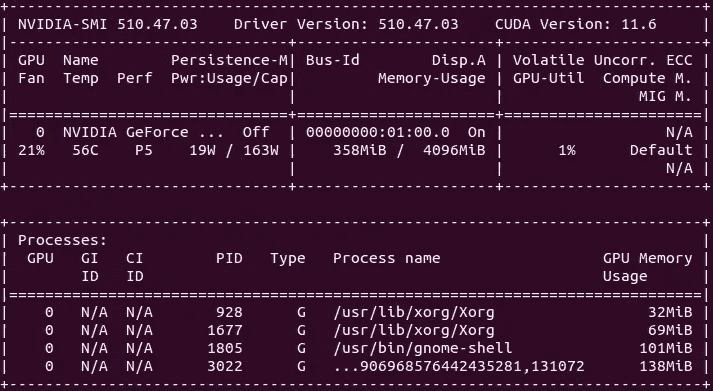

# 数据科学码头工人

> 原文：<https://towardsdatascience.com/docker-for-data-science-7927fb3c70d3>

## 每个数据科学家都应该了解的 Docker

## Docker 是什么？

想象一下，你是一名在空间站的宇航员，打算去外面欣赏风景。你将面临敌对的环境。温度、氧气和辐射都不是你生来的目的。人类需要特定的环境才能茁壮成长。为了在任何其他场景中正常工作，比如在深海或高空，我们需要一个系统来重现这种环境。无论是宇航服还是潜艇，我们都需要隔离，以及确保我们所依赖的氧气、压力和温度水平的东西。

换句话说，我们需要一个容器。

任何软件都面临着和宇航员一样的问题。一旦我们离开家，来到外面的世界，环境变得充满敌意，一种复制我们自然环境的保护机制是强制性的。Docker 容器是程序的宇航服。


作者图片

Docker 将软件与同一系统上的所有其他东西隔离开来。在“宇航服”内运行的程序通常不知道自己穿着宇航服，也不受外界发生的任何事情的影响。


作者图片

集装箱堆栈

*   **应用:**高层应用(你的数据科学项目)
*   **依赖:**低级通用软件(想想 Tensorflow 或 Python)
*   **Docker 容器:**隔离层
*   **操作系统:**与硬件交互的低级接口和驱动程序
*   **硬件:** CPU、内存、硬盘、网络等。

基本思想是将应用程序及其依赖项打包到一个可重用的工件中，该工件可以在不同的环境中可靠地实例化。

# 如何创建容器？

创建 Docker 容器的流程:


作者图片

1.  **Dockerfile:** 编译图像的说明
2.  **图片:**编译好的神器
3.  **容器:**图像的执行实例

# Dockerfile 文件

首先，我们需要说明。

我们可以定义宇航服的温度、辐射和氧气水平，但我们需要的是说明，而不是要求。Docker 是基于指令的，而不是基于需求的。我们将描述如何，而不是什么。为此，我们创建了一个文本文件，并将其命名为 Dockerfile。

```
# Dockerfile
FROM python:3.9
RUN pip install tensorflow==2.7.0
RUN pip install pandas==1.3.3
```

`FROM`命令描述了一个基础环境，所以我们不需要从头开始。从 [DockerHub](https://hub.docker.com/) 或通过谷歌搜索可以找到大量的基础图片。

`RUN`命令是改变环境的指令。


作者图片

注意:虽然我们的例子是一个接一个地安装 Python 库，但不推荐这样做。最佳实践是利用`requirements.txt`，它定义了 Python 的依赖性。

```
# Dockerfile with requirements.txt
FROM python:3.9
COPY requirements.txt /tmp
RUN pip install -r /tmp/requirements.txt
```

`COPY`命令将本地磁盘上的一个文件(如`requirements.txt`)复制到映像中。这里的`RUN`命令一次性安装了在`requirements.txt`中定义的所有 Python 依赖项。

注意:使用 RUN 时，所有熟悉的 Linux 命令都由您支配。

# Docker 图像

现在我们有了我们的`Dockerfile`，我们可以把它编译成一个叫做图像的二进制工件。

这一步的原因是使它更快和可重复。如果我们不编译它，每个需要宇航服的人都需要找到一台缝纫机，并费力地运行每次太空行走的所有指令。这太慢了，而且不确定。你的缝纫机可能和我的不同。速度和质量的权衡是图像可能相当大，通常是千兆字节，但无论如何，2022 年的千兆字节是微不足道的。

要进行编译，请使用 build 命令:

```
docker build . -t myimage:1.0
```

这将构建一个存储在本地机器上的映像。t 参数将图像名称定义为“myimage”，并给它一个标记“1.0”。要列出所有图像，请运行:

```
docker image list
REPOSITORY          TAG                 IMAGE ID            SIZE
<none>              <none>              85eb1ea6d4be        2.9GB
myimagename         1.0                 ff732d925c6e        2.9GB
myimagename         1.1                 ff732d925c6e        2.9GB
myimagename         latest              ff732d925c6e        2.9GB
python              3.9                 f88f0508dc46        912MB
```

# 码头集装箱

最后，我们为太空行走做好了准备。容器是宇航服的真实实例。它们在衣柜里没什么用处，所以宇航员应该穿着它们执行一两项任务。

指令可以嵌入到映像中，或者在启动容器之前及时提供。让我们做后者。

```
docker run myimagename:1.0 echo "Hello world"
```

这将启动容器，运行一个 echo 命令，然后关闭它。

现在我们有了一个可重现的方法，可以在任何支持 Docker 的环境中执行我们的代码。这在数据科学中非常重要，因为每个项目都有许多依赖项，而可再现性是这个过程的核心。

容器在执行完指令后会自动关闭，但是容器可以运行很长时间。尝试在后台启动一个很长的命令(使用 shell 的`&`操作符):

```
docker run myimagename:1.0 sleep 100000000000 &
```

您可以看到我们当前运行的容器:

```
docker container list
```

要停止这个容器，从表中取出容器 ID 并调用:

```
docker stop <CONTAINER ID>
```

这停止了容器，但是它的状态保持不变。如果你打电话

```
docker ps -a
```

您可以看到容器已停止，但仍然存在。彻底摧毁它:

```
docker rm <CONTAINER ID>
```

结合停止和删除的单一命令:

```
docker rm -f <CONTAINER_ID>
```

要移除所有停止的剩余容器:

```
docker container prune
```

提示:您也可以使用交互式 shell 启动容器:

```
$ docker run -it myimagename:1.0 /bin/bash
root@9c4060d0136e:/# echo "hello"
hello
root@9c4060d0136e:/# exit
exit
$ <back in the host shell>
```

当您可以自由地交互运行所有 Linux 命令时，这对于调试映像的内部工作非常有用。通过运行`exit`命令返回到您的主机 shell。

# 术语和命名

**注册表** =托管和分发图像的服务。默认的注册中心是 Docker Hub。

**存储库** =名称相同但标签不同的相关图像的集合。通常，同一应用程序或服务的不同版本。

**标签** =附加到存储库中图像的标识符(例如，14.04 或 stable)

**ImageID** =为每个图像生成的唯一标识符哈希

官方文件宣称:

*映像名称由斜杠分隔的名称组成，可以选择以注册表主机名作为前缀。*

这意味着您可以将注册表主机名和一串斜杠分隔的“名称组件”编码成您的映像的名称。老实说，这很复杂，但这就是生活。

基本格式是:

```
<name>:<tag>
```

但实际上是:

```
<registry>/<name-component-1>/<name-component-2>:<tag>
```

它可能因平台而异。对于谷歌云平台(GCP)，惯例是:

```
<registry>/<project-id>/<repository-name>/@:<tag>
```

为您的案例找出正确的命名方案取决于您。


作者图片

注意:如果你拉一个没有任何标签的图像，将使用`latest`标签。切勿在生产中使用此`latest`标签。始终使用具有唯一版本或散列的标签，因为有人不可避免地会更新“最新”图像并破坏您的构建。今天最新的，明天不再最新！宇航员不关心最新的花里胡哨。他们只是想要一套适合他们的宇航服，让他们活下去。和`latest`在一起，你可能得不到你想要的。

# 码头工人的形象和秘密

就像将秘密放入 git 存储库是一种可怕的做法一样，您也不应该将它们放入 Docker 映像中！

图像被放入储存库并被随意传递。正确的假设是，进入图像的任何内容在某个时候都可能是公开的。它不是存放用户名、密码、API 令牌、密钥代码、TLS 证书或任何其他敏感数据的地方。

机密和 docker 图像有两种情况:

1.  在构建时你需要一个秘密
2.  运行时你需要一个秘密

这两种情况都不能通过把事情永久地放入图像中来解决。让我们看看如何以不同的方式来做这件事。


作者图片

# 构建时秘密

如果您需要一些私有的东西——比如一个私有的 GitHub 存储库——在构建时放入映像中，您需要确保您使用的 SSH 密钥不会泄漏到映像中。

不要使用复制指令将密钥或密码移动到映像中！即使你事后把它们拿掉，它们还是会留下痕迹！

快速搜索会给你很多不同的选择来解决这个问题，比如使用多阶段构建，但是最好和最现代的方法是使用 BuildKit。BuildKit 随 Docker 一起提供，但是需要通过设置环境变量`DOCKER_BUILDKIT`来启用构建。

例如:

```
DOCKER_BUILDKIT=1 docker build .
```

BuildKit 提供了一种机制，使秘密文件在构建过程中安全可用。

让我们首先用内容创建`secret.txt`:

```
TOP SECRET ASTRONAUT PASSWORD
```

然后创建一个新的`Dockerfile`:

```
FROM alpine
RUN --mount=type=secret,id=mypass cat /run/secrets/mypass
```

`--mount=type=secret,id=mypass`通知 Docker，对于这个特定的命令，我们需要访问一个名为 mypass 的秘密(其内容我们将在下一步告诉 Docker build)。Docker 将通过临时挂载一个文件`/run/secrets/mypass`来实现这一点。

`cat /run/secrets/mypass`是实际的指令，其中 cat 是将文件内容输出到终端的 Linux 命令。我们称之为验证我们的秘密确实可用。

让我们构建图像，添加`--secret`来通知`docker build`在哪里可以找到这个秘密:

```
DOCKER_BUILDKIT=1 docker build . -t myimage \
    --secret id=mypass,src=secret.txt
```

一切正常，但是我们并没有像预期的那样看到 secret.txt 的内容在我们的终端中打印出来。原因是默认情况下，BuildKit 不会记录每一次成功。

让我们使用附加参数来构建图像。我们添加了`BUILDKIT_PROGRESS=plain`来获得更详细的日志记录，添加了`--no-cache`来确保缓存不会破坏日志记录:

```
DOCKER_BUILDKIT=1 BUILDKIT_PROGRESS=plain docker build . \
    --no-cache --secret id=mypass,src=secret.txt
```

在所有打印出来的日志中，您应该会发现这一部分:

```
5# [2/2] RUN --mount=type=secret,id=mypass cat /run/secrets/mypass 5# sha256:7fd248d616c172325af799b6570d2522d3923638ca41181fab4ea143 5# 0.248 TOP SECRET ASTRONAUT PASSWORD
```

这证明构建步骤可以访问`secret.txt`。

使用这种方法，您现在可以安全地将秘密装载到构建过程中，而不用担心将密钥或密码泄漏到生成的映像中。

# 运行时秘密

当容器在生产环境中运行时，如果您需要一个秘密(比如数据库凭证)，您应该使用环境变量将秘密传递到容器中。

不要在构建时将任何秘密直接放入映像中！

```
docker run --env MYLOGIN=johndoe --env MYPASSWORD=sdf4otwe3789
```

这些可以用 Python 访问，比如:

```
os.environ.get('MYLOGIN')
os.environ.get('MYPASSWORD')
```

提示:你也可以从像哈希公司金库这样的秘密商店获取秘密！

# GPU 支持

带有 GPU 的 Docker 可能比较棘手。从头构建映像超出了本文的范围，但是现代 GPU (NVIDIA)容器有五个先决条件。

**图像:**

*   CUDA/cuDNN 库
*   框架的 GPU 版本，如 Tensorflow(需要时)

**主机:**

最好的方法是找到一个已经包含了大多数先决条件的基础映像。像 Tensorflow 这样的框架通常会提供像`tensorflow/tensorflow:latest-gpu`这样的图片，这是一个很好的起点。

排除故障时，您可以首先尝试测试您的主机:

```
nvidia-smi
```

然后在容器中运行相同的命令:

```
docker run --gpus all tensorflow/tensorflow:latest-gpu nvidia-smi
```

对于这两个命令，您应该得到类似这样的结果:



作者图片

如果您从任何一个地方得到一个错误，您将知道问题是在容器内部还是外部。

测试你的框架也是一个好主意。例如 Tensorflow:

```
docker run --gpus all -it --rm \
    tensorflow/tensorflow:latest-gpu \
    python -c \
    "import tensorflow as tf;print(tf.reduce_sum(tf.random.normal([1000, 1000])))"
```

输出可能很详细，并有一些警告，但它应该以类似如下的内容结束:

```
Created device /job:localhost/replica:0/task:0/device:GPU:0 with 3006 MB memory: -> device: 0, name: NVIDIA GeForce GTX 970, pci bus id: 0000:01:00.0, compute capability: 5.2 tf.Tensor(-237.35098, shape=(), dtype=float32)
```

# Docker 容器与 Python 虚拟环境


作者图片

Python 虚拟环境在本地开发环境中的不同 Python 项目之间创建了一个安全气泡。Docker 容器解决了一个类似的问题，但是在不同的层面上。

虽然 Python 虚拟环境在所有与 Python 相关的事物之间创建了隔离层，但是 Docker 容器为整个软件栈实现了这一点。Python 虚拟环境和 Docker 容器的用例是不同的。根据经验，虚拟环境足以在本地机器上开发东西，而 Docker 容器是为在云中运行生产作业而构建的。

换句话说，对于本地开发来说，虚拟环境就像在沙滩上涂防晒霜，而 Docker 容器就像穿着宇航服——通常不舒服，而且大多不实用。

# 想要更多实用的工程技巧吗？

数据科学家越来越多地成为 R&D 团队的一部分，并致力于生产系统，这意味着数据科学和工程领域正在发生碰撞。我想让没有工程背景的数据科学家更容易理解，就这个主题写了一本免费电子书。

下载电子书: [*数据科学家的工程实践*](https://valohai.com/engineering-practices-ebook/)

【https://valohai.com】最初发表于[](https://valohai.com/blog/docker-for-data-science/)**。**