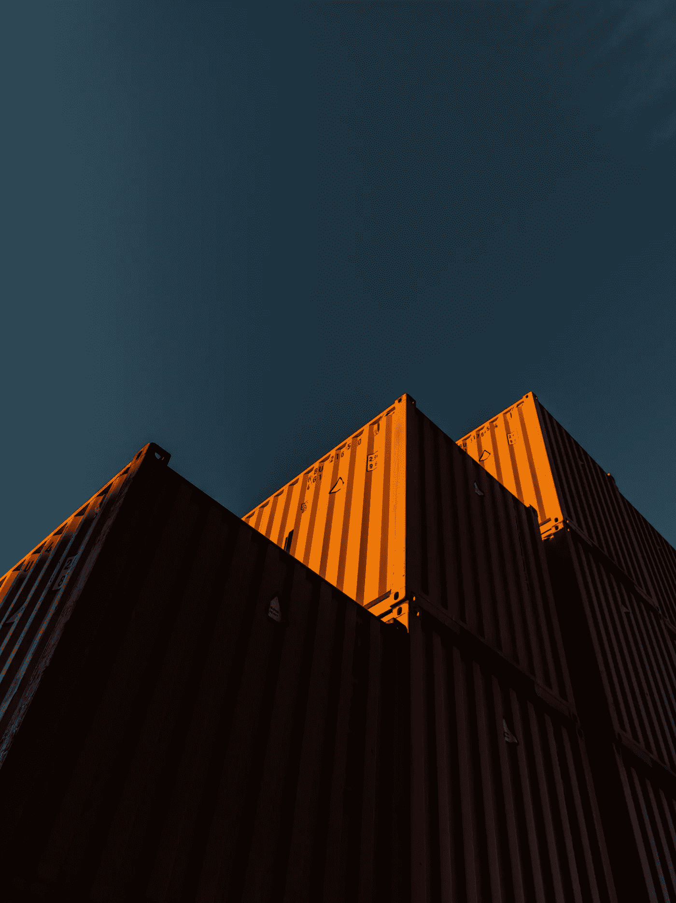

# Docker 图像与容器

> 原文：<https://towardsdatascience.com/docker-image-vs-container-7d9acab24c5>

## 理解 Docker 中图像和容器的区别



[阿隆·伊金](https://unsplash.com/@aronyigin?utm_source=unsplash&utm_medium=referral&utm_content=creditCopyText)在 [Unsplash](https://unsplash.com/s/photos/container?utm_source=unsplash&utm_medium=referral&utm_content=creditCopyText) 上的照片

Docker 一直是软件开发领域的游戏规则改变者，因为它使开发人员能够共享一个隔离的环境，让整个团队(或用户组)以一种非常一致和直观的方式构建、测试和部署应用程序。

由于这项技术已经存在了相当长的时间，我敢肯定你已经遇到了像图像、容器、卷甚至 Dockerfile 这样的术语。Docker 图像和容器是这种特殊技术的两个最基本的概念，许多 Docker 的新手都很难清楚地区分这两者。

在接下来的部分中，我们将讨论 Docker 图像和容器是什么，以及它们的主要区别。

## Docker 图像(容器图像)

docker 映像是包含多个层的不可变文件，每个层对应于可以包含依赖关系、脚本或其他配置的文件系统。

这种分层提高了可重用性并加快了映像构建，因为每一步都可以缓存。现在，下一次构建将从缓存中加载一个步骤，除非自上次构建以来该步骤已被修改。

现在,`docker build`命令被用来从`Dockerfile`构建一个图像——一个由用户可以在命令行上调用的命令组成的文本文件来创建一个想要的图像。

> Docker 图像是容器的基础。映像是根文件系统更改和相应的执行参数的有序集合，供容器运行时使用。一个映像通常包含一个相互堆叠的分层文件系统的联合体。
> 
> — [Docker 词汇表](https://docs.docker.com/glossary/#container-image)

图像存储在 Docker 注册表中——默认的是 [Docker Hub](https://registry.hub.docker.com/) ,但是您甚至可以托管您自己的 Docker 注册表，只有您的组织才能访问。

您可以通过运行以下命令来查看主机上的所有图像

```
$ docker images
```

## 码头集装箱

现在 docker 容器是 Docker 映像的**实例，运行在完全**隔离的环境**(即与机器上运行的任何其他进程隔离)中，并且可以在任何操作系统上执行(可移植性！).**

容器是轻量级和可移植的运行时环境，用户可以在其中独立于底层主机运行应用程序。

可以停止正在运行的容器，但同时它可以保留设置和任何文件系统更改，以便下次重新启动时可以重用它们。

> 容器是 docker 映像的运行时实例。
> 
> 码头集装箱包括
> 
> -码头工人图像
> 
> -执行环境
> 
> -一套标准的指令
> 
> 这个概念是从海运集装箱借用的，它定义了一个在全球运输货物的标准。Docker 定义了一个运送软件的标准。
> 
> — [码头术语表](https://docs.docker.com/glossary/#container)

您可以通过运行以下命令来查看所有正在运行的容器

```
$ docker ps
```

如果您还想列出没有启动和运行的容器，您必须传递`-a`选项:

```
$ docker ps -a
```

## 最后的想法

Docker 为开发人员提供了一个开发、运行和发布应用程序的平台。理解如何有效地使用 Docker 肯定会对你的软件开发之旅和职业生涯有所帮助。

因此，首先理解该技术的基本原理和组件很重要，这将有助于您更舒适地使用 Docker。这个旅程从您能够区分 Docker 图像和 Docker 容器开始。

简而言之，Docker 映像是一个由多层组成的结构，正如在`Dockerfile`中所指定的，而 Docker 容器是 Docker 映像的一个(运行中的)实例(这也许是您可能想要使用 Docker 的原因！).

[**成为会员**](https://gmyrianthous.medium.com/membership) **阅读媒介上的每一个故事。你的会员费直接支持我和你看的其他作家。你也可以在媒体上看到所有的故事。**

<https://gmyrianthous.medium.com/membership>  

**相关文章你可能也喜欢**

</run-airflow-docker-1b83a57616fb>  </data-engineer-tools-c7e68eed28ad>  </apache-airflow-architecture-496b9cb28288> 