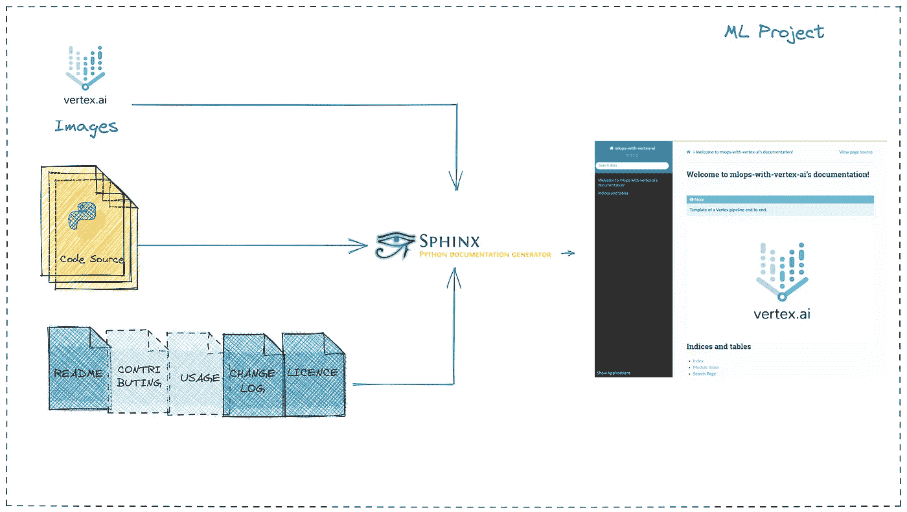
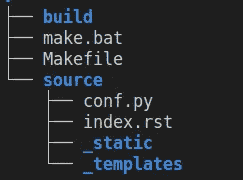
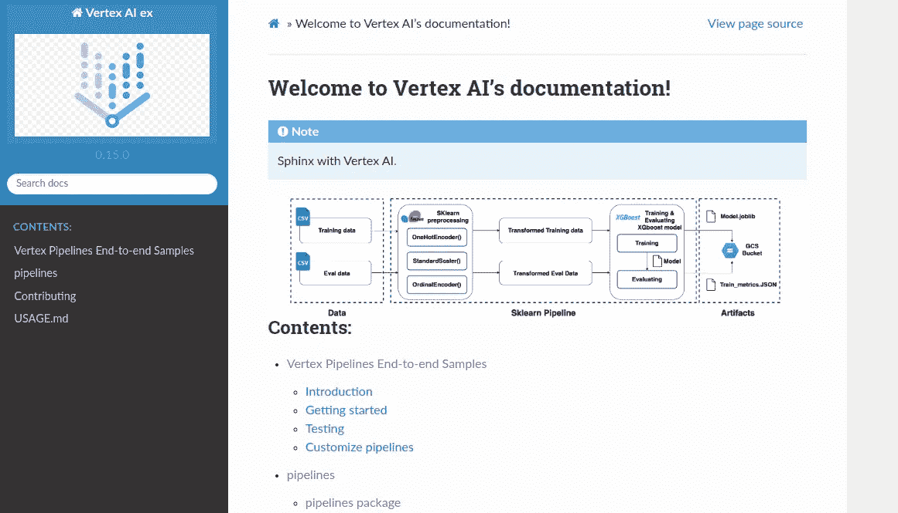
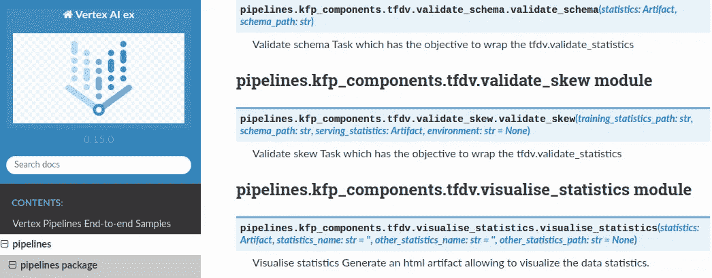

# 用聪明的方式记录你的机器学习项目

> 原文：<https://towardsdatascience.com/document-your-machine-learning-project-in-a-smart-way-35c68aa5fc0e>

## 如何使用 Sphinx 和顶点 AI 管道的分步教程。


作者:[@西格蒙德](https://unsplash.com/@sigmund)，unsplash.com

本文的目的是分享使用 Sphinx 自动生成机器学习项目文档的过程。

我将使用 Sphinx 的高级功能，例如添加了**徽标**、**注释**、**图像**和**降价文档**。此外，我将展示您需要的 python 包，以便 Sphinx 可以提取顶点管道中的文档字符串。

# 一些背景

我们开始吧！如你所知，拥有最新的机器学习项目文档对于生产和概念验证阶段都是至关重要的。 **为什么它至关重要？**因为它有助于澄清和简化你的模块，与你的团队合作，快速整合新的团队成员，更快地发展，并与业务所有者分享。

就我个人而言，我经历过很多这样的情况，由于上市时间的限制，文档被忽略了，但是一旦项目在生产中发布，这就变成了致命的。因此，我建议你避开任何手动程序来生成你的文档，因为这样的程序总是以失去同步和耗时而告终。

因此，在发布您的项目之前，花一些时间检查您的项目的可读性。在我的例子中，我倾向于使用以下文件:

*   **自述文件** —一个易于阅读的文件，提供项目的介绍和一般信息，如目的、技术信息、软件组件
*   **许可** —一个文件，提到了贡献者需要遵循的许可分步程序
*   **用法** —解释如何使用项目的文件
*   **CHANGELOG** —一个跟踪项目变更和发布版本的文件

请注意，最重要的文件是自述文件。贡献和使用信息可以直接添加到自述文件中。可以在生产中发布项目之前添加 changelog 文件。要编辑文件，您可以使用[](https://www.markdownguide.org/)**、简单文本、*或[*重组文本*](https://www.sphinx-doc.org/en/master/usage/restructuredtext/index.html) ***。****

*参见下面我们将要描述的过程的概述。*

**

*过程概述(图片由作者提供)*

*斯芬克斯是什么？*

*Sphinx 是一个强大且易于使用的开源自动生成器工具，被 Python 社区广泛使用。它能够生成优秀的结构化文档。存在一些替代品，如 MkDocs、Doxygen、pdoc 等，但是 Sphinx 仍然是一个完整且易于使用的强有力的竞争对手。*

*主要特点:*

*   *支持多种输出格式:HTML、PDF、纯文本、EPUB、TeX 等。*
*   *文档的自动生成*
*   *自动链接生成*
*   *多语言支持*
*   *各种扩展可用*

# *步骤:*

> **一、设置环境**
> 
> **二世。安装虚拟环境**
> 
> *三。安装 Sphinx*
> 
> *四。设置 Sphinx*
> 
> *动词 （verb 的缩写）建立文档*

## ***一、搭建环境***

*   **Python 3**
*   **本地虚拟机或 Vertex AI 工作台(用 Python 3 运行在虚拟环境中的 Jupyter 笔记本)**
*   **包含顶点 AI 代码的 Python 项目**
*   **虚拟人**
*   ****Kfx****—e*kube flow 管道 sdk 扩展*
*   *MyST 解析器 Markdown 风格*
*   **包含 sdk 管道的顶点项目**

*让我们用一个 Apache-2.0 许可下的顶点 AI 管道 的端到端[**开源例子。该项目是一个很好的例子，因为该项目使用顶点管道，而不使用文档生成器。**](https://github.com/GoogleCloudPlatform/vertex-pipelines-end-to-end-samples.git)*

*首先克隆源代码，转到**顶点-管道-端到端-样本** 目录 *:**

```
*git clone [https://github.com/GoogleCloudPlatform/vertex-pipelines-end-to-end-samples.git](https://github.com/GoogleCloudPlatform/vertex-pipelines-end-to-end-samples.git)
cd vertex-pipelines-end-to-end-samples*
```

***二。创建一个虚拟环境&激活它***

## ***III。安装斯芬克斯***

*创建一个文件 requirements-sphinx.txt 并添加:*

```
*myst-parser==0.15
requests==2.28.1
sphinx==4.5.0
sphinx-click==4.3.0
sphinx-me==0.3
sphinx-rtd-theme==1.0.0
rst2pdf==0.99
kfx*
```

*立即安装需求-sphinx.txt 中列出的 Sphinx 及其扩展:*

```
*pip install -r requirements-sphinx.txt*
```

*创建一个 docs 目录(如果不存在)来存储 Sphinx 布局:*

```
*mkdir docs 
cd docs* 
```

*使用 **sphinx-quickstart** 命令生成初始目录结构:*

```
***sphinx-quickstart***
```

*选择单独的源代码和构建目录、项目名称、作者姓名、项目版本和项目语言。您可以在下面找到我的配置:*

**

*您应该获得以下树结构:*

**

*如你所见，我们选择分离*构建*和*源*目录。关于它的内容我们来做几个说明。*

****build/*** 目录是用来保存生成的文档*。因为我们还没有生成任何文档，所以它现在是空的。**

****make . bat(Windows)***和 ***Makefile(Unix)*** 文件是简化文档生成的脚本。*

****source/conf.py*** 是 Sphinx 项目的配置文件。它包含默认的配置密钥和您为 sphinx-quickstart 指定的配置。*

****source/index . rst****是包含目录树(toctree)指令的项目的根文档，您应该在其中列出您想要包含在文档中的所有模块。**

****_static** 目录包含自定义样式表和其他**静态**文件。**

****_templates** 目录存储了 Sphinx 模板。**

## ****四。设置狮身人面像****

*****识别 python 模块:/pipelines*****

**目录/ **管道**包含我们想要包含在 Sphinx 文档中的 python 代码。**注意**只有当您添加 __init__ 时，Sphinx 才会看到 pipelines 包中的子模块。/ **管道**目录下的 py 文件。**

*****生成狮身人面像来源*****

**使用 *sphinx-apidoc* 构建您的 API 文档(确保您位于项目的根目录)。创建的 Sphinx 源代码存储在 docs/source/pipelines 中。**

```
 **sphinx-apidoc -f -o docs/source/pipelines pipelines/**
```

**您可以检查以下文件是在 docs/source/pipelines 中创建的:**

****

*****将降价文件复制到 docs/source*****

**在 Sphinx 源目录(docs/source/)中自动复制 README.md、CONTRIBUTING.md 和 USAGE.md 文件。在 docs/Makefile 中添加以下行以自动同步降价文件:**

```
**COPY_README = ../README.md
COPY_CONTRIBUTING = ../CONTRIBUTING.md
COPY_USAGE = ../USAGE.md#sincronyze MD files
$(shell cp -f $(COPY_README) $(SOURCEDIR))
$(shell cp -f $(COPY_CONTRIBUTING) $(SOURCEDIR))
$(shell cp -f $(COPY_USAGE) $(SOURCEDIR))**
```

****编辑 index.rst 编辑****

**使用****注释**指令获取您想要突出显示的信息。****

```
****.. note::  Sphinx with Vertex AI.****
```

****使用**图像**指令添加图像。推荐的图像尺寸宽度在 400-800 像素之间。****

```
****.. image:: ../images/xgboost_architecture.png
    :align: center
    :width: 800px
    :alt: alternate text****
```

****在**to tree**指令下，列出你希望包含在最终文档中的所有模块(自述文件、模块)。****

```
****.. toctree::
   :maxdepth: 2
   :caption: Contents: README
   pipelines/modules
   CONTRIBUTING
   USAGE****
```

****请在下面找到我的 index.rst:****

*******编辑 conf . py—Sphinx***的主配置文件****

****定义路径:****

```
****# Define path
sys.path.insert(0, os.path.abspath("../.."))****
```

****添加您的扩展:****

```
****extensions = [
    "sphinx.ext.duration", 
    "sphinx.ext.doctest",
    "sphinx.ext.viewcode",
    "sphinx.ext.autosummary",
    "sphinx.ext.intersphinx",
    "sphinx_rtd_theme",
    "sphinx_click",
    "myst_parser",
    "sphinx.ext.todo",
    "sphinx.ext.coverage",
    "myst_parser",
]****
```

****列出要解析的文件列表:****

```
****source_suffix = {
    ".rst": "restructuredtext",
    ".md": "markdown",
}****
```

****指定 HTML 主题:****

```
****html_theme = "sphinx_rtd_theme"****
```

****要添加**一个徽标**，请确保图像出现在**/_ static**源中。我用过 v [ertex AI logo](https://www.google.com/url?sa=i&url=https%3A%2F%2Ftechcrunch.com%2F2021%2F05%2F18%2Fgoogle-cloud-launches-vertex-a-new-managed-machine-learning-platform%2F&psig=AOvVaw2yIk5iHnn12J135DQba3AU&ust=1664401523881000&source=images&cd=vfe&ved=0CAwQjRxqFwoTCNCrwP_4tfoCFQAAAAAdAAAAABAD) 。然后，您可以定义徽标路径:****

```
****html_logo = "_static/vertex.png"****
```

****列出降价文件中存在的所有外部链接:****

```
****intersphinx_mapping = {    "python": ("[https://python.readthedocs.org/en/latest/](https://python.readthedocs.org/en/latest/)", None)}****
```

****请参阅我的配置文件 conf.py:****

## ******V .构建文档******

****要使用 Sphinx 生成 HTML 文档，请转到/docs 并使用命令:****

```
****make html****
```

****使用 Firefox 打开 HTML 页面:****

```
****firefox docs/build/html/index.html****
```

****如果你设法完成了所有的步骤，你应该能够看到一个更吸引人的 HTML 页面。****

********

## ****KFX 扩展将使 Sphinx 能够读取 Kubeflow 组件、函数名、参数和文档字符串。****

********

*******使用 Makefile(位于项目的根目录)自动构建*** 文档。编辑 Makefile 并添加以下几行:****

```
****create-sphinx-sources:
 cd docs; make clean; cd ..; rm -r docs/source/pipelines; sphinx-apidoc -f -o docs/source/pipelines pipelines/generate-doc:
 @ $(MAKE) create-sphinx-sources && \
 cd docs; make html****
```

****然后调用 make generate-doc:****

```
****make generate-doc****
```

****我们带着斯芬克斯到达了旅程的终点。我希望这些内容对你有用！****

# ****摘要****

****我们已经看到了如何使用 Sphinx，这是一个为您的机器学习项目生成文档的强大工具。我们定制了带有徽标、图像和降价内容的文档。当然，Sphinx 附带了许多其他扩展，您可以使用它们来使您的文档更加吸引人。****

# ****感谢您的阅读！****

****如果你想在收件箱里收到我未来的故事，别忘了订阅。****

*****如果您喜欢阅读我的故事，并希望支持我成为一名作家，请考虑注册成为 Medium 会员，并获得数千篇数据工程和数据科学文章。*****

****[](https://medium.com/@anna.bildea/membership) [## 通过我的推荐链接加入 Medium—Bildea Ana

### 作为一个媒体会员，你的会员费的一部分会给你阅读的作家，你可以完全接触到每一个故事…

medium.com](https://medium.com/@anna.bildea/membership) 

*在*[*LinkedIn*](https://www.linkedin.com/in/ana-bildea-phd-2339b728/)*和* [Twitter](https://twitter.com/AnaBildea) 上找我！****