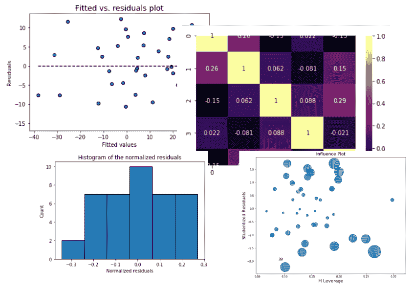
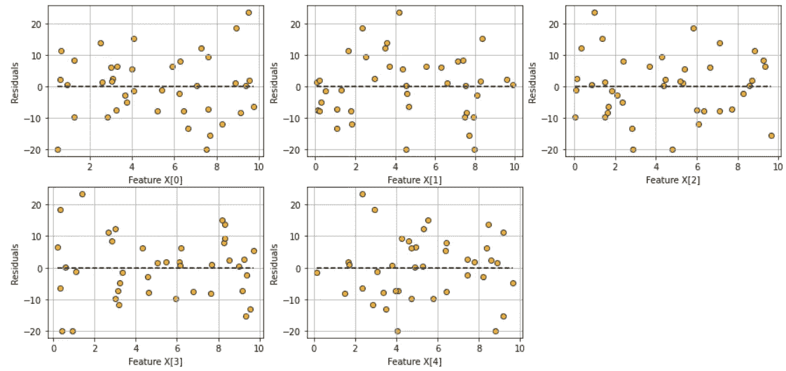
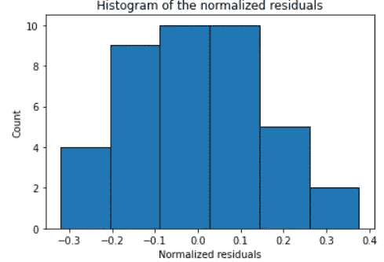
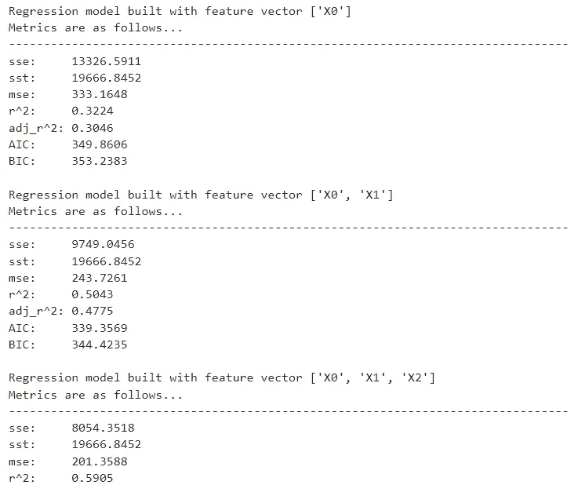
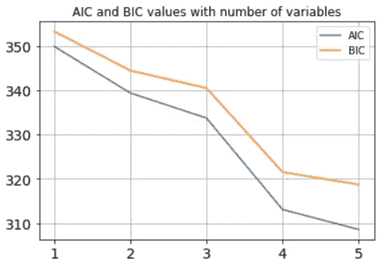

# 不要只是拟合数据，还要获得洞察力

> 原文：<https://towardsdatascience.com/dont-just-fit-data-gain-insights-too-1dba73d3cf8e>

## 一个轻量级的 Python 包可以让您对回归问题有更多的了解



图片来源:作者创作

# 为什么需要洞察力？

首先要做的事。为什么线性回归很重要？

线性回归是一项基本技术，[它深深植根于久经考验的统计学习和推理理论](/linear-regression-using-python-b136c91bf0a2)，并为现代数据科学管道中使用的所有基于回归的算法提供支持。此外，对于大多数数据分析工作，除了处理图像、音频或自然语言等高维数据的问题，这种回归技术仍然是最广泛使用的工具。

它们易于实现，更重要的是，易于遵循和解释。**而且，可交代性越来越重要**。

<https://blog.fiddler.ai/2021/10/the-key-role-of-explainable-ai-in-the-next-decade/>  

然而，**一个线性回归模型的成功还取决于一些关于基础数据性质的基本假设**。验证这些假设是否“合理地”得到满足是多么重要，怎么强调都不为过。这种检查是确保线性回归模型质量的唯一保证。

我在之前的一篇文章中探讨了这些问题，

</how-do-you-check-the-quality-of-your-regression-model-in-python-fa61759ff685>  

对于我们所有使用 Python 作为数据科学语言的人来说，机器学习的首选包是 Scikit-learn。尽管 Scikit-learn 的估计器经过了高度优化和精心设计，但它们并没有为回归任务提供许多统计见解或检查。例如，他们可以给你 *R* 分数和回归系数，除此之外别无其他。

但是，如果您想从同一个评估者那里获得以下见解/图表，该怎么办呢？

*   残差与预测变量图
*   拟合与残差图
*   归一化残差的直方图
*   归一化残差的 Q-Q 图
*   残差的夏皮罗-维尔克正态性检验
*   残差的库克距离图
*   预测特征的方差膨胀因子(VIF)

这些图中的每一个都很关键，可以告诉您**回归问题(即输入数据)是否质量良好**或者是否满足**建模假设**。本质上，问题必须满足这些，


图片来源:作者创作，摘自本文[文章](/how-do-you-check-the-quality-of-your-regression-model-in-python-fa61759ff685)(作者拥有版权)

在本文中，我们将探索一个简单、轻量级的 Python 包`**mlr**`,展示如何用最少的代码深入了解回归问题。

# 安装和基本安装

基本 pip 安装。

```
pip install mlr
```

我们可以为演示生成一些随机数据。

```
num_samples=40
num_dim = 5
X = 10*np.random.random(size=(num_samples,num_dim))
coeff = np.array([2,-3.5,1.2,4.1,-2.5])
y = np.dot(coeff,X.T)+10*np.random.randn(num_samples)
```

特征向量有 5 个维度。请注意添加到数据中的随机噪声。它看起来怎么样？我们绘制了响应变量 w.r.t .特征向量的每个维度，


图片来源:作者创作

此时，我们可以使用`mlr`库创建一个模型实例。

```
model = mlr()
```

这是什么？我们可以探测:-)

```
model>> I am a Linear Regression model!
```

下一步是接收数据。还不适合，但只是为了消化。

```
model.ingest_data(X,y)
```

在这一点上，数据已经被摄取，但不适合。

```
model.is_ingested>> Truemodel.is_fitted>> False
```

相关矩阵立即可用于可视化。**即使在拟合回归模型之前，你也必须检查多重共线性，不是吗**？

```
model.corrplot()
```


图片来源:作者创作

所有相关数据和完整的协方差矩阵也是可用的。我们不会为了节省空间而打印它们，

```
model.corrcoef()
model.covar()
```

然后，合身就好。

```
model.fit()
```

# 一堆东西任你处置

一旦安装完毕，就会发生大量的内部动作，模型对象就有了大量的度量和可视化，供您深入了解。

## 简单 R 分数(以及所有相关指标)

我们可以打印简单的 R 系数，

```
model.r_squared()
>> 0.8023008559130889model.adj_r_squared()
>> 0.7732274523708961
```

或者，我们可以一次性将它们全部打印出来！

```
model.print_metrics()
>>
sse:     3888.1185
sst:     19666.8452
mse:     97.2030
r^2:     0.8023
adj_r^2: 0.7732
AIC:     308.5871
BIC:     318.7204
```

为了简洁起见，我不会讨论所有这些指标，但是这些是线性回归问题的基础，你应该已经熟悉了:-)

## 进行总体显著性的 f 检验

它返回测试的 F 统计量和 p 值。如果 p 值很小，您可以拒绝所有回归系数为零的零假设。这意味着较小的 p 值(通常< 0.01)表明总体回归具有统计学意义。

```
model.ftest()>> (27.59569772244756, 4.630496783262639e-11)
```

## t 检验统计和系数的标准误差

标准误差和相应的 t 检验为我们提供了每个回归系数的 p 值，它告诉我们特定的系数是否具有统计显著性(基于给定的数据)。

同样，所有这些，一个函数调用，

```
print("P-values:",model.pvalues())
print("t-test values:",model.tvalues())
print("Standard errors:",model.std_err())
```

我们得到，

```
P-values: [1.37491834e-01 8.39253557e-06 1.62863484e-05 1.64865547e-03
 1.23943729e-06 1.97055499e-02]
t-test values: [-1.5210582   5.23964721 -5.017859    3.41906173  5.87822303 -2.44746809]
Standard errors: [7.35200748 0.65528743 0.58944149 0.58706879 0.55966142 0.7806859 ]
```

## 每个特征的置信区间？

一行代码，

```
model.conf_int()
>>
array([[-26.12390808,   3.75824557],
       [  2.10177067,   4.76517923],
       [ -4.15562353,  -1.75984506],
       [  0.81415711,   3.20029178],
       [  2.15244579,   4.42718347],
       [ -3.49724847,  -0.3241592 ]])
```

# 残差的可视化分析

残差分析对于检查线性回归模型的假设是至关重要的。`mlr`通过为残差提供直观的可视化分析方法，帮助您轻松检查这些假设。

## 拟合与残差图

使用此图检查恒定方差和不相关特征(独立性)的假设。

```
model.fitted_vs_residual()
```


图片来源:作者创作

## 拟合与特征图

用该图检查线性假设，

```
model.fitted_vs_features()
```



图片来源:作者创作

## 标准化残差的直方图和 Q-Q 图

使用这些图检查误差项的正态假设，

```
**model**.histogram_resid()
```



图片来源:作者创作

```
**model**.qqplot_resid()
```


图片来源:作者创作

# 特征选择

简化 API 的一个好处是，我们可以用它来完成复杂的任务，只需要几行代码。例如，我们可能希望使用`mlr`来检查**回归指标是如何变化的，因为我们开始时只有一个解释变量，然后逐渐增加更多的**。这是特征选择方法的常见任务。

为此，假设我们已经使用`fit_dataframe`方法将数据放入 Pandas 数据框架中。

```
for i in range(1,6):
    m = mlr() # Model instance
    # List of explanatory variables
    X = ['X'+str(j) for j in range(i)]
    # Fitting the dataframe by passing on the list
    m.fit_dataframe(X=X,y='y',dataframe=df) 
    print("\nRegression model built with feature vector", X)
    print("Metrics are as follows...")
    print("-"*80)
    m.print_metrics()
```

打印出类似下面的内容，



图片来源:作者创作

我们还可以绘制出随着变量的增加，AIC 和 BIC 的价值逐渐减少的曲线。

**从上面**的剧情中你能得到什么样的感悟？也许，如果您的模型训练资源有限，您可能会停止使用三个特性来构建模型。

**向您的客户解释**，为什么您只选择了这三项功能。



图片来源:作者创作

此处提供了[方法的完整列表。](https://mlr.readthedocs.io/en/latest/methods/)

# 摘要

仅仅拟合数据和预测是不够的。为了进行严格的回归分析，需要进行许多统计显著性检验和残差检验。拥有一个轻量级的库有助于用最少的代码量实现这一点。这就是我们在本文中演示的内容。

在这里阅读本库(`mlr`)的完整文档: [**文档**](https://mlr.readthedocs.io/en/latest/) 。

*喜欢这篇文章吗？成为* [***中等会员***](https://medium.com/@tirthajyoti/membership) *继续* ***无限制学习*** *。如果您使用下面的链接，* ***，我将收取您的一部分会员费，而无需您支付额外费用*** *。*

<https://medium.com/@tirthajyoti/membership> 