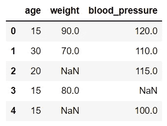
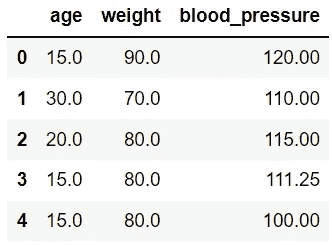
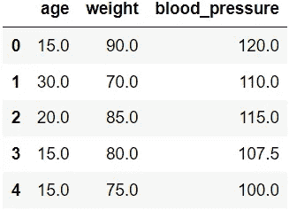
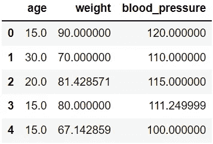

# 处理缺失值时不要走捷径

> 原文：<https://towardsdatascience.com/dont-take-shortcuts-when-handling-missing-values-afb9312e73c3>

## 如何确保缺失数据得到正确处理

安 H 的照片:[https://www . pexels . com/photo/pink-jigsaw-puzzle-piece-3482441/](https://www.pexels.com/photo/pink-jigsaw-puzzle-piece-3482441/)

在许多数据集中，缺失值是一个两难问题，但是许多用户渴望分配更少的时间来处理它们，以便他们可以将更多的精力放在建模上。

我写这篇文章之前，我最近遇到了许多将丢失数据视为事后想法的投资组合项目。人们对最佳算法和超参数进行了大量的考虑，但很少对选择的插补方法进行论证。

我明白，建立模型很有趣，但机器学习项目的成功取决于在任何建模之前如何处理数据。

在这里，我们深入探讨了许多人在处理缺失数据时往往会跳过的重要步骤，并展示了用户如何在自己的项目中实现这一点。

## 最重要的一步

那么，您必须执行什么步骤来确保正确处理丢失的数据呢？

答案很简单:探索性数据分析(EDA)！

不幸的是，在处理数据集中缺失的数据时，用户经常会忽略 EDA。相反，他们选择依靠他们最熟悉/最舒适的方法。

总的来说，不考虑“为什么”而盲目地执行技术是一个灾难。

毕竟，丢失数据的性质因情况而异。在处理缺失值时，适用于一个使用数据集中的方法可能不适用于另一个使用数据集中。

跳过 EDA 的用户更有可能使用基于错误假设的技术，这将影响数据质量。较差的数据质量自然会对后续建模阶段建立的任何机器学习模型产生负面影响(垃圾进，垃圾出)。

## 使用 EDA 处理缺失数据

EDA 是掌握数据集的关键特征及其缺失值的有效方法。通过掌握关于缺失数据的更多信息，您将能够就如何处理这些缺失值做出更明智的决策。

下一个问题是:当用户用 EDA 检查他们的数据时，到底应该寻找什么？

理想情况下，处理缺失数据的用户应回答以下问题:

*   哪些要素包含缺失值？
*   每个特征的记录中缺失数据的比例是多少？
*   缺失数据是随机缺失(MAR)还是非随机缺失(MNAR)？
*   具有缺失值的要素是否与其他要素相关？

## 处理缺失数据的方法

为了有效地解决缺少值的困境，用户将受益于对他们可用的各种技术的熟悉。了解几种方法及其优缺点将增加选择最佳方法的机会。

现在，我们简要概述一些处理缺失数据的基本和高级方法，并考虑它们的优点和局限性。

此外，我们将使用下面的模拟数据集演示如何在 Python 中使用这些方法。

代码输出(由作者创建)

## 基本方法

1.  **省略有缺失数据的记录**

有缺少值的数据点吗？

只需从数据集中删除它们！问题解决了！

这种方法的优点是它是处理缺失值的最简单的方法。就代码而言，您可以使用 Pandas 库用一行程序执行这个操作。

代码输出(由作者创建)

但是，这种方法会产生一个小得多的数据集，从而为模型提供较少的训练信息。此外，如果缺失值不是随机缺失(MNAR)，这意味着移除这些数据点将不可避免地导致模型中的偏差。

这很少是处理缺失数据的首选方法。对于考虑这种方法的人来说，至少要确保有足够的数据，并且缺失值是随机缺失的。

**2。省略丢失数据的特征**

另一种选择是只移除特征而不是数据点。

代码输出(由作者创建)

同样，这需要移除数据，因此用户在考虑此方法之前，应首先验证要素中缺失数据的数量。

如果某个要素缺少太多数据，它很可能不会对模型有所贡献。对于这种情况，最好不要考虑这个特性。

**3。用统计数据输入缺失数据**

用户可以依靠简单的插补方法，用导出值替换缺失数据，而不是删除缺失值的记录或特征。对于数字要素，缺失数据可以用分布中值的平均值或中值来替换。对于分类特征，缺失数据可以由模式替换。

Python 中的插补可以用 Scikit Learn 包的[simple imputr](https://scikit-learn.org/stable/modules/generated/sklearn.impute.SimpleImputer.html)类来实现。

代码输出(由作者创建)

虽然简单的插补听起来像是一种完美的方法，但它忽略了感兴趣的特征与任何其他特征之间可能存在的相关性，而其他特征可能不适合感兴趣的数据。因此，用基本方法替换缺失值可能会产生不能充分代表数据点的值分布。

## 处理缺失数据的高级方法

到目前为止，我们已经探索了一些解决缺失值的简单方法。然而，这些方法基于可能不适用于现实生活场景的假设。

对于较简单的方法无法解决的情况，值得考虑在输入缺失数据时考虑多个变量的更高级的方法。

1.  **用 K-最近邻进行输入**

您可能熟悉 K-最近邻算法在分类中的应用，但是您知道吗，您还可以利用 K-最近邻算法来估算缺失值？

该过程需要在特征空间中绘制特征，以找到具有缺失值的记录的“最近邻”。然后，最近邻值的平均值用于估算缺失值。

您可以使用 Scikit-learn 模块的 [KNNImputer](https://scikit-learn.org/stable/modules/generated/sklearn.impute.KNNImputer.html) 类来执行这项技术。

代码输出(由作者创建)

KNN 算法的主要缺点是计算量大，容易出现异常值。

**2。用链式方程进行多元插补(小鼠)**

MICE 是一种独特的插补方法，没有得到足够的重视。可以说它值得单独写一篇文章。

简而言之，该方法需要为每个缺失值创建多个插补，而不是只有一个。该算法解决了统计不确定性，并使用户能够估算不同类型数据的值。

如果你想了解这个算法的来龙去脉，我找到了一篇很好的论文，在这里详细介绍了它。

可以使用 Scikit Learn 包的[iterative imputr](https://scikit-learn.org/stable/modules/generated/sklearn.impute.IterativeImputer.html)类在 Python 中实现 MICE 算法。注意这个类还是实验性的，所以你还需要导入`enable_iterative_imputer`来使用它。

代码输出(由作者创建)

MICE 算法是健壮的，但是它是在假设数据中的缺失值是随机缺失(MAR)的情况下运行的。

## 寻找最佳方法

因为没有一种放之四海而皆准的方法可以用来处理缺失值，所以理想的方法取决于所讨论的数据。

因此，任何关于丢失数据处理的决定都应始终基于明智的决定，这就是为什么在处理丢失数据之前进行 EDA 如此重要的原因。

通过识别感兴趣的数据集的特征，您可以识别最合适的方法，或者至少可以不考虑某些方法。

以下是一些示例，说明您可以从 EDA 中检测到什么，以及如何根据您的发现处理丢失的数据:

1.  如果数据集的要素有超过 80%的记录缺失数据，最好是将该要素完全移除。
2.  如果具有缺失值的要素与其他缺失值密切相关，则值得考虑使用高级插补技术，该技术使用来自其他要素的信息来推导值以替换缺失数据。
3.  如果某个特性的值不是随机丢失的(MNAR ),请不要考虑像鼠标这样的方法。

## 关键要点

照片由 [Unsplash](https://unsplash.com?utm_source=medium&utm_medium=referral) 上的 [Prateek Katyal](https://unsplash.com/@prateekkatyal?utm_source=medium&utm_medium=referral) 拍摄

本文的主要观点应该是始终分配时间来执行 EDA，以便更好地理解您的数据。您的 EDA 结果将让您深入了解与给定用例最兼容的技术。

此外，值得用处理缺失数据的多种方法的知识来武装自己，以确保 EDA 的发现将引导您选择最佳方法。

当您可以直接进入建模阶段时，花费额外的时间查看您的数据可能看起来很麻烦(我明白，EDA 可能很无聊)，但是当最终的模型表现令人满意时，花费额外的时间来确定要使用的最佳技术将会得到回报。

我祝你在数据科学的努力中好运！