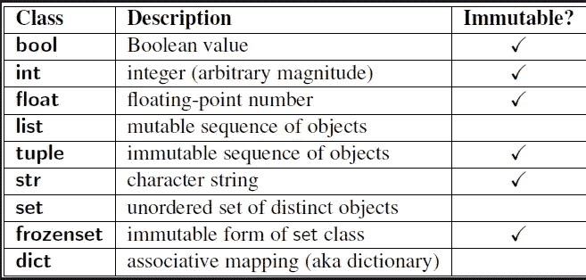

# 不要用 Python 的列表乘法([n] * N)

> 原文：<https://towardsdatascience.com/dont-use-python-s-list-multiplication-n-n-450c68d673a3>

## 意见

## 这是个陷阱


照片由[像素](https://www.pexels.com/)上的[像素](https://www.pexels.com/photo/abstract-arachnid-art-black-and-white-206901/)拍摄

无论您是新手还是有经验的 Python 程序员，都有可能使用过列表乘法和/或在那些“很酷的 Python 特性”风格的文章中读到过它。

这是因为它无疑是那些旨在使您的 Python 生活更容易的很酷的特性之一。

列表乘法的好处是它抽象了初始化列表的过程。

不使用迭代方法或列表理解:

```
# Iterative approach
my_list = []
for _ in range(N):
    my_list.append(n)# List comprehension
my_list = [n for _in range(N)]
```

您可以通过以下方式获得相同的结果:

```
my_list = [n] * N
```

你看，我是按照以下顺序学习编程语言的:

```
C -> C++ -> MATLAB -> R -> Python.
```

在 Python 之前，我使用过的任何其他编程语言都无法提供如此的简洁和直观。

然而，随着我开始编写越来越复杂的代码，列表乘法开始让我心烦。

我记得有一次我花了整整一个下午调试代码，结果发现问题源于使用`*`操作符创建不正确的列表。

因此，我觉得有必要讨论一下这个问题，因为我知道一个事实，一些开发人员仍然没有注意到 star 操作符在列表创建方面的权衡。

## 列表乘法有什么问题

让我们考虑下面的代码:

```
>>> my_list = [0] * 3
>>> my_list[0] = 1
>>> my_list
[1, 0, 0]
```

这是你所期望的。到目前为止，一切顺利。

现在，让我们尝试使用相同的方法创建一个 2D 阵列:

```
>>> my_list = [[0] * 3] * 5
>>> my_list[0][0] = 1
>>> my_list
[[1, 0, 0], [1, 0, 0], [1, 0, 0], [1, 0, 0], [1, 0, 0]]
```

嗯！这可能不是你想要的。

通过初始化一个 3D 数组来进一步推动它怎么样:

```
>>> my_list = [[[0] * 3] * 5] * 2
>>> my_list[0][0][0] = 1
>>> my_list
[[[1, 0, 0], [1, 0, 0], [1, 0, 0], [1, 0, 0], [1, 0, 0]], [[1, 0, 0], [1, 0, 0], [1, 0, 0], [1, 0, 0], [1, 0, 0]]]
```

预期的输出是更新子列表`[0, 0, 0]`的第一个值。然而，似乎这个更新在所有的子列表中都被复制了。

那么，为什么会这样呢？

## 列表乘法是如何工作的？

为了理解前面的行为，有必要重温一下 Python 的 [FAQ](https://docs.python.org/3/faq/programming.html#faq-multidimensional-list) ，其中写道:

> 原因是用`*`复制一个列表不会创建副本，它只会创建对已有对象的引用

让我们将其转化为代码，以便更好地理解 Python 在幕后是如何操作的:

*   **列表乘法:**

```
my_list = [[0] * 5] * 5
for i in range(5):
    print(id(my_list[i]))
```

输出:

```
2743091947456
2743091947456
2743091947456
2743091947456
2743091947456
```

*   **使用 for 循环**

```
my_list = []
for _ in range(5):
    my_list.append([0] * 5)for i in range(5):
    print(id(my_list[i]))print(my_list)
```

输出:

```
2743091947456
2743095534208
2743095532416
2743095534336
2743095532288
```

*   **释义**

与`for`循环不同，通过操作符`*`复制的所有列表都指向同一个内存地址。这意味着影响一个嵌套列表的任何改变都会影响所有其他列表，这显然违背了我们的初衷。

现在的问题是:

*   为什么第一个例子`([n] * N)`工作得很好，尽管列表中的所有元素都引用同一个对象？

事实证明，这种行为背后的原因(如 Python 的 [wikibook](https://en.wikibooks.org/wiki/Python_Programming/Lists#List_creation_shortcuts) 中所述)是列表是可变项，而`int, str`等是不可变的。看看这个:



[来源](https://community.insaid.co/hc/en-us/community/posts/360016423234-Mutable-vs-Immutable-in-Python-numpy-Pandas)

因为不可变的对象不能被改变，所以当你更新列表中的一个条目时，Python 会创建一个新的(不同的)对象引用。

```
>>> my_list = [0] * 3
>>> id(my_list[0])
1271862264016
>>> my_list[0] = 1
>>> id(my_list[0])
1271862264048
```

## 工作区

解决这个问题的一个快速简单的方法是使用列表理解。当然，这是在标准的`for`循环之外的。

```
>>> my_list = [[0] * 3 for _ in range(5)]
>>> my_list[0][0] = 1
>>> my_list
[[1, 0, 0], [0, 0, 0], [0, 0, 0], [0, 0, 0], [0, 0, 0]]
```

此外，我们可以看到不同的内存地址被分配给每个列表。

```
>>> my_list = [[0] * 3 for _ in range(5)]
>>> [id(l) for l in my_list]
[1271867906112, 1271864321536, 1271864322048, 1271864326912, 1271864322560]
```

更重要的是，这种方法适用于所有场景。

所以，你为什么不坚持下去，为了安全起见，而不是在使用列表乘法之前必须三思呢？

## 结论

我不是 Pythonic 句法糖的超级粉丝。

是的，我同意这有助于代码简洁明了。

然而`conciseness == readability`在软件行业是什么时候？

事实上，我用 Python 编写的代码越多，我就越倾向于使用 Python 标准语法和放弃快捷方式。

说到底，重要的是*性能*、*可维护性*，以及*可读性*。而不是你有多少行代码。

如果你不能没有捷径，至少读一读你正在使用的语法糖的好的、坏的和丑陋的。在这种情况下，可能需要对软件工程概念(即数据结构、内存分配……)有一定的理解。

*快乐编码！*

*如果你觉得这个有用，可以考虑成为* [*高级*](https://ayarmohammed96.medium.com/membership) *会员。如果用这个* [*链接*](https://ayarmohammed96.medium.com/membership) *，我会得到一个小切。*

[](https://ayarmohammed96.medium.com/membership) 