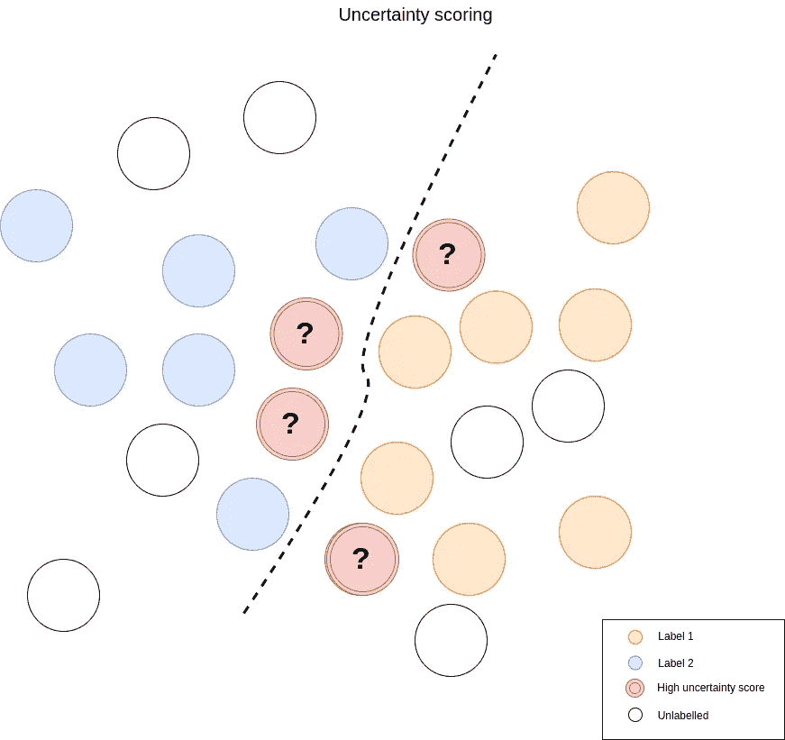
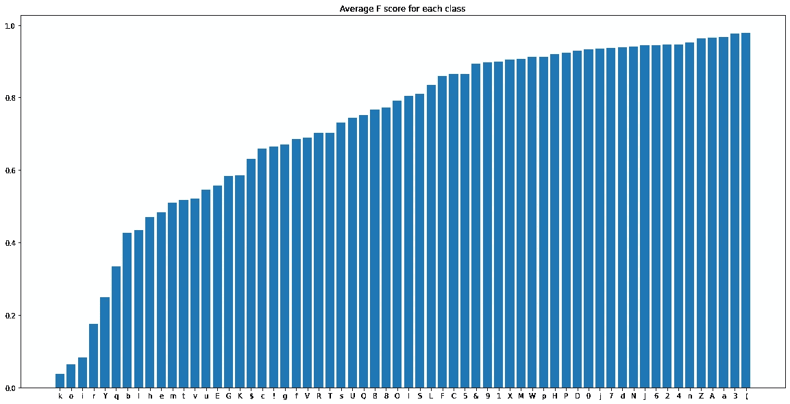
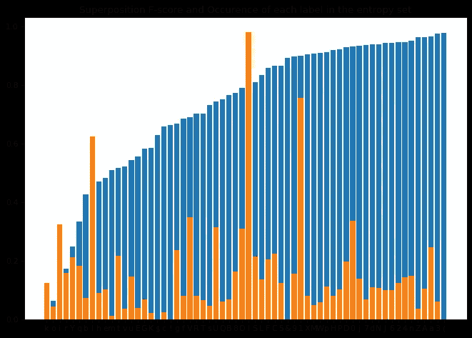
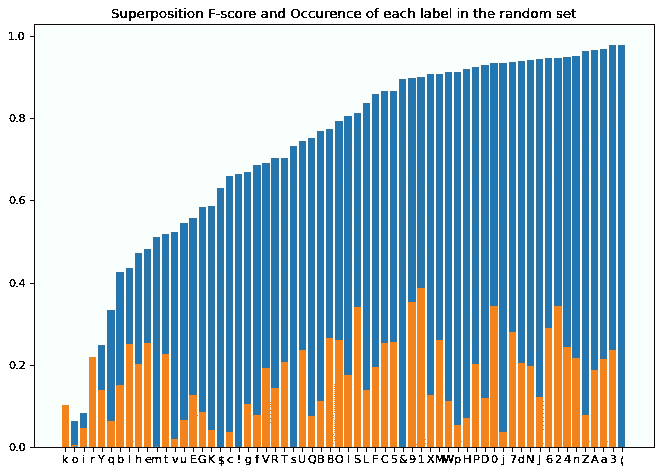
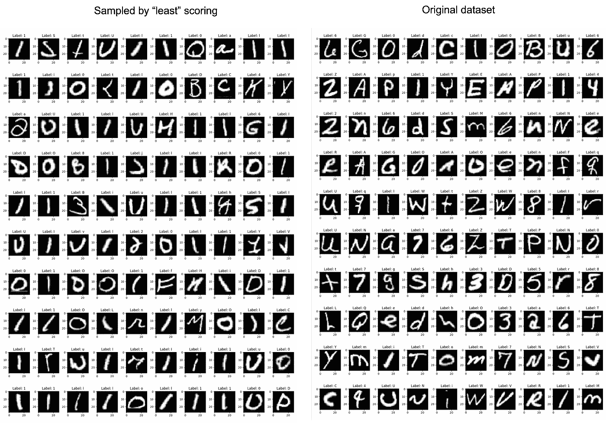
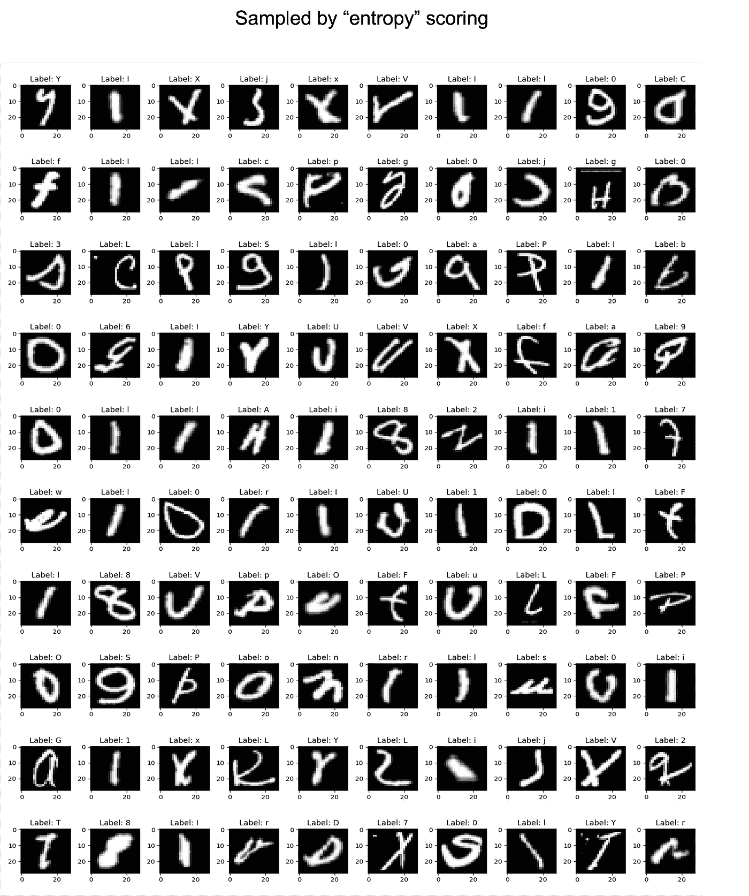

# 不要浪费你未标记的数据

> 原文：<https://towardsdatascience.com/dont-waste-your-unlabeled-data-9bb778743b41>

## [行业笔记](https://towardsdatascience.com/tagged/notes-from-industry)

# 不要浪费你未标记的数据

## 评估您的模型的弱点，并在可用数据中确定最具信息性的数据样本。


不确定性之光。迈克尔将抱在[的 Unsplash](https://unsplash.com/photos/jPhXEmOxt0w) 上。

# 以数据为中心的方法

在过去的十年里，人工智能的主要趋势是专注于建立创造性的复杂模型。但是最近几年，任何人都可以用 Python 等流行语言和 Pytorch、Tensorflow、JAX 等库来使用最先进的架构。**现在，人工智能的最高优先级是让这些模型对每个特定的用例都有价值**。这需要对可用的精选数据有深刻的理解，不幸的是，数据分析和如何建立一个良好的训练集是经典 ML 课程中很少教授的技能，而是通过时间和汗水学习的。

到目前为止，数据并不被认为是一个主要问题:可变大小的标准研究数据集是免费的( *ImageNet，COCO，GLUE 等*，以及预训练模型的权重( *ModelZoo，Huggingface* 等)，作为对特定数据子集进行微调的先验知识。除此之外，在小规模数据集上训练本地模型成为一种商品。但在实践中，在生产阶段成功制作 ML 模型是一个难题。

失败的主要原因之一是研究模板上的模型和现实环境中部署的模型之间的准确性损失。事实上，这些公司中有 13%的模型能够投入生产[7]。

当我们知道随着 AutoML 平台的兴起，甚至模型搜索也已经自动化时，这似乎很令人惊讶。瓶颈是什么？

**瓶颈是数据**。下一个需要强大框架和标准化的挑战是处理数据的管道。行业中的人工智能可能需要从以模型为中心的方法后退一步，转向以数据为中心的方法。以数据为中心的方法试图将模型开发与训练数据集的创建和模型性能的监控协调起来。

> “并非所有数据都是生而平等的”——詹妮弗·普伦斯基

## 不确定性的量化

因为真实世界的数据是杂乱的、嘈杂的、错误的、充满离群值的，并且不遵循正态分布，所以量化不确定性对于构建可信的人工智能模型至关重要。选择好你输入的数据。剔除可疑数据。避免致命的垃圾进，垃圾出，节省时间和金钱。除非我们可以信任模型预测，否则它几乎毫无用处。为了发现这些病态数据，我们将探索作为数据质量代理的模型的不确定性。**我们想确定数据在哪里混淆了模型。**

## **不确定性的原因有哪些？**

不确定性有许多原因。当训练和测试数据集的分布不匹配时，推理中可能出现不确定性。当数据类重叠或数据本身有噪声时，它也会出现。一般来说，我们应该意识到数据集中不确定性的原始来源，以便创建一个有效的策略来尽可能地减少它。

在主动学习文献中，这些不确定性被分为两大类:**认知**和**任意**不确定性。一方面，随机不确定性是由数据的噪声产生的，并且在同一实验的每次运行中都会有所不同。这种不确定性是不可减少的，因为它是数据的固有属性。另一方面，认知的不确定性可以通过学习来减少。通过增加数据集大小或使模型复杂化。


两种不确定性的示意图。图自开篇:【https://arxiv.org/pdf/2011.06225.pdf 

## 从理论到实践

默认情况下，我们经常错误地将 softmax 函数输出的每个标签的概率视为每个标签的模型置信度。这种误解可以通过使用一种简单的技术来避免:考虑每个 softmax 输出相对于其他标签或其他实例的相对值。

在本文中，我将分享扫描所有可用数据(标记的或未标记的)的标准技术，以帮助对数据和模型的当前状态做出以数据为中心的结论。这些技术根据模型对其预测标签的置信度来排列每个数据点。我们可以使用不同的函数，将“不确定性”分数归属于每个数据点。高度不确定性意味着模型对该数据点不确定，推断很可能是错误的。



用不确定性分数识别类边界附近的实例。图片由作者提供，灵感来自[1]。

## 为什么我们应该尝试自动化每个可用数据点的评分？

*   利用现有数据和模型
*   在数据集中查找边缘案例
*   查找质量差的数据以重新标记或从训练数据集中排除
*   通过追踪歧义来澄清标签说明
*   找到当前模型的弱点
*   识别新传入数据的数据漂移
*   误差分析，以找出下一个要标记的样本
*   查找异常值

考虑到我们将模型投入生产的不断发展的世界，持续改进数据是必要的一步。我听说过一个保龄球图片分类器的故事，当 COVID 开始时，因为社交媒体在这件事上的趋势，它将空卫生纸架上的图像标记为保龄球图片。我们永远不知道未来的数据会是什么样子，我们应该始终意识到我们让数据溜进我们的模型预测。

## 我们的实验

在本文中，我们评估了为 CNN 模型提供分类的图像。我们将使用 EMNIST 进行实验。

我们使用 softmax 根据最后一个激活函数计算的输出逻辑创建概率分布。Softmax 无法提供模型确定性的概率，并且正在丢失信息，因为它使用指数，所以它丢失了数字的比例([1，4，2，1]将产生与[101，104，102，101]相同的分布)。但我们仍然可以使用 softmax 作为模型可信度的代理，并从高模型可信度到低模型可信度对我们的数据样本进行排序。

> “没有算法能在坏数据中存活”——罗伯特·莫纳克

# 不确定性评分

我们希望将数据标注在我们的模型最混乱的地方——不确定性。因此，对于每个数据点，我们将为所有未标记的数据点给出单个**不确定性分数**，并**将它们从最不确定性到最不确定性**进行排序。

该方法是不确定性量化的最简单、最便宜的方法。**您可以识别位于模型决策边界附近的数据点**。

对于一个数据点，您的模型:

*   给不同的类一个相似的 softmax 概率(例如，输入图像是狗，输出 softmax 是:狗 33.3%，猫 33.3%，鸟 33.3%)
*   将低概率赋予最高概率(例如，在十个等级中，最高的 softmax 是“青蛙”, softmax 为 10.5%)

我们将按照从简单到复杂的顺序列出评分技术。

我们称 *p_max* 为针对一幅图像推断出的类的最高 softmax 分数，称 *p_2nd* 为针对一幅图像的类的第二高置信度。 *n* 为分类的类数。

对于下面的每个函数，输入 *prob_dist* 是一个数据点的 softmax 输出数组，输出是该数据点的模型的 0 到 1 之间的不确定性分数。如果数据集是具有三个类的多类分类， *prob_dist* 的形状为(3，)。

## 评分类型:

*   **最小置信度**(最大置信度预测和 100%置信度之间的差值)


我们希望选择在最可能的类别中可信度最低的实例。假设我们有两个图像 A 和 B，模型的最高 softmax logit 分别是 A 的 0.9 和 B 的 0.3。在这种情况下，我们可能希望了解 B 看起来是什么样子，处理，(重新)标记或删除它。

我们使用为每个数据点计算的标准化“最小”不确定性分数(公式(1))。由于最有可能的实例的最低置信水平不能低于 *1/n* ，我们添加了标准化分数，以将不确定性分数从 0 调整到 1。

该分数将给出预测的等级顺序，其中我们希望对预测标签置信度最低的项目进行采样。

这种评分技术只取决于最有信心项的信心，而不关心第二个或第 n 个信心分。

*   **置信区间**


边际置信度取一个数据点的两个最有把握的预测之间的差值。我们可以通过将结果减去 1(公式(2))将该差值转换为[0–1]范围。这次你只关心两个最高类别中两个最高分的差。这个差值越小，越接近 1，你就越不确定。与最小置信度得分相比，该算法对 softmax 基数不太敏感，但仍然敏感。

*   **置信度**(两个最有把握的预测之间的比率)


比率评分函数是置信区间评分的变体。这个不确定性分数看两个最高分数的比率(3)。该比率作为用于 softmax 的基数的乘数给出，因此与前两种方法不同，它对 softmax 基数不敏感。它捕捉到第一个标签比第二个标签更有可能。

*   **基于熵的**(所有预测之间的差异)


熵分数考虑了所有类别的预测。它是通过将概率的负和乘以其 log_2 概率来计算的。

我们除以 log_2(n)来归一化 0 和 1 之间的熵(等式(4))。

2 作为对数的基数是不改变排名的任意基数，即使它将单调地改变绝对不确定性分数。

# **实验设置**

我们举例说明两个评分函数的结果(**最小**和**熵**)。我们首先在一半的 **EMNIST** 数据集(130，106 张图片)上训练一个简单的两层 CNN。然后，我们预测所有看不见的数据点的类别，并根据它们的不确定性得分对它们进行排序。我们对前 1000 幅图像进行采样，给出它们的不确定性分数。

我们的 CNN 由两个卷积层组成，每个卷积层之后是 RELU 激活，然后是两个完全连接的层。在验证准确度开始降低之前，我们在第 6 个时期停止训练。我们在验证集上获得了 0.79 的 F1 分数。

您可以在以下位置找到培训代码:[https://github . com/ble DEM/active-learning/blob/master/run _ experiment . py](https://github.com/bledem/active-learning/blob/master/run_experiment.py)

以及用于采样前 1000 个图像作为新数据集，位于:[https://github . com/ble DEM/active-learning/blob/master/create _ new _ set . py](https://github.com/bledem/active-learning/blob/master/create_new_set.py)

## 结果

我们查看在验证集上每个类的平均 F1 分数最高和最低的类。

F1 分数最低的类别(F1 <50%) are:

```
'k' 'o' 'i' 'r' 'Y' 'q' 'b' 'l' 'h' 'e' 'm'
```

and the classes with the highest F1 score (F1> 95%)是:

```
'n' 'Z' 'A' 'a' '3'
```



每级 F1-验证数据集中的分数。

现在让我们来看看根据不确定性得分排名的前 1k 张图片。为了便于比较，我们还随机抽取了 1k 的样本。


使用“最少”评分技术从看不见的数据中分配 1k 个采样数据点。

从上图可以看出，我们对容易混淆的字符进行了过采样:“I”、“1”、“l”或“O”、“O”、“0”。

在下图中，我们将每个类的 F1 分数与使用熵不确定性评分函数采样的 1k 的不同类之间的实例分布进行了比较。我们在“容易混淆”的类中发现一个高峰，这在随机采样的数据集中不会发生。



验证数据集(蓝色)上的 F1 分数与“最少”技术得出的样本集中每个类的百分比的叠加。



验证集(蓝色)和随机采样的 1k(橙色)上 F1 分数的叠加。

我们在下面展示了一些 EMNIST 图像作为前 1k 不确定推理的例子。当我们查看基于“最少”或“熵”的样本时，我们可以清楚地看到标签中的噪声(例如 S 标记为 0)和图像本身(模糊、不可读的字符)。



随机采样的图像(右)和模型置信度最低的图像(左)之间的比较。



给定“熵”不确定性分数的高不确定性图像(低模型置信度)的示例。

# 在实践中使用不确定性评分

使用不确定性分数对新标注任务的数据批次进行采样是标记未知数据集中最具信息量的数据点的有效方法。然而，正如我们所看到的，我们应该注意不要系统地对过度表示的类及其近邻中的相似数据点进行过采样。

我们在这里列出了使用上面介绍的评分方法的利弊:

**优点:**

*   使用现有/标准模型
*   快速且易于计算和解释。
*   如果您的模型使用传统的机器学习(而不是深度学习)，请创建一批新的信息数据样本进行标记

**缺点:**

*   这些简单的评分函数不应用于为深度学习的新批量任务选择数据点。由于潜在的采样偏差，在对这些采样数据进行训练后，模型的性能可能比随机采样差[5]。
*   使用贝叶斯深度学习创建高维数据(图像、文本等)的采样策略更安全。).

## 复制不确定样品的注意事项


图片由[穆罕默德·道迪](https://unsplash.com/@ahsanjaya)拍摄

使用不确定性量化方法可以非常有效地在未标记的数据中找到位于模型边界上的样本。但是，在为下一批注释选择要采样的数据点时要小心。该抽样单独评估每个未标记点的信息量。如果您只选择最高不确定性得分数据点，您将检索到一个信息数据点和许多几乎相同的拷贝。如果你天真地获得了前 k 个最有信息的点，你可能最终也会问 k 个几乎相同的点。这将使您的样本批次的贡献低于随机抽样批次。例如，在 EMNIST 实验中，如果你观察熵采样技术，你可以看到字符“I”，“1”，“l”被大量采样。

为了避免这种重复采样效应，一些研究论文提出了补充方法，如 BatchBALD 等批量感知采样技术解决方案[2]。在本文中，作者不仅关注每个样本的不确定性得分，还关注为下一批训练样本提供最丰富的信息。

使用 wise 采样构建注释的智能批处理[1]:

*   最小化样本量，以确保从每个数据点获得最大收益。
*   最大化样本量，以避免过于频繁的重新训练。

# **关于智能采样的更多信息**

## 1)异议评分:

评估每个未标记数据点的不确定性的另一种流行的启发式方法被称为委员会的**查询**方法。如果您有一组模型，您也可以通过获取每个模型的每个数据点的所有分数来调整不确定性评分。您在初始训练集上训练几个不同的模型，您可以查看它们在未标记数据上的分歧。

例如，我可以在相同的训练集上用不同的超参数训练相同的 CNN，然后将它们应用于未标记的数据，并使用它们的不一致来选择下一个要标记的样本。

当您想要评估预测中 softmax 置信度不可用的回归任务的不确定性分数时，此方法特别有用。

**辍学策略**

如果你没有一个集合模型，你可以为每个数据点画出不同的预测，其中每个新的预测是在每次丢弃不同的随机选择的神经元之后做出的。正常情况下，退出仅在训练期间应用，所有神经元在测试期间都被激活。但是如果我们在测试中也应用 dropout，我们可以为每个实例推断出一系列不同的预测。每个样本的不确定性可以计算为所有预测的变化:不一致程度越高，不确定性就越大[1]。这种技术通常被称为*蒙特卡洛退出*技术。蒙特卡洛是一种计算技术，它从真实分布中随机取样，以获得该分布的估计值。在不确定性估计过程中，我们将来自漏失模型的每个预测视为蒙特卡罗样本。

面向 MC 辍学和其他主动学习技术的开源库:[https://github.com/ElementAI/baal/](https://github.com/ElementAI/baal/)[【论文】](https://arxiv.org/pdf/2006.09916.pdf)

## 2)贝叶斯模型

您可以使用生成贝叶斯模型对每个类的分布进行建模。在这种情况下，您不需要使用概率代理来推断模型预测的可信度，因为您可以从模型输出本身直接读取每个数据点属于每个类的概率。

您可以使用贝叶斯神经网络来估计神经网络的不确定性。在贝叶斯神经网络框架中，在训练期间，你不尝试学习单个函数 f，而是学习类似于集成模型的多个函数。训练之后，我们可以对每个数据点进行平均预测，并计算这些预测之间的方差。可以为从回归到分割的各种任务建立贝叶斯神经网络。它将模型参数视为正态分布以及每个模型参数分布的均值和方差。这些参数通常在训练过程中学习。

## 3)主动学习

我一直专注于给每个未标记的样本分配一个不确定性分数。但是，不确定性量化只占更广泛的主动学习领域的极小一部分。AL 致力于通过标记尽可能少的样本来获得尽可能多的性能增益[3]。理论上，理想的系统会查询位于模型的决策边界上的实例和远离决策边界的实例(离群值、多样性采样、要定义的新类)。不幸的是，还没有一种标准的方法来构建最佳的管道来查询最小的数据样本以获得最高的性能。

## 4)课程学习

另一个非常有趣的研究领域试图通过向模型提供适当的数据点来优化学习。它不是关注未标记的数据，而是关注已经标记的数据。学习任务需要一些时间来为模型提供简单的样本，并在训练过程中一点一点地增加样本的难度，类似于人类。对于不平衡的数据集，相反的策略工作得很好:我们为硬(罕见)实例分配更高的惩罚，以迫使模型学习它们。在实践中，这种先易后难的学习策略是由损失函数的选择来设定的。我鼓励你阅读这篇文章[4]来学习更多关于标记数据中的抽样技术。

# 本文的代码

https://github.com/bledem/active-learning

# 参考

[1] *人在回路机器学习:以人为中心的人工智能的主动学习和注释*，Robert Monarch。

[2]巴特包勒德:[https://oatml.cs.ox.ac.uk/blog/2019/06/24/batchbald.html](https://oatml.cs.ox.ac.uk/blog/2019/06/24/batchbald.html)

【3】*深度主动学习的调查*。、任&肖、昀&常、肖军&黄、王宝耀&李、陈志辉&陈、肖江&王、辛。(2020).[https://arxiv.org/pdf/2009.00236.pdf](https://arxiv.org/pdf/2009.00236.pdf)

[4] *先学哪些样本:容易还是难？*，[欧武](https://arxiv.org/search/cs?searchtype=author&query=Wu%2C+O)，2021。[https://openreview.net/pdf?id=pSbqyZRKzbw](https://openreview.net/pdf?id=pSbqyZRKzbw)

[5] *通过期望改进最大化在 CNN 中主动学习。纳格帕尔，乌代。(2020).[https://open access . the CVF . com/content _ WACV _ 2020/papers/Mayer _ Adversarial _ Sampling _ for _ Active _ Learning _ WACV _ 2020 _ paper . pdf](https://openaccess.thecvf.com/content_WACV_2020/papers/Mayer_Adversarial_Sampling_for_Active_Learning_WACV_2020_paper.pdf)*

[6][https://www.youtube.com/watch?v=Yqj7Kyjznh4&t = 1260s&ab _ channel = deep learning ai](https://www.youtube.com/watch?v=Yqj7Kyjznh4&t=1260s&ab_channel=DeepLearningAI)

[7][https://venturebeat . com/2019/07/19/why-do-87-of-data-science-projects-never-make-it-into-production/](https://venturebeat.com/2019/07/19/why-do-87-of-data-science-projects-never-make-it-into-production/)