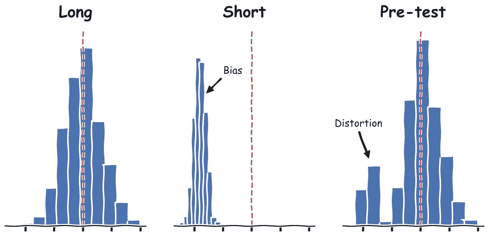
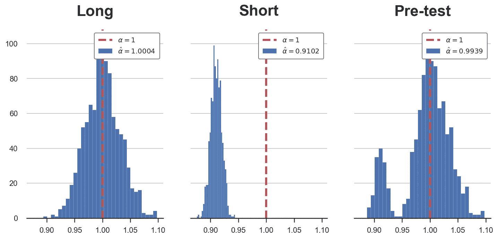
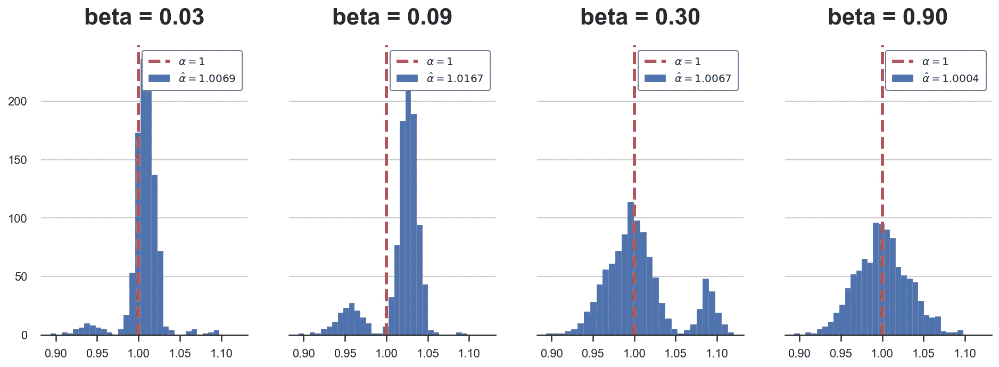
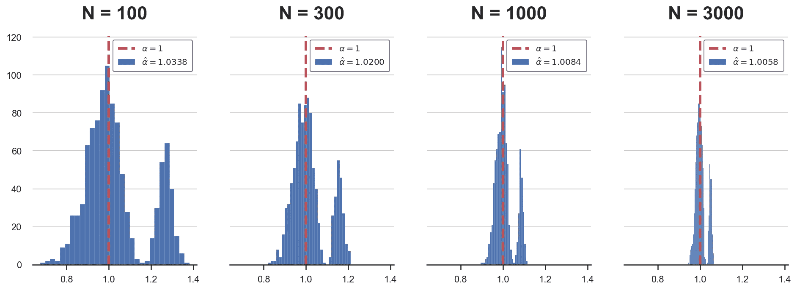

# 双重去偏机器学习(第一部分)

> 原文：<https://towardsdatascience.com/double-debiased-machine-learning-part-1-of-2-eb767a59975b>

## [因果数据科学](https://towardsdatascience.com/tagged/causal-data-science)

## *因果推理、机器学习和正则化偏差*



作者图片

在因果推断中，我们通常通过对其他变量的分析来估计因果影响。我们通常将这些变量称为**控制变量**或**混杂变量**。在随机对照试验或 AB 测试中，条件反射可以通过减少随机化后出现的组间不平衡来增加分析的能力。然而，条件作用在观察性研究中更为重要，在观察性研究中，如果没有随机化，可能[对恢复因果关系](/b63dc69e3d8c)至关重要。

当我们有许多控制变量时，我们可能希望**选择最相关的变量**，可能捕捉非线性和相互作用。机器学习算法非常适合这项任务。然而，在这些情况下，我们引入了一个偏差，称为**正则化或预测试，或特征选择偏差**。在这篇和下一篇博文中，我试图解释偏见的来源和一个非常强大的解决方案，称为**双去偏机器学习**，这可能是过去十年中机器学习和因果推理交叉点上最相关的进步之一。

# 预测试

既然这是一个复杂的话题，那就从一个简单的例子开始吧。

假设我们是一家公司，我们对广告支出对收入的影响感兴趣:广告值得吗？还有很多其他因素可能会影响销售，因此，我们正在考虑在分析中控制过去的销售，以提高我们的分析能力。

假设数据生成过程可以用下面的 [**有向无环图(DAG)**](/b63dc69e3d8c) 来表示。如果你对 DAGs 不熟悉，我在这里写了一个简短的[介绍](/b63dc69e3d8c)。


数据生成过程的 DAG，按作者排序的图像

我从`[src.dgp](https://github.com/matteocourthoud/Blog-Posts/blob/main/notebooks/src/dgp.py)`导入数据生成过程`dgp_pretest()`，从`[src.utils](https://github.com/matteocourthoud/Blog-Posts/blob/main/notebooks/src/utils.py)`导入一些绘图函数和库。

```
from src.utils import *
from src.dgp import dgp_pretest

df = dgp_pretest().generate_data()
df.head()
```


作者图片

我们有关于 *1000 个*不同市场的数据，其中我们观察当前`sales`，在`advertisement`和`past sales`花费的金额。

我们想了解`ads`支出是否能有效增加`sales`。一种可能性是使用以下回归模型对前者进行回归，该回归模型也称为**短模型**。


短回归，作者图片

我们是不是也应该把`past sales` it 纳入回归？那么回归模型将如下，也称为**长模型**。


长回归，作者图片

由于我们不确定是否以`past sales`为条件进行分析，我们可以**让数据决定**:我们可以运行第二次回归，如果`past sales`、 *β* 的影响在统计上是显著的，我们就可以使用长模型，否则，我们运行短模型。

```
smf.ols('sales ~ ads + past_sales', df).fit().summary().tables[1]
```


回归摘要，按作者分类的图像

看来`past sales`对电流`sales`的影响是积极而显著的。因此，我们对我们的规范感到满意，我们的结论是`ads`对`sales`的影响是积极且显著的，95%的置信区间为【0.912，1.029】。

# 偏见

这个过程有一个**问题**:我们没有考虑到这样一个事实，即我们已经运行了一个测试来决定是否将`past_sales`包括在回归中。我们决定包括`past_sales`的事实是因为它的系数*是重要的*对关于`ads`对`sales`、 *α* 的影响的推断有影响。

理解问题的最好方法是通过**模拟**。由于我们可以访问数据生成过程`dgp_pretest()`(与现实生活中不同)，我们可以测试如果我们多次重复这个过程会发生什么:

1.  我们从数据生成过程中抽取一个新样本。
2.  我们在`ads`和`past_sales`上回归`sales`。
3.  如果`past_sales`的系数在 95%的水平上显著，我们从(2)中保留 *α̂-long* 。
4.  否则，我们只对`ads`回归`sales`，并保持系数 *α̂-short.*

我写了一个`pre_test`函数来实现上面的程序。我还保存了两个回归的系数，long 和 short，选择的系数称为**预测试系数**。

**提醒**:我们正在预测`past_sales`对`sales`的影响，但是`ads`对`sales`的影响系数。

我们现在可以绘制估计系数的分布图(通过模拟)。



α̂在模拟中的分布，图片由作者提供

在上面的图中，我已经描述了不同回归规格的模拟的估计系数。

正如我们从第一张图中看到的，如果我们总是运行**长回归**，我们的估计量 *α̂-long* 将是无偏的，并且是正态分布的。然而，如果我们总是运行**短期回归**(第二个图)，我们的估计量 *α̂-short* 会有**偏差**。

**预测试**程序生成一个估计量 *α̂-pretest* ，它是两者的混合:大多数时候我们选择正确的规格，长回归，但有时预测试无法拒绝`past sales`对`sales`、 *H₀:β=0* 没有影响的零假设，我们选择不正确的规格，运行短回归。

重要的是，预测试程序**不会产生有偏估计值**。正如我们在最后一幅图中看到的，估计系数非常接近真实值 1。原因是，在大多数情况下，我们选择短*回归的次数足够小，不会引入偏差，但也没有小到可以进行有效的推断。*

的确，**预测试扭曲了推论**:估计量 *α̂-pretest* 的分布不再是正态分布，而是双峰分布。**的后果**是我们对于 *α* 的置信区间将会有错误的覆盖范围(包含真实的效应，其概率与声称的不同)。

# 什么时候预测试是个问题？

预测试的问题出现是因为运行短回归产生的偏差: [**省略变量偏差(OVB)**](/344ac1477699) 。如果你不熟悉 OVB，我在这里写了一篇[简短介绍](/344ac1477699)。然而，一般来说，我们可以通过忽略 *X* 对 *D* 回归 *Y* 引入的省略变量偏差表示为


作者图片

其中 *β* 是 *X* (我们例子中的`past sales`)对 *Y* ( `sales`)的影响， *δ* 是 *D* ( `ads`)对 *X* 的影响。

预测试是一个**问题**如果

1.  我们运行短回归而不是长回归*和*
2.  偏见的影响是明显的

有什么可以帮助提高(1)，即正确拒绝`past sales`、 *H₀:β=0* 零效应零假设的概率？答案很简单:更大的样本量。如果我们有更多的观察，我们可以更精确地估计 *β* ，并且我们不太可能犯[类型 2 错误](https://en.wikipedia.org/wiki/Type_I_and_type_II_errors)并运行短回归而不是长回归。

让我们模拟不同样本量下的估计系数 *α̂* 。记住，直到现在使用的样本大小是 *N=1000* 。

```
Ns = [100,300,1000,3000]
alphas = {f'N = {n:.0f}':  pre_testing(N=n)['Pre-test'] for n in Ns}
plot_alphas(alphas, true_alpha=1)
```


α̂在模拟中的分布，图片由作者提供

从图中我们可以看出，随着样本量的增加(从左到右)，偏差减小，估计量 *α̂-pretest* 的分布收敛于正态分布。

如果 *β* 的值不同，会发生什么？这可能会影响上一段中的第(2)点，但如何影响呢？

*   如果 *β* 是**非常小的**，将很难检测到它，我们将经常以运行*短*回归而告终，从而引入偏差。然而，如果 *β* 非常小，这也意味着偏差的**幅度很小，因此不会对我们对 *α* 的估计产生太大影响**
*   如果 *β* 非常大**，这将很容易被检测到，我们将经常结束运行*长*回归，避免偏差(尽管偏差会非常大)。**

**让我们模拟不同的 *β* 值下的估计系数 *α̂* 。直到现在使用的真实值是 *β=0.3* 。**

```
betas = 0.3 * np.array([0.1,0.3,1,3])
alphas = {f'beta = {b:.2f}':  pre_testing(b=b)['Pre-test'] for b in betas}
plot_alphas(alphas, true_alpha=1)
```

****

**α̂在模拟中的分布，图片由作者提供**

**从图中我们可以看出，随着 *β* 值的增加，偏置先出现，然后消失。当 *β* 较小时(左图)，我们往往选择短回归，但偏差较小，平均估计值非常接近真实值。对于 *β* 的中间值，偏差是明显的，对推断有明显的影响。最后，对于大值的 *β* (右图)，我们总是运行长回归，偏差消失。**

**但是**一个系数什么时候大或者小**？相对于什么来说是大还是小？答案很简单:相对于**样本量**，或者更准确地说，相对于样本量平方根的倒数 *1/√n* 。原因深植于[中心极限定理](https://en.wikipedia.org/wiki/Central_limit_theorem)，这里就不赘述了。**

**这个想法展示起来容易解释起来难，所以让我们重复上面同样的模拟，但是现在我们将同时增加系数和样本量。**

```
betas = 0.3 * 30 / np.sqrt(Ns)
alphas = {f'N = {n:.0f}':  pre_testing(b=b, N=n)['Pre-test'] for n,b in zip(Ns,betas)}
plot_alphas(alphas, true_alpha=1)
```

****

**α̂在模拟中的分布，图片由作者提供**

**正如我们所见，既然 *β* 与 *1/√n* 成正比，那么无论样本大小如何，失真都不会消失。所以推论永远是错的。**

**虽然取决于样本大小的系数可能听起来**不直观**，但它很好地抓住了**量级**的概念，在这个世界上，我们依靠渐近结果进行推断，首先是[中心极限定理](https://en.wikipedia.org/wiki/Central_limit_theorem)。事实上，中心极限定理依赖于无限大的样本量。然而，对于无限量的数据，没有一个系数是小的，并且任何非零效应都可以确定地检测到。**

# **预测试和机器学习**

**到目前为止，我们讨论了只有两个变量的线性回归。答应我们的**机器学习**在哪里？**

**通常，我们不是只有一个控制变量(或混杂因素)，而是很多。此外，对于这些控制变量进入模型所采用的函数形式，我们可能要灵活一些。一般来说，我们将假设以下模型:**

****

**作者图片**

**在利益效应仍然是 *α* 的情况下， *X* 可能是高维的，我们不会对 *X* 影响 *D* 或 *Y* 的函数形式采取立场。**

**在这种设置中，很自然地使用机器学习算法来估计 *g₀* 和 *m₀* 。然而，机器学习算法通常会引入与预测试相当的**正则化偏差**。**

**可能，“最简单”的思考方式是[套索](https://en.wikipedia.org/wiki/Lasso_(statistics))。Lasso 在 *X* 中是线性的，带有一个惩罚项，有效地执行我们上面讨论的变量选择。因此，如果我们在 *Y* 上使用 *X* 和 *D* 的套索，我们将引入正则化偏差，推论将被扭曲。更复杂的算法也是如此。**

**最后，您可能仍然想知道“为什么模型在治疗变量 *D* 中是线性的？”。在线性模型中进行推断要容易得多，不仅是因为计算原因，也是因为解释原因。此外，如果处理 *D* 是二元的，则线性函数形式不失一般性。一个更强的假设是 *D* 和 *g(X)* 的加性可分性。**

# **结论**

**在这篇文章中，我试图解释正则化偏差是如何出现的，以及为什么它会成为因果推理中的一个问题。这个问题本质上与具有许多控制变量的设置有关，或者当控制混杂因素时，我们希望有一个无模型(即非参数)的设置。这些正是机器学习算法可以发挥作用的设置。**

**在这篇文章的第二部分中，我介绍了一个简单却非常强大的解决方案:双去偏机器学习。**

**</double-debiased-machine-learning-part-2-bf990720a0b2>  

## 参考

[1] A. Belloni，D. Chen，V. Chernozhukov，C. Hansen，[应用于征用权的最优工具的稀疏模型和方法](https://onlinelibrary.wiley.com/doi/abs/10.3982/ECTA9626) (2012)，*计量经济学*。

[2] A. Belloni，V. Chernozhukov，C. Hansen，[高维对照中选择后对治疗效果的推断](https://academic.oup.com/restud/article-abstract/81/2/608/1523757) (2014)，*《经济研究综述》*。

[3] V. Chernozhukov，D. Chetverikov，M. Demirer，E. Duflo，C. Hansen，W. Newey，J. Robins，[用于治疗和结构参数的双/去偏置机器学习](https://academic.oup.com/ectj/article/21/1/C1/5056401) (2018)，*《计量经济学杂志》*。

## 相关文章

*   [理解省略变量偏差](/344ac1477699)
*   [理解弗里希-沃-洛弗尔定理](/59f801eb3299)
*   [Dag 和控制变量](/b63dc69e3d8c)

## 密码

你可以在这里找到 Jupyter 的原始笔记本:

<https://github.com/matteocourthoud/Blog-Posts/blob/main/notebooks/pretest.ipynb>  

## 感谢您的阅读！

*真的很感谢！*🤗*如果你喜欢这个帖子并且想看更多，可以考虑* [***关注我***](https://medium.com/@matteo.courthoud) *。我每周发布一次与因果推断和数据分析相关的主题。我尽量让我的帖子简单而精确，总是提供代码、例子和模拟。*

*还有，一个小小的* ***免责声明*** *:我写作是为了学习所以错误是家常便饭，尽管我尽力了。当你发现他们的时候，请告诉我。也很欣赏新话题的建议！***