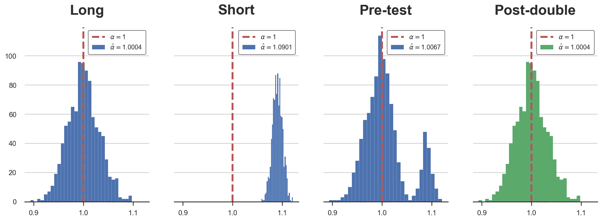
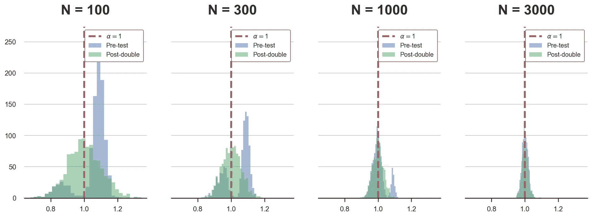
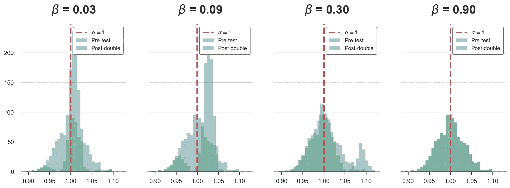
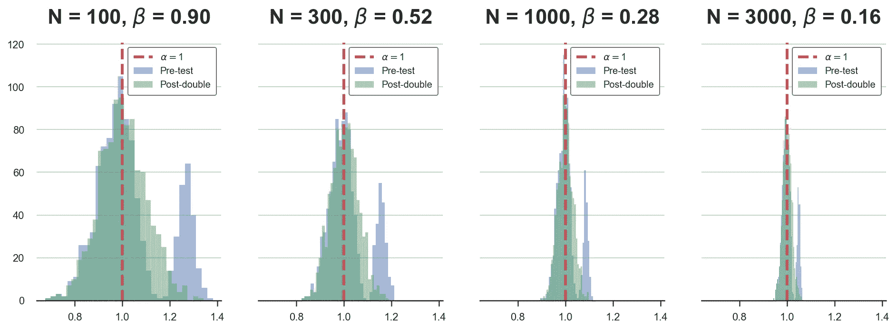

# 双重去偏机器学习(下)

> 原文：<https://towardsdatascience.com/double-debiased-machine-learning-part-2-bf990720a0b2>

## [因果数据科学](https://towardsdatascience.com/tagged/causal-data-science)

## *如何使用后双重选择消除正则化偏差*


作者图片

在因果推断中，我们通常对治疗变量对特定结果的影响感兴趣。在随机对照试验或 AB 试验中，以一组其他变量——**控制变量**或协变量为条件进行分析，可以减少随机化后出现的不平衡，从而提高分析的功效。然而，条件作用在观察性研究中更为重要，在观察性研究中，如果没有随机化，可能[对恢复因果关系](/b63dc69e3d8c)至关重要。

通常，我们对分析的条件变量或函数形式没有强烈的意见，我们可能倾向于**让数据决定**，要么通过变量选择，要么通过灵活的机器学习方法。在这篇博文的[的前一部分，我们已经看到了这种方法是如何扭曲推论的，例如，对感兴趣的因果效应产生错误的置信区间。这种偏差一般称为**正则化偏差**或预测试偏差。](/eb767a59975b)

在这篇博客文章中，我们将探索变量选择问题的解决方案，**后双重选择**，并且我们将介绍一种处理许多控制变量和/或非线性函数形式的通用方法，**双重去偏置机器学习**。

# 概述

为了更好地理解偏见的**来源**，在这篇文章的第一部分，我们探讨了一家公司对测试广告活动的有效性感兴趣的例子。该公司有关于其当前广告支出和销售水平的信息。问题的出现是因为公司不确定是否应该以过去的销售水平作为分析的条件。

下面的 [**有向无环图**](/b63dc69e3d8c) 总结了数据生成过程。


我从`[src.dgp](https://github.com/matteocourthoud/Blog-Posts/blob/main/notebooks/src/dgp.py)`导入数据生成过程`dgp_pretest()`，从`[src.utils](https://github.com/matteocourthoud/Blog-Posts/blob/main/notebooks/src/utils.py)`导入一些绘图函数和库。

```
from src.utils import *
from src.dgp import dgp_pretest

df = dgp_pretest().generate_data()
df.head()
```


作者图片

我们有 1000 个不同市场的数据，我们观察当前的`sales`，在`advertisement`和`past sales`花费的金额。

我们想了解`ads`支出是否能有效增加`sales`。一种可能性是使用以下回归模型，也称为**短模型**，在前者的基础上回归后者。


短模型，作者图片

我们是否应该将`past sales`也包括在回归中？那么，回归模型将如下，也称为**长模型**。


长模型，作者图片

一种简单的方法是**让数据决定**:我们可以运行第二次回归，如果`past sales`、 *β̂* 的估计效果在统计上是显著的，我们就可以使用长模型，否则我们运行短模型。该程序称为**预测试**。

这个程序的问题是它引入了一个偏差，称为**正则化或预测试偏差**。预测试确保该偏差足够小，不会扭曲估计的系数。但是，它不能确保它足够小，不会扭曲估计系数周围的置信区间。

有解决办法吗？是啊！

# 双重选择后

解决方案叫做**后双选**。该方法首先由 [Belloni，Chernozhukov，Hansen (2014)](https://academic.oup.com/restud/article-abstract/81/2/608/1523757) 提出，后来在以 [Victor Chernozhukov](http://www.mit.edu/~vchern/) 为共同标准的各种论文中得到扩展。

作者假设以下**数据生成过程**:


数据生成过程，按作者分类的图像

在我们的例子中， *Y* 对应于`sales`， *D* 对应于`ads`， *X* 对应于`past_sales`，利益效应为 *α* 。在我们的例子中，为了简单起见， *X* 是一维的，但是一般来说，我们对 X 是高维的情况感兴趣，甚至有可能比观察的数量更多的维度。在这种情况下，变量选择在线性回归中非常重要，因为我们不能拥有比变量更多的特征(OLS 系数不是唯一确定的)。

双重选择后由以下**程序**组成。

1.  **缩小形式**选择:套索 *Y* 上 *X* 。选择集合*中的统计显著变量 S₁ ⊆ X*
2.  **第一阶段**选择:在 *X* 上后退 *D* 。选择集合*中的统计显著变量 S₂ ⊆ X*
3.  回归前两步中所选变量的 *D* 上的 *Y* 和**并集**，*s₁*∩*s₂*

作者表明，该程序给出了估计的感兴趣系数 *α̂* 的置信区间，其具有正确的覆盖范围，即 1 型错误的正确概率。

**注(1)** :就变量选择而言，该程序总是比预测试更少节约。事实上，我们仍然选择所有我们在预测试中选择的变量，但是，在第一阶段，我们可能会选择额外的变量。

**注(2)** :术语*第一阶段*和*约化形式*来自计量经济学中的[工具变量](https://en.wikipedia.org/wiki/Instrumental_variables_estimation)文献。的确，后双选择的第一个应用是在 [Belloni，Chen，Chernozhukov，Hansen (2012)](https://onlinelibrary.wiley.com/doi/abs/10.3982/ECTA9626) 中选择工具变量。

**注(3)** :双重选择后这个名字来源于这样一个事实，现在我们不是执行一次变量选择，而是执行两次*。*

## *直觉*

*后置双选背后的思路是:绑定 [**省略变量 bias**](/344ac1477699) 。以防你不熟悉，我写了一篇关于省略变量 bias 的单独的[博文。](/344ac1477699)*

*在我们的设置中，我们可以将省略的变量 bias 表示为*

**

*省略可变偏差，图片由作者提供*

*我们可以看到，省略变量 bias 来自于**与省略变量 *X* 相关的两个量**的乘积:*

1.  *其与结果的偏相关 *Y* ， *β**
2.  *其与治疗的偏相关 *D* ， *δ**

*通过预测试，我们确保 *X* 和结果 *Y* 、 *β* 之间的偏相关为**小**。事实上，我们很少忽略不应该忽略的 *X* (例如，我们犯了类型 2 错误)。*小*和*很少*是什么意思？*

*当我们因为变量的重要性而选择变量时，我们确保对于某个数字 *c* ，它的维数小于 *c/√n* ，其中 *n* 是样本大小。因此，通过预测试，我们确保无论 *δ* 的值是多少，偏置的大小都小于 *c/√n* 。这意味着对于足够大的 *n* ，它收敛到零。这就是为什么预测试估计量仍然**一致**，即对于足够大的样本量 *n* 收敛到真实值。*

*然而，为了让我们的置信区间有正确的覆盖范围，这是不够的。在实践中，我们需要偏置比 *1/√n* 更快地**收敛到零。为什么？***

*为了得到这个结果的一个**直觉**，我们需要求助于[中心极限定理](https://en.wikipedia.org/wiki/Central_limit_theorem)。CLT 告诉我们，对于大样本量 *n* ，随机变量 *X* 的样本均值分布收敛于均值 *μ* 和标准差 *σ/√n* 的正态分布，其中 *μ* 和 *σ* 是 *X* 的均值和标准差。为了进行推断，我们通常将中心极限定理应用于我们的估计量，以获得其渐近分布，这反过来允许我们建立置信区间(使用均值和标准差)。因此，如果偏差没有明显小于估计量的标准差，置信区间就是错误的。因此，我们需要偏差比标准偏差更快地收敛到零**，即比 *1/√n* 更快。***

*在我们的设置中，省略的变量 bias 是 *βδ* ，我们希望它比 *1/√n* 更快地收敛到零。后双重选择保证了*

*   **简化形式*选择:任何“缺失”变量 *j* 有 *|βⱼ| ≤ c/√n**
*   **第一阶段*选择:任何“缺失”变量 *j* 有 *|δⱼ| ≤ c/√n**

*因此，只要省略变量的数量是有限的，省略变量 bias 将以比 *1/√n* 更快的速度 *1/n* 收敛到零。**问题解决**！*

## *应用*

*现在让我们回到我们的例子，测试后双选择程序。在实践中，我们希望做到以下几点:*

1.  ***第一阶段**选择:在`past_sales`上回归`ads`。检查`past_sales`是否有统计学意义*
2.  ***缩小形式**选择:在`past_sales`上回归`sales`。检查`past_sales`是否具有统计显著性*
3.  *在`ads`上回归`sales`，并且仅当在*或*前两个回归中的一个中有意义时，才包括`past_sales`和*

***我从文章的第一部分更新了`pre_test`函数来计算双选择后的估计量。***

***我们现在可以绘制估计系数的分布图(通过模拟)。***

******

****α̂的分布，图片由作者提供****

***正如我们所看到的，双重选择后的过程总是正确地选择长回归，因此估计量具有正确的分布。***

## ***双重检查***

***在上一篇文章中，我们运行了一些模拟来研究预测试偏差何时出现。我们看到预测试是一个问题***

*   ***小样本量 *n****
*   ****β* 的中间值***
*   ***当 *β* 的值取决于样本量时***

***让我们检查后双重选择是否消除了**所有**先前案例中的正则化偏差。***

***首先，让我们模拟不同样本量的后双选择估计量 *α̂-postdouble* 的分布。***

```
***Ns = [100,300,1000,3000]
alphas = {f'N = {n:.0f}':  pre_test(N=n) for n in Ns}***
```

***我们现在可以画出并比较验前估计量和验后加倍估计量的分布。***

******

****α̂的分布，图片作者****

***对于小样本，预测试估计量的分布不是正态分布，而是双峰分布。相反，双精度后估计量在小样本情况下也是高斯型的。***

***现在我们重复同样的练习，但是对于 *β* 的不同值，即`past_sales`对`sales`的系数。***

```
***betas = 0.3 * np.array([0.1,0.3,1,3])
alphas = {rf'$\beta$ = {b:.2f}': pre_test(b=b) for b in betas}
compare_alphas(alphas, true_alpha=1)***
```

******

****α̂的分布，图片作者****

***同样，无论 *β* 的值如何，双选择后估计器都具有高斯分布，而预测试估计器则存在正则化偏差。***

***对于最后的模拟，我们同时改变系数和样本大小。***

```
***betas = 0.3 * 30 / np.sqrt(Ns)
alphas = {rf'N = {n:.0f}, $\beta$ = {b:.2f}':  pre_test(b=b, N=n) for n,b in zip(Ns,betas)}
compare_alphas(alphas, true_alpha=1)***
```

******

****α̂的分布，图片作者****

***此外，在最后一种情况下，后双精度选择在模拟中具有正确的高斯分布。***

# ***双重去偏机器学习***

***到目前为止，我们只分析了一个线性的单变量例子。如果 *X* 的维数增加，我们不知道 *X* 通过什么函数形式影响 *Y* 和 *D* 会发生什么？在这些情况下，我们可以使用机器学习算法来揭示这些高维非线性关系。***

***[Chernozhukov、Chetverikov、Demirer、Duflo、Hansen、Newey 和 Robins (2018)](https://academic.oup.com/ectj/article/21/1/C1/5056401) 调查这一设置。特别地，作者考虑了下面的部分线性模型。***

******

***数据生成过程，按作者分类的图像***

***其中 *Y* 是结果变量， *D* 是对兴趣的处理， *X* 是潜在的高维控制变量集。**与之前设置的区别**在于，现在我们通过函数 *g()* 和 *m()* 将 *X* 和 *Y* 和 *D* 之间的关系置为未指定。***

## ***天真的方法***

***使用机器学习方法来估计 *α* 的一种简单方法是，例如，构建一个复杂的机器学习估计器来学习回归函数 *αD + g(X)* 。***

1.  ***将样本一分为二:主样本和辅助样本(为什么？参见下面的注释)***
2.  ***使用辅助样本来估计 *ĝ(X)****
3.  ***使用主样本计算 *Y* 在 *X* 上的正交分量:***

******

***作者图片***

***4.在 *D* 使用主样本估计回归 *û* 的剩余 OLS 估计量***

******

***作者图片***

***这个估算器会有两个问题:***

1.  ***收敛速度慢，即比 *√n* 慢***
2.  ***它会有偏差，因为我们采用了高维正则化估计量(例如，我们正在做变量选择)***

*****注(1)** :到目前为止我们还没有谈到，但是变量选择程序还引入了另一种类型的偏倚:**过拟合偏倚**。这种偏差的出现是因为用于选择变量的样本与用于估计感兴趣系数的样本是相同的。这种偏差**很容易通过样本分割**解决:在选择和估计过程中使用不同的子样本。***

*****注(2)** :为什么可以用第三步的残差来估计第四步的 *α* ？因为[弗里希-沃-洛弗尔定理](/59f801eb3299)。如果你不熟悉它，我已经在这里写了一篇关于弗里希-沃-洛弗尔定理的博文。***

## ***双重正交化***

*****双去偏机器学习**通过重复正交化过程**两次**来解决问题。双重选择后的想法是相同的:通过执行两次变量选择来减少正则化偏差。由于[弗里希-沃-洛弗尔定理](/59f801eb3299)，估计器仍然有效。***

***实际上，双去偏机器学习由以下**步骤**组成。***

1.  ***将样品一分为二:主样品和辅助样品***
2.  ***使用辅助样本估计 *ĝ(X)* 从***

******

***作者图片***

***3.使用辅助样本从下式估计 *m̂****

******

***作者图片***

***4.使用主样本计算 *D* 在 *X* 上的正交分量为***

******

***作者图片***

***5.使用主样本估计双剩余 OLS 估计量为***

******

***作者图片***

***估计量是**根-N 一致**！这意味着，随着样本量的增加，不仅估计量收敛到真实值(即它是一致的)，而且它的标准差也收敛到真实值(即它是根-N 一致的)。***

***然而，由于样本分裂，估计器仍然具有较低的收敛速度。该问题通过反转分割样本、重新估计系数并对两次估计取平均值来解决。请注意，这一程序是有效的，因为两个估计是独立的样本分裂程序。***

## ***警示故事***

***在我们结束之前，我必须提到最近由 [Hünermund，Louw 和 Caspi (2022)](https://arxiv.org/abs/2108.11294) 发表的一篇研究论文，其中作者表明，如果盲目应用，双去偏置的机器学习很容易**适得其反**。***

***问题与**坏的控制变量**有关。如果你从未听说过这个术语，我已经在这里写了一篇关于好的和坏的控制变量的介绍性的[博文](/b63dc69e3d8c)。简而言之，以额外特征为分析条件并不总是有利于因果推断。根据不同的设置，可能存在一些我们想在分析中忽略的变量，因为它们的**包含**可能会使兴趣系数产生偏差，从而妨碍因果解释。最简单的例子是治疗变量 *D* 和结果变量 *Y* 的常见结果变量。***

***双去偏机器学习模型隐含地假设控制变量 *X* 是结果 *Y* 和治疗 *D* 的(弱)**共同原因**。如果是这种情况，并且在 *X* 和 *Y* 之间不存在进一步的中介/间接关系，则没有问题。但是，例如，如果控制 *X* 中的某个变量是一个共同的结果，而不是一个共同的原因，那么它的包含将会使感兴趣的系数产生偏差。此外，该变量可能与结果 *Y* 或治疗 *D* 高度相关。在后一种情况下，这意味着后双重选择可能会包括它，而在简单选择的情况下则不会。因此，在存在不良控制变量的情况下，双去偏的机器学习可能比简单的预测试更糟糕。***

***简而言之，对于任何方法来说，**至关重要的是**清楚地理解该方法的假设，并始终检查潜在的违规行为。***

# ***结论***

***在这篇文章中，我们看到了如何使用后双重选择，更一般地说，双重去偏置机器学习来消除偏置的一个重要来源:正则化偏置。***

***Victor Chernozhukov 及其合作者的这一贡献无疑是过去十年中因果推理最相关的进步之一。它现在被业界广泛采用，包含在最常用的因果推理包中，如 [EconML](https://econml.azurewebsites.net/) (微软)和 [causalml](https://causalml.readthedocs.io/en/latest/) (优步)。***

***如果你(可以理解)觉得需要更多关于双去偏置机器学习的材料，但你不喜欢阅读学术论文(也很容易理解)，这里有一个很好的妥协。***

***在这个视频讲座中，Victor Chernozhukov 亲自介绍了这个想法。视频讲座相对偏重于数学和统计，但你不可能得到比这更合格和直接的来源！***

## ***参考***

***[1] A. Belloni，D. Chen，V. Chernozhukov，C. Hansen，[应用于征用权的最优工具的稀疏模型和方法](https://onlinelibrary.wiley.com/doi/abs/10.3982/ECTA9626) (2012)，*计量经济学*。***

***[2] A. Belloni，V. Chernozhukov，C. Hansen，(2014)，*经济研究综述*。***

***[3] V. Chernozhukov，D. Chetverikov，M. Demirer，E. Duflo，C. Hansen，W. Newey，J. Robins，[用于治疗和结构参数的双/去偏置机器学习](https://academic.oup.com/ectj/article/21/1/C1/5056401) (2018)，*计量经济学杂志*。***

***[4] P. Hünermund，B. Louw，I. Caspi，[双机器学习和自动化混杂选择——一个警示故事](https://arxiv.org/abs/2108.11294) (2022)，*工作论文*。***

## ***相关文章***

*   ***[双去偏机器学习(第一部分)](/eb767a59975b)***
*   ***[理解省略变量偏差](/344ac1477699)***
*   ***[理解弗里希-沃-洛弗尔定理](/59f801eb3299)***
*   ***[Dag 和控制变量](/b63dc69e3d8c)***

## ***密码***

***你可以在这里找到 Jupyter 的原始笔记本:***

***[](https://github.com/matteocourthoud/Blog-Posts/blob/main/notebooks/pds.ipynb) [## Blog-Posts/PDS . ipynb at main matter courthoud/Blog-Posts

### 我博客文章的代码和笔记本。通过在…上创建帐户，为 matteocourthoud/Blog-Posts 的发展做出贡献

github.com](https://github.com/matteocourthoud/Blog-Posts/blob/main/notebooks/pds.ipynb)*** 

## ***感谢您的阅读！***

***我真的很感激！🤗*如果你喜欢这个帖子并且想看更多，可以考虑* [***关注我***](https://medium.com/@matteo.courthoud) *。我每周发布一次与因果推断和数据分析相关的主题。我尽量让我的帖子简单而精确，总是提供代码、例子和模拟。****

****还有，一个小小的* ***免责声明*** *:我写作是为了学习所以出错是家常便饭，尽管我尽力了。当你发现他们的时候，请告诉我。也很欣赏新话题的建议！****