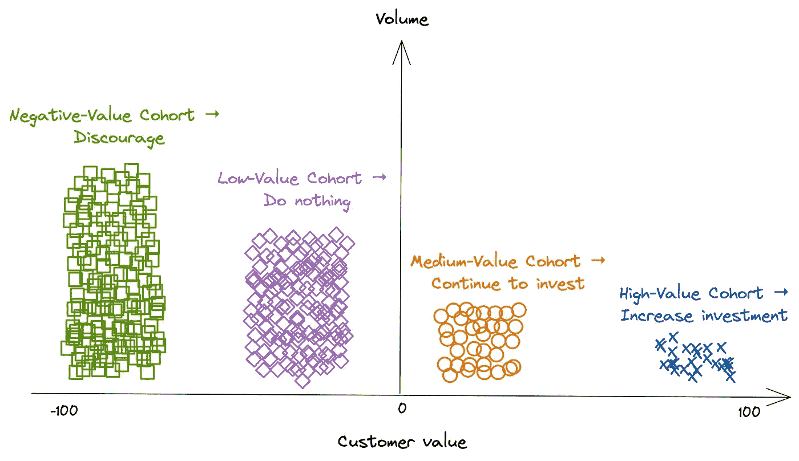
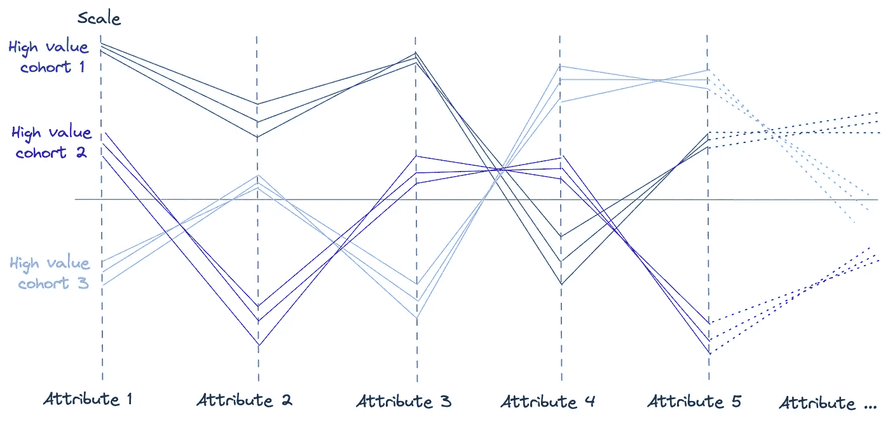

# 对最有价值的客户加倍下注

> 原文：<https://towardsdatascience.com/double-down-on-the-most-valuable-customers-c6ad97689595>

## 利用数据科学定义您的理想客户概况(ICP)

在[用数据科学抓住商业中唾手可得的果实](/seizing-the-low-hanging-fruit-in-business-with-data-science-7b3a3265e07e)中，我提到公司可以通过削减表现不佳的计划来获得巨大的增长机会。纵观各行各业，这些失败的计划都是从错误的受众开始的。例如，如果一家电子产品初创公司试图赢得保守的消费者，它的活动将不会产生什么回报。

发现**理想客户档案(ICP)** 通常比预期更具挑战性。在采访了数百家公司后，很少有人能说出他们 ICP 的足够细节，以至于销售和营销团队可以采取行动来吸引那些马上适合 ICP 的访问者。没有明确的 ICP，企业会无意识地浪费宝贵的资源去追逐不可能的前景。

在这篇文章中，我将谈谈如何借助数据科学来定义 ICP。

# 你理想的客户档案(ICP)是怎样的？

正如罗伯特凯利教授在他的书*关键路径宣言*中讨论的那样，所有的商业活动都应该与关键路径保持一致:为公司创造更多的收入或降低成本。因此，ICP 描述了为公司带来最长期价值的客户。

由于每个公司都有不同的商业模式，其对客户长期价值的定义也各不相同。为了简单起见，我将使用下面的公式来测量值。

**客户的长期价值=客户重复购买的收入—其获取成本**

有了适当的数据跟踪机制，您可能会看到如下的客户价值分布。

作者图片

负价值群体和低价值群体中的来访者多于高价值群体和中等价值群体中的来访者。这两个组之间的划分通常遵循 80/20 规则。在收到广告或浏览公司网站的访问者中，只有 20%或更少的人完成一次或多次购买。

# 那 20%是什么样子的？

找出那 20%是每个公司的梦想；即使那些接近找到它的人也能迅速扩大他们的业务。让我们从小处着手，分析高价值群体，以清楚地了解这 20%的人群。

客户细分是这类分析中最常见的方法。为了说明这种方法，我将继续开头提到的 gadget 启动示例。

两年多来，这家初创公司通过营销活动、浏览历史、购买历史、优惠券使用记录等来跟踪每个访问者的互动。对于每个访问者，创业公司收集 100+属性。通过主成分分析、聚类和其他算法，高价值群组可以进一步细分为三个较小的群组，每个群组的属性分布如下所示。

作者图片

虽然算法可以自动生成群组，但解读群组依赖于企业经营者的行业和产品知识。在这个例子中，他们很快得出结论，第 1 组喜欢购买最新型号，第 2 组喜欢打折购买，第 3 组经常购买作为礼物。

# 如何吸引那 20%的人

除了这些标签之外，访问者与营销活动的互动等属性暗示了如何吸引他们；他们的浏览历史揭示了他们对客户体验偏好的细节。有了这些认识，公司可以调整方法来吸引每个高价值群体。

*   **根据客户偏好调整产品和信息**

利用数据，这个小工具创业公司可以为每个产品和每个客户群个性化其营销信息。例如，历史数据显示，群组 1 对关于酷极客功能的活动反应积极。另一方面，第二组更多地参与宣传使用新设备的实际好处的活动。

*   **在顾客出现的地方展示产品**

群组 1 和群组 2 可能转向不同的地方购买他们的电子产品。例如，群组 1 可能会信任那些谈论最新最棒的科技产品并在观看拆箱视频后进行购买的 YouTubers。与此同时，第二代人喜欢去好市多(Costco)购物，购买打折的小玩意。因此，与技术影响者合作有助于公司吸引第一批顾客，而与批发商店合作可以加快向第二批顾客的销售。

# 关注最有价值的客户

作者图片

你可能已经发现，发现和吸引每个高价值的子群体需要付出巨大的努力。然而，获得客户并不是故事的结尾。收购后留住这些客户也需要优质的服务。由于每个公司都必须处理的资源限制，如果公司将资源分散到各个方面，那么公司对其有价值客户的服务将受到负面影响。

你还想把注意力花在那 80%的人群上吗？

在接下来的文章中，我将继续深入客户获取主题。如果你同时想聊聊他们，请随时通过 [Linkedin](https://www.linkedin.com/in/ivylc/) 联系我。