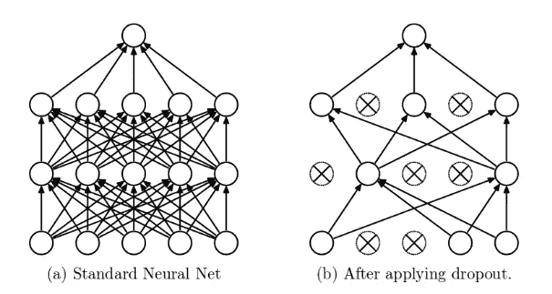
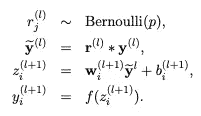

# 神经网络中的辍学

> 原文：<https://towardsdatascience.com/dropout-in-neural-networks-47a162d621d9>

## 丢弃层是减少神经网络过拟合的常用方法。它是现代深度学习时代的地下规则之王。

在这个深度学习的时代，几乎每个数据科学家都必须在他们构建神经网络的职业生涯中的某个时刻使用过 dropout 层。但是，为什么辍学如此普遍？辍学层内部是如何运作的？它解决了什么问题？除了退学还有别的选择吗？

图 0:印度的 Jharokhe，去掉一些光(图片由作者提供)

如果您有关于辍学层的类似问题，那么您就来对地方了。在这篇博客中，你会发现著名的辍学层背后的错综复杂。完成这篇博客后，你会很舒服地回答与辍学有关的不同问题，如果你是一个更具创新精神的人，你可能会提出一个更高级版本的辍学层。

我们开始吧…:)

# **概述**

本博客分为以下几个部分:

1.  简介:它试图解决的问题
2.  什么是辍学？
3.  它是如何解决问题的？
4.  辍学实施
5.  推理过程中的遗漏
6.  它是如何构思的
7.  Tensorflow 实现
8.  结论

# 介绍

因此，在深入了解它的世界之前，让我们先来解决第一个问题。我们试图解决的问题是什么？

深度神经网络具有不同的架构，有时很浅，有时很深，试图在给定的数据集上进行概括。但是，在努力从数据集中学习不同特征的过程中，他们有时会学习数据集中的**统计噪声**。这无疑提高了模型在训练数据集上的性能，但在新的数据点(测试数据集)上却失败了。这就是**过拟合的问题。**为了解决这个问题，我们有各种惩罚网络权重的正则化技术，但这还不够。

减少过度拟合的最佳方式或调整固定大小模型的最佳方式是从所有可能的参数设置中获取平均预测值，并汇总最终输出。但是，这在计算上变得过于昂贵，并且对于实时推断/预测是不可行的。

另一种方法是受集成技术(如 AdaBoost、XGBoost 和 Random Forest)的启发，其中我们使用不同架构的多个神经网络。但这需要训练和存储多个模型，随着时间的推移，随着网络越来越深，这将成为一个巨大的挑战。

因此，我们有一个很好的解决方案，称为脱落层。

图 1:应用于标准神经网络的下降(图片由 [Nitish](https://jmlr.org/papers/volume15/srivastava14a/srivastava14a.pdf) 提供)

# 什么是辍学？

> 术语“丢失”是指在神经网络中丢失节点(输入和隐藏层)(如图 1 所示)。与被丢弃节点的所有前向和后向连接都被临时移除，从而在父网络之外创建新的网络架构。节点以 p 的丢弃概率被丢弃。

让我们用给定的输入 x: {1，2，3，4，5}来理解全连接层。我们有一个掉线层，概率 p = 0.2(或者保持概率= 0.8)。在从输入 x 向前传播(训练)期间，20%的节点将被丢弃，即 x 可能变成{1，0，3，4，5}或{1，2，0，4，5}等等。同样，它适用于隐藏层。

例如，如果隐藏层有 1000 个神经元(节点),并且以丢弃概率= 0.5 应用丢弃，则在每次迭代(批次)中将随机丢弃 500 个神经元。

通常，对于输入层，保持概率，即 1-丢弃概率，更接近于 1，0.8 是作者建议的最佳值。对于隐藏层，丢弃概率越大，模型越稀疏，其中 0.5 是最佳保持概率，表示丢弃 50%的节点。

*那么辍学如何解决过度拟合的问题呢？*

# 它是如何解决过拟合问题的？

在过拟合问题中，模型学习统计噪声。准确地说，在给定所有单元(神经元)的情况下，训练的主要动机是减少损失函数。因此，在过度拟合中，一个单元可能以修正其他单元的错误的方式改变。这导致了复杂的协同适应，这又导致了过拟合问题，因为这种复杂的协同适应不能在看不见的数据集上推广。

现在，如果我们使用 dropout，它会阻止这些单元修复其他单元的错误，从而阻止共同适应，因为在每次迭代中，一个单元的存在是非常不可靠的。因此，通过随机删除一些单元(节点)，它迫使各层采取概率方法对输入承担或多或少的责任。

这确保了模型变得一般化，从而减少了过度拟合问题。

图 2: (a)无脱落的隐藏层特征；(b)隐藏的图层特征与丢失(图片由 [Nitish](https://jmlr.org/papers/volume15/srivastava14a/srivastava14a.pdf) 提供)

从图 2 中，我们可以很容易地看出，与没有丢失的层中的共同适应相比，具有丢失的隐藏层正在学习更多的一般化特征。很明显，辍学打破了这种单位间的关系，更注重一般化。

# 辍学实施

说够了！让我们来看看辍学的数学解释。

图 3: (a)训练期间的单元(神经元)以概率 p 存在，并以权重' **w** '连接到下一层；(b)推理/预测期间的单元总是存在的，并且通过权重连接到下一层，' **pw** '(图片由 [Nitish](https://jmlr.org/papers/volume15/srivastava14a/srivastava14a.pdf) 提供)

在丢弃层的原始实现中，在训练期间，以保持概率(1 丢弃概率)选择层中的单元(节点/神经元)。这就在给定的训练批次中创建了一个更薄的架构，而且每次这个架构都不一样。

在标准神经网络中，在前向传播期间，我们有以下等式:

图 4:标准神经网络的前向传播(图片由 [Nitish](https://jmlr.org/papers/volume15/srivastava14a/srivastava14a.pdf) 提供)

其中:
z:表示激活前层(l + 1)的输出向量
y:表示层 l 的输出向量
w:层 l 的权重
b:层 l 的偏差

此外，利用激活函数，z 被转换成层(l+1)的输出。

现在，如果有一个压差，正向传播方程会发生如下变化:

图 5:有缺失的层的向前传播(图片由 [Nitish](https://jmlr.org/papers/volume15/srivastava14a/srivastava14a.pdf) 提供)

因此，在我们计算 **z 之前，**对该层的输入进行采样，并按元素乘以独立的伯努利变量。 **r** 表示伯努利随机变量，每个伯努利随机变量具有为 1 的概率 p。基本上， **r** 充当输入变量的掩码，确保根据丢失的保留概率只保留少数单元。这确保了我们具有细化的输出“**y(bar)”**，其在前馈传播期间作为输入提供给该层。

图 6:前向传播期间给定层的压差网络与标准网络的比较(图片由 [Nitish](https://jmlr.org/papers/volume15/srivastava14a/srivastava14a.pdf) 提供)

# 推理过程中的遗漏

现在，我们知道辍学在数学上行得通，但是在推理/预测过程中会发生什么呢？我们是使用带有丢失的网络，还是在推理过程中移除丢失？

这是辍学最重要的概念之一，但很少有数据科学家知道。

> 根据推理过程中的原始实现(图 3b ),我们不使用漏失层。这意味着在预测步骤中会考虑所有单元。但是，由于从一个层中取出所有的单元/神经元，最终的权重将比预期的要大，为了处理这个问题，权重首先按照所选择的辍学率进行缩放。有了这个，网络将能够做出准确的预测。

更准确地说，如果在训练期间以概率 p 保留一个单元，则在预测阶段该单元的输出权重乘以 p。

# 辍学是如何形成的

《辍学:防止神经网络过度适应的简单方法》的作者之一杰弗里·辛顿(Geoffrey Hinton)表示，有一系列事件激发了根本性的辍学。

1.  与谷歌大脑的类比是，它应该很大，因为它学习了大量的模型。在神经网络中，这不是一个非常有效的硬件使用，因为相同的功能需要由不同的模型分别发明。这是使用相同神经元子集的想法被发现的时候。
2.  银行出纳员:在那个年代，出纳员会定期更换，这一定是因为需要员工之间的合作才能成功地欺骗银行。这植入了随机选择不同神经元的想法，使得每次迭代都使用不同组的神经元。这将确保神经元无法学习共同适应，并防止过度适应，类似于防止银行中的阴谋。
3.  有性生殖:它包括谈论父母一方的一半基因和另一方的一半基因，添加非常少量的随机突变，以产生后代。这创造了基因的混合能力，使它们更加强壮。这可能与用于破坏共同适应的辍学有关(就像基因突变一样增加了随机性)。

整个旅程难道不令人着迷吗？

介绍辍学概念的主要动机是激励读者探索他们周围的世界，并将其与其他几个神经网络的工作原理联系起来。它肯定会产生许多这样的创新。

# **Tensorflow 实现**

如果我们遵循最初的实现，我们需要在预测阶段将权重乘以丢弃概率。只是为了去除这个阶段中的任何处理，我们有一个被称为“**反向丢弃”的实现。**

将权重与丢失概率相乘的目的是确保最终的权重具有相同的尺度，因此预测是正确的。在反向辍学，这一步是在训练本身。在训练时，在丢弃操作之后剩余的所有权重乘以保持概率的倒数，即 w * (1/p)。

为了获得为什么两种操作在层权重上相似的数学证明，我推荐浏览一下[毛蕾](https://leimao.github.io/blog/Dropout-Explained/#:~:text=During%20inference%20time%2C%20dropout%20does,were%20multiplied%20by%20pkeep%20.)的博客。

# 结论

终于！！我们已经深入分析了几乎所有神经网络使用的漏失层。

辍学可以用于大多数类型的神经网络。这是减少模型过度拟合的一个很好的工具。它比可用的正则化方法好得多，并且还可以与最大范数归一化相结合，这比仅使用辍学提供了显著的提升。

在接下来的博客中，我们将会学到更多关于这些基本层的知识，这些基本层在几乎所有的网络中都有使用。仅举几个例子，批标准化、层标准化和关注层。

# 参考

[1] Nitish Srivastava，Dropout:防止神经网络过拟合的简单方法，[https://jmlr . org/papers/volume 15/Srivastava 14 A/Srivastava 14 A . pdf](https://jmlr.org/papers/volume15/srivastava14a/srivastava14a.pdf)

[2]杰森·布朗利(Jason Brownlee)，对正则化深度神经网络的辍学现象的温和介绍，[https://machine learning mastery . com/Dropout-for-regulating-Deep-Neural-Networks/](https://machinelearningmastery.com/dropout-for-regularizing-deep-neural-networks/)

[3]毛蕾，Dropout Explained，[https://lei Mao . github . io/blog/Dropout-Explained/#:~:text =期间%20 推断% 20 时间%2C%20dropout%20does，被% 20 乘%20pkeep%20](https://leimao.github.io/blog/Dropout-Explained/#:~:text=During%20inference%20time%2C%20dropout%20does,were%20multiplied%20by%20pkeep%20) 。

[4] Juan Miguel，Tensorflow 中的 Dropout explained and implementation，[http://layed . delanover . com/Dropout-explained-and-implementation-in-tensor flow/](http://laid.delanover.com/dropout-explained-and-implementation-in-tensorflow/)