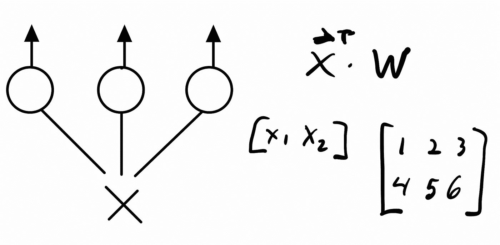

# 辍学是非常容易实现的

> 原文：<https://towardsdatascience.com/dropout-is-drop-dead-easy-to-implement-67f08a87ccff>

# 辍学是非常容易实现的

## 大概是 1 行 python…


图来自描述辍学的原始[论文](https://jmlr.org/papers/volume15/srivastava14a/srivastava14a.pdf)。

# **简介**

我们都听说过辍学。从历史上看，这是正则化神经网络的最著名的方法之一，尽管现在它已经有些失宠，并被批量归一化所取代。不管怎样，这是一项很酷的技术，在 PyTorch 中实现起来非常简单。在这篇简短的博文中，我们将从头实现 dropout，并展示我们在 PyTorch 中获得了与标准 dropout 相似的性能。运行这个快速教程的所有实验的完整笔记本可以在[这里](https://gist.github.com/nbertagnolli/35eb960d08c566523b4da599f6099b41)找到。

# 什么是辍学？

退出是指在每个训练步骤中有效地随机删除神经网络的一些节点。这个想法是，通过不过度依赖任何一个节点，这将有助于网络变得更加健壮。


图来自最初描述辍学的[论文](https://jmlr.org/papers/volume15/srivastava14a/srivastava14a.pdf)。

实际上，我们忽略了每个训练周期中的一些随机节点集。很简单，对吧？

# 数学

因此，如果我们将网络中的每一层都视为一个矩阵，那么在每个训练步骤中，我们只需要将一组随机节点清零。这闻起来很像哈达玛产品。考虑一个单层神经网络，其中层由矩阵 **A** 表示。该网络将接受二维输入并输出三维结果，因此 **A** 是 2×3。



我们单层网络的可视化。

如果我们想将一些随机的节点集清零，我们可以创建一个二进制矩阵 **D** ，其中每一列都是零，概率为 *p* ，然后取元素乘积。我们可以通过创建一个具有与 **A** 相同列数的阈值化统一向量，然后在乘法运算中广播来轻松实现这一点。

让我们在 PyTorch 中实现它:

```
p = .5
A = torch.tensor([[1, 2, 3], [4, 5, 6]])
D = (torch.empty(A.size()[1]).uniform_(0, 1) >= p)
x = A.mul(D)====Output===
tensor([[0, 2, 3],
        [0, 5, 6]])
```

如您所见，上述计算将会遗漏一些随机的节点集。

另一种方法是使用 DropConnect，我们随机删除权重，而不是节点。这里唯一的区别是创建一个与**和**大小相同的随机均匀矩阵，而不是进行广播。这看起来像这样:

```
p = .5
A = torch.tensor([[1, 2, 3], [4, 5, 6]])
D = (torch.empty(A.size()).uniform_(0, 1) >= p)
x = A.mul(D)====Output===
tensor([[1, 2, 0],
        [0, 5, 6]])
```

# **在 PyTorch 中实现一个层**

有了最初的数学知识，让我们在 PyTorch 中实现一个 dropout 层。

第 6–7 行检查以确保传递给该层的概率实际上是一个概率。

第 10 行确定该层是处于训练模式还是测试模式。这很重要，因为我们不希望仅在训练期间在推断过程中遗漏节点。这个简单的 if 语句为我们解决了这个问题。

第 11 行完成了我们之前讨论的所有魔术，它创建了一个与 **x** 大小相同的二进制矩阵，其中有一个概率为 *p* ，任何节点都被遗漏了。

我们现在可以在一个简单的模型中使用这种下降。

如果我们用标准 PyTorch dropout 替换我们的自定义 dropout，我们会得到相同的结果。相当整洁！

# 最后一个音符

敏锐的读者会注意到，这并不是辍学者在实践中应该采取的方式。我们不是通过一个节点被训练的次数来标准化的。想一想这个。当我们丢弃一堆随机节点时，一些节点将比其他节点得到更多的训练，并且在最终预测中应该具有不同的权重。考虑到这一点，我们需要在推理期间通过保持概率`1/(1-p)`的倒数来调整每个节点的权重。但是在推理的时候这样做是很痛苦的。大多数实现在实践中所做的是在训练期间按这个量来缩放权重。所以真正的辍学层应该是这样的:

就是这样！感谢阅读！