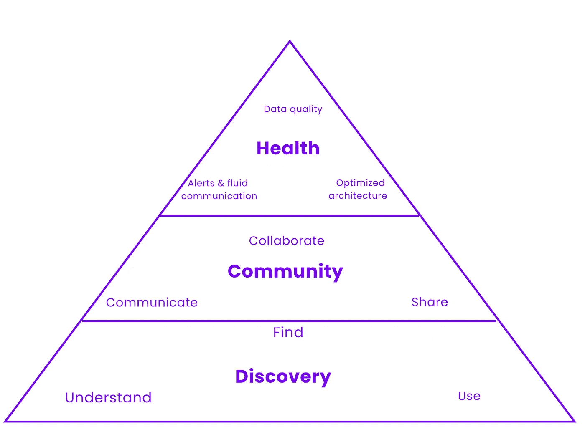
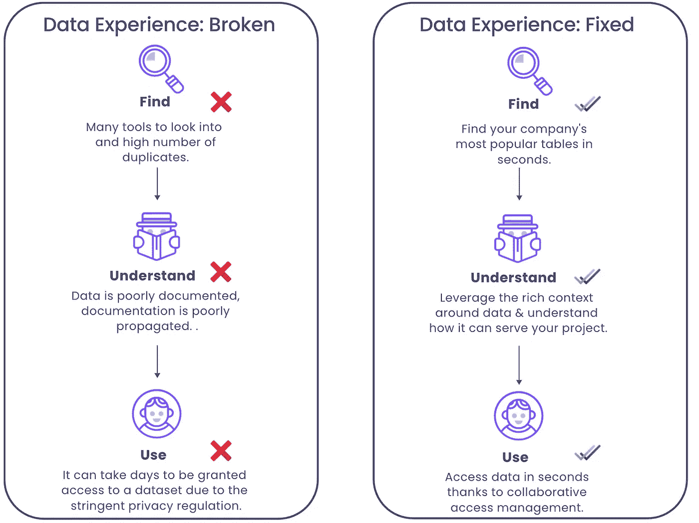
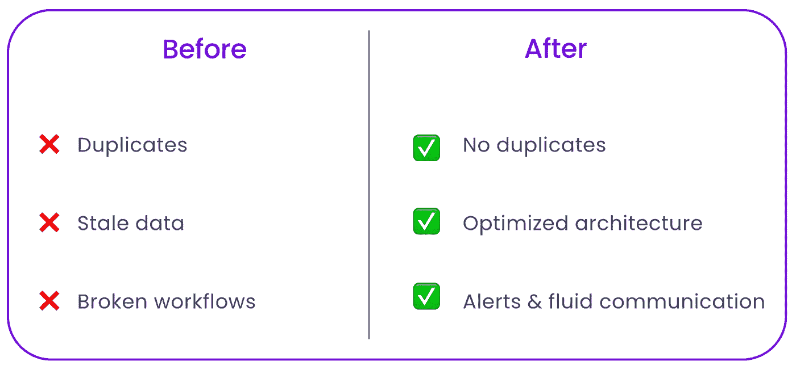

# DX 是新的 UX

> 原文：<https://towardsdatascience.com/dx-is-the-new-ux-1565304a4c82>

## 数据体验的兴起

DX 是新的 UX——图片由 [Castor](https://www.castordoc.com) 提供

在过去十年中，数据生态系统中的大多数创新都集中在产生更多数据的**。它成功了，正如 UX 随着数字产品的激增变得重要一样，DX 也随着数据产品的蓬勃发展占据了重要的位置。**

**事实上，20 年前，数据是 IT 团队和少数数据奇才的领域。即使在 5 年前，它仍然主要由数据团队所有。如今，数据驱动着公司内的所有运营职能:销售、财务、营销、运营等。多亏了[、反向 ETL](https://www.castordoc.com/blog/reverse-etl-benchmark-for-mid-market-companies) 、BI 工具和自助服务，业务团队将数据作为日常运营的一部分。**

**简而言之，业务用户变成了数据用户，他们的体验变成了数据体验。**数据体验**是这些领域专家每天使用数据来增强工作能力时的感受。**

****数据体验**并不新鲜。业界已经[谈论它有一段时间了](https://benn.substack.com/p/the-modern-data-experience)。它也接近去年每个人都想到的[数据网格和数据产品](https://martinfowler.com/articles/data-monolith-to-mesh.html)的概念。**

**达成共识很容易:[数据体验被破坏](https://www.castordoc.com/blog/the-data-experience-is-broken)并且[需要修复](https://www.subbu.org/articles/2021/broken-state-of-data/)。事实上，[数据生态系统是分散的](https://www.moderndatastack.xyz/community/posts/what-are-the-gaps-that-the-modern-data-stack-promised-to-solve-but-is-still-un)，很难统一工作流并在工具之间提供流畅的体验。**

**坏消息是，如果我们等待生态系统提出解决方案，我们将会在很长一段时间内默默忍受。生态系统不太可能汇聚成一个统一的解决方案，突然提供跨整个堆栈的良好数据体验，从数据接收和仓库一直到转换和可视化。在那之前我们做什么？**

**我们的挑战是从我们现有的地方开始，利用我们现有的人员和工具，让**数据体验**更好。**

**本文旨在定义什么是**良好的数据体验**。经验远不止是工具和组织框架。对我们来说，良好的数据体验意味着在以下三个领域实现卓越:发现、社区和健康。我们将在下一节深入探讨这三个领域的卓越之处。**

****

**数据体验的三大支柱——由[卡斯特](https://www.castordoc.com/)提供的图像**

# **良好的数据体验是什么样子的？**

**我们对良好数据体验的看法基于三大支柱:**发现、社区和健康**。这三个要素及其相互作用的产物构成了数据体验的主体。每个类别都封装了许多重叠的工具和概念。出于本文的目的，我们避免进入我们为后面的系列保留的繁琐细节。让我们更详细地看看这些支柱。首先，您需要**找到&并理解**您所拥有的。然后，随着你的成长，分享&和围绕它交流一定很容易。一旦事情被发现&可以作为一个团队使用，您现在就可以**改善健康状况**因为您可以有效地发现数据资产&在问题出现时进行沟通。这是数据体验的马斯洛金字塔。**

# **支柱 1:发现**

**数据体验的第一个支柱是**数据发现**。解锁数据发现意味着您组织中的人员可以**查找**、**理解**和**使用**他们的数据资产，同时最大限度地减少不同团队之间不必要的交互。其思想是，体验是一个有几个步骤的工作流程。改善这种体验归结于在过程的每一步都移除阻断剂。**

****

**数据发现工作流程-图像由 [Castor](https://www.castordoc.com/) 提供**

## **发现**

**当数据工程师不再被视为数据目录时，数据就“可被发现”了。也就是说，人们不再懈怠地询问在哪里可以找到特定的数据集，以及在给定的报告中使用该数据集是否可靠。**

**这意味着公司里的每个人都知道在哪里以及如何为他们的特定项目找到最好的数据。即使数据很混乱。即使有 20 张几乎同名的桌子。**

**那么“好”是什么样子的呢？当团队可以轻松地在混乱中导航，毫不费力地确定哪些是最流行和最新的表格，而无需询问他们的同事或老板时，数据是可以找到的。改善数据体验的数据发现支柱需要消除所有与知道使用哪些数据相关的摩擦点。**

**同样，这可以通过很多方式实现:废弃无用的表格或记录数据。不管通过什么途径到达那里，你都应该追求一种体验，在这种体验中，人们永远不会费力去寻找一个数据集。**

## **明白；理解**

**当人们**意识到数据将满足的需求**、其内容和位置时，他们就理解了数据集。没有上下文的数据毫无价值&危险。一旦你找到了相关的数据集，你就完成了 10%的工作。现在，您需要仔细阅读一份包含 10 多个问题的清单，以确保您了解您使用的是什么数据。如果你不能回答下面的问题，说明你不了解你的数据。**

*   **数据从哪里来？**
*   **流向哪里，向下游馈给哪些表？**
*   **谁拥有它/谁对它负责？**
*   **我的领域中给定字段的含义是什么？**
*   **为什么重要？**
*   **这个表最后一次更新是什么时候？**
*   **这些数据的上游和下游依赖关系是什么？**
*   **这是生产质量数据吗？**

**当**所有相关知识都与数据联系在一起**时，人们才能真正理解数据。理解是主观的。ML 工程师处理数据集的方式与数据分析师不同。这就是为什么所有的理解都需要将所有相关的知识层与一个数据集联系起来。**

## **使用**

**人们使用和利用数据有两个必要条件。人们需要访问数据，并围绕数据收集足够的上下文，以知道它适合于哪个用例。**

**过去，访问很简单。不再是了。GDPR 或 HIPAA 等严格的法规要求严格控制数据访问。对于我们今天处理的数据量，很难在**数据治理和数据可访问性之间找到合适的平衡。**很难在保护信息的同时确保人们能够在需要的时候访问他们需要的数据集。**

****查询**您的数据。在几秒钟内获得您需要的答案。良好的数据体验使得任何人查询数据都非常容易，不管有没有代码。浏览领域专家已经做过的工作，开始你的分析。重用团队中有经验的数据人员编写的强大查询。告别重复工作。不管人们的背景如何，查询数据应该变得非常简单。查询允许人们利用数据并获得问题的答案。**

# **支柱 3:社区**

****

**数据社区的四块砖—图片由 [Castor](/**Find**  A good indication that data is “findable” is when data engineers stop being treated like a data catalog. That is, people stop pinging them on slack asking where to find a specific dataset, and whether it is reliable to use for a given report.   This means everyone in the company knows **where and how to find the best data** for their specific project. Even if data is messy. Even if there are 20 tables bearing the almost same name.   So what does “good” look like?%20Data%20is%20**findable**%20when%20teams%20can%20easily%20navigate%20across%20the%20mess,%20and%20identify%20effortlessly%20which%20are%20the%20most%20popular%20and%20up-to-date%20tables%20without%20asking%20their%20colleagues%20or%20boss.%20Improving%20the%20data%20discovery%20pillar%20of%20the%20Data%20Experience%20goes%20through%20removing%20all%20friction%20points%20related%20to%20knowing%20which%20data%20to%20use.%20%20Again,%20this%20can%20be%20achieved%20in%20a%20lot%20of%20ways:%20deprecating%20useless%20tables%20or%20documenting%20your%20data.%20Regardless%20of%20the%20path%20taken%20to%20arrive%20there,%20you%20should%20be%20aiming%20for%20an%20experience%20where%20people%20NEVER%20struggle%20to%20find%20a%20dataset.%20%20%20**Understand**%20%20People%20understand%20a%20dataset%20when%20they%20are%20**aware%20of%20the%20needs%20this%20data%20will%20satisfy**,%20its%20content,%20and%20its%20location.%20Data%20without%20context%20is%20worthless%20&%20dangerous.%20Once%20you%20found%20the%20relevant%20dataset,%20you%20did%2010%%20of%20the%20job.%20Now%20you%20need%20to%20go%20through%20a%20checklist%20of%2010+%20questions%20to%20make%20sure%20you%20understand%20what%20data%20you%20are%20using.%20If%20you%20can%E2%80%99t%20answer%20the%20following%20question,%20you%20don%E2%80%99t%20understand%20your%20data.%20%20%20-%20Where%20does%20the%20data%20come%20from?%20-%20Where%20does%20it%20flow%20and%20which%20tables%20does%20it%20feed%20downstream?%20-%20Who%20owns%20it%20/%20who%20is%20responsible%20for%20it?%20-%20What%20is%20the%20meaning%20of%20a%20given%20field%20in%20my%20domain?%20-%20Why%20does%20it%20matter?%20-%20When%20was%20the%20last%20time%20this%20table%20was%20updated?%20-%20What%20are%20the%20upstream%20and%20downstream%20dependencies%20of%20this%20data?%20-%20Is%20this%20production-quality%20data?%20%20People%20can%20truly%20understand%20the%20data%20when%20**all%20the%20relevant%20knowledge%20is%20tied%20to%20it**.%20Understanding%20is%20subjective.%20An%20ML%20engineer%20will%20approach%20a%20dataset%20differently%20than%20a%20data%20analyst.%20This%20is%20why%20all%20understanding%20goes%20through%20tying%20all%20the%20relevant%20knowledge%20layers%20to%20a%20dataset.%20%20%20**Use**%20%20There%20are%20two%20necessary%20conditions%20for%20people%20to%20use%20and%20leverage%20data.%20People%20need%20to%20access%20the%20data%20and%20gather%20enough%20context%20around%20it%20to%20know%20which%20use%20case%20it%20is%20good%20for.%20%20%20**Access**%20used%20to%20be%20straightforward.%20Not%20anymore.%20Tight%20regulations%20such%20as%20GDPR%20or%20HIPAA%20require%20data%20access%20to%20be%20firmly%20controlled.%20With%20the%20data%20volumes%20we%E2%80%99re%20dealing%20with%20today,%20it%20has%20become%20hard%20to%20find%20the%20right%20balance%20between%20**data%20governance%20and%20data%20accessibility.**%20It%E2%80%99s%20hard%20to%20protect%20information%20while%20ensuring%20that%20people%20can%20access%20the%20dataset%20they%20need,%20at%20the%20exact%20moment%20they%20need%20it.%20%20**Query**%20your%20data.%20Obtain%20the%20answer%20you%20need%20from%20it%20in%20seconds.%20A%20good%20Data%20Experience%20makes%20it%20super%20easy%20for%20anyone%20to%20query%20the%20data,%20with%20or%20without%20code.%20Kickstart%20your%20analysis%20by%20browsing%20through%20what%20domain%20experts%20already%20did.%20Reuse%20the%20powerful%20queries%20written%20by%20experienced%20data%20people%20in%20your%20team.%20Say%20goodbye%20to%20duplicate%20work.%20Querying%20the%20data%20should%20be%20made%20an%20incredibly%20easy%20step,%20regardless%20of%20people%E2%80%99s%20backgrounds.%20Queries%20allow%20people%20to%20leverage%20the%20data%20and%20obtain%20answers%20to%20their%20questions.%20%20%20##%20Community) 提供**

**社区是数据体验的基本支柱。社区被定义为“一种与他人相交的感觉，是分享共同兴趣和目标的结果”。不管在你的组织中社区采取什么形式，创造这种感觉是关键。**

**事实上，在数据团队中没有竖井的空间。筒仓让你走上了失败之路。数据工程师、分析工程师、数据科学家、数据分析师和业务分析师都有相同的目标:**利用数据帮助他们的组织蓬勃发展**。他们在同一条船上，这就是为什么对他们来说感觉到他们在同一条船上是很重要的。**

**数据团队的解决方案社区包含四个组成部分:**

1.  ****内部沟通协调**。在现代组织中，度量标准和业务定义的不一致性仍然是一个令人头疼的问题。很难就对每个人都重要的 KPI 达成一致，定义存在于我们分散的数据堆栈的不同工具中。团队应该寻求内部数据实践 100%符合指标、KPI 和仪表板的体验。在这个世界里，数据资产是经过认证的，你对“活跃用户”只有一个定义(我知道，对吗？).即使你的团队使用几十个数据工具，每个人都应该配备**相同的**信息。**
2.  ****对外交流。**数据知识往往不会离开数据团队。我们应该致力于构建一种数据体验，让数据在数据团队和其他利益相关者之间无缝流动。运营团队应该能够在其日常工具中访问数据知识的**非技术概述**。无论部门、角色、任期和数据素养水平如何，员工都必须理解数据才能高效工作。社区确保数据知识不会停留在数据团队中。**
3.  ****用法和团队。**目前，组织中的数据使用缺乏透明度。不可能看到人们如何转换、查询和使用给定的数据集。这导致了大量的重复工作，通过让人们先睹为快可以很容易地避免这些重复工作。让你的团队明白他们并不孤单。良好的**数据体验**能让员工看到**其他人**如何使用数据。它允许每个人重用和利用他们团队成员已经完成的工作。意识到他人的消费正在激起一种友谊的感觉，这种感觉是社区的特征。**
4.  ****讨论和反馈。**团队将从轻松交流和表达想法的体验中受益。目前，回答与数据集相关的问题的唯一方法是 ping slack 上的 10 个同事，希望有人会回复。分散化和远程工作应该使我们更加意识到需要创建接口，以允许数据团队内部以及数据团队和其他数据利益相关者之间的顺畅通信。例如，这可能采取附加到每个数据集的聊天的形式。**

# **支柱 3:健康**

****

**健康的数据系统——图片由 [Castor](https://www.castordoc.com/) 提供**

**良好的数据体验始于健康的数据环境。这样，我们并不意味着你的数据应该遵循酮饮食和从事每天 18 小时的间歇性禁食。**

**健康的数据应该是**发现、社区和强大治理框架**的自然结果。原因很简单。数据健康描述了组织的数据如何支持其业务目标。健康数据是容易被发现、理解并对需要使用它的人有价值的数据。**

**健康的数据意味着组织中的每个人都可以在他们需要的时候访问他们需要的信息，并且使用它而不用担心它的有效性。健康还意味着您知道**您的数据资产是如何关联的**。如果你对资产之间的关系没有一个清晰的认识，你甚至可以在没有意识到的情况下，贬低为你的 CEO 最喜欢的仪表板提供信息的表格。**

**健康的数据还应该在整个数据生命周期中保持这些属性。这远非简单明了。现代数据管道非常复杂，并显示出黑盒特征。你知道进去的是什么，出来的是什么，但你不知道中间发生了什么。**

**只要出现想要的结果就好。但如果没有，那就非常令人沮丧。当数据集从管道中出来时，通常会留下奇怪的值、缺失的列、本应是数字的字段中的字母等等。**

**因此，健康数据是**可观察的**数据。它的**状态应该始终是明确的**:您应该知道上游流程是否运行不正常、是否过时或者是否只是被破坏。 [**数据可观察性**](https://www.castordoc.com/blog/data-monitoring-and-observability) 在监控数据系统的健康状况方面，工具可以做很多事情。它们允许您快速发现事件，并在数据损坏时进行干预。**

**健康的数据环境具有以下特征:**

*   **清楚地了解哪些数据可用，以及如何利用这些数据为您的组织带来好处。**
*   **参与数据管理的各方之间的信任文化。**
*   **一个强大的安全系统，以防止未经授权的访问或滥用所述数据。**
*   **适应新技术的计划。**

# **碎片化生态系统中的数据体验**

**现在的问题是:你如何让自己做到这一点？答案不在于等待，直到生态系统弄清楚事情，并最终决定整合。我们需要利用**我们拥有的:**我们拥有的人员、工具和数据。这个系列是关于利用我们现有的生态系统来改善我们团队的数据体验。同样，良好的数据体验可以采取多种形式，只要它建立在坚如磐石的发现支柱、数据团队中强烈的社区意识以及健康的数据生态系统之上。**

**‍**

***最初发表于*[T5【https://www.castordoc.com】](https://www.castordoc.com/blog/dx-is-the-new-ux)*。***