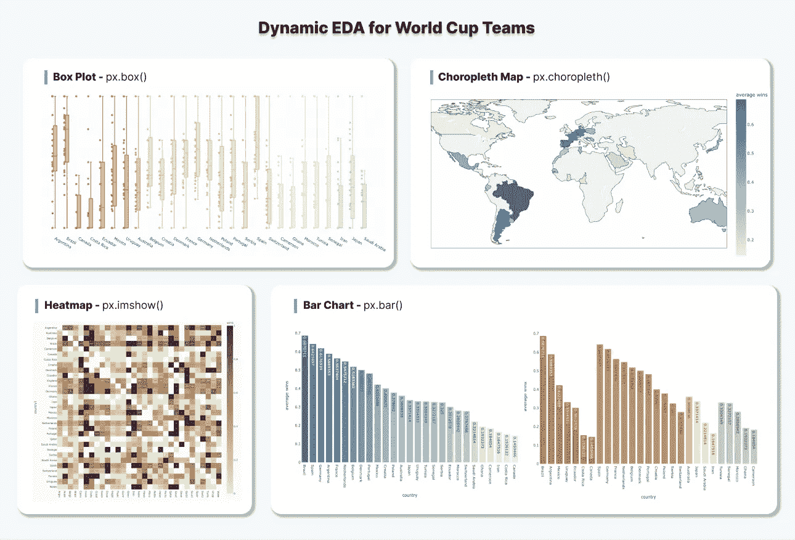
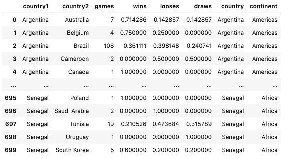
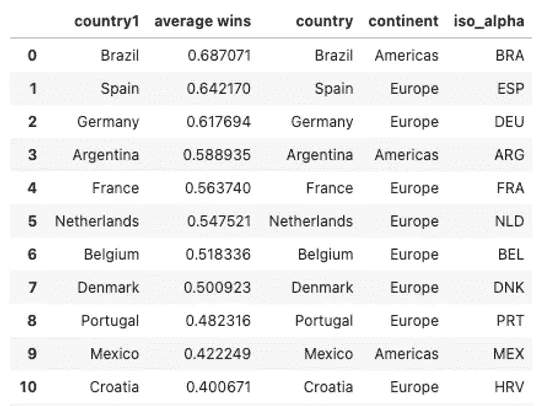
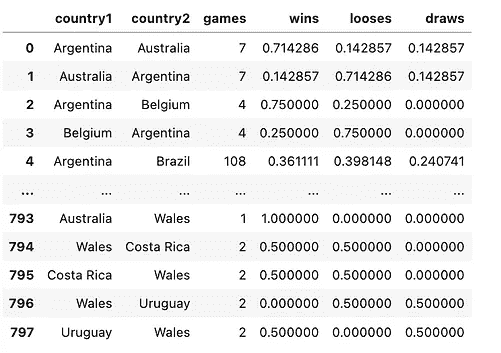

# 如何使用 Plotly 进行更深入和互动的数据探索

> 原文：<https://towardsdatascience.com/dynamic-eda-for-qatar-world-cup-teams-8945970f16be>

## 案例研究:卡塔尔世界杯球队的动态 EDA



世界杯球队的动态 EDA(图片由作者提供)

本文将详细介绍工具[1]，它将数据可视化和探索性数据分析(EDA)带到了一个新的高度。无论您是 Python 用户还是 R 用户，您都可以使用这个开源图形库来使您的笔记本更加美观和具有交互性。要安装 Plotly，使用命令`!pip install — upgrade plotly`。

我们就用“[历史世界杯胜散比数据](https://www.kaggle.com/datasets/amineteffal/qatar2022worldcupschudule?select=historical_win-loose-draw_ratios_qatar2022_teams.csv)【2】”来分析参加卡塔尔 2022 世界杯的国家队。数据集包含每个“国家 1-国家 2”对之间的赢、输和平局比率，如下所示。例如，第一行给我们的信息是，在阿根廷和澳大利亚之间的 7 场比赛中，阿根廷赢、输和平的比率分别是 0.714286、0.142857 和 0.142857。

```
df = pd.read_csv('/kaggle/input/qatar2022worldcupschudule/historical_win-loose-draw_ratios_qatar2022_teams.csv')
```


df 预览

在本练习中，我们将利用**箱线图、条形图、choropleth 图和热图**进行数据可视化和探索。此外，我们还将介绍与这些可视化技术密切相关的高级 Pandas 功能，包括:

*   聚合:`*df.groupby()*`
*   排序:`*df.sort_values()*`
*   合并:`*df.merge()*`
*   旋转:`*df.pivot()*`

# 箱线图—按国家列出的胜率

箱线图—按国家/地区列出的胜率(按作者列出的图片)

第一个练习是想象每个国家与其他国家比赛时的胜率。为了实现这一点，我们可以使用箱线图来描绘每个国家的胜率分布，并进一步用该国的大洲来着色。将鼠标悬停在数据点上以查看详细信息，并放大方框图以查看最大值、q3 值、中值、q1 值和最小值。

让我们一步一步地分解我们是如何构建盒状图的。

## 1.获取大陆数据

从原始数据集中，我们可以使用字段“wins”并按“country1”进行分组，来研究一个国家内的值与国家间的值相比如何变化。为了进一步探究胜率是否受洲的影响，我们需要引入 plotly 内置数据集`px.data.gapminder()`中的“洲”字段。

```
geo_df = px.data.gapminder()
```


geo_df(图片由作者提供)

*(这里我使用“大陆”作为例子，也可以随意使用“lifeExp”和“gdpPercap”)*

由于只需要洲信息，我们使用`drop_duplicates()`删除其他列来选择不同的行。

```
continent_df = geo_df[['country', 'continent']].drop_duplicates()
```

然后，我们将 *geo_df* 与原始数据集 *df* 合并，以获得大陆信息。如果您以前使用过 SQL，那么您将熟悉表连接/合并。`df.merge()`的工作方式相同，它将 *df* (即“国家 1”)和*continental _ df*(即“国家”)中的公共字段组合在一起。

```
continent_df = geo_df[['country', 'continent']].drop_duplicates()
merged_df = df.merge(continent_df, left_on='country1', right_on='country')
```



merged_df(图片由作者提供)

## 2.创建箱形图

我们应用 [*px.box*](https://plotly.com/python/box-plots/#:~:text=A%20box%20plot%20is%20a,data%2C%20see%20other%20statistical%20charts.) 函数，并指定以下参数，这些参数描述了馈入盒图的数据。

```
fig = px.box(merged_df, 
             x='country1', 
             y='wins', 
             color='continent',
...
```

## 3.格式化绘图

以下参数是可选的，但有助于格式化图并在视觉效果中显示更多有用的信息。

```
fig = px.box(merged_df, 
             x='country1', 
             y='wins', 
             color='continent',
# formatting box plot
             points='all',
             hover_data=['country2'],
             color_discrete_sequence=px.colors.diverging.Earth,
             width=1300,
             height=600
            )
fig.update_traces(width=0.3)
fig.update_layout(plot_bgcolor='rgba(0,0,0,0)')
```

*   `points = ‘all’` 表示除了方框图之外的所有数据点都显示出来。将鼠标悬停在每个数据点上以查看详细信息。
*   `hover_data=[‘country2’]`在悬停框内容中增加了“国家 2”。
*   `color_discrete_sequence=px.colors.diverging.Earths`指定颜色主题。请注意，当用于着色的字段是离散的分类值时，应用`*color_discrete_sequence*`。或者，当字段是连续的数值时，应用`*color_continuous_scale*`。
*   `width=1300`和`height=600`指定图形的宽度和高度尺寸。
*   `fig.update_traces(width=0.3)`更新每个方框图的宽度。
*   `fig.update_layout(plot_bgcolor=’rgba(0,0,0,0)’)`将图形背景颜色更新为透明。

# 条形图—按国家列出的平均胜率

条形图—按国家/地区列出的平均胜率(按作者列出的图片)

第二个练习是可视化每个国家的平均胜率，并按降序排列，以便查看表现最佳的国家。

首先，我们使用下面的代码进行数据操作。

```
average_score = df.groupby(['country1'])['wins'].mean().sort_values(ascending=False
```

*   `df.groupby([‘country1’])` ***:*** 将 df 按字段“country1”分组。
*   `[’wins’].mean()`:取“赢”值的平均值。
*   `sort_values(ascending=False)`:按降序排列数值。

然后我们使用`pd.DataFrame()` 将*average _ score*(Series 数据类型)转换成类似表格的格式。

```
average_score_df = pd.DataFrame({'country1':average_score.index, 'average wins':average_score.values})
```

将 *average_score_df* 传递给 [*px.bar*](https://plotly.com/python/bar-charts/) 函数，遵循与 *px.box.* 相同的语法

```
# calculate average wins per team and descending sort
fig = px.bar(average_score_df,
             x='country1',
             y='average wins',
             color='average wins',
             text_auto=True,
             labels={'country1':'country', 'value':'average wins'},
             color_continuous_scale=px.colors.sequential.Teal,
             width=1000,
             height=600
            )
fig.update_layout(plot_bgcolor='rgba(0,0,0,0)')
```

为了更进一步，我们还可以使用下面的代码，根据洲对条形图进行分组，以显示每个洲中表现最好的国家。

条形图—按洲分组的国家/地区的平均胜率(图片由作者提供)

```
# merge average_score with geo_df to bring "continent" and "iso_alpha"
geo_df = px.data.gapminder()
geo_df = geo_df[['country', 'continent', 'iso_alpha']].drop_duplicates()
merged_df = average_score_df.merge(geo_df, left_on='country1', right_on='country')
# create box plot using merged_df and colored by "continent"
fig = px.bar(merged_df,
             x='country1',
             y='average wins',
             color='average wins',
             text_auto=True,
             labels={'country1':'country', 'value':'average wins'},
             color_continuous_scale=px.colors.sequential.Teal,
             width=1000,
             height=600
            )
fig.update_layout(plot_bgcolor='rgba(0,0,0,0)')
```

# Choropleth 地图—按地理位置划分的平均胜率

Choropleth 地图—按地理位置划分的平均胜率(图片由作者提供)

我们要探索的下一个可视化是通过地图显示国家的平均胜率。上图让我们更清楚地看到世界上哪些地区的表现相对较好，例如南美和欧洲。

ISO 代码用于识别国家的位置。在前面按洲进行着色的平均胜率代码片段中，我们将 *geo_df* 与原始数据集合并，以创建带有字段“洲”和“iso_alpha”的 *merged_df* 。在这个练习中，我们将继续使用 *merge_df* (如下图所示)。



merged_df(图片由作者提供)

然后我们使用[*px . choropleth*](https://plotly.com/python/choropleth-maps/)*函数，将参数`locations`定义为“iso_alpha”。*

```
*fig = px.choropleth(merged_df, 
                    locations='iso_alpha',
                    color='average wins',
                    hover_name='country',
                    color_continuous_scale=px.colors.sequential.Teal,                
                    width=1000,
                    height=500,
                   )
fig.update_layout(margin={'r':0,'t':0,'l':0,'b':0})*
```

# *热图—国家对之间的胜率*

*热图—国家对之间的胜率(图片由作者提供)*

*最后，我们将引入热图来直观显示每个国家对之间的胜率，其中密集区域显示 y 轴上的国家胜率更高。此外，将鼠标悬停在单元格上以动态方式查看胜率。*

*我们需要使用`df.pivot()`函数来重建数据帧结构。下面的代码指定数据透视表的行为“country1”，列为“country2”，并将“wins”作为透视值。结果，左边的桌子变成了右边的桌子。*

```
*df_pivot = df.pivot(index = 'country1', columns ='country2', values = 'wins')*
```

***

df 到 pivoted_df(图片由作者提供)* 

*然后我们使用 *pivoted_df* 和 [*px.imshow*](https://plotly.com/python/heatmaps/) 通过下面的代码创建热图。*

```
*# heatmap
fig = px.imshow(pivoted_df, 
                text_auto=True,
                labels={'color':'wins'},
                color_continuous_scale=px.colors.sequential.Brwnyl,
                width=1000,
                height=1000
               )
fig.update_layout(plot_bgcolor='rgba(0,0,0,0)')*
```

*感谢到达终点。如果你想阅读我更多关于媒介的文章，我将非常感谢你的支持，注册成为媒介会员。*

# *带回家的信息*

*Plotly 为我们提供了创建动态可视化的能力，并产生了比静态图形更多的洞察力。我们利用世界杯趋势数据探索了以下 EDA 技术:*

*   *箱形图*
*   *条形图*
*   *等值区域图*
*   *热图*

*我们还解释了一些用于数据操作的高级 Pandas 函数，这些函数已在 EDA 过程中得到应用，包括:*

*   *聚合:`df.groupby()`*
*   *排序:`df.sort_values()`*
*   *合并:`df.merge()`*
*   *旋转:`df.pivot()`*

## *更多这样的文章*

*</semi-automated-exploratory-data-analysis-eda-in-python-7f96042c9809>  

[德斯坦贡](https://destingong.medium.com/?source=post_page-----8945970f16be--------------------------------)

## EDA 和特征工程技术

[View list](https://destingong.medium.com/list/eda-and-feature-engineering-techniques-e0696974ed54?source=post_page-----8945970f16be--------------------------------)9 stories</which-chart-to-choose-4b21929539eb>  

## 参考

[1] Plotly。(2022).Plotly 开源 Python 图形库。从 https://plotly.com/python/[取回](https://plotly.com/python/)

[2]卡格尔。(2022).卡塔尔 2022 年足球世界杯【CC0:公有领域】。检索自[https://www . ka ggle . com/datasets/amine teffal/Qatar 2022 world cupschudule？select = historic _ win-loose-draw _ ratios _ Qatar 2022 _ teams . CSV](https://www.kaggle.com/datasets/amineteffal/qatar2022worldcupschudule?select=historical_win-loose-draw_ratios_qatar2022_teams.csv)

*原载于 2022 年 12 月 10 日 https://www.visual-design.net*<https://www.visual-design.net/post/semi-automated-exploratory-data-analysis-process-in-python>**。***