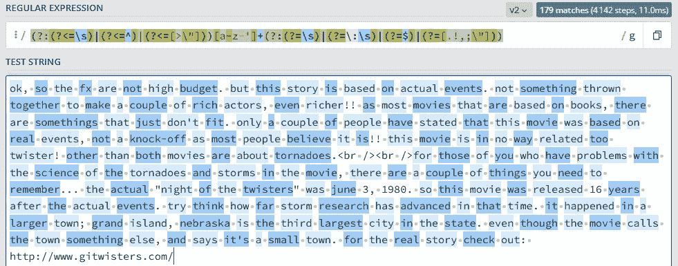

# 使用正则表达式分词器进行动态单词分词

> 原文：<https://towardsdatascience.com/dynamic-word-tokenization-with-regex-tokenizer-801ae839d1cd>

## 关于用正则表达式单步预处理文本的简短教程


图片由[阿玛多·洛雷罗](https://unsplash.com/@amadorloureiro)在 [Unsplash](https://unsplash.com/) 上拍摄

> 在本教程中，我们将引入正则表达式来为 NLP 任务定制单词标记化。通过主动选择标记或单词，您可以快速预处理您的文本，而无需大量的文本清理。

在机器学习工程领域，*界定*、*数据处理*、*建模*和*部署*是项目生命周期的主要递归过程。值得注意的是，数据清理和准备被认为是任何数据科学项目管道的早期阶段，但它们对模型的准确性至关重要。简单来说:

[垃圾进，垃圾出](https://www.oxfordreference.com/view/10.1093/oi/authority.20110803095842747)。


图来自 DeepLearning.ai 的 MLOps Specialization 的讲座幻灯片([来源](https://www.coursera.org/specializations/machine-learning-engineering-for-production-mlops?))

对于结构化表格数据，数据预处理可能采取缺失数据插补或某些类别的标准化值的形式(例如，引用相似类别的字符串的小写)。然而对于本教程，我们将触及另一个子领域的非结构化数据的数据预处理方法，自然语言处理(NLP)——*文本数据*。

# 1.文本预处理—标记化

如果图像(另一种非结构化数据)被认为是空间数据，那么文本应该被认为是顺序数据，在*记号*(单词或字符)被完全按顺序处理之后，文本的**信息被导出。**

每一个文本标记都可以是单词、数字、符号、标点符号等等，它们承载着一定的意义，因而可以被看作是语义的一个要素。

从文本中获取标记列表的过程是一个称为**标记化**的预处理步骤，在此之后，标记被转换为一个热点向量，以馈入任何下游模型，例如用于 NLP 任务的转换器或双向 LSTM，例如机器翻译、摘要、情感分析和共指消解等。(然后，在训练过程之后，可以为每个标记导出 n 维向量嵌入，其封装了特定的含义。)

如果 NLP 任务在字符级别处理文本，标记化非常容易，如下面的代码片段所示:


字符级标记化。图片作者。

尽管如此，大多数 NLP 任务通常在单词级别上处理文本。使用 Python 中一些流行的 NLP 库，如 NLTK 或 spaCy，可以很容易地完成单词标记化，如下所示:


单词级标记化。图片作者。

上述记号化方法的一个问题是记号化方法要么是固定的，要么不容易定制。当文本混乱时，例如包含 HTML 标签，或者包含您希望省略的文本，如数字、网络链接、电子邮件甚至符号诅咒，这个问题会进一步加剧。


典型的单词分词器不会自动清除文本。图片作者。

第二个问题可以通过手动文本清理来解决，用空字符串替换掉不需要的文本。这很好，只要你能考虑到所有不需要的文本的变化。然而，这是乏味的，特别是如果你有一个巨大的语料库，包括数百万个文本文档。因此，这样的话，有时我们可能会得到未清除的令牌，并将其传递给下游模型。

如果我们可以在一个步骤中将文本清理和标记化结合在一起会怎么样？换句话说，除了在标记化之前过滤掉不想要的文本，我们是否可以只基于我们想要包含的文本*来实现基于规则的标记化？*

输入正则表达式(regex)标记符！但在此之前，让我们看看正则表达式是如何工作的。

# 2.按文本模式搜索—正则表达式

正则表达式(regex)在**通过搜索特定搜索模式的匹配从文本**中提取字符时非常有用。搜索模式的语言，表示为另一个文本字符串，称为正则表达式。对于每个特定的用例，regex 中都有几个特殊的字符，但是在本教程中，为了便于说明，我们将只简要介绍其中的一些:

## 锚——^和美元

> **^The:匹配字符串开头的“The”。**
> 
> **end$:如果它在字符串的末尾，则匹配“end”。**
> 
> **hello20:如果字符序列出现在字符串中的任何位置，则匹配“hello20”。**

## 量词— * +？

> love*:匹配包含“lov”后跟零个或多个“e”的字符串
> 
> love+:匹配包含“lov”后跟一个或多个“e”的字符串
> 
> 爱情！:匹配包含后跟零或一个“e”的“lov”的字符串

## 空格— \s，\s

> \s:匹配空格
> 
> \S:匹配非空格

## 括号表达式— [ ]

> 【a！？:]:匹配为' a '，'！'的字符串, '?'或者':'
> 
> [a-zA-Z0–9]:匹配字母表中的任何字母(小写或大写)或任何数字 0–9。

## 捕捉，不捕捉 OR 运算符—()，？:和|

> (roar)ing:匹配并捕获后面有“ing”的字符串“roar”。
> 
> (?:([0–9]+)|([#@!])) : `' ?: ‘`通常否定捕获，当您想要将表达式与 OR 运算符`'|’`组合在一起，但不想将其保存为字符串的捕获部分时使用。

## 向前看，向后看——(？=)和(？regex101.com< =)

> [0–9-]+(?=[.]) : Matches a telephone number, for instance, that ends with a full-stop.
> 
> (?<=^)[a-z@.]+ : Matches an email, for instance, that begins at the start of the string.

The above tutorial on regular expressions is non-exhaustive and there are several other regular expression use cases and rules, and I will leave this to your exploration. I have also collated some good resources for further learning here:

[](https://medium.com/factory-mind/regex-tutorial-a-simple-cheatsheet-by-examples-649dc1c3f285)  [](/a-simple-and-intuitive-guide-to-regular-expressions-404b057b1081)    [](https://stackoverflow.com/questions/2973436/regex-lookahead-lookbehind-and-atomic-groups)  

There are also a couple of handy websites to easily test out regex on text strings. One of my favorite is this:

[](https://regex101.com/)  

# 3\. The NLTK Regex Tokenizer

Now we have mastered regular expressions, we can easily search for and customize text patterns that we wish to tokenize. Now say for instance, we only wish to capture all meaningful words, excluding all external punctuations, numbers, HTML tags, websites and what not. To do this, we can make use of the regex tokenizer in the NLTK library to tokenize text according to a search pattern. Consider the following text, which is a movie review, we see that tokens can be captured with clear precision without needing prior text cleaning.

```
'OK, so the FX are not high budget. But this story is based on actual events. Not something thrown together to make a couple of rich actors, even richer!! As most movies that are based on books, there are somethings that just don\'t fit. Only a couple of people have stated that this movie was based on real events, not a knock-off as most people believe it is!! This movie is in no way related too TWISTER! Other than both movies are about tornadoes.<br /><br />For those of you who have problems with the science of the tornadoes and storms in the movie, there are a couple of things you need to remember... The actual "night of the twisters" was June 3, 1980\. So this movie was released 16 years after the actual events. Try think how far storm research has advanced in that time. It happened in a larger town; Grand Island, Nebraska is the third largest city in the state. Even though the movie calls the town something else, and says it\'s a small town. For the real story check out: [http://www.gitwisters.com/'](http://www.gitwisters.com/')
```

Code snippet in applying NLTK regex tokenizer.



Screenshot from [。图片作者。](https://regex101.com/)

应用的正则表达式允许我们捕获任何单词(一个或多个带撇号和连字符的字母)的标记，这些单词前面有:

*   字符串开头
*   空白
*   类似[> "]的字符

并且还成功地通过以下方式之一:

*   字符串结尾
*   空白
*   像[:]这样的字符。！；"]

因此，正则表达式能够捕获所有有意义的单词，除了不需要的文本，如网页链接、电子邮件、HTML 标签等。出于好奇，我们应用的 regex 字符串如下所示，您可以随意定制以适应其他上下文。

```
“(?:(?<=\s)|(?<=^)|(?<=[>\”]))[a-z-’]+(?:(?=\s)|(?=\:\s)|(?=$)|(?=[.!,;\”]))”
```

# 4.最后的想法

正则表达式标记化是一种基于规则的动态标记化。尽管近年来算法逐渐转向基于模型或使用数据来驱动标记化，但正则表达式仍然是一个强大的工具。事后看来，在另一个应用中，在标记化之前，例如通过使用 regex 将网页链接转换成标记(例如<weblinks>)，甚至可以进一步预处理文本。</weblinks>

如果杂乱的文本能够被容易地和清楚地描述，那么在 MLOps 生命周期的地平线上，可以为任何 NLP 模型提供强大的基础。

> 感谢阅读！如果你喜欢这些内容，可以在[媒体](https://tanpengshi.medium.com/)上阅读我的其他文章，并在 [LinkedIn](https://www.linkedin.com/in/tanpengshi/) 上关注我。
> 
> ***支持我！*** —如果你*没有*订阅 Medium，并且喜欢我的内容，请考虑通过我的[推荐链接](https://tanpengshi.medium.com/membership)加入 Medium 来支持我。

[](https://tanpengshi.medium.com/membership) 