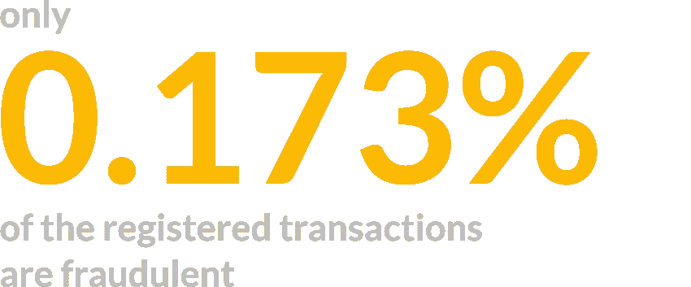
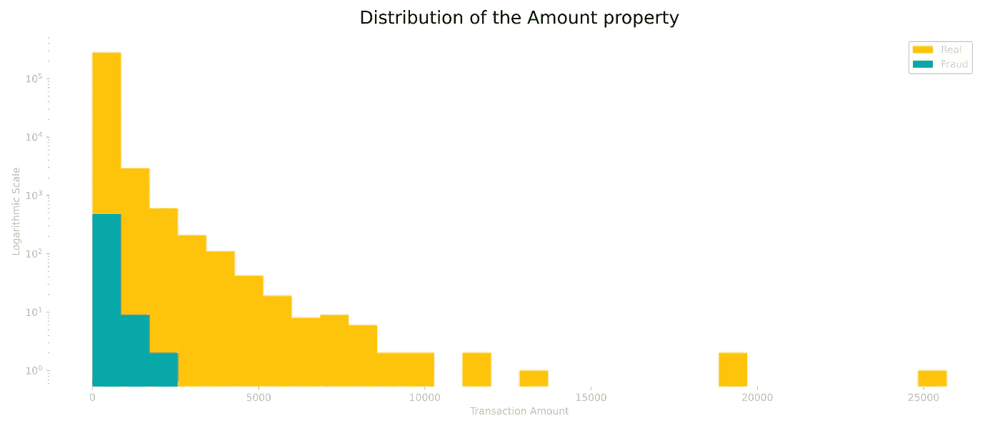
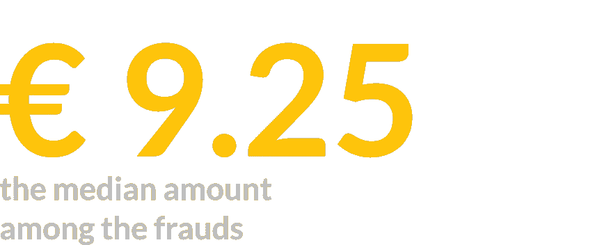
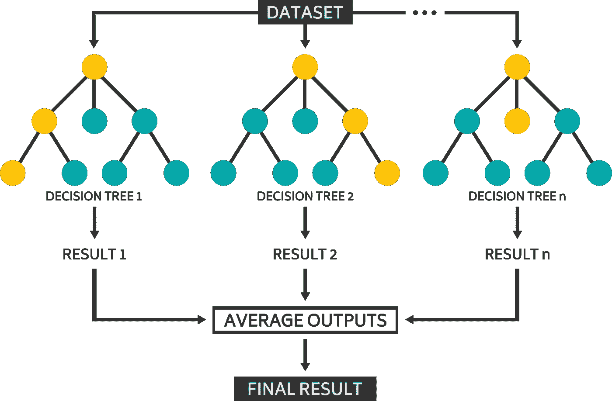
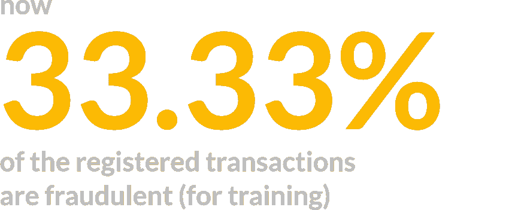
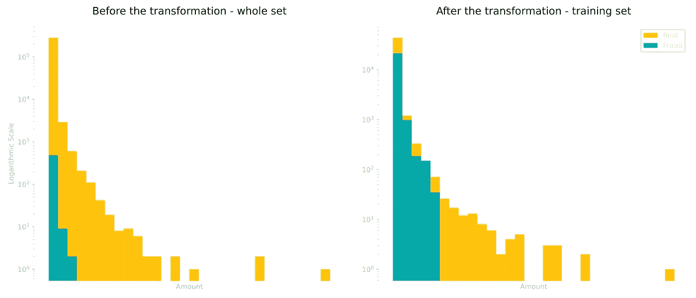
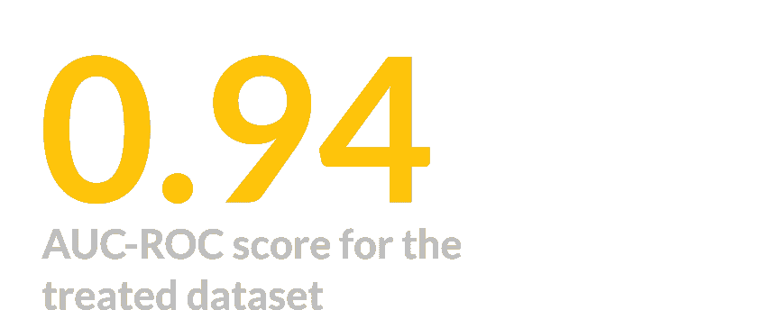

# 及早发现信用卡欺诈

> 原文：<https://towardsdatascience.com/early-detecting-credit-card-frauds-38db7c190e44>

# 及早发现信用卡欺诈

## 应用机器学习模型来主动测试交易并将其分类为有效或无效

作者图片

## 介绍

信用卡技术背后的想法实际上可以追溯到 19 世纪晚期，来自爱德华·贝拉米([维基百科](https://en.wikipedia.org/wiki/Credit_card))写的乌托邦小说《回望过去》。然而，我们在 20 世纪才开始看到类似的东西，但与我们今天所拥有的相比，什么都不是。

事实是，信用卡已经彻底改变了我们购物和生活的方式，而不必随身携带大量现金。据估计，2018 年，仅在美国就有 12 亿张信用卡在流通，72%的成年人至少拥有一张信用卡。

照片由来自 [Pexels](https://www.pexels.com/photo/conceptual-photo-of-a-money-scam-7111619/?utm_content=attributionCopyText&utm_medium=referral&utm_source=pexels) 的 [Tara Winstead](https://www.pexels.com/@tara-winstead?utm_content=attributionCopyText&utm_medium=referral&utm_source=pexels) 拍摄

不幸的是，这项技术为诈骗和欺诈打开了一个全新的可能性。这些类型的犯罪大多发生在通过各种渠道非法获取你卡上的数据时，但大多是由于数据库泄露或身份盗窃计划( [FBI](https://www.fbi.gov/scams-and-safety/common-scams-and-crimes/credit-card-fraud#:~:text=Credit%20card%20fraud%20is%20the,in%20an%20identity%20theft%20scheme) )。

然而，你可以采取很多措施来防止你的数据被盗。仅举几个例子:

*   确保您正在访问的网站具有有效的安全证书；
*   不要把你的信息透露给任何你不认识的人；
*   不要相信你通过电子邮件或网站收到的每一个产品或投资提议。

来自 [Pexels](https://www.pexels.com/photo/serious-man-paying-online-purchases-using-smartphone-on-street-6353683/?utm_content=attributionCopyText&utm_medium=referral&utm_source=pexels) 的 [Anete Lusina](https://www.pexels.com/@anete-lusina?utm_content=attributionCopyText&utm_medium=referral&utm_source=pexels) 摄影

为了避免这种欺诈，银行公司总是试图早期识别这些事件，以便立即阻止卡和交易失败。

考虑到这一点，我们将利用 [*Kaggle*](https://www.kaggle.com/mlg-ulb/creditcardfraud) 上提供的一个数据集，该数据集是一家欧洲银行 2013 年两天的交易量，我们将开发一个模型来将交易分类为欺诈与否。

## 关于我们的数据集

原始数据集由 **31 个属性**(列)组成，考虑了关于时间、金额和交易类型(欺诈与否)的数据，这将是我们的目标变量。出于隐私原因，其余属性采用主成分分析( [PCA](https://en.wikipedia.org/wiki/Principal_component_analysis) )方法进行降维处理，并隐藏描述。至于行，我们总共有 **284407 个条目**。

作者图片

这个数据集的一个重要方面是它的自然不平衡。正如预期的那样，我们应该会看到比欺诈交易更多的真实交易，这可以从我们的数据中看出。事实上，只有 **0.173%** (492 个条目)被归类为欺诈。

这实际上是我们分析的一个问题，但我们稍后会处理它。

## 分析分布

我们现在来看看两个主要的(已知的)属性:数量和时间，关于交易的类型，并开始分析我们的数据。

作者图片

通过查看 Amount 属性，我们已经可以开始看到一些特征，例如欺诈在较小的值中更常见。

作者图片

经过进一步分析，可以发现欺诈的**平均值**为 **122.21 欧元**，但**中位数**仅为 **9.25 欧元**，也就是说，所有交易的 50%实际上小于或等于后者。

中值和平均值之间的差异实际上是由于存在*异常值*，这些异常值不符合相应的分布，导致平均值更高。记录在案的**最大**诈骗实际金额为 **2125.87 欧元**。

作者图片

我们知道，时间属性与 48 小时的事务相关。尽管我们没有每笔交易发生的实际时间，但通过观察分布情况，我们可以得出一些结论。我们看到较低价值的时刻可能是在黎明前，那时我们预计人们不会四处购物。

但是，对于欺诈性交易，我们没有观察到完全相同的模式，因为许多交易实际上都是在一天的这些时段注册的。

## 准备数据集

尽管我们不知道大多数数据的含义，但是这些列出现在各种范围内，所以第一步将是调整这些范围。为此，我们将标准化时间和数量变量，因为其他属性已经被处理过了。

下一步将是在训练和测试数据之间，以及在 *X* (独立变量)和 *y* (目标类)中分割我们的数据集。为此，选择的测试比例为 20%，剩余的 80%分配给训练集，然后随机分配值。

我们仍然有不平衡的问题要处理，但我们将稍后处理它，以便进行比较。

## 构建随机森林分类器

作者图片

这个项目选择的机器学习模型是**随机森林分类器，来自 *Scikit-Learn* Python 库中的**。当我们试图根据不同的特征和一系列对或错的陈述做出选择时，随机森林是我们在日常生活中直观使用的常见决策树的升级。

决策树倾向于创建一系列规则，并一次处理整个数据集。然而，随机森林增加了一点(你猜对了)随机性，为构建的许多决策树中的每一个选择不同的随机特征和条目，然后平均结果。理论上，模型的这种可变性会产生更准确的预测，因为许多树倾向于减弱每一棵树的单独误差。

但是，我们应该如何评估我们模型的性能呢？

这是一个极其重要的问题，没有一个真正的全球性结论性答案。它总是取决于我们使用的数据的模型和特征。

对于我们的具体情况，即我们有一组高度不平衡的数据并在寻找二进制分类(有效或无效)，最合适的方法是 **AUC-ROC** (接收器工作特性曲线下的区域)，这是一种处理真阳性率(TPR)和假阳性率(FPR)的方法。您可以在这里更多地了解它[。](https://www.analyticsvidhya.com/blog/2020/06/auc-roc-curve-machine-learning/)

但是，简单解释一下，我们的 AUC-ROC 评分将取 0 到 1 之间的值，其中较大的值意味着模型在正确识别所需类别方面更好。我们还将使用*预测*和*召回*参数进行比较。

## 训练原始数据

所选超参数为模型的标准值(仅为再现性设置了 *random_state* )，共有 *100 个估计值*(决策树)。

在将模型与训练数据拟合之后，我们继续根据测试数据预测类。

作者图片

第一个模型的数据处理不当，返回的最终评分为 **0.89** ，作为预测因子，假阳性率基本较低(*精度为 0.92* ),假阴性率轻微(*召回率为 0.78* )。

由于问题的性质，我的方法是尽量减少假阴性率，但代价是最终增加假阳性结果的数量。假设是预防性封锁(最终的社会公害)比通过的欺诈性交易更受青睐，这将导致报销必要性等问题。

## 处理失衡问题

正如我们所看到的，我们的原始数据集非常不平衡，我们有一些技术来减少这个问题。这些技术可分为过采样或欠采样方法。在本分析中，我们将使用两者，方法来自[不平衡学习](https://imbalanced-learn.org/stable/index.html) Python 库。

顾名思义，这些技术要么增加要么减少我们的数据集上的观察数量。我们首先使用 **SMOTE** ( [合成少数过采样技术](https://imbalanced-learn.org/stable/references/generated/imblearn.over_sampling.SMOTE.html))进行过采样，目标比例为 1:10(总计 10%)，这实质上是通过生成符合原始观察值的属性值，为较小的类(欺诈)创建新条目。

对于欠采样，我们将使用[随机欠采样器](https://imbalanced-learn.org/stable/references/generated/imblearn.under_sampling.RandomUnderSampler.html)方法，比例为 5:10(少数类的两倍)，随机挑选出一些最大的类(有效)条目，并将其从数据集中删除。

作者图片

有了这个，我们现在有**整组**的三分之一是诈骗。需要指出的重要一点是**只有训练集经历了这种转换**。我们希望测试数据尽可能真实，以便正确评估我们的模型。

下面我们可以看到治疗失衡前后分布的对比。

作者图片

我们现在继续创建一个新的模型，这次使用更平衡的数据集。

## 训练新处理的数据

作者图片

保留相同的超参数进行比较，现在我们能够检索到 AUC-ROC 评分 **0.94，**比之前的模型高 0.5 分。达到了预期的结果，实现了更低的假阴性代表更多的假阳性。

# 结论

在这个项目中，有可能将**随机森林**算法识别为对欺诈性信用卡交易进行分类的有效方法。从一个庞大且不平衡的数据集中，我们可以在处理数据之前和之后测试模型的准确性。

为了处理不平衡，对训练集应用了两种技术: **SMOTE** 和 **Random Under Sampling** 。有了它们，欺诈交易的最初不平衡 **0.17%** 变成了类别之间的比例 **66/33** 。

从原始模型到处理后的模型，评估模型性能的主要选择指标 **AUC-ROC** 得到了显著改善:分别为 **0.89** 和 **0.94** 分。

不平衡处理有效地提高了模型的性能，但也增加了假阳性率。由于问题的性质，这个结果是合理的，因为它是可取的，以更好地检测欺诈，代表一些更多的误报。

感谢支持！

> 你可以在这里访问整个笔记本[。](https://github.com/thalestmm/credit_card_fraud_detection/blob/main/Credit_Card_Fraud_Detection.ipynb)