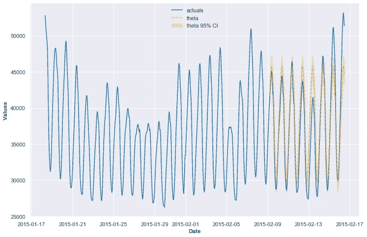
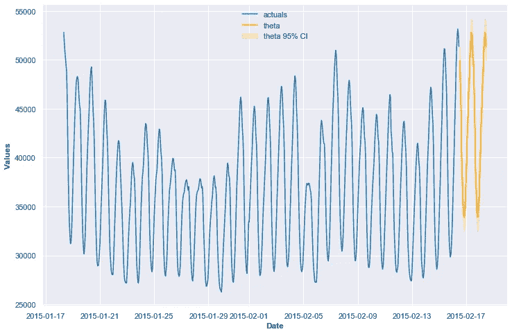

# 轻松采用时间序列的 Theta 模型

> 原文：<https://towardsdatascience.com/easily-employ-a-theta-model-for-time-series-b94465099a00>

## M4 竞赛中的最佳基准模型使用 Python 轻松训练、调整和测试


作者图片

与 ARIMA 等经典技术相比，Theta 不太为人所知，它是一种时间序列模型，可以产生准确的结果，并且易于理解和应用。如果你是时间序列从业者和预测者，这是一个很好的工具。

它的工作原理是从潜在的时间序列中提取两条“θ线”。第一条线是时间序列的线性趋势，可以通过对使用时间趋势作为输入的数据运行简单的线性回归来提取。这条θ线可以非常简单地通过无限期地继续其线性趋势而推断出未来。

第二条θ线可以看作是级数的曲率。它是系列的第二个差值乘以一个因子，默认情况下为 2。小于 1 的值抑制曲率并强调长期趋势，大于 1 的值强调曲率并强调短期趋势。通过使用指数平滑向前外推第二条θ线。

这两条θ线然后在加法或乘法过程中结合。为了说明季节性，在提取 theta 线之前，该模型还使用乘法或加法季节性分解方法对数据进行去季节性处理。在θ线合并后，这种季节性会重新应用到预测数据中。

提出这种方法的论文还提到，进一步的研究可能包括提取两条以上的θ线，但据我所知，没有这样的模型发现任何有前途的东西，但思考起来很有趣(Assimakopoulos & Nikolopoulos，2000)。

很简单吧？让我们看看如何使用 Python 来实现它。

# Python 应用程序

## 飞镖游戏

Darts 是一个用户友好的时间序列包，它使用了一个名为 FourTheta 的 Theta 模型的实现，这是上面解释的思想的衍生物，可以对第一条 theta 线应用指数变换(而不是使用简单的线性趋势)。这款衍生车型是 2020 年 M4 竞赛中表现最佳的基准车型。

要安装省道:

```
pip install darts
```

这里有一个链接到 darts 中的模型文档。

## 规模预测

[Scalecast](https://github.com/mikekeith52/scalecast) 将 darts 的 theta 模型移植到一个通用的时间序列框架中，该框架易于实施，并可与其他几种经典的时间序列方法、scikit-learn 的机器学习模型以及其他技术进行比较。我将演示 theta 模型的 scalecast 实现，因为我是 scalecast 的作者，并且希望展示这个框架如何能够非常容易地为任何用户实现。也就是说，如果你想直接使用 darts 的模型，它也提供了一个用户友好和舒适的框架。

要安装 scalecast:

```
pip install scalecast
```

你可以在这里找到本文[中使用的完整笔记本。](https://github.com/mikekeith52/scalecast-examples/blob/main/theta/theta.ipynb)数据来自 M4 竞赛的[开放访问](https://github.com/Mcompetitions/M4-methods/issues/16)，可在 [GitHub](https://github.com/Mcompetitions/M4-methods/tree/master/Dataset) 上获得。我们将使用 H7 每小时时间序列。

## 代码实现

在代码中应用这个模型非常简单。我们首先将数据加载到预测器对象:

```
train **=** pd**.**read_csv('Hourly-train.csv',index_col**=**0)
y **=** train**.**loc['H7']**.**to_list()
current_dates **=** pd**.**date_range(
    start**=**'2015-01-07 12:00',
    freq**=**'H',
    periods**=**len(y)
)**.**to_list()
f **=** Forecaster(y**=**y,current_dates**=**current_dates)
```

我们可以绘制这个系列，以便更好地了解我们在做什么:

```
f**.**plot()
plt**.**show()
```


作者图片

让我们留出 25%的数据进行测试，并预测未来的 48 个时间段:

```
f**.**set_test_length(.25)
f**.**generate_future_dates(48)
```

现在，我们可以指定一个超参数网格来找到调优该模型的最佳方式。这个网格在大多数情况下都能找到一个很好的模型，但是你也可以考虑给它增加更多的θ值。

```
fromdarts.utils.utils import (
    SeasonalityMode, 
    TrendMode, 
    ModelMode
)theta_grid **=** {
    'theta':[0.5,1,1.5,2,2.5,3],
    'model_mode':[
        ModelMode**.**ADDITIVE,
        ModelMode**.**MULTIPLICATIVE
    ],
    'season_mode':[
        SeasonalityMode**.**MULTIPLICATIVE,
        SeasonalityMode**.**ADDITIVE
    ],
    'trend_mode':[
        TrendMode**.**EXPONENTIAL,
        TrendMode**.**LINEAR
    ],
}
```

现在，让我们使用三重时间序列交叉验证来寻找最佳的超参数组合。这将基于我们的训练集创建 3 个数据段，其中每个验证集的长度为 131 个观察值，并且具有所有上述超参数组合的模型根据每个验证集之前的数据进行训练。基于哪个模型返回所有褶皱的最佳平均 MAPE 值来选择最终模型。

```
f**.**set_validation_metric('mape')
f**.**set_estimator('theta')
f**.**ingest_grid(theta_grid)
f**.**cross_validate(k**=**3)
```

从交叉验证中选择的最佳参数是:

```
>>> f**.**best_params
{'theta': 1,
 'model_mode': <ModelMode.ADDITIVE: 'additive'>,
 'season_mode': <SeasonalityMode.MULTIPLICATIVE: 'multiplicative'>,
 'trend_mode': <TrendMode.EXPONENTIAL: 'exponential'>}
```

然后，我们使用选择的模型预测我们的测试集和 48 期预测范围:

```
f**.**auto_forecast()
```

我们现在可以看到可视化的测试结果:

```
f**.**plot_test_set(ci**=**True)
plt**.**show()
```



作者图片

以及预测结果:

```
f**.**plot(ci**=**True)
plt**.**show()
```



作者图片

这返回了 5.5%的测试集 MAPE 结果。交叉验证过程中的平均验证 MAPE 为 7.5%。验证 MAPE 稍微差一点是有道理的，因为它在每次验证迭代中要学习的训练集更少。

假设一段时间过去了，我们现在有一些新的数据要引入到这个模型中，我们可以衡量它在 48 期预测中的表现。让我们看看效果如何。

```
test = pd.read_csv('Hourly-test.csv',index_col=0)
y_test = test.loc['H7'].to_list()
future_dates = pd.date_range(
    start=max(current_dates) + pd.Timedelta(hours=1),
    freq='H',
    periods=len(y_test),
).to_list()fcst = f.export('lvl_fcsts')
mape = np.mean(
   [np.abs((f - a) / a) for f, a in zip(fcst['theta'],y_test)]
)
```

这返回了 6%的值，正好在我们的测试集和验证度量之间，这正是我们所期望的！

# 结论

theta 模型是时间序列分析师的强大工具，概念简单，易于调整，易于评估。希望你觉得这个教程有用！如果是的话，请考虑以后使用 scalecast，为其成长做点贡献！

[](https://github.com/mikekeith52/scalecast)  

# 参考

动词 （verb 的缩写）Assimakopoulos，K. Nikolopoulos，theta 模型:预测的分解方法，国际预测杂志，第 16 卷，2000 年第 4 期，第 521-530 页，ISSN 0169-2070，[https://doi . org/10.1016/s 0169-2070(00)00066-2。](https://doi.org/10.1016/S0169-2070(00)00066-2.)
([https://www . science direct . com/science/article/pii/s 0169207000000662](https://www.sciencedirect.com/science/article/pii/S0169207000000662))