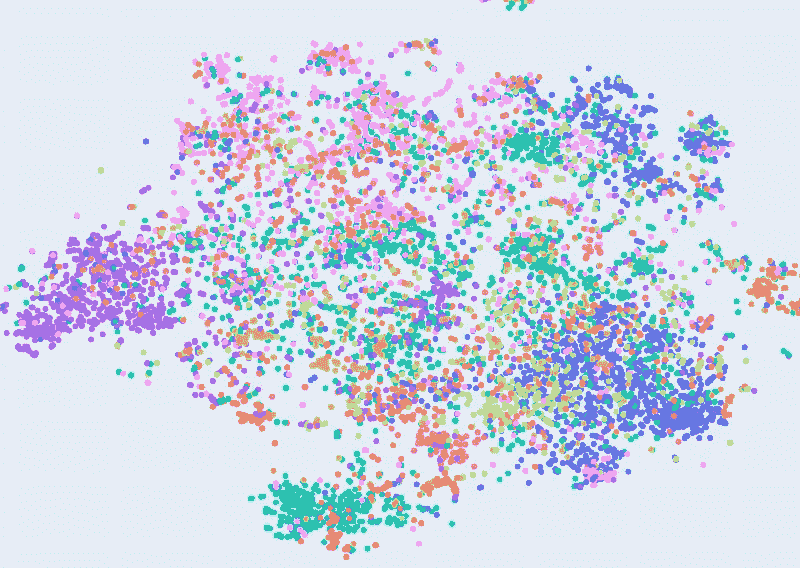

# 使用 SentenceTransformers 轻松获得高质量的嵌入！

> 原文：<https://towardsdatascience.com/easily-get-high-quality-embeddings-with-sentencetransformers-c61c0169864b>

# 使用 SentenceTransformers 轻松获得高质量的嵌入！

## 介绍向量表示的概念，并比较 TF-IDF 向量和 SentenceTransformers 向量！



图片作者。

# 背景

在我加入 [HK01](https://www.hk01.com/) 之前，它的数据团队已经利用大量的文本数据建立了几个数据项目。虽然能够将 NLP(自然语言处理)技术应用于真实世界的数据以对业务产生影响是件好事，但我注意到这些数据项目都在使用 [TF-IDF](https://en.wikipedia.org/wiki/Tf%E2%80%93idf) 来学习 HK01 上发布的内容的嵌入(向量表示)。这些嵌入是这些数据项目的核心，因为它们在机器学习模型中用于进行预测。这种方法有几个问题:

1.  **性能欠佳** 虽然 TF-IDF 做得很好，但它是一种相对较老的计算文本嵌入的方法。最近有很多关于 NLP 的研究，现在变形金刚模型(例如[伯特](https://arxiv.org/abs/1810.04805)、[罗伯塔](https://arxiv.org/abs/1907.11692)、 [GPT-3](https://en.wikipedia.org/wiki/GPT-3) )是 NLP 任务的最新模型。
2.  **难以维护**
    升级或调试效率低下，我们需要对这些项目中的每一个都进行更改。
3.  **高成本**
    由于这些数据项目中的每一个都是独立计算嵌入，因此其成本远远高于由一个集中式服务来计算全部嵌入。

## 我们为什么要关心这些嵌入呢？

嵌入只是一些东西的表示，可以是文本、图像，甚至是语音，通常是矢量形式。计算文本嵌入的最简单方法是使用[单词袋(BOW)表示法](https://en.wikipedia.org/wiki/Bag-of-words_model)。

假设你有很多关于你在网上销售的产品的用户评论。要获得 BOW 表示或用户评论，您需要做的就是将这些评论分解成单词。然后创建一个表格(或者更像一个矩阵),它的列是注释中的单词。索引将是用户评论的 id。该值是该单词是否出现在用户评论中。看起来是这样的:

现在每一行都是一个注释的向量表示，所以注释 ID 1 的嵌入向量是`[1, 0, 1, 1, 0, ...]`。由于第一行在单词“好”、“爱”和“令人惊叹”中的值为 1，我们已经可以看出这个评论在情感方面是积极的。所以嵌入向量告诉我们注释的上下文含义。

一旦我们有了所有用户评论的嵌入，我们就可以做许多不同的事情。例如:

1.  我们可以训练一个分类器来预测每个评论的情绪。
2.  我们可以通过计算余弦相似度或欧氏距离来找到上下文相似的评论。
3.  我们可以将评论分组，然后找到这些组中出现的最常见的单词。例如，我们可能会在聚类中找到像`'fast', 'delivery'`或`'overpriced'`这样的词。这有助于我们了解需要改进什么。

想象一下，如果我们对 HK01 上发表的文章这样做，我们就可以做一些事情，比如主题建模(类似于第 3 点)，推荐用户读过的类似文章(类似于第 2 点)，等等！

## 旁注

在实践中，我们会将停用词(例如' the '，' a '，' and ')和词干词放入它们的基本形式(例如' flying '到' fly '，' cars '到' car '，' am '到' be ')。这里不解释涉及的许多数据预处理技术。

## 为什么弓不够好？

在这一点上，你可能会意识到我们的向量的维数很高，这是因为用户评论中可能出现的单词数量非常大。所以每个向量在维度上可以是`1x10000`甚至是`1x100000`。当我们使用这些向量时，这会降低计算速度！

此外，BOW(单词袋)表示法可能不是一个很好的表示法。如果我们有两个注释，例如`Exactly what I wanted! 5 stars!`和`Absolutely amazed by the product! great price!`。虽然我们可以知道它们都是正面的评论，但是这两个评论的 BOW 表示没有相似之处，因为没有重叠的单词。这就是为什么我们需要更好的东西！

# 句子变压器

 [## 句子变压器文件-句子-变压器文件

### 编辑描述

www.sbert.net](https://www.sbert.net/index.html) 

SentenceTransformers 是一个 Python 框架，用于最先进的句子、文本和图像嵌入。它的 API 使用起来非常简单:

就这么简单，这就是我们需要编码来获得任何文本的嵌入的全部内容！

```
[-5.09571552e-01  6.48085847e-02  7.05999061e-02 -1.10023748e-02
 -2.93584824e-01 -6.55062944e-02  7.86340162e-02  1.02539763e-01
 -3.80028449e-02  1.71354219e-01  1.69140086e-01 -9.65721607e-02
  2.04715624e-01  3.12998295e-01 -1.77713439e-01  1.53584480e-02
  9.74370390e-02  2.11779386e-01  1.24351427e-01 -1.38820678e-01
  4.35955316e-01 -1.17388457e-01 -3.58339213e-02 -1.36476666e-01
... # hidden by me as it's too long :)(1, 384)
```

与使用 BOW 得到的 1 和 0 不同，我们得到了浮点值和固定尺寸(本例中为 1 x 384)。这是因为嵌入是从变压器模型中的隐藏层提取的，维度与该隐藏层的神经元数量相同。因为嵌入是由 transformer 模型学习的，所以前一节中的两个示例注释现在是相似的。在这篇博文中，我不打算详细讨论这个问题。现在，只需要知道转换器是一个神经网络，它的本质是可以将高维数据压缩到低维。

## 它在幕后做什么？

为 SentenceTransformers 做出贡献的人们在 [HuggingFace 模型中心](https://huggingface.co/sentence-transformers)上托管许多不同的预训练的变形金刚模型。托管预训练模型已经在大量数据(100 多万甚至 1B+训练对)上进行训练，因此被称为“预训练”模型。模型看到的数据样本量如此之大，以至于我们可以简单地使用它**开箱即用**来获得高质量的嵌入。当 API 被调用时，它从 HuggingFace Model Hub 下载所选择的预训练模型(或者如果给定了本地路径，则下载 load)。然后，它对你的输入句子进行标记，并将它们放入模型中计算它们的嵌入。

API 极大地简化了这个过程，以至于我们不再需要为标记化编写代码，改变 PyTorch 模型类中定义的`predict()`等等。如果你使用了 HuggingFace 甚至纯 PyTorch 来做这件事，你就会知道这种痛苦了。现在，它变成了一行代码！

```
embeddings = model.encode(sentences) # very simple, isn't it?
```

## 我的文字超级长怎么办？

考虑 SentenceTransformers 上可用的每个预训练模型的最大长度很重要。例如，`paraphrase-multilingual-mpnet-base-v2`型号的最大序列长度为 128。这意味着对于任何超过 128 个标记的输入句子，都将被修剪，即只有前 128 个标记将被放入模型。想象一下，如果我们在 HK01 上发表了一篇包含数千个汉字的文章。如果我们把它放到 API 中，我们将只能得到代表前几个句子的嵌入！

克服这一点的一个简单技巧是将文章分成一系列句子，然后取句子嵌入的平均值作为文章嵌入。像这样:

虽然这听起来可能太简单，但我们发现它工作得很好。让我们在下一节看看它的表现。

## 旁注

正如你所看到的，理解它是如何工作的非常重要。这正是为什么即使训练机器学习模型的 API 已经简化了这么多，公司仍然需要数据科学家和机器学习工程师的原因:)！

## 与 TF-IDF 相比，它的性能如何？

为了了解它如何优于 TF-IDF 矢量表示，我们:

1.  随机抽样 10，000 篇发表在 HK01 上的文章。
2.  使用句子变形器(`paraphrase-multilingual-MiniLM-L12-v2`和平均句子嵌入)和 TF-IDF 计算它们的嵌入。对于 TF-IDF，我使用`sklearn.feature_extraction.text.TfidfVectorizer`和`TfidfVectorizer(analyzer='word', min_df=0.001, ngram_range=(1, 3)`来更好地捕捉汉字。
3.  通过运行 t-SNE 将嵌入维数减少到 2， [t-SNE 是一种降维算法，以防你不知道](https://en.wikipedia.org/wiki/T-distributed_stochastic_neighbor_embedding)。
4.  将文章类别映射到数据，并将结果可视化。

以下是可视化效果，您可以通过单击图例与图表进行交互以放大和过滤数据:

请注意，由于有太多不同的类别，一些不同的类别使用相同的颜色。

我们可以看到，在顶部(红色的)和底部(紫色的)周围只有一些小簇。这个中心根本没有清晰的星团。想象一下，如果我们完全没有类别，我们很难对同一主题的文章进行分组。现在让我们来看看句子变形器生成的嵌入:

请注意，由于有太多不同的类别，一些不同的类别使用相同的颜色。

At first glance, you can already see data points with the same category are sticking closer together. Not only that, categories that are somewhat related (e.g. movie (電影), games & anime (遊戲動漫) and entertainment (即時娛樂)) are also closer together at the bottom right.

想象一下，如果我们有一篇关于喜剧电影的文章，那么我们可以使用上述嵌入来找到最近的 N 个数据点，并将它们列在 HK01 上作为相关文章，最近的 N 个数据点也将与“电影”、“喜剧”或至少“娱乐”相关。

# 摘要

现在，我们已经看到 SentenceTransformers 非常容易使用，并且它生成高质量的嵌入。

为了克服 HK01 的问题，我们正在创建一个新项目，目的是使用 SentenceTransformers 计算 HK01 上发布的任何内容的嵌入。目前，我们正在将每一个数据源集成到这个新项目中，以建立一个 cronjob 来计算新内容或编辑内容的嵌入。我们期待看到我们的推荐系统和下游数据项目的改进！

## 如果你喜欢这篇博文，请点击下面按钮并鼓掌！[👏🏻也在 Github 上关注我吧！](https://emojipedia.org/clapping-hands-light-skin-tone/)

[](https://github.com/thomas-tf) [## 托马斯-tf -概述

### thomas-tf 有 13 个可用的存储库。在 GitHub 上关注他们的代码。

github.com](https://github.com/thomas-tf) 

# 参考

*   变形金刚—[https://www.sbert.net/index.html#](https://www.sbert.net/index.html#)
*   TF-IDF—[https://en.wikipedia.org/wiki/Tf%E2%80%93idf](https://en.wikipedia.org/wiki/Tf%E2%80%93idf)
*   鞠躬—[https://en.wikipedia.org/wiki/Bag-of-words_model](https://en.wikipedia.org/wiki/Bag-of-words_model)