# EDA 与 Tableau: 2021 年 NYPD 停下来搜身的人口统计

> 原文：<https://towardsdatascience.com/eda-with-tableau-2021-nypd-stop-and-frisks-by-demographics-e5e88eb43939>

## 使用公共数据时制作可访问仪表板的案例—

([longislandwins](https://www.flickr.com/photos/25246917@N04)的《无声行进到终点》被 2.0 的 [CC 授权。)](https://creativecommons.org/licenses/by/2.0/?ref=openverse)

上面这张照片是在一次结束截停搜身和种族歧视的无声游行中拍摄的，拍摄于 2012 年 6 月 17 日，在截停搜身被视为违宪的一年前。探索 NYPD 的拦截搜身数据符合公众的既得利益。去年在纽约，有将近 9000 次停车。

但是什么是拦截搜身呢？

## NYPD 拦截搜身概述:

Dictionary.com 将 stop-and-frisk 定义为*[*短暂拦截某人以搜查其武器或违禁物品的警察行为*](https://www.dictionary.com/browse/stop-and-frisk#:~:text=a%20policy%20that%20permits%20a,suspected%20of%20concealing%20a%20weapon.)*

**NYPD 从去年开始称他们的项目为“拦截、询问和搜身”,以反映市长亚当对拦截和搜身的态度，亚当是前 NYPD 队长。**

> **“我不断被追问我对被称为‘拦截搜身’的警务程序的立场——这在执法中实际上被称为‘拦截、询问和搜身’——以及为什么我相信，如果使用得当，它可以在不侵犯个人自由和人权的情况下减少犯罪，”—亚当斯市长*【1】***

**为什么这对纽约市的治安历史如此重要，是因为如果你在谷歌上搜索“停下来搜身+违宪”，你首先会看到以下内容，来自维基百科:**

> **[在 2013 年 8 月 12 日裁决的 Floyd 诉纽约市一案中，美国地方法院法官 Shira Scheindlin 裁定，拦截搜身检查的使用方式违宪，并指示警方采取书面政策，具体说明在哪些地方允许此类拦截。](https://en.wikipedia.org/wiki/Stop-and-frisk_in_New_York_City#:~:text=In%20Floyd%20v.,where%20such%20stops%20are%20authorized.)**

**纽约市警察局在 NYPD 的拦截搜身计划上立场明确。[4]**

**来自纽约市警察局:**

> ****年度拦截搜身数字:****
> 
> **NYCLU 的一项分析显示，自 2002 年以来，无辜的纽约人遭到警察拦截和街头审讯超过 500 万次，黑人和拉丁裔社区仍然是这些策略的主要目标。在 2011 年彭博政府时期的截停搜身高峰期，超过 685，000 人被截停。几乎 90%被拦截搜身的纽约人是完全无辜的。**
> 
> **…在 **2021 年**，记录了 8947 次停车。
> 5422 人是无辜的(61%)。5404 人是黑人(60%)。2457 人是拉丁裔(27%)。732 人是白人(8%)。192 人是亚洲/太平洋岛民(2%)
> 71 人是中东/西南亚人(1%)**

**然而，有一个问题阻止了大多数纽约人接近拦截搜身数据。正如我在关于 NYPD 拦截搜身数据的[上一篇文章](/using-folium-on-police-data-3207e505c649)中提到的，这些信息对公众开放，但公众无法获取。NYPD 公布的文件仅以原始形式存在，它们没有被总结或汇总。文件的每一行代表一个站点的一个记录，查看原始文件有点像这样:**

**(视频由作者提供。youtube 上的视频片段链接如下:[https://www.youtube.com/watch?v=illObkP3TLQ](https://www.youtube.com/watch?v=illObkP3TLQ)**

**对于需要公众访问的数据，Tableau Public 这样的工具是绝佳的匹配。它的点击式图形用户界面对于熟悉数据的人和数据新手来说都很直观。通过将 Tableau Public 用于我的 EDA，交互式可视化的好处有助于我自己对数据的理解，但更重要的是，我可能为普通纽约人构建了一些易于理解的东西，以理解去年的“拦截搜身”。**

**让我们看看我能做什么。然后，我将向后展示我的方法，这样您就可以理解我是如何构建这个仪表板并将其用于 EDA 的。**

**我的 EDA 将专注于理解人口统计学(种族、年龄和性别)与警察辖区之间的关系，在这些区域发生了拦截搜身，并阻止了涉嫌犯罪的人。我还会调查是否使用了任何形式的暴力，以及停车是否导致了逮捕。**

# **结果:**

**[https://public . tableau . com/views/stopandfrisk 2021 NYPD/stopandfrisk 2021 demographicoverview？:language = en-US&:display _ count = n&:origin = viz _ share _ link](https://public.tableau.com/views/StopandFrisk2021NYPD/StopandFrisk2021DemographicOverview?:language=en-US&:display_count=n&:origin=viz_share_link)**

**这是我制作的一张仪表盘的静态图片，因为 Medium 不支持嵌入 Tableau 公共仪表盘。**

**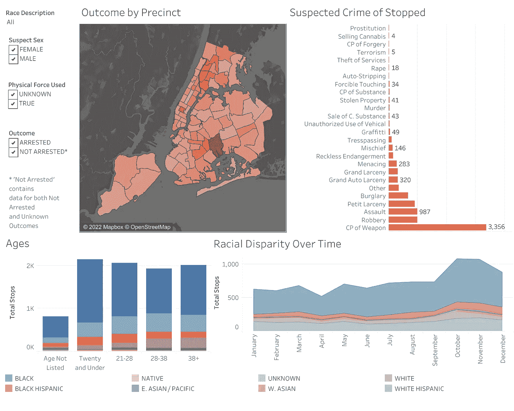**

**(图片由作者提供)**

## **数据:**

**NYPD 将其所有可用数据发布到纽约市开放数据网站，这是他们的拦截、询问和搜身数据。**

**纽约市在“学校、警察、健康和消防”【3】下面有 NYPD 分局的 geojson 档案[。](https://www1.nyc.gov/site/planning/data-maps/open-data/districts-download-metadata.page)**

## **代码:**

**[我的 Github Repo 在这里清理了数据，并为聚合做好了准备。我不会回顾我所做的每一步，而是概述我所做的选择。](https://github.com/casanave/tableau_data)**

1.  **我将`STOP_FRISK_DATE`和`STOP_FRISK_TIME`制作成每一站的日期时间列，并将文件重新保存为 csv.gz 文件以节省一些空间:**

**(图片由作者提供)**

**2.我分离出感兴趣的列，只保留那些:**

**(图片由作者提供)**

**3.我用完整的措辞替换了一些更复杂的犯罪描述:**

**(图片由作者提供)**

**4.我尽可能地将一些种族描述改为更微妙的语言。(Business Insider 很好地解释了为什么“中东”是过时的语言。[ [4](https://www.businessinsider.com/why-you-should-stop-calling-it-the-middle-east-2015-1) ]在`SUSPECT_RACE_DESCRIPTION`中将类似`MALE`和`(null)`的值更改为`UNKNOWN`非常简单。我不想改变太多的这些价值观，因为我发现保持警察如何对人们进行种族侧写的精确性是相关的。**

**然而，可以将`BLACK HISPANIC`与`BLACK`和`WHITE HISPANIC`与`WHITE`合并，或者将`HISPANIC`或`LATINX`单独归为一类。将`ASIAN / PACIFIC ISLANDER`更改为`E. ASIAN`是唯一一个我失去了一些细微差别的类别，以换取一个更简单易用的名称对象，这是我在 Tableau 中使用别名时解决的问题。**

**(图片由作者提供)**

**5.在关于使用体力的栏中，我将`Y`替换为`1`，将`UNKNOWN`替换为`0`。当我合计时，这将把所有的`Y`加在一起。**

**(图片由作者提供)**

**6.出于汇总和描述性统计的目的，我还制作了一个列，记录了一次遭遇中使用的所有物理力量(行。)**

**(图片由作者提供)**

**它返回给我们下表:**

****

**(图片由作者提供)**

**值得注意的是，在该数据代表的 8，947 行中，只有不到 100 行使用了`UNKNOWN`数量的体力。该数据集中的所有其他停止都有一个已知的因素，即至少使用了某种物理力的一个计数。当我们得到描述性统计数据时，我们将回到这个问题上来。**

**7.我做了一个布尔列来捕捉是否使用了任何形式的物理力量。请注意，当我在 Tableau 中为该列添加别名时，`FALSE`变成了`UNKNOWN`:**

**(图片由作者提供)**

**8.我将 DateTime 列转换为索引，并将`STOP_LOCATION_PRECICNT`列更改为 string 数据类型，因为它是分类信息，我们不想计算这些值。**

**(图片由作者提供)**

**9.我在做了一个`data['SUSPECT_REPORTED_AGE'].value_counts()`之后，发现了一些像 0 岁、120 岁这样不合逻辑的年龄值，就把`SUSPECT_REPORTED_AGE`中一些没有意义的值改成了`UNKNOWN`。**

**(图片由作者提供。)**

**10.我从数据中切掉年龄是已知值的行，并将这些值转换成整数，这样我们就可以计算它们了。**

**(图片由作者提供)**

**我这样做是因为我想基于年龄的四分位数范围创建一个`AGE_CATEGORY`分类列。通过按四分位数范围划分年龄，我知道我可以在数据分布的地方最平均地划分数据。**

**(图片由作者提供)**

**这段代码向我们返回了与年龄层位置相关的数字。**

****

**(图片由作者提供)**

**11.所以我做了一个垃圾桶来捕捉 20 岁以下，21-28 岁，28-38 岁和 38 岁以上的人:**

**这段代码返回到我们的`SUSPECT_REPORTED_AGE`列，与我们刚刚创建的`AGE_CATEGORY`列进行比较。让我们看看它是否有效。**

**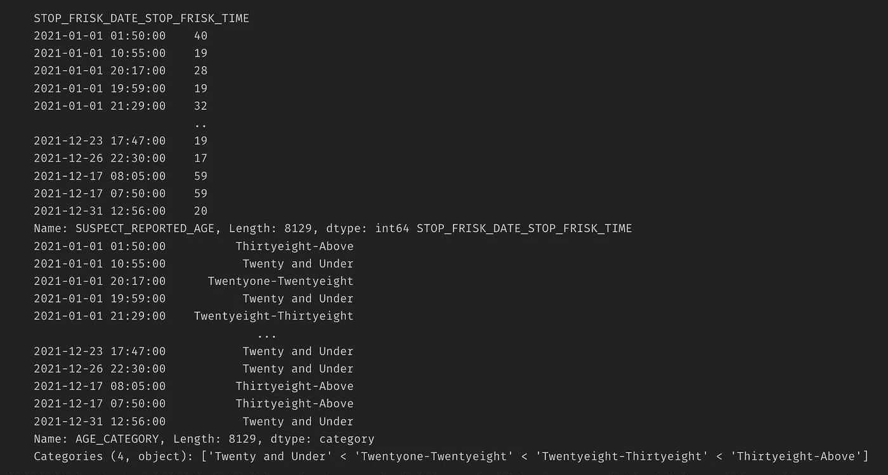**

**成功了！我可以说它工作了，因为我们的第一行，索引在`2021-01-01 01:50:00`被列为`40`岁，在`Thirtyeight-Above`类别等等。**

**从那里，我想把我们的年龄未知数混合回数据中，他们的年龄类别为`UNKNOWN`:**

**(图片由作者提供)**

**它返回以下内容:**

****

**(图片由作者提供)**

**好像花了！从那里，我想了解一下`AGE_CATEGORY`中年龄的总体分布情况**

**它返回了以下内容:**

****

**(图片由作者提供)**

**看起来我们的分位数成功地捕捉到了均匀分布，我们的`UNKNOWN`年龄类别比其他类别的一半要小。**

**11.当我查看像这样的`SUSPECT_SEX`发行版时:**

**(图片由作者提供)**

**它返回了以下内容:**

**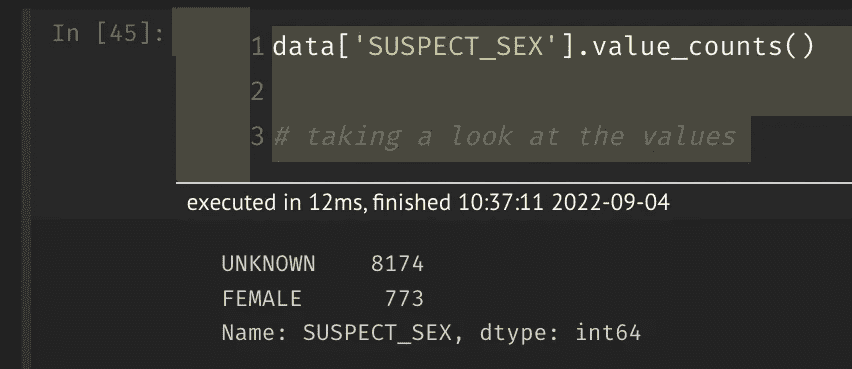**

**(图片由作者提供)**

**使`FEMALE`成为这个数据集中的少数。让大多数人是一种性别没有太大意义。我决定将`UNKNOWN`改为`MALE`,因为我知道可能会有一些既不是女性也不是男性的人通过这种方式处理数据时会经历数据擦除。**

**(图片由作者提供)**

**12.我制作了一个列，仅仅是为了汇总任何给定类别中的停靠点总数。我会在 Tableau 中大量使用这个专栏。**

**(图片由作者提供)**

**13.我使`SUSPECT_ARRESTED_FLAG`列适合聚合，并使它的对应列`SUSPECT_NOT_ARRESTED_FLAG`显示相反的值，这样我就可以同时使用这两个列。**

**(图片由作者提供)**

**因此，如果有人被捕，它将显示值为`SUSPECT_ARRESTED_FLAG`的`1`和值为`SUSPECT_NOT_ARRESTED_FLAG`的`0`，这将在可视化过程中帮助我。**

**14.我使用`data.describe()`查看了描述性统计数据，以下是我的发现:**

****

**(图片由作者提供)**

*   **总的平均比率是 37%被捕与 62%未被捕，平均标准偏差约为 50%，这意味着可变性高于实际被捕率。**
*   **在停车期间，平均枪支收缴率不到 6%。**
*   **在停车期间，大约有 20%的时间会强制使用手铐。**

**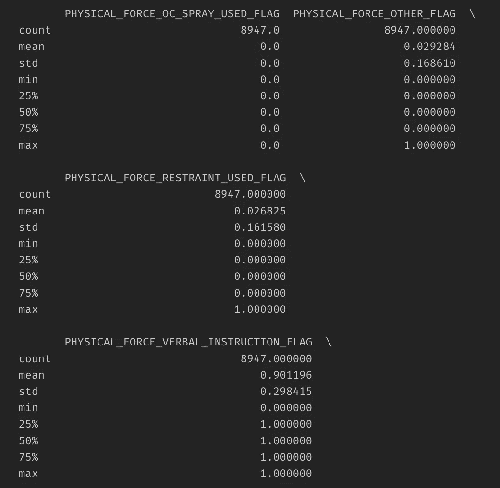**

**(图片由作者提供)**

*   **根据数据，2021 年停车期间没有使用 OC 喷雾。**
*   **在停车期间，大约 3%的时间使用体力“其他”。**
*   **在停车期间，只有不到 3%的时间使用了约束。**
*   **90%的时间都在使用体力口头指令，这使它成为大多数停车的常规部分。**

**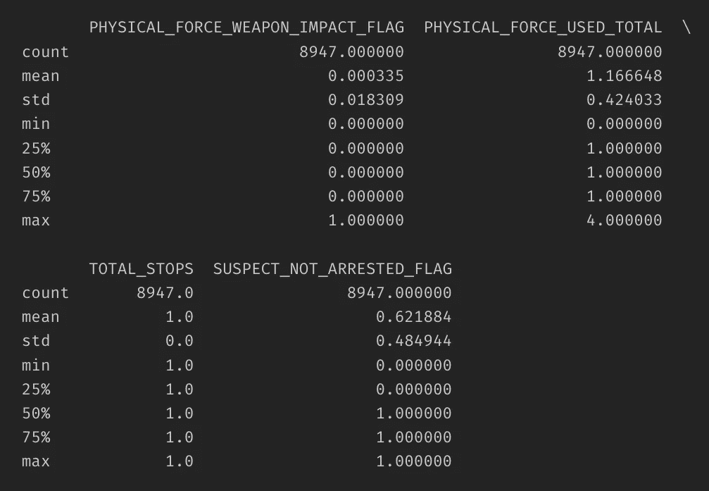**

**(图片由作者提供)**

*   **几乎没有使用过武器的记录。**
*   **体力总量，也许是这组统计数据中最有趣的指标，约为 1.25%，这意味着如果我们将所有使用的各种体力计数相加，使用的体力计数比停止的多大约四分之一。这是一个非常有趣的统计数据。标准偏差约为 0.5 或所用物理力的一半，这意味着平均经验是物理力被用于止损，物理力的大小通常变化半个计数。**

**从这里开始，我使用`data.to_csv('2021_data.csv')`保存数据，并继续使用 Tableau 公开仪表板。**

## **仪表板:**

**这是我第一次使用 Tableau Public，我花了一分钟才适应。这里是我的一般步骤，但对于更多细节，我鼓励您下载仪表板本身并开始使用它。**

1.  **将`precincts.json`文件添加为`Spacial`文件，将`2021_data.csv`文件添加为文本文件，并将它们之间的关系定义为`Precicnt1` `=` `STOP_LOCATION_PRECICNT`**

**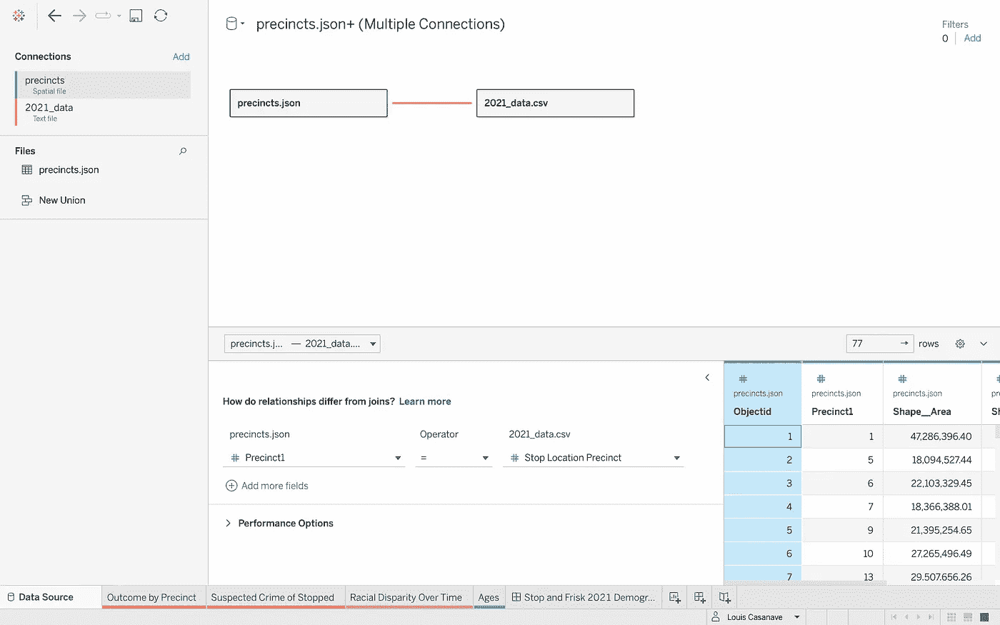**

**(图片由作者提供)**

**2.通过将`Geometry`拖到空白页上制作**分区结果**图，使`Stop Location Precicnt`成为一个维度细节(不是按总和)，允许我滚动每个分区并弹出该分区。从那以后，问题就变成了我想在选区展示什么。我选择显示该辖区内的总停靠次数，并选择显示我创建的名为`Not-Arrested Rate`的计算字段，有关我如何计算该字段的详细信息，请参见此处:**

**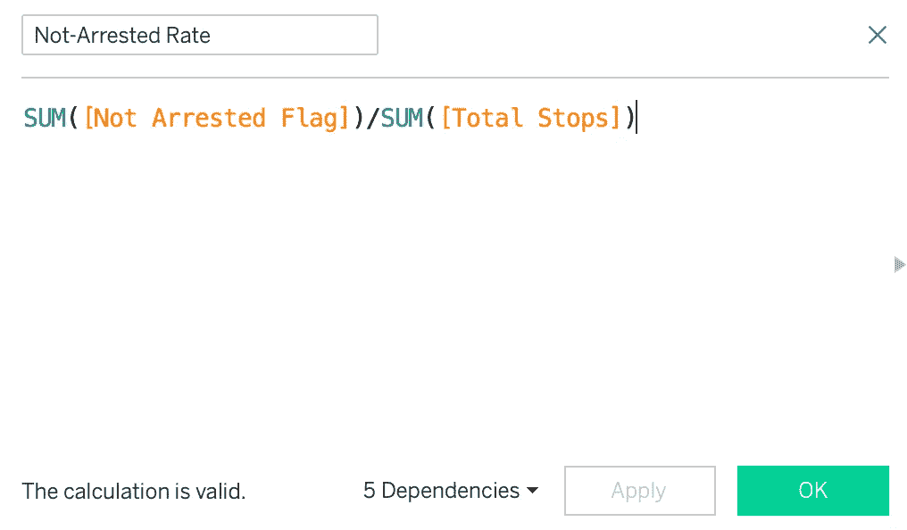**

**(图片由作者提供)**

**3.对于**涉嫌犯罪被阻止的**情节，我把`Total Stops`拖到列上，确定它正在取和。然后，我将`Suspected Crime`药丸拖到几排。**

**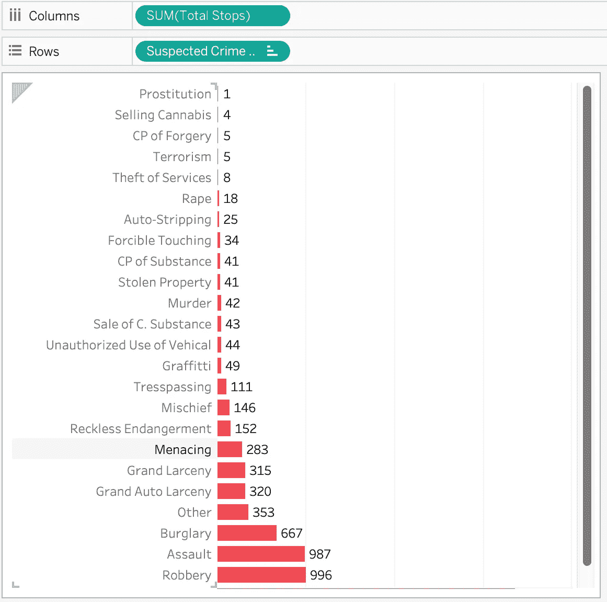**

**(图片由作者提供)**

**我决定将“大麻的销售”与“大麻的销售”混为一谈，因为我想消除说西班牙语的人的污名。更多来自 NPR 的消息。]**

**让数字在栏旁边弹出也很简单，只需将`SUM(Total Stops)`拖到文本框中，如下所示:**

**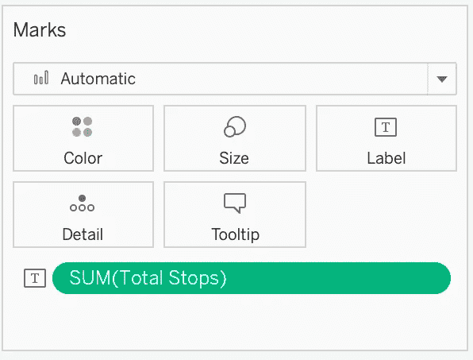**

**(图片由作者提供)**

**4.随着时间的推移制作**种族差异**剧情分两步走。首先，我将时间索引拖到列上，并选择了`Month`而不是`Year.`，然后我将`Total Stops`拖到行上，并确保它得到了总和。**

****

**(图片由作者提供)**

**然后我把`Suspect Race Description`药丸拖到 Marks，并使它成为一个彩色细节。**

**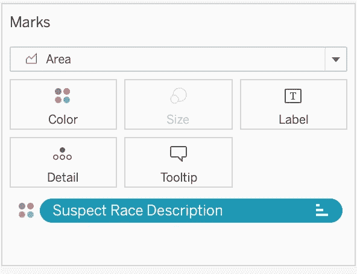**

**(图片由作者提供)**

**5.制作**年龄**图是类似的，我将`Age Category`拖到列上，将`Total Stops`拖到行上，确保它得到总和。**

****

**(图片由作者提供)**

**然后我同样将`Suspect Race Description`拖到颜色标记处。**

**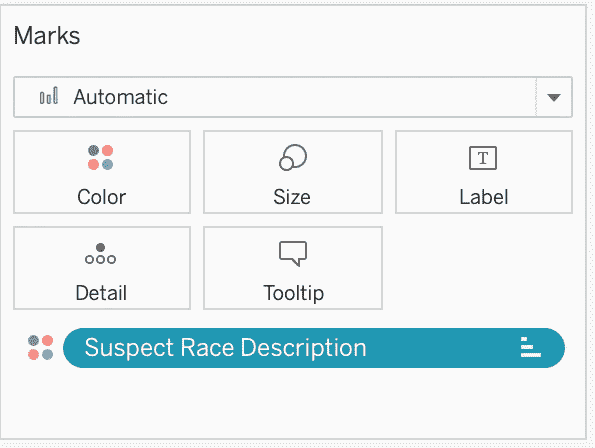**

**(图片由作者提供。)**

**6.将所有这些都放在一个仪表板上，使每个情节相互作用，并设置所有的过滤器，这是一个有趣的过程。要看到我的整个过程，最简单的事情就是从 Tableau Public 下载仪表板，然后自己去找。Tableau 社区文档中有丰富的更多资源:[https://help . Tableau . com/current/pro/desktop/en-us/filtering . htm](https://help.tableau.com/current/pro/desktop/en-us/filtering.htm)[6]**

***注意:这个仪表板仍然可以看到一些变化或改进。举例来说，我还没有尝试使用集合功能将同一个区的所有选区组合在一起。我也没有连接一种方法来显示使用了两种或两种以上物理力的停止，这在分离出* `PHYSICAL_FORCE_` *时可能是相关的。***

# **为什么这比用 python 做我所有的 EDA 要好？**

1.  **我可以用连珠炮似的问题来处理数据，而不会因为制作大量的静态表格和图表而慢下来。**
2.  **我可以非常容易地与公众和我的利益相关者分享我的发现。**

**例如，如果我只想得到未逮捕率最高的统计数据的明细，该怎么办？在地图上，我可以很容易地将 75 区(东纽约)标记为最暗的红色，当我单击它时，我可以看到该区内涉嫌犯罪的分布明细，其中绝大多数是持枪犯罪。从这里我还可以看到按种族划分的年龄分布，以及按种族划分的被捕时间。一次点击为我节省了很多很多行代码！**

**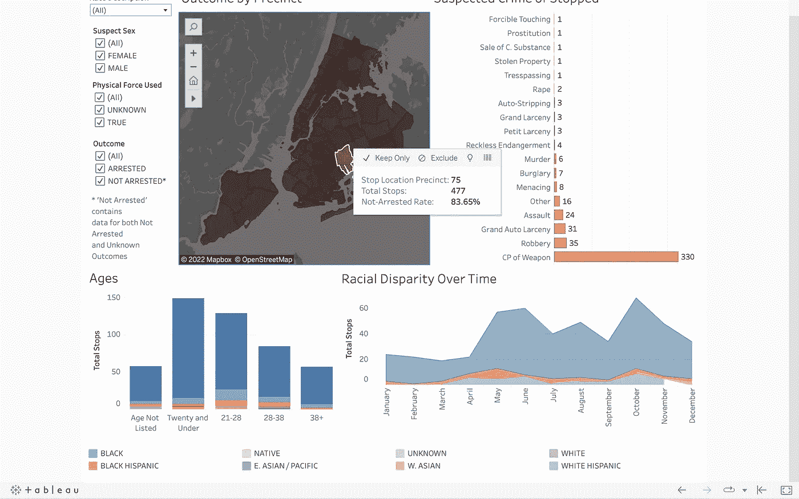**

**(图片由作者提供)**

**当我们使用这些描述性统计数据深入了解该辖区时，我们可以了解到，平均而言，75 号辖区拦截的乘客年龄远低于所有车站的平均年龄(28 岁)。)我们还了解到，75 区的未逮捕率远高于全市平均水平，分别为 83%和 67%。如果我们看一下时间线，我会想到问“4 月份开始发生了什么来阻止止损，特别是当阻止黑人时？”**

****

**(图片由作者提供)**

**当我们使用`Outcome`过滤器比较我们的图表时，我们可以看到，去年在 75 区因涉嫌非法持有武器而被拦下的 330 人中，有 278 人没有被逮捕。**

## **进一步的发现:**

****涉嫌非法持有武器并不导致逮捕:****

**在今年进行的 8，947 次拦截中，有 2，471 次是涉嫌非法持有武器，并没有导致逮捕。这仅占所有停靠站的 27%。通过查看年龄图，我们可以看到超过四分之一的停靠点都是 20 岁以下的人，或者他们的年龄没有被列出。我们也可以看到大多数黑人弥补这些停止。当我们查看种族差异随时间变化的图表时，我们可以看到一波从 9 月开始，在 11 月达到高峰，停留次数是 9 月的两倍多。这就引出了一个问题，9 月份开始发生了什么，为什么警方会阻止涉嫌非法持有武器的年轻黑人？**

****

**(图片由作者提供)**

****斯塔滕岛站:****

**当我们查看仅发生在斯塔滕岛的停靠点时，我们会得到不同的数据。我们看到了更多针对年轻人停车的证据，(但没有列出年龄的趋势)，黑人年轻人占了 20 岁及以下类别停车的一半。**

**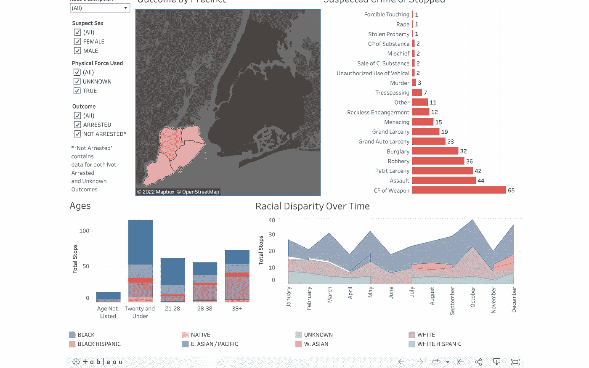**

**(图片由作者提供。)**

**最值得注意的是，在斯塔滕岛发生的停车事件中，绝大多数都使用了暴力。这两张照片显示了发生在斯塔顿岛的所有停靠站，然后我只分离出使用某种物理力量的停靠站。这两张照片几乎一模一样。**

****

**(图片由作者提供)**

**那是因为去年在斯塔滕岛只有 5 次停车，没有证实是否使用了某种暴力。其余的停留都涉及到体力。在未来，我想进行假设检验，看看斯塔滕岛的数据与纽约市其他地方的数据有多大差异，因为我们之前发现，去年全市 90%的车站中至少有一次使用了物理力量。**

****14 区的车站和妇女:****

**只要看看那些被拦下的人被列为女性的车站(记住，虽然大多数女性都自称为女性，但这是一种过于简单化的说法)，我们就可以看到曼哈顿下城的一个区，那里的不逮捕率特别高(暗红色。)**

**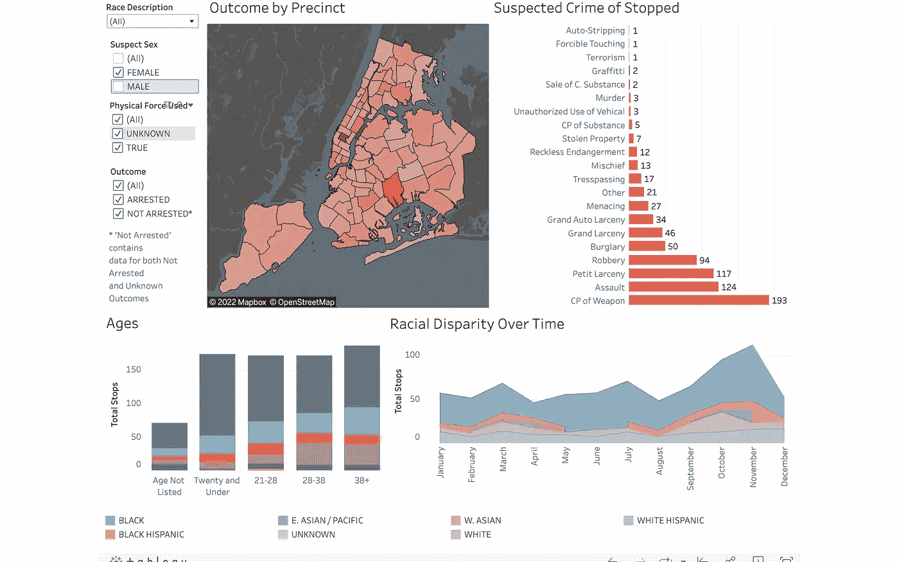**

**(图片由作者提供)**

**在进一步调查中，我们可以看到这是 14 区，去年有 60 个由妇女组成的站点，其中 90%没有被逮捕。与我们全市所有车站 67%的不逮捕率相比，这是一个相当高的比率。**

**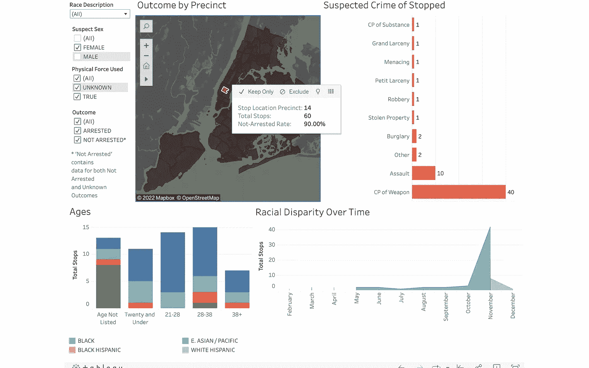**

**(图片由作者提供。)**

**在这 60 次拦截中，40 次(67%或三分之二)涉嫌非法持有武器。当我们查看她们的年龄时，我们可以发现超过一半的女性年龄在 28 岁以下，而大多数没有列出年龄的女性是东亚或太平洋裔。当我们查看我们的种族差异随时间变化的图表时，我们可以看到这些停止在 10 月和 11 月之间有一个很大的峰值。**

**当我们更仔细地观察时，我们可以看到这些拦截中的大多数并没有导致逮捕。**通过比较这两张快照，我们可以看到，随着时间的推移，种族差异主要是由黑人女性构成的。重要的是，大多数导致这些黑人女性被捕的停车点并不是在 10 月至 11 月停车高峰时发生的。****

**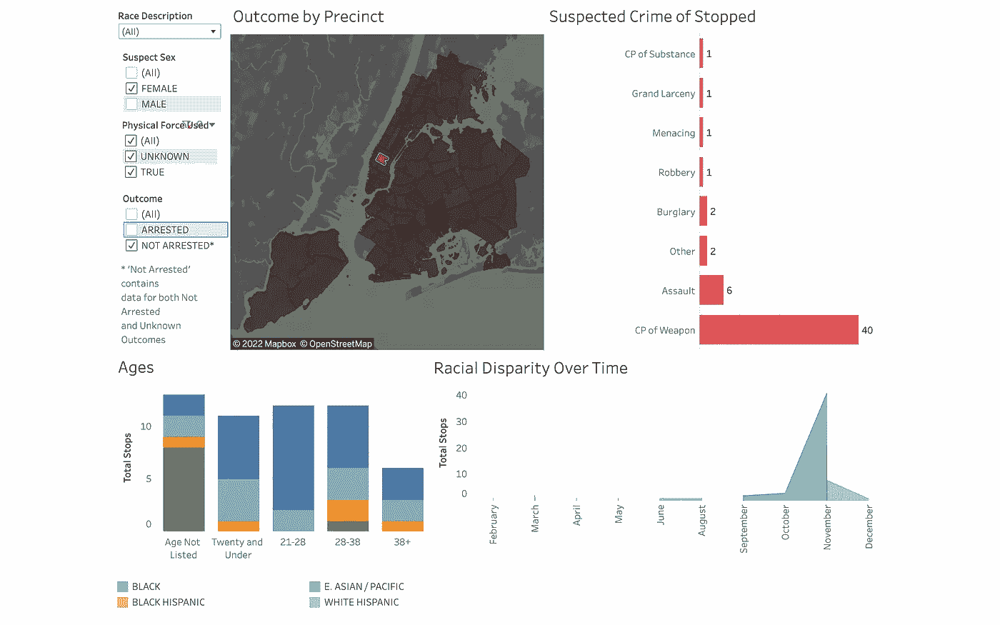**

**通过使用 Tableau，我可以与更多的观众分享这些发现，并且我能够轻松地对数据快速提问。事实证明，Tableau 在帮助我探索数据以及找到我想要进一步查询数据的位置方面非常有用。**

****最后**，我将把 Tableau 整合到我的 EDA 过程中，我鼓励你也考虑这样做。它节省了你询问数据问题的时间，你的利益相关者会感谢你能够理解数据并与数据本身互动。**

**[1] E. Adams，A. Wehenkel 和 G. Louppe，[我们如何使纽约市变得安全:当选市长 Eric Adams 解释了我们为什么需要拦截搜身和积极主动的治安](https://www.nydailynews.com/opinion/ny-oped-how-we-make-new-york-city-safe-20211128-4ekltfwlx5f4bgb3r4aegdnaiu-story.html) (2021)，纽约每日新闻**

**[2] NYPD，[拦住、盘问和搜身的数据](https://www1.nyc.gov/site/nypd/stats/reports-analysis/stopfrisk.page) (2021)**

**[3]纽约市，[政治和行政区—下载和元数据](https://www1.nyc.gov/site/planning/data-maps/open-data/districts-download-metadata.page) (2021)**

**[4]纽约市警察局，[拦截搜身数据](https://www.nyclu.org/en/stop-and-frisk-data) (2021 年)，纽约市警察局**