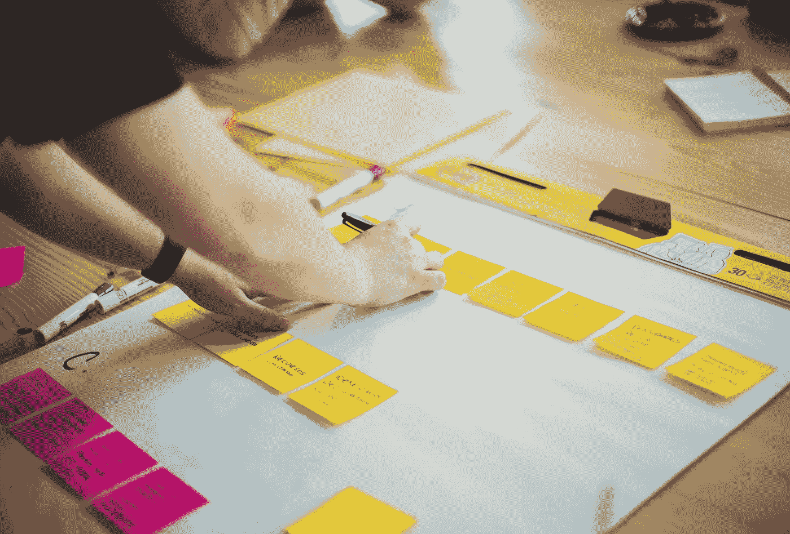

# 有效界定数据科学的范围，并向决策者传达数据科学

> 原文：<https://towardsdatascience.com/effectively-scoping-and-communicating-data-science-to-decision-makers-ab5a2bdc0e65>

## 因为首席执行官不想看你的笔记本

在 [Unsplash](https://unsplash.com?utm_source=medium&utm_medium=referral) 上由 [Carlos Muza](https://unsplash.com/@kmuza?utm_source=medium&utm_medium=referral) 拍摄的照片

Metis 的数据科学和机器学习训练营的模块 3 已经结束了！对于这一部分，我们稍微改变了一些事情——从一个月的不间断编码中(相对)休息了一下，专注于**业务基础、**,它概述了我们将在其中实践新技能的专业环境，以及如何最好地将数据产生的见解传达给非技术利益相关者和决策者。

# 我们都是销售人员

十年来，我大部分时间都在从事面向客户的工作，因此对这类对话并不陌生。作为从云提供商到政治顾问和社交媒体平台等公司的销售人员和客户经理，我最基本的工作是找到潜在公司的决策者并与之联系，帮助他们了解我的产品如何帮助他们解决问题。在销售中，我们把这个向潜在客户推销的过程称为 ***制定价值主张的过程称为*。**

虽然阐明产品的价值主张是成功销售的一个重要部分，但仅仅证明你的产品具有实用性并不足以促使决策者购买。顾客(像所有人类一样)主要是利己的生物。当你推销时，他们想知道一件事: ***我有什么好处*？**或者， ***WIIFM* ，**如果你喜欢缩写的话。

您如何为您的客户缓解一些棘手问题？让他们在老板面前看起来像摇滚明星？节省他们的时间？钱？减轻他们的工作量？这些是真正激励人们购买你的产品的东西。不仅仅是效用。

照片由 [Cytonn 摄影](https://unsplash.com/@cytonn_photography?utm_source=medium&utm_medium=referral)在 [Unsplash](https://unsplash.com?utm_source=medium&utm_medium=referral) 上拍摄

作为数据从业者，同样的原则也适用。我们的客户是我们的利益相关者。利益相关者可以采取多种形式。你的利益相关者可能是你的咨询公司客户的主要联系人，一个寻找关于新功能的用户数据的产品经理，或者是你公司的销售负责人，他想要了解客户流失的情况。

无论我们在做什么项目，都需要用它能为我们的利益相关者提供的价值来表达，如果我们希望我们的提议“投入生产”，我们提供的见解或建议需要用它们可能带来的潜在利益来表达。

让我们回到销售主管的例子来做一个恰当的说明:为了帮助减少客户流失，你建立了一个逻辑回归模型，将客户标记为“流失”或“不流失”。该模型的准确率为 95.3%。太神奇了！但这个指标对销售主管来说毫无意义。他们想知道如何将这种模式应用于减少客户流失的问题。

> 完美不是在没有什么可以添加的时候，而是在没有什么可以拿走的时候

***——安托万·德·圣埃克苏佩里***

作为数据从业者，我们经常迷失在我们所做工作的技术细节中。当你大量生产可视化产品，用特征工程提高模型的准确性时，很难把它放回**业务影响**的环境中。但是，如果我们想说服我们的利益相关者接受我们的想法，我们需要超越评估指标和可视化，并考虑我们的发现如何在实际意义上影响业务成果。为了取得成功，我们需要既有完成工作的技术诀窍，又有以简洁、易懂、与利益相关者需求相关且禁止性的方式提出我们的想法所需的整体商业敏锐度。

[品牌&人](https://unsplash.com/@brandsandpeople?utm_source=medium&utm_medium=referral)在 [Unsplash](https://unsplash.com?utm_source=medium&utm_medium=referral) 上拍照

# 剖析成功的数据科学项目:项目范围界定

## 识别

交付成功的数据科学项目的第一步是**确定**一个已经成熟的问题或解决机会。在识别问题时，请记住以下一些想法:

1.  从问题中前进，而不是从解决方案中后退
2.  从利益相关的各种团队/观点中征求意见。
3.  想法应该以影响为中心，而不是以数据科学为中心。
4.  产生许多想法，质量不是这里的衡量标准。

## 投

成功项目的下一步是获得决策者的认可。要做到这一点，我们需要采纳我们在识别步骤中产生的想法，并对它们做一些初步的范围界定。这意味着清楚地阐明问题/机会、解决这些问题的**潜在商业影响**，以及与将资源投入特定想法相关的后勤/风险/陷阱。

一旦我们收集了已经确定范围的想法，就该向我们的决策者推销了！当我们关注可能性时，推销项目想法应该是一个令人兴奋的时刻。在推销过程中，一些想法可能会有明显的问题，但我们应该在推销时努力保持乐观。这个过程的下一步**，**是这些问题得到解决的时候。

**筛选**是指决策者将我们的初步想法清单削减成那些应该彻底探索的想法。我们的最终清单应该包括雄心勃勃的、乏味的、但潜在影响大的、具有战略重要性的想法。根据您的组织，数据科学家在流程的这一部分可能有很多、很少或根本没有发言权。

## 范围

照片由[杰森·古德曼](https://unsplash.com/@jasongoodman_youxventures?utm_source=medium&utm_medium=referral)在 [Unsplash](https://unsplash.com?utm_source=medium&utm_medium=referral) 上拍摄

有了我们新精简的想法列表，我们需要进行第二轮更彻底的范围界定。本次范围界定分为三个部分:

1.  非技术范围界定
2.  技术范围界定
3.  协作范围界定

**非技术范围**主要关注我们问题的战略方面:

*   障碍、机会或业务需求是什么？(例如，减少客户流失)
*   解决这个问题的潜在影响是什么？
*   这个想法的内部利益相关者是谁？外在？
*   这个想法会面临什么限制？

**技术范围**是数据科学家熟悉的流程。在这里，我们想:

*   定义潜在的解决方案路径(例如，预测客户是否会流失的分类模型)
*   确定哪些数据是理想的，哪些数据是现实可用的？

**协作范围界定**是非技术范围界定和技术范围界定的结合，带有少量业务战略。这里，我们的目标是综合前两次范围界定会议的要点，并提出一个**影响假设。**

*   **业务需求:**减少客户流失。
*   **数据科学目标:**使用分类模型预测客户流失。
*   **影响假设:**通过外联、激励和促销来锁定潜在的流失客户，将会减少流失的数量。

除了定义我们的影响假设，**协作范围界定**还应该实现其他几个目标:

*   定义当前状态(例如，没有采取任何措施来预测或防止客户流失)
*   定义期望的业务成果(例如减少 X%的流失率)
*   确定在项目期间应该探索的未知因素(例如，为什么客户会流失？)
*   定义我们的项目将告知的行动(例如，营销部门将向被确定为潜在客户的客户发送促销信息)
*   概述促进上述行动所需的技术后勤
*   在项目时间线上对齐
*   识别/量化项目的成功和失败
*   定义数据科学解决方案的成功指标(例如，正确识别 70%以上的老客户)
*   定义业务成果的成功指标(例如，预期节省 X 到 Y 美元，否则会因流失而损失)
*   定义确认项目成功/失败的流程

[活动发起人](https://unsplash.com/@campaign_creators?utm_source=medium&utm_medium=referral)在 [Unsplash](https://unsplash.com?utm_source=medium&utm_medium=referral) 上的照片

# 剖析一个成功的数据科学项目:交流结果

一旦我们彻底地确定了项目的范围，完成了产生可交付成果所需的工作，项目最关键的部分就在眼前了:**交流结果。**

如果我们希望我们的工作有真正的影响，我们需要把我们投入的时间浓缩成一个容易理解的演示文稿。这绝非易事！也许我在这里只是为自己说话，但我喜欢上下文。我很难有效地沟通，因为我想深入工作的每一个细节，在这个过程中失去了我的观众。

最好的数据科学传播者将他们的受众从枯燥中抽象出来，只使用要点讲述一个引人注目的故事。在太少和太多的细节之间找到正确的平衡是很难掌握的，但是有一些最佳实践可以帮助指导你的思考。

## 观众

最好的演示是为他们的观众量身定制的，所以这是一个很好的开始:你将向谁展示你的发现？作为一名销售人员，了解你的潜在客户/客户是至关重要的。这里也没什么不同。请考虑以下情况:

*   年龄、教育程度、宗教信仰等个人特征。
*   角色、技术性、资历、决策权等职业特征。
*   主题领域的专业水平

## **内容**

一旦你对你的受众有了充分的了解，就该开始整理你的内容了。一般来说，在传达结果时，您应该包括以下内容:

*   简介(动机、目标和目的)
*   方法(数据、模型、指标和工具)
*   结果(误差指标、预测、图表)
*   结论(建议和见解)
*   未来工作(如果你有更多的时间，你会做什么？)
*   附录(其他所有内容)

就演示本身而言，最好记住以下几点:

*   练习良好的公开演讲技巧
*   了解内容并预测问题
*   排练并在时间限制内控制自己
*   乐观积极！
*   保持简短(亲吻)
*   留给你的听众不超过 3 个要点

# 带 Tableau 的示例项目

对于 Metis 训练营的第三个模块，我们的项目更加开放。目标是确定一个假设客户的业务需求，使用上述流程确定项目范围以解决他们的问题，并使用演示最佳实践交流项目的初始工作，着眼于后续步骤。

凯尔·格伦在 [Unsplash](https://unsplash.com?utm_source=medium&utm_medium=referral) 上的照片

我为我的客户**选择了 **AirBnB** 。**我想通过提出主机价格优化功能来帮助 AirBnB 增加平台参与度，作为我的可交付成果，我想对纽约市 AirBnB 房源的[公开数据集](http://insideairbnb.com/get-the-data.html)进行 EDA，以确定最容易预测价格的变量，并就应该进一步探索的问题提出建议。

为了让这个项目更有趣，我们不得不使用 Python 之外的工具。这意味着 Excel、Google Sheets 和 Tableau 的某种组合。

[Tableau](https://public.tableau.com/en-us/s/) 是企业数据可视化解决方案领域无可争议的领导者，也是各地高管和决策者的最爱。出于这些原因，我挑战自己去做我大部分的工作，包括用故事来搭建我的展示。

取决于你想做什么，Tableau 要么非常简单，要么不必要的难操作。我在整合这个项目的过程中经历了这两种情况，但我肯定会建议任何有抱负的数据专业人士花时间下载 Tableau Public，并对这种无处不在的工具有一个基本的了解。它可能非常强大，有时甚至很有趣！

使用 Tableau 作为我的演示媒介的另一个好处是它是交互式的，并且可以发布到互联网上。这意味着，如果 AirBnB 的团队想要参考我的项目，他们可以找到它，并在自己的时间里深入研究这些见解。就像你们一样！

查看下面的仪表板截图(非常小)，你可以看到演示文稿，所有独立的可视化，并在这里下载[整个公共工作簿](https://public.tableau.com/app/profile/nate.direnzo/viz/NYCAirBnBWorkbook/Presentation)。你也可以在这里抓取 GitHub 回购[。好好享受，下次再见！](https://github.com/NateDiR/nyc_airbnb_price_optimization)

(图片由作者提供)