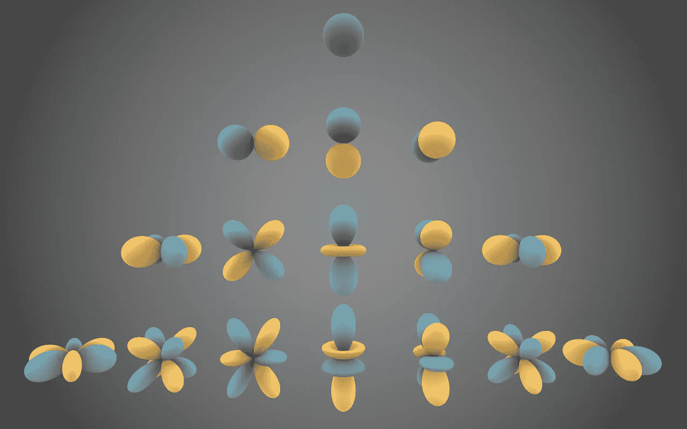
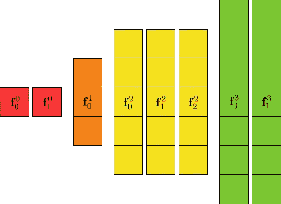
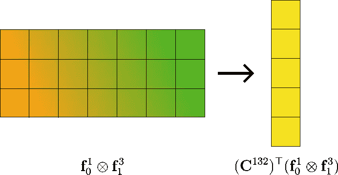
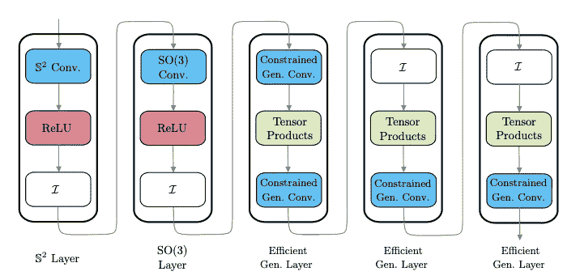
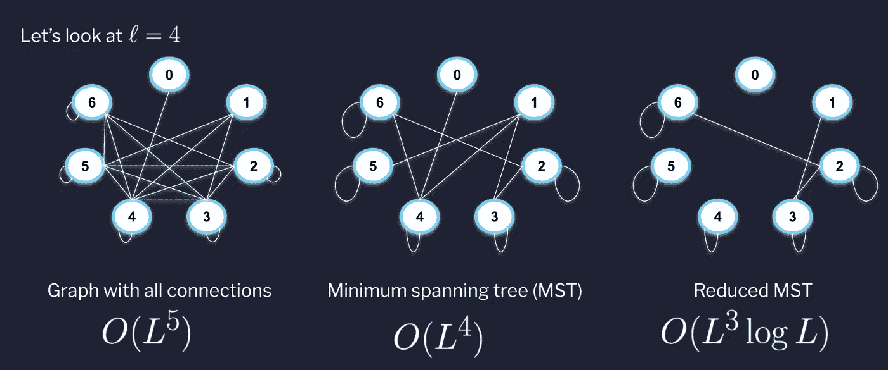
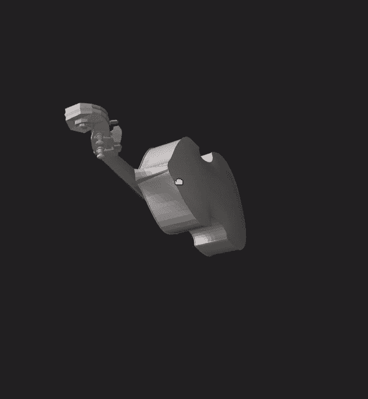
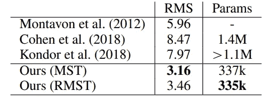

# 高效的广义球形细胞神经网络

> 原文：<https://towardsdatascience.com/efficient-generalized-spherical-cnns-1493426362ca>

## 混合旋转等变球形 CNN

*球形卷积的概念为释放深度学习的潜力提供了一条有前途的途径，以解决球形数据普遍存在的各种问题。然而，非线性的引入是一个挑战。在本帖中，我们将探索如何应用量子物理学中的思想来克服这一障碍。我们介绍了在实践中有效实现这些想法的新方法。(进一步的细节可以在我们相关的 ICLR 论文中找到关于* [*高效广义球形 CNN*](https://arxiv.org/abs/2010.11661)*)。)*

这篇博文由来自 [Kagenova](https://www.kagenova.com) 的奥利弗·科布和奥古斯丁·马沃-帕克共同撰写。

照片由[哈尔·盖特伍德](https://unsplash.com/@halacious?utm_source=medium&utm_medium=referral)在 [Unsplash](https://unsplash.com?utm_source=medium&utm_medium=referral) 上拍摄

任何跨越计算机视觉和自然科学的问题都需要对球形数据进行分析。通常，当模拟球形数据时，我们希望处理特征的方式不依赖于特征在球体上的取向。遵守这一原则的模型被称为*旋转等变*。通过只考虑满足该属性的模型，学习可以更有效地进行，正如在[之前的帖子](/what-einstein-can-teach-us-about-machine-learning-1661e26bef2c)中所讨论的。

球面和旋转群上的卷积概念可用于构建球面数据的可学习的、*线性*和旋转等变变换。这些卷积的概念，当与一个*非线性*和旋转等变变换配对时，可以被顺序地应用以分级地学习球形数据的特征。

# 球体和旋转组上的信号

球体和旋转组上的信号可表示为谐波系数的集合，描述它们如何由一组[谐波基信号](https://en.wikipedia.org/wiki/Spherical_harmonics)组成(见下图)。

球体上的信号可以分解成球谐 Yˡₘ(ω).的线性组合ℓ = 0，1，2，…的每一度都有 2ℓ+1 谐波[图片来自[维基共享资源](https://en.wikipedia.org/wiki/Spherical_harmonics#/media/File:Spherical_Harmonics.png)。]

当以谐波形式表示时，球体和旋转群上的信号旋转以及它们之间的卷积具有相似的形式。

这种共享形式包括将谐波系数收集到矢量中。特别地，对于每个谐波模式ℓ，相应的系数被收集到矢量中，

用 *t* 索引不同的向量。旋转(通过ρ)可以通过线性变换向量来实现，如下所示

其中 **D** 被称为ρ的[维格纳 D 矩阵](https://en.wikipedia.org/wiki/Wigner_D-matrix)表示。与可学习滤波器的卷积可以通过以下方式在每个谐波模式内采用可学习的向量线性组合来实现

# 广义信号

球体上的信号只需要一个矢量

而旋转组上的信号需要

然而，根据 Kondor 等人(2018)，我们可以考虑更一般的集合，每个模式对应任意数量的向量。尽管该集合可能不再被解释为球体或旋转群上的信号，但它仍可以以完全相同的旋转等变方式进行旋转和卷积。这样的集合因此被称为广义(可旋转)信号，如下图所示。

广义球形信号的一个例子。当信号每度仅包含一个向量时，在球体上存在相应的信号。然而，在广义框架内，每度允许任意数量的向量。这里我们取了(2，1，3，2，0，0，…)。【原创人物由作者创作。]

# 为什么要一概而论？

卷积的概念提供了一种以可学习的、线性的和旋转等变的方式变换广义信号的方法。然而，为了顺序地应用这种变换并分层地学习复杂的特征，我们还必须在连续的线性变换之间非线性地变换信号。

对于限于球体或旋转组上的解释的信号，可以通过获得相应的基于样本的表示并应用样本方式的非线性函数，以近似旋转等变的方式引入非线性(如前一篇文章[中进一步讨论的)。这类似于在平面 CNN 中如何逐点应用非线性。然而，与保持平移等变的平面情况相反，不能以统一的方式对球体或旋转组进行采样意味着在球体上应用非线性采样方式不是严格的旋转等变的。不仅旋转等方差只是近似的，而且转换到基于样本的表示和转换回来是一个昂贵的过程。](/geometric-deep-learning-for-spherical-data-55612742d05f)

然而，还有一种引入非线性的替代方法，它直接作用于我们基于矢量集合的表示，同时保持精确的旋转等方差！Kondor 等人(2018)提出的关键思想如下。

是广义信号中的两个矢量。如果我们拿外面的产品

在两个向量之间，并投影合成结果

使用非常特殊的线性投影将维向量转换为 2ℓ+1 维空间，整个过程是旋转等变的(见下图)。这不是偶然的。线性投影是经过仔细选择的，因此这是正确的(更确切地说，它涉及如何分解张量积群表示),并且可以用 3D 张量来描述

[的克莱布什-戈丹系数](https://en.wikipedia.org/wiki/Clebsch%E2%80%93Gordan_coefficients)。当处理旋转对称的类似概念时，特别是在耦合角动量时，克莱布什-戈丹系数也被用于量子力学。

*输入信号的两个组成向量如何组合形成输出的一个组成向量的例子。对于每一对输入向量，计算各种程度的输出向量。*【作者创作的原创人物。]

这提出了一种非线性变换广义信号的方法:

对所有ℓ度执行此程序，并收集合成矢量，每个矢量可表示为

变成一个新的广义信号。因为每个输出向量是输入的旋转等变变换，因为克莱布什-戈丹系数满足

和旋转可以通过它如何变换各个向量来描述，但是广义信号的这种整体变换也是旋转等变的。此外，我们看到它是非线性的，因为外积在输入和输出之间引入了二次关系。

# 广义球形 CNN

有了以旋转等变方式对广义信号进行线性和非线性变换的方法，可以构建广义球形 CNN(Kondor 等人，2020)。

与通常 CNN 形成由卷积和非线性组成的层的惯例的唯一区别在于，在广义层中，基于外积的非线性应该在卷积之前应用。这是因为收集每一度*的所有外积大大增加了信号中包含的向量的数量。通过在非线性之后执行卷积，它可以被用于向下投影到合理大小的表示上。*

如果我们考虑采用线性→非线性→线性形式的稍微更一般的层，我们也将科恩等人(2018)和埃斯特韦斯等人(2018)的球形 CNN 构造包含在这个广义球形 CNN 框架内(科布等人，2021)。此外，我们可以在混合模型中利用这些不同的方法，如下图所示。

包含我们开发的高效层的混合体系结构示意图，这些层与𝕊和 SO(3)层结合在一个网络中。【原创人物由作者创作。]

利用基于外积的非线性的一般化层的问题在于，每度输出的向量数量与每度输入信号的向量数量成二次方比例，并且成五次方比例(5 次方！)就最大程度而言。虽然可以使用卷积进行向下投影到合理的大小，但是这样做需要大量的参数，并且没有首先解决计算所有这些向量的成本。作为合理分辨率(最大程度)和表示能力(每度向量)的非线性转换广义信号的一种方式，需要一些修改，这是我们在*高效广义球形 CNN*工作的重点(Cobb 等人 2020)。

# 高效的广义球形细胞神经网络

首先，我们引入一个通道式结构(见下图)。在 Kondor 等人(2018)的框架内，假设单独的向量包含单独通道的角色，因此网络内的表示采用一个大向量集合的形式。相反，如果我们将集合分成单独的通道(每个通道都有自己的广义信号),并将基于外积的非线性分别应用于每个通道，则需要计算的片段数量会大大减少(减少了所考虑的通道数量的一个因子)。

通过使用逐通道张量积，高效的广义球形 CNN 层减少了片段计算的计算足迹。【原创人物由作者创作。]

其次，我们将卷积分解为三个独立的步骤，这只有在采用通道式结构时才有可能。回想一下，卷积对应于对每个度数分别采用输入向量的线性组合。在我们的三步法中，第一步是收缩步骤，分别对每个通道进行相同的线性组合。第二步采用每个通道内的线性组合，第三步采用跨通道的线性组合。通过在收缩步骤之后执行后两个步骤，可以更有效地学习有意义的特征。

第三，我们注意到没有必要计算所有可能的输入向量对之间的外积来引入非线性。我们可以只计算一个子集，程序保持旋转等变。然而，重要的是选择子集，使得信息仍然混合在不同的谐波阶数之间。可以采用基于计算图的方法，该方法将实现给定混合量的最低成本子集标识为对应于最小生成树的边，如下图所示。

度混合集的图表示。【原创人物由作者创作。]

最后，对于依赖于基于样本的数据表示的操作，我们在球体和旋转组上采用最佳采样方案(McEwen & Wiaux 2011，McEwen 等人 2015)和相应的谐波变换，这进一步提高了效率。

# 实验

在广义球形 CNN 的层内进行这些修改允许我们训练比其他可能方式更具表达力的模型。我们在两个现实世界的问题上展示了这些有效层的性能，这两个问题乍看起来不一定是固有的球形问题。然而，对于这些问题，尊重旋转对称性是重要的，因此球形 CNN 可以被有效地利用。

# 三维形状分类

我们考虑的第一个问题是对 3D 对象的网格进行分类，如下所示。

我们的网络分类的 3D 对象类型的一个例子。[ [来源于维基共享资源的 3D 模型](https://commons.wikimedia.org/wiki/Category:STL_files_of_objects#/media/File:Contrabass.stl)。]

乍一看，这似乎不是一个球面问题。然而，我们希望尊重旋转对称:网格的预测类别不应该取决于它的方向。因此，可以获得物体网格的球形表示(通过从边界球的光线投射),并且球形 CNN 可以应用到很大的效果。

我们利用类似于上面所示的混合架构。相对于以前的球形 CNN 结构，这实现了优异的性能，实现了五个性能指标中最高的三个(用于[SHREC’17 竞赛](https://shapenet.cs.stanford.edu/shrec17/)的基于精度和召回的指标)，同时使用了明显更少的参数。

SHREC'17 对象检索竞争指标(微扰全)。

# 雾化能量预测

我们考虑的第二个问题是，在给定每个原子的类型、位置和电荷的情况下，预测将分子(见下图)分裂成其组成原子所需的能量。

肾上腺素分子模型。[图片来源于[维基共享资源](https://commons.wikimedia.org/wiki/File:Adrenaline_molecule_ball_from_xtal.png)。]

同样，这可能不是一个球面问题，但是我们希望模型的预测对于分子围绕每个组成原子的旋转是不变的。对于每个原子，这可以通过计算来自每个方向的排斥电荷来实现，从而产生模型应该旋转不变的球形信号。此外，该模型应该以这样一种方式构建，即它对于球面图的数量和排列是不变的。

为了处理这些球形地图，我们再次使用了类似于上述的混合架构。上述修改使大的表示能力成为可能，这使得在这个问题上最先进的性能真正从均方根误差 5.96 推进到 3.16，Cohen 等人(2018)和 Kondor 等人(2018)的球形 CNN 构造分别达到 8.47 和 7.97。这是在使用比类似方法少得多的参数的同时实现的。

原子化能量回归问题的检验均方根误差。

# 摘要

我们已经看到，通过形成球面表示和应用球面 CNN，最初可能不表现为固有球面的问题可以从编码旋转对称的理解中受益匪浅。然后，通过在一个更一般的框架内解释这些球形表示，其中非线性可以以严格等变的方式引入，并仔细考虑如何有效地引入这种非线性，可以在重要的现实世界问题上实现最先进的性能(Cobb 等人，2021)。

虽然我们已经讨论了有效的方法，但是所提出的技术仍然需要大量的计算。进一步扩展球形深度学习的技术将在接下来的帖子中讨论。

# 参考

[1] Cobb，Wallis，Mavor-Parker，Marignier，Price，d'Avezac，McEwen，*高效广义球形 CNN*，ICLR (2021)， [arXiv:2010.11661](https://arxiv.org/abs/2010.11661#)

[2]科恩，盖格，克勒，韦林，*球形 CNN*，ICLR (2018)， [arXiv:1801.10130](https://arxiv.org/abs/1801.10130)

[3]埃斯特韦斯，艾伦-布兰切特，马卡迪亚，达尼利迪斯，*学习 SO(3)与球形 CNN 的等变表示*，ECCV (2018)， [arXiv:1711.06721](https://arxiv.org/abs/1711.06721)

[4]康多尔，林，特里维迪，*克莱布什-戈丹网:一种全傅立叶空间球形卷积神经网络*，NeurIPS (2018)， [arXiv:1806.09231](https://arxiv.org/abs/1806.09231)

[5] McEwen & Wiaux，*一个新颖的球面上的采样定理*，IEEE TSP (2012)， [arXiv:1110.6298](https://arxiv.org/abs/1110.6298)

[6] McEwen，Büttner，Leistedt，Peiris，Wiaux，*旋转群上的一个新颖的采样定理*，IEEE SPL (2015)， [arXiv:1508.03101](https://arxiv.org/abs/1508.03101)